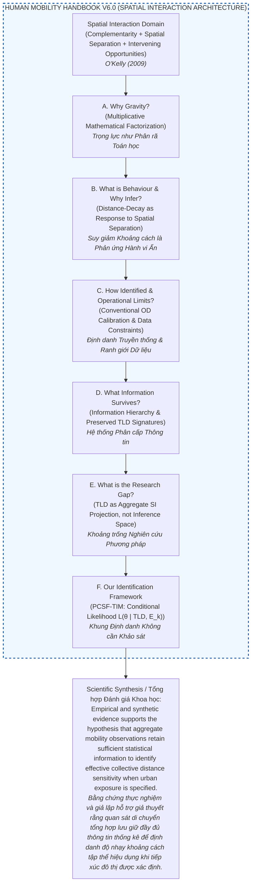
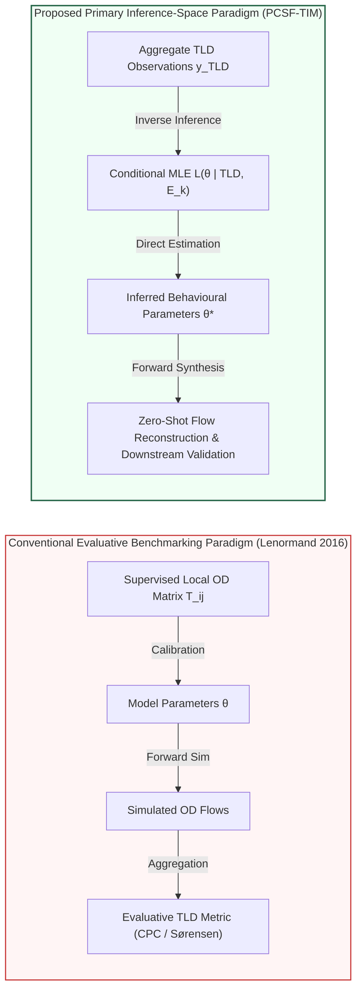

# Theoretical Background and Methodological Blueprint
# Hướng dẫn Lý thuyết và Bản thiết kế Phương pháp luận

---

This handbook is organized as a single scientific argument rather than a conventional literature review.

Each module answers one scientific question.

The answer of each module motivates the next question, forming a continuous chain from scientific foundation to empirical validation.

The purpose is not to review all human mobility models, but to establish the scientific reasoning leading to the central question:

# Central Scientific Question / Câu hỏi Khoa học Trung tâm

Mobility aggregation inevitably removes detailed Origin–Destination interactions. The fundamental scientific question is whether the remaining aggregate observations still contain enough behavioural information for empirical parameter identification.

> **Can aggregate mobility observations preserve sufficient information to identify collective distance-decay behaviour?**
> *(Liệu các quan sát di chuyển tổng hợp có bảo toàn đủ thông tin để định danh hành vi suy giảm khoảng cách tập thể hay không?)*

> [!NOTE]
> ### Rigorous Conceptual Breakdown of the Central Question / Phân tích Khái niệm Chặt chẽ của Câu hỏi Trung tâm
>
> 1. **Mobility (Di chuyển Quần thể):** Collective population-level movement across an urban region (e.g., 10M daily trips in HCMC, NYC total OD), NOT microscopic individual travel itineraries.
> 2. **Observations (Quan sát vs Thực tế):** Data collected from empirical measurements (e.g., Trip-Length Distribution - TLD), which represents a transformed observation rather than the unobserved latent true flow matrix ($T_{ij}$).
> 3. **Aggregate Mobility Observations (Quan sát Tổng hợp):** Aggregate mobility observations (hereafter abbreviated as aggregate observations) comprise observation layers such as Trip-Length Distributions (TLD) and other spatially aggregated mobility summaries.
> 4. **Preserve Information (Bảo toàn Thông tin):** The residual statistical information surviving distance-domain projection $\mathcal{P}$ under spatial binning and link aggregation.
> 5. **Sufficient Information (Thông tin Đầy đủ / Information Sufficiency):** Whether surviving information in aggregate TLD is statistically sufficient to constrain and support identification of parameter vector $\theta$.
> 6. **Identify (Định danh Tham số):** Inverse statistical inference deriving parameter vector $\hat{\theta}^* = (\alpha, \beta)$ from observed data via MLE, NOT flow prediction or matrix reconstruction.
> 7. **Collective (Tính Tập thể):** Systemic population response to spatial separation across an urban region, NOT individual psychology or discrete choices.
> 8. **Distance-decay (Suy giảm Khoảng cách):** The spatial friction function $f(d_{ij}; \theta)$ dictating how interaction probability declines with spatial separation.
> 9. **Behaviour (Hành vi):** Narrowly defined in this Handbook as *the collective response to spatial separation encoded by the distance-decay function*, NOT mode choice, departure time, or route selection.
>
> **Core Scientific Essence / Bản chất Khoa học Cốt lõi:**
> *When mobility data are aggregated into Trip-Length Distributions, losing detailed pairwise Origin-Destination links, does the aggregate distribution preserve sufficient statistical information to reliably infer population-level distance sensitivity parameters $\theta$?*
> *(Khi dữ liệu di chuyển được tổng hợp thành các thống kê như Phân bố Độ dài Chuyến đi (TLD) và mất thông tin chi tiết về các cặp Origin–Destination, liệu những thống kê đó vẫn còn đủ thông tin để suy ra một cách đáng tin cậy các tham số mô tả mức độ nhạy cảm của toàn bộ dân số đối với khoảng cách?)*

Throughout this handbook, claims regarding "information sufficiency" refer to empirical evidence obtained through statistical inference and validation. They should not be interpreted as formal proofs of identifiability, sufficient statistics, or information-theoretic optimality, which remain important directions for future theoretical research.

Throughout this Handbook:
- **Urban Structure** refers to the observable structural characteristics of a city represented through the structural terms of the Gravity model, including population distribution, land use, transportation networks, and activity locations.
- **Aggregate Observations** (short for *Aggregate mobility observations*) comprise observation layers such as Trip-Length Distributions (TLD) and other spatially aggregated mobility summaries.
- **Effective** denotes the collective distance-decay behaviour that best explains aggregate observations under the assumed urban structure model, rather than microscopic individual preferences.
- **Identification** refers to statistical estimation of an effective collective behavioural descriptor from observations.
- **Inference** refers to the probabilistic procedure used to obtain the descriptor.
- **Recovery** is used only in an operational sense (parameter recovery in synthetic experiments) and does not imply reconstruction of latent individual behaviour.
- **Conditioning** denotes that behavioural identification is performed conditioned on independently specified urban structure.
- **Modelling Assumption**: Throughout this Handbook, behavioural identification is performed under the assumption that urban structure can be independently specified from external spatial information.

## Guiding Philosophy / Triết lý Hướng dẫn

> **EN:** *Human mobility research is ultimately concerned with understanding how observable urban structure gives rise to collective movement patterns, what information is preserved under different observation levels, and how this information can be used to reconstruct mobility in data-scarce environments.*
>
> **VI:** *Nghiên cứu di chuyển con người rốt cuộc hướng tới việc hiểu cách cấu trúc đô thị có thể quan sát được tạo ra các mẫu hình di chuyển tập thể, thông tin nào được bảo toàn dưới các cấp độ quan sát khác nhau, và cách thông tin này có thể được sử dụng để tái tạo sự di chuyển trong môi trường khan hiếm dữ liệu.*

---

## Central Thesis & Research Hypothesis / Luận điểm & Giả thuyết Khoa học Trung tâm

> **EN:** **This Handbook formulates and evaluates the central hypothesis that aggregate mobility observations retain sufficient statistical information to support the identification of effective collective distance sensitivity governing spatial interaction.**
> 
> **VI:** **Handbook này xây dựng và đánh giá giả thuyết trung tâm rằng các quan sát di chuyển tổng hợp lưu giữ đầy đủ thông tin thống kê để hỗ trợ việc định danh độ nhạy khoảng cách tập thể hiệu dụng chi phối tương tác không gian.**
>
> ---
>
> **EN:** *This Handbook develops the scientific argument that effective collective distance-decay parameters $\hat{\theta}^* = (\hat{\alpha}^*, \hat{\beta}^*)$ can be statistically identified from aggregate observations (such as Trip-Length Distributions) when urban spatial structure is independently specified from open spatial data.*
>
> **VI:** *Cuốn Handbook này phát triển lập luận khoa học rằng các tham số suy giảm theo khoảng cách tập thể hiệu dụng $\hat{\theta}^* = (\hat{\alpha}^*, \hat{\beta}^*)$ có thể được định danh thống kê từ các quan sát tổng hợp (như Phân bố Độ dài Chuyến đi - TLD) khi cấu trúc không gian đô thị được xác định độc lập từ dữ liệu không gian mở.*

> [!NOTE]
> **Boundary of the Hypothesis / Scope Ranh giới Giả thuyết:**
> 
> **EN:** *This hypothesis concerns statistical identifiability under the modelling assumptions adopted in this Handbook, rather than universal identifiability under arbitrary observation processes.*
> 
> **VI:** *Giả thuyết này đề cập đến khả năng định danh thống kê theo các giả định mô hình hóa được áp dụng trong Handbook này, chứ không phải khả năng định danh vạn năng dưới các quá trình quan sát tùy ý.*

---

> [!IMPORTANT]
> **Theoretical Convergence Principle & Three Conceptually Distinct Failure Modes**
> **Nguyên lý Hội tụ Lý thuyết & Ba Dạng Thất bại Khái niệm:**
>
> **EN:** 
> ### Effective–Microscopic Convergence & Failure Mode Taxonomy
> In PCSF-TIM, parameter inference from aggregate Trip-Length Distributions (TLD) does not aim to directly recover microscopic individual deterrence preferences, but rather to identify an **effective collective deterrence descriptor** $f^*(d; \hat{\theta}^*)$ conditioned on current spatial and observational structures.
> 
> The discrepancy between the identified deterrence function $f^*(d; \hat{\theta}^*)$ and the true underlying behavioural function $f_G(d; \theta)$ is conceptually governed by three distinct failure mechanisms:
> 
> 1. **Observation failure ($\epsilon_{\rm obs}$) — *Did we observe enough information?***
>    The discrepancy arises because the observation process preserves only an aggregated travel-distance distribution rather than complete individual travel information (including distance binning, loss of spatial origin-destination pairs, and purpose mixing). As observational fidelity and resolution improve, observation error is substantially mitigated ($\epsilon_{\rm obs} \to 0$).
> 
> 2. **Structure failure ($\epsilon_{\rm struct}$) — *Did we model the city correctly?***
>    The discrepancy arises because the assumed opportunity field $E(d)$ does not accurately represent the true urban structure governing travel choices. When structural exposure is accurately specified from multi-source open spatial data, structural bias is minimized ($\epsilon_{\rm struct} \to 0$).
> 
> 3. **Coupled failure ($\epsilon_{\rm coupled}$) — *Are both problems occurring simultaneously?***
>    Observation loss and structural misspecification non-linearly interact to influence behavioural identification, producing discrepancies that cannot generally be attributed to either mechanism alone.
> 
> ### Conceptual Pipeline Alignment:
> ```text
> Observation  ──►  Observation Failure  ──►  Information Available  ──►  Structure Model  ──►  Structure Failure  ──►  Behaviour Identification  ──►  Coupled Failure
> ```
> 
> **Observational Limit:**
> \[
> f^*(d; \hat{\theta}^*) \to f_G(d; \theta) \quad \text{as observational information increases and structural exposure is accurately specified} \quad (\epsilon_{\rm obs} \to 0, \, \epsilon_{\rm struct} \to 0, \, \epsilon_{\rm coupled} \to 0)
> \]
> *Note: Model-class misspecification ($\epsilon_{\rm model}$) is explicitly decoupled from this observational boundary and treated under Model Selection (Module F2b).*
>
> ---
>
> **VI:** 
> ### Khung Hội tụ Hiệu dụng – Vi mô & Phân loại Ba Dạng Thất bại
> Trong PCSF-TIM, suy luận tham số từ Phân bố Độ dài Chuyến đi tổng hợp (TLD) không nhằm phục hồi trực tiếp hàm cản trở vi mô cấp độ cá nhân, mà nhằm xác định một **mô tả cản trở hành vi tập thể hiệu dụng** $f^*(d; \hat{\theta}^*)$ điều kiện trên cấu trúc không gian và quan sát hiện hành.
> 
> Sự sai lệch giữa hàm cản trở được định danh $f^*(d; \hat{\theta}^*)$ và hàm hành vi nền tảng thực sự $f_G(d; \theta)$ về mặt khái niệm được chi phối bởi ba cơ chế thất bại tách biệt:
> 
> 1. **Thất bại Quan sát ($\epsilon_{\rm obs}$) — *Liệu ta có quan sát đủ thông tin?***
>    Phát sinh vì quá trình quan sát chỉ bảo toàn phân bố khoảng cách di chuyển tổng hợp thay vì thông tin di chuyển cá nhân hoàn chỉnh (bao gồm rời rạc hóa bin khoảng cách, mất cặp điểm đi - điểm đến, và hỗn hợp mục đích chuyến đi). Khi độ trung thực quan sát tăng lên, thất bại quan sát triệt tiêu ($\epsilon_{\rm obs} \to 0$).
> 
> 2. **Thất bại Cấu trúc ($\epsilon_{\rm struct}$) — *Liệu ta có mô hình hóa đô thị đúng cách?***
>    Phát sinh vì trường cơ hội giả định $E(d)$ không phản ánh chính xác cấu trúc đô thị thực sự chi phối các lựa chọn di chuyển. Khi tiếp xúc cấu trúc được xác định không chệch từ dữ liệu không gian mở đa nguồn, thất bại cấu trúc triệt tiêu ($\epsilon_{\rm struct} \to 0$).
> 
> 3. **Thất bại Sóng đôi ($\epsilon_{\rm coupled}$) — *Liệu cả hai vấn đề có đồng thời xảy ra?***
>    Phát sinh khi sự mất mát quan sát và sự đặc tả sai cấu trúc tương tác phi tuyến cùng nhau tác động lên quá trình định danh hành vi, tạo ra các sai lệch không thể tách biệt cho riêng cơ chế nào.
> 
> **Giới hạn Hội tụ Lý thuyết:**
> \[
> f^*(d; \hat{\theta}^*) \to f_G(d; \theta) \quad \text{khi} \quad (\epsilon_{\rm obs} \to 0, \, \epsilon_{\rm struct} \to 0, \, \epsilon_{\rm coupled} \to 0)
> \]
> *Lưu ý: Sai số đặc tả họ mô hình ($\epsilon_{\rm model}$) được tách biệt khỏi ranh giới quan sát này và được phân tích tại chương Lựa chọn Mô hình (Module F2b).*

---

*This Handbook serves as the theoretical blueprint for the manuscript. It is structured as a 6-module scientific argument: each module poses a core scientific question, formulates a supporting hypothesis or claim, and accumulates evidence toward evaluating that claim. This progressive structure moves systematically from foundational principles (Modules A–D) to method evaluation (Module E) and empirical evaluation (Module F).*

*Cuốn Handbook này đóng vai trò là cơ sở lý thuyết và bản thiết kế phương pháp luận cho bản thảo bài báo. Nó được cấu trúc như một lập luận khoa học gồm 6 module: mỗi module đặt ra một câu hỏi khoa học cốt lõi, công thức hóa một giả thuyết hoặc luận điểm hỗ trợ, và tích lũy bằng chứng để đánh giá luận điểm đó. Tiến trình này đi một cách hệ thống từ các nguyên lý nền tảng (Module A–D) đến đánh giá phương pháp (Module E) và đánh giá thực nghiệm (Module F).*

---

## Design Principles & Strategic Positioning / Các Nguyên tắc Thiết kế & Định vị Chiến lược

> [!NOTE]
> **Key Strategic Positioning for Manuscript Drafting / Định vị Chiến lược cho Bản thảo Bài báo:**
> 
> 0. **Core Scientific Framework & Observation Setting Shift / Frame Khoa học Cốt lõi & Sự Chuyển dịch Bối cảnh Quan sát:** 
>    - **EN:** Spanning several decades of spatial interaction science, foundational researchers such as Tanner \citep{tanner1961} and Wilson \citep{wilson1971} developed spatial interaction models under an **observation setting** in which complete local OD flow matrices were generally available (or surveyed) for model calibration. Today, many urban mobility contexts reflect a shifting **observation setting**, where aggregate mobility products (e.g., travel-distance distributions) are increasingly accessible, whereas complete local OD matrices are often restricted due to privacy considerations. This observational shift introduces an important methodological challenge: estimating behavioural distance-decay parameters ($\hat{\theta}^*$) under limited flow observations, where aggregate distributions serve as the primary inference space and downstream flow reconstruction provides empirical validation.
>    - **VI:** Trải qua vài thập kỷ nghiên cứu tương tác không gian, các nhà nghiên cứu nền tảng như Tanner \citep{tanner1961} và Wilson \citep{wilson1971} đã phát triển các mô hình tương tác không gian trong một **bối cảnh quan sát (observation setting)** mà ở đó các ma trận lưu lượng OD địa phương hoàn chỉnh thường có sẵn (hoặc được khảo sát trực tiếp) để hiệu chỉnh mô hình. Ngày nay, nhiều bối cảnh di chuyển đô thị thể hiện một **bối cảnh quan sát** có nhiều thay đổi, nơi các sản phẩm di chuyển tổng hợp (như phân bố khoảng cách di chuyển - TLD) ngày càng trở nên phổ biến, trong khi ma trận OD chi tiết thường bị hạn chế do yêu cầu bảo mật. Sự chuyển dịch bối cảnh quan sát này đặt ra một thách thức phương pháp luận quan trọng: ước tính các tham số suy giảm khoảng cách hành vi ($\hat{\theta}^*$) trong điều kiện quan sát di chuyển hạn chế, trong đó các phân bố tổng hợp đóng vai trò là không gian suy luận chính và việc tái tạo lưu lượng hạ nguồn cung cấp sự kiểm chứng thực nghiệm.
>
> 1. **Model–Observation Compatibility Principle / Nguyên lý Tương thích Mô hình - Quan sát:** 
>    - **EN:** When the observation space is restricted to aggregate TLD $\mathbf{y} = (y_1, \dots, y_K)$, inference relies on explaining the full distribution shape. The parametric decay model must match the observation space shape requirements (e.g., Tanner provides dual parameters: $\alpha$ for short-to-intermediate shape and $\beta$ for long-range decay).
>    - **VI:** Khi không gian quan sát bị giới hạn ở TLD tổng hợp $\mathbf{y} = (y_1, \dots, y_K)$, việc suy luận dựa vào giải thích toàn bộ hình dạng phân bố. Mô hình suy giảm tham số phải phù hợp với yêu cầu hình dạng không gian quan sát (ví dụ, mô hình Tanner cung cấp tham số kép: $\alpha$ cho hình dạng khoảng cách ngắn-trung bình và $\beta$ cho sự suy giảm khoảng cách xa).
>
> 2. **Terminology Standard / Tiêu chuẩn Thuật ngữ:** 
>    - **EN:** Standardized on **observed Trip-Length Distribution (observed TLD)** to anchor the observation space to empirical binned histograms $y = (y_1, \dots, y_K)$. Aggregate mobility products—including Meta's Movement Distribution Maps (MDM) \citep{MetaMovementDistributionMaps}—are becoming increasingly available across platforms and regions, providing privacy-preserving summaries of population travel behavior.
>    - **VI:** Chuẩn hóa thuật ngữ **Phân bố Độ dài Chuyến đi quan sát được (observed TLD)** để gắn không gian quan sát với các biểu đồ tần suất khoảng cách thực nghiệm $y = (y_1, \dots, y_K)$. Các sản phẩm dữ liệu di chuyển tổng hợp—bao gồm Bản đồ Phân bố Di chuyển của Meta (Meta MDM) \citep{MetaMovementDistributionMaps}—ngày càng trở nên phổ biến trên nhiều nền tảng và khu vực, cung cấp các tóm tắt bảo vệ quyền riêng tư về hành vi di chuyển của quần thể.
>
> 3. **Architectural Separation in Contemporary AI Models & Methodological Distinction / Phân tách Kiến trúc trong các Mô hình AI Hiện đại & Sự Khác biệt Phương pháp:** 
>    - **EN:** Several recent mobility models (e.g., Deep Gravity \citep{simini2021}, UGNN \citep{guo2025universal}, neuroGravity \citep{neurogravity2026}, TransGM \citep{transgm2026}, Imagery2Flow \citep{imagery2flow2026}) explicitly distinguish structural information from behavioural or interaction components within their computational architectures. Although these models are primarily developed for prediction, transfer, or network reconstruction rather than behavioural identification, they illustrate the practical value of separating structural context from behavioural modelling. The present work differs in providing a probabilistic inference framework for behavioural parameter identification rather than a predictive architecture.
>    - **VI:** Một số mô hình di chuyển gần đây (như Deep Gravity \citep{simini2021}, UGNN \citep{guo2025universal}, neuroGravity \citep{neurogravity2026}, TransGM \citep{transgm2026}, Imagery2Flow \citep{imagery2flow2026}) phân biệt một cách rõ ràng giữa thông tin cấu trúc và các thành phần tương tác hoặc hành vi trong kiến trúc tính toán của chúng. Mặc dù các mô hình này chủ yếu được phát triển cho các tác vụ dự báo, chuyển giao hoặc tái tạo mạng lưới chứ không phải cho việc định danh hành vi, chúng minh họa giá trị thực tiễn của việc tách biệt bối cảnh cấu trúc khỏi mô hình hóa hành vi. Công trình này khác biệt ở chỗ cung cấp một khung suy luận xác suất cho việc định danh tham số hành vi thay vì một kiến trúc dự báo.
>
> 4. **The Structure–Behaviour Separation Principle / Nguyên lý Tách biệt Cấu trúc - Hành vi:** 
>    - **EN:** The gravity interaction model factorizes spatial interaction into two mathematically separable components:
>      \[
>      T_{ij} = \underbrace{O_i A_j}_{\text{Urban Structure}} \cdot \underbrace{f(d_{ij};\theta)}_{\text{Behaviour}}
>      \]
>      The structural terms $(O_i, A_j)$ describe the spatial distribution of trip generation and attraction, whereas the deterrence function $f(d_{ij};\theta)$ describes collective distance sensitivity. In this Handbook, we interpret this factorized form as implying an explicit conceptual separation between urban structure and travel behaviour. This interpretation forms the first foundational principle of PCSF-TIM. *(Notation Standard: Origin emission capacity is denoted $O_i$ and destination attraction/opportunity density is denoted $A_j$ throughout this Handbook).*
>    - **VI:** Mô hình tương tác Trọng lực phân rã tương tác không gian thành hai thành phần có thể tách biệt về mặt toán học (mathematically separable):
>      \[
>      T_{ij} = \underbrace{O_i A_j}_{\text{Cấu trúc Đô thị}} \cdot \underbrace{f(d_{ij};\theta)}_{\text{Hành vi}}
>      \]
>      Các thuật ngữ cấu trúc $(O_i, A_j)$ mô tả sự phân bố không gian của phát thải và sức hút chuyến đi, trong khi hàm cản trở $f(d_{ij};\theta)$ mô tả độ nhạy khoảng cách tập thể. Trong Handbook này, chúng tôi diễn giải dạng phân rã nhân này như một nguyên lý tách biệt khái niệm giữa cấu trúc đô thị và hành vi di chuyển. Cách diễn giải này tạo thành nguyên lý nền tảng đầu tiên của PCSF-TIM. *(Quy chuẩn ký hiệu: Năng lực phát thải điểm đi ký hiệu là $O_i$ và mật độ cơ hội/sức hút điểm đến ký hiệu là $A_j$ trong xuyên suốt Handbook này).*
>
> 5. **Novelty Positioning & Proposed Observation-Loss Conceptual Framing / Định vị Tính Mới & Khung Khái niệm Mất mát Quan sát Đề xuất:** 
>    - **EN:** The core novelty of this work lies in its **observation-loss framing**: formulating behavioural parameter identification directly from aggregate travel-distance distributions under information loss (spatial binning, loss of pairwise OD links). Existing aggregate behavioural calibration approaches typically rely on low-dimensional summary statistics or aggregate calibration constraints. In contrast, our proposed conceptual framework performs likelihood-based behavioural inference directly on the complete observed travel-distance distribution, treating the observed histogram as the primary statistical observation of the inference problem rather than reducing it to a smaller set of aggregate descriptors. The multinomial likelihood is adopted as the probabilistic model of this observation process.
>      
>      *Conventional Aggregate Calibration:*
>      ```text
>      Mobility observations ──► Travel-distance distribution ──► Low-dimensional Summary Statistic (Mean/Median) ──► Calibration Target
>      ```
>      *Proposed Conceptual Framework:*
>      ```text
>      Mobility observations ──► Complete Travel-distance distribution ──► Probabilistic Observation Model ──► Likelihood-based Inference
>      ```
>      Rather than calibrating behavioural parameters from low-dimensional aggregate summaries, the proposed framework performs inference directly on the complete observed travel-distance distribution.
>
>    - **VI:** Tính mới cốt lõi của công trình này nằm ở **khung lập luận mất mát quan sát (observation-loss framing)**: công thức hóa việc định danh tham số hành vi trực tiếp từ phân bố khoảng cách di chuyển tổng hợp dưới sự mất mát thông tin (rời rạc hóa khoảng cách, mất liên kết OD cặp). Các tiếp cận hiệu chỉnh hành vi tổng hợp hiện có thường dựa vào các thống kê tóm tắt số chiều thấp hoặc các ràng buộc hiệu chỉnh tổng hợp. Ngược lại, khung khái niệm được đề xuất thực hiện suy luận hành vi dựa trên likelihood trực tiếp trên phân bố khoảng cách di chuyển quan sát được hoàn chỉnh, coi biểu đồ tần suất quan sát được là quan sát thống kê chính của bài toán suy luận thay vì nén nó thành một tập hợp nhỏ các chỉ số mô tả tổng hợp. Phân phối multinomial likelihood được sử dụng như mô hình xác suất của quá trình quan sát này.
>      
>      *Hiệu chỉnh Tổng hợp Truyền thống:*
>      ```text
>      Quan sát di chuyển ──► Phân bố khoảng cách ──► Thống kê tóm tắt số chiều thấp (Mean/Median) ──► Mục tiêu hiệu chỉnh
>      ```
>      *Khung Khái niệm Đề xuất:*
>      ```text
>      Quan sát di chuyển ──► Phân bố khoảng cách quan sát hoàn chỉnh ──► Mô hình quan sát xác suất ──► Suy luận dựa trên Likelihood
>      ```
>      Thay vì hiệu chỉnh tham số hành vi từ các thống kê tóm tắt số chiều thấp, khung đề xuất thực hiện suy luận trực tiếp trên phân bố khoảng cách di chuyển quan sát được hoàn chỉnh.
>
> 6. **Frequentist Epistemological Paradigm / Paradigm Triết học Thống kê Frequentist:** 
>    - **EN:** PCSF-TIM is anchored strictly in the **Frequentist statistical paradigm** \citep{casella2002statistical}:
>      - Parameters $\theta = (\alpha, \beta)$ are treated as **fixed, unknown physical-behavioural constants** governing collective population travel behavior.
>      - Parameter estimation is performed via Maximum Likelihood Estimation (MLE): $\hat{\theta}^* = \arg\max_{\theta} \mathcal{L}(\theta \mid \mathbf{y}_{TLD}, E_k)$.
>      - Parameter uncertainty and identifiability evidence are evaluated through the Fisher Information matrix $\mathcal{I}(\theta)$, likelihood surface concavity, and empirical sampling distributions across cities, **NOT through Bayesian posterior probability distributions $P(\theta \mid D)$ or subjective prior regularizers $P(\theta)$**.
>      - This ensures that parameter identification evidence is derived 100% from the empirical aggregate observation space under the Frequentist Likelihood Principle.
>    - **VI:** PCSF-TIM được định vị chặt chẽ theo **paradigm thống kê Frequentist** \citep{casella2002statistical}:
>      - Các tham số $\theta = (\alpha, \beta)$ được coi là **các hằng số hành vi - vật lý cố định, chưa biết** chi phối hành vi di chuyển của quần thể đô thị.
>      - Việc ước tính tham số được thực hiện qua Ước tính Khả năng Tối đa (MLE): $\hat{\theta}^* = \arg\max_{\theta} \mathcal{L}(\theta \mid \mathbf{y}_{TLD}, E_k)$.
>      - Độ không đảm bảo tham số và bằng chứng định danh được đánh giá qua ma trận Thông tin Fisher $\mathcal{I}(\theta)$, độ lõm bề mặt likelihood, và phân bố mẫu thực nghiệm giữa các thành phố, **KHÔNG thông qua phân bố xác suất hậu đề Bayesian $P(\theta \mid D)$ hay các hàm chuẩn hóa tiên đề chủ quan $P(\theta)$**.
>      - Điều này đảm bảo rằng bằng chứng định danh tham số đến 100% từ không gian quan sát tổng hợp thực nghiệm theo Nguyên lý Likelihood Frequentist.
>
> 7. **Role of Downstream Reconstruction: Corroborating Evidence vs Identification / Vai trò của Tái tạo Hạ nguồn: Bằng chứng Củng cố vs Định danh:** 
>    - **EN:** Behavioural parameter identification is established through the probabilistic likelihood framework ($P(\mathbf{y} \mid \theta)$), likelihood surface sharpness, synthetic parameter recovery, and cross-city empirical consistency. Downstream flow reconstruction ($\hat{T}_{ij} = O_i A_j f(d_{ij}; \hat{\theta}^*)$) is reported only as an external consistency check indicating that the inferred behavioural parameters remain useful when embedded within a complete gravity model. Downstream performance alone cannot be interpreted as proof of behavioural parameter identification, because flow accuracy depends jointly on structural terms ($O_i, A_j$) and deterrence ($f(d;\hat{\theta}^*)$). Controlled ablation against a Null Deterrence baseline ($f(d) \equiv 1$) under fixed structural terms isolates the marginal contribution ($\Delta \text{CPC}$) attributable specifically to inferred behaviour.
>    - **VI:** Việc định danh tham số hành vi được thiết lập thông qua khung xác suất likelihood ($P(\mathbf{y} \mid \theta)$), độ nhọn bề mặt likelihood, khôi phục tham số giả lập và tính nhất quán thực nghiệm liên đô thị. Việc tái tạo lưu lượng hạ nguồn ($\hat{T}_{ij} = O_i A_j f(d_{ij}; \hat{\theta}^*)$) được báo cáo thuần túy như một bước kiểm tra tính nhất quán bên ngoài nhằm chứng minh rằng các tham số hành vi được suy luận vẫn hữu dụng khi được đưa vào một mô hình trọng lực hoàn chỉnh. Kết quả tái tạo lưu lượng hạ nguồn đơn lẻ không thể được diễn giải như một sự chứng minh cho việc định danh tham số hành vi, bởi vì độ chính xác lưu lượng phụ thuộc đồng thời vào các thuật ngữ cấu trúc ($O_i, A_j$) và hàm cản trở ($f(d;\hat{\theta}^*)$). Thí nghiệm loại bỏ kiểm soát (ablation) đối chiếu với baseline Không Cản trở ($f(d) \equiv 1$) dưới các thuật ngữ cấu trúc cố định giúp tách biệt đóng góp biên ($\Delta \text{CPC}$) thuộc về riêng hành vi được suy luận.
>
> 8. **Core Methodological Rigor Triad / Bộ Ba Chặt chẽ Phương pháp luận Cốt lõi:** 
>    - **EN:** The theoretical architecture of PCSF-TIM is anchored by three complementary methodological pillars:
>      1. **Statistical Backbone:** $\text{Data-Generating Process (DGP)} \longrightarrow \text{Probability Model (Multinomial)} \longrightarrow \text{Likelihood} \longrightarrow \text{MLE} \longrightarrow \text{Negative Log-Likelihood (NLL)}$.
>      2. **Loss Function Origin:** Cross-Entropy is not an arbitrary optimization heuristic; it is the exact Negative Log-Likelihood of the Multinomial model, mathematically equivalent to minimizing KL Divergence relative entropy discrepancy.
>      3. **Scientific Positioning:** Numerical optimization (L-BFGS-B) finds the parameter estimator $\hat{\theta}^*$, while parameter identifiability is evaluated via empirical statistical evidence (likelihood surface concavity, synthetic recovery, cross-city stability) rather than claimed as an absolute mathematical proof. Downstream flow validation corroborates predictive utility within defined observational assumptions and scope boundaries.
>    - **VI:** Kiến trúc lý thuyết của PCSF-TIM được neo chặt bởi ba trụ cột phương pháp luận bổ sung cho nhau:
>      1. **Cột sống Thống kê (Statistical Backbone):** $\text{Quá trình Sinh Dữ liệu (DGP)} \longrightarrow \text{Mô hình Xác suất (Multinomial)} \longrightarrow \text{Likelihood} \longrightarrow \text{MLE} \longrightarrow \text{Negative Log-Likelihood (NLL)}$.
>      2. **Nguồn gốc Hàm Mất mát:** Cross-Entropy không phải là một thuật toán tối ưu hóa tự phát; nó chính là Negative Log-Likelihood chính xác của mô hình Multinomial, tương đương toán học với việc tối thiểu hóa độ lệch thông tin KL Divergence.
>      3. **Định vị Khoa học:** Tối ưu hóa số (L-BFGS-B) tìm bộ ước tính tham số $\hat{\theta}^*$, trong khi tính định danh tham số được đánh giá thông qua bằng chứng thống kê thực nghiệm (độ lõm bề mặt likelihood, khôi phục giả lập, tính ổn định liên đô thị) thay vì tuyên bố chứng minh toán học tuyệt đối. Kiểm chứng lưu lượng hạ nguồn củng cố giá trị dự báo trong các giả định quan sát và ranh giới phạm vi được xác định rõ.

---

# Human Mobility Handbook V6.0 (6-Module Architecture) / Kiến trúc 6 Module Handbook Di chuyển Con người

> [!TIP]
> **Core 6-Question Scientific Chain / Chuỗi 6 Câu hỏi Khoa học Trung tâm:**
>
> 1. **Q1 (Module A): Why Gravity in Spatial Interaction?** — *Establishes Gravity not as the entire domain, but as the foundational mathematical factorization decomposing Spatial Interaction into urban structure ($O_i, A_j$) and travel behavior ($f(d;\theta)$).*<br>*Thiết lập mô hình Trọng lực không phải là toàn bộ lĩnh vực, mà là phép phân rã toán học nền tảng giúp tách Tương tác Không gian thành cấu trúc đô thị ($O_i, A_j$) và hành vi di chuyển ($f(d;\theta)$).*
> 2. **Q2 (Module B): What is behaviour in Spatial Interaction?** — *Formulates the Principle of Spatial Interaction, identifies distance-decay as the mathematical representation of behavioural response to Spatial Separation, and articulates its latent nature.*<br>*Công thức hóa Nguyên lý Tương tác Không gian, xác định suy giảm khoảng cách là biểu diễn toán học của phản ứng hành vi đối với Spatial Separation, và làm rõ bản chất biến ẩn của nó.*
> 3. **Q3 (Module C): Why can't we observe it?** — *Analyzes operational limits of conventional OD calibration under privacy-preserving data constraints.*<br>*Phân tích ranh giới áp dụng của hiệu chỉnh OD truyền thống trong các ràng buộc dữ liệu bảo vệ quyền riêng tư.*
> 4. **Q4 (Module D): What survives spatial aggregation?** — *Formalizes the Information Hierarchy and preserved binned distance signatures.*<br>*Hình thức hóa Hệ thống Phân cấp Thông tin và các dấu hiệu khoảng cách tổng hợp được bảo toàn.*
> 5. **Q5 (Module E): Why don't existing methods use it?** — *Pinpoints the research gap of treating TLD as an evaluation target rather than an aggregate observation space of Spatial Interaction.*<br>*Chỉ ra khoảng trống nghiên cứu khi coi TLD là mục tiêu đánh giá hạ nguồn thay vì không gian quan sát tổng hợp của Tương tác Không gian.*
> 6. **Q6 (Module F): How can we infer it?** — *Formulates conditional MLE under open-data exposure and evaluates empirical statistical evidence.*<br>*Công thức hóa MLE điều kiện trên tiếp xúc dữ liệu mở và đánh giá các bằng chứng thống kê thực nghiệm.*

| Module | Scientific Question (EN / VI) | Scientific Answer (EN / VI) | Leads to... (EN / VI) |
| :--- | :--- | :--- | :--- |
| **A. Gravity as Primary SI Factorization** / *Trọng lực như Phân rã Toán học Cốt lõi của Tương tác Không gian* | **Why is Gravity the foundational mathematical factorization for Spatial Interaction?**<br>*Tại sao Trọng lực là phép phân rã toán học nền tảng của Tương tác Không gian?* | Gravity factorizes Spatial Interaction into urban spatial structure ($O_i, A_j$) and traveller behavioural response ($f(d;\theta)$) \citep{wilson1971, erlander1990spatial, okelly2009spatial}.<br>*Trọng lực phân rã Tương tác Không gian thành cấu trúc không gian đô thị ($O_i, A_j$) và phản ứng hành vi người di chuyển ($f(d;\theta)$).* | If behaviour is decoupled from structure, **what represents the behavioural mechanism in Spatial Interaction and why must it be inferred?**<br>*Nếu hành vi được tách khỏi cấu trúc, điều gì đại diện cho cơ chế hành vi trong Tương tác Không gian và tại sao nó phải được suy luận?* |
| **B. Spatial Separation & Latent Behavioural Response** / *Sự chia cắt Không gian & Suy giảm Khoảng cách như Phản ứng Hành vi Ẩn* | **What is the behavioural mechanism in spatial interaction models, and why must it be inferred rather than observed?**<br>*Cơ chế hành vi trong mô hình tương tác không gian là gì, và tại sao nó phải được suy luận thay vì quan sát trực tiếp?* | Within Spatial Interaction theory \citep{okelly2009spatial}, the distance-decay function $f(d;\theta)$ mathematically represents behavioural response to **Spatial Separation**. While travel flows are observable, $\theta$ is a latent parameter confounded by structural exposure.<br>*Trong lý thuyết Tương tác Không gian \citep{okelly2009spatial}, hàm suy giảm khoảng cách $f(d;\theta)$ biểu diễn toán học cho phản ứng hành vi đối với **Spatial Separation**. Mặc dù lưu lượng di chuyển có thể quan sát được, $\theta$ là tham số ẩn bị nhiễu bởi tiếp xúc cấu trúc.* | If $\theta$ is a latent variable, **how has mobility science conventionally identified it, and what are its operational limits when flow data are unobserved?**<br>*Nếu $\theta$ là một biến ẩn, khoa học di chuyển đã định danh nó theo cách truyền thống như thế nào, và ranh giới áp dụng của nó là gì khi dữ liệu lưu lượng không quan sát được?* |
| **C. Conventional Identification under Data Constraints** / *Định danh Truyền thống trong Ràng buộc Dữ liệu* | **How has mobility science conventionally identified latent parameters, and what are its applicability limits?**<br>*Khoa học di chuyển đã định danh các tham số ẩn theo cách truyền thống như thế nào, và ranh giới áp dụng của nó là gì?* | Conventional identification relied on supervised local OD matrix calibration, which is effective when local OD flows exist but limited when only aggregate observations are available (Meta MDM).<br>*Định danh truyền thống dựa vào việc hiệu chỉnh ma trận OD địa phương có giám sát, hiệu quả khi có dữ liệu OD địa phương nhưng gặp ranh giới áp dụng khi chỉ có các quan sát tổng hợp (Meta MDM).* | If conventional OD calibration is constrained by data availability, **what statistical information survives spatial aggregation?**<br>*Nếu hiệu chỉnh OD truyền thống gặp hạn chế về tính sẵn có của dữ liệu, thông tin thống kê nào còn tồn tại qua sự gom tụ không gian?* |
| **D. Information Hierarchy of Aggregate Mobility** / *Hệ thống Phân cấp Thông tin* | **What statistical information survives spatial aggregation across mobility observation layers?**<br>*Thông tin thống kê nào còn tồn tại qua sự gom tụ không gian trên các lớp quan sát di chuyển?* | Aggregation collapses cell-to-cell OD identities while preserving aggregate travel-distance signatures (observed TLD) under aggregate privacy constraints.<br>*Sự gom tụ loại bỏ danh tính OD giữa các ô nhưng lưu giữ các dấu hiệu khoảng cách di chuyển tổng hợp (observed TLD) dưới các ranh giới bảo mật tổng hợp.* | If aggregate TLD preserves statistical distance signatures, **why has existing mobility literature treated TLD strictly as a downstream evaluation benchmark rather than a primary observation space for parameter inference?**<br>*Nếu TLD tổng hợp bảo toàn các dấu hiệu thống kê khoảng cách, tại sao văn liệu di chuyển hiện tại vẫn xem TLD thuần túy là một mục tiêu đánh giá hạ nguồn thay vì một không gian quan sát chính cho bài toán suy luận tham số?* |
| **E. Methodological Knowledge & Research Gap** / *Khoảng trống Nghiên cứu Phương pháp* | **Why have aggregate Trip-Length Distributions been used primarily as downstream evaluation benchmarks rather than as primary probabilistic observation spaces for behavioural parameter inference?**<br>*Tại sao Phân bố Độ dài Chuyến đi (TLD) tổng hợp trong các nghiên cứu hiện nay chủ yếu được sử dụng làm các chỉ số đánh giá chuẩn hạ nguồn, thay vì làm các không gian quan sát xác suất chính cho bài toán suy luận tham số hành vi?* | Landmark literature treats TLD strictly as a downstream evaluation benchmark; to the best of our knowledge, existing literature has not formulated a probabilistic framework using TLD as the primary aggregate observation space of Spatial Interaction.<br>*Văn liệu cột mốc coi TLD thuần túy là chỉ số đánh giá chuẩn hạ nguồn; theo hiểu biết của chúng tôi, văn liệu hiện chưa công bố một khung xác suất dùng TLD làm không gian quan sát tổng hợp chính cho Tương tác Không gian.* | **How does the proposed framework solve this gap and validate it empirically?**<br>*Khung làm việc được đề xuất giải quyết khoảng trống này như thế nào và kiểm chứng thực nghiệm ra sao?* |
| **F. Survey-Free Identification Framework (PCSF-TIM)** / *Khung Định danh Không cần Khảo sát* | **How does PCSF-TIM achieve survey-free parameter identification from aggregate TLDs and validate it empirically?**<br>*PCSF-TIM đạt được việc định danh tham số không cần khảo sát từ TLD tổng hợp như thế nào và kiểm chứng thực nghiệm ra sao?* | Maximum likelihood estimation conditional on open-data exposure $\mathcal{L}(\theta \mid \mathbf{y}_{TLD}, E_k)$ identifies stable parameters $\hat{\theta}^*$ and enables zero-shot OD reconstruction.<br>*Ước tính khả năng tối đa điều kiện trên sự tiếp xúc dữ liệu mở $\mathcal{L}(\theta \mid \mathbf{y}_{TLD}, E_k)$ khôi phục tham số ổn định $\hat{\theta}^*$ và cho phép tái tạo OD không cần huấn luyện lại.* | **Scientific Synthesis.**<br>*Tổng hợp Đánh giá Khoa học.* |

### Core Logic Graph V6.0 / Đồ thị Logic Trung tâm V6.0



---

# Module A — Gravity as the Primary Mathematical Factorization of Spatial Interaction
# Module A — Mô hình Trọng lực như một Phân rã Toán học Cốt lõi của Tương tác Không gian

| Component / Thành phần | EN Content | VI Content |
| :--- | :--- | :--- |
| **Module Title** | **Gravity as the Primary Mathematical Factorization of Spatial Interaction** | **Mô hình Trọng lực như một Phân rã Toán học Cốt lõi của Tương tác Không gian** |
| **Scientific Question** | **Why is the Gravity model the appropriate scientific foundation for studying and identifying collective mobility behaviour?** | **Tại sao mô hình Trọng lực là nền tảng khoa học phù hợp để nghiên cứu và định danh hành vi di chuyển tập thể?** |
| **Module Rationale** | Gravity is adopted not because it always predicts best, but because it provides the clearest scientific representation of the structure–behaviour decomposition required for behavioural identification \citep{wilson1971, erlander1990spatial, okelly2009spatial}. | Trọng lực không được lựa chọn vì nó luôn dự báo tốt nhất, mà vì nó cung cấp biểu diễn khoa học rõ ràng nhất về sự phân rã cấu trúc - hành vi bắt buộc cho việc định danh hành vi \citep{wilson1971, erlander1990spatial, okelly2009spatial}. |
| **Mission** | Convince the reader that the Gravity model is the most appropriate scientific representation for studying aggregate human mobility because it explicitly decomposes mobility flows into urban structure and collective behavioural response. This decomposition provides an interpretable and statistically identifiable foundation for behavioural inference, making Gravity the natural starting point for the remainder of the handbook. | Thuyết phục người đọc rằng mô hình Trọng lực là biểu diễn khoa học phù hợp nhất để nghiên cứu di chuyển con người tổng hợp vì nó phân rã một cách rõ ràng lưu lượng di chuyển thành cấu trúc đô thị và phản ứng hành vi tập thể. Sự phân rã này cung cấp một nền tảng có thể giải thích được và có thể định danh thống kê cho suy luận hành vi, biến Trọng lực thành điểm khởi đầu tự nhiên cho toàn bộ Handbook. |
| **Central Claim** | **Gravity provides the appropriate scientific language and structural representation isolating urban structure from travel behaviour for parameter identification.** | **Mô hình Trọng lực cung cấp ngôn ngữ khoa học và biểu diễn cấu trúc phù hợp giúp tách biệt cấu trúc đô thị khỏi hành vi di chuyển cho việc định danh tham số.** |


### Theoretical Explanation: Representation vs. Predictive Performance / Giải thích Lý thuyết: Biểu diễn vs. Hiệu suất Dự báo

> [!NOTE]
> **Foundational Representation Principle & Core Takeaways / Nguyên lý Biểu diễn Nền tảng & 4 Điểm Nhấn Cốt lõi:**
>
> **EN:** The Gravity interaction model is adopted in this Handbook **not because it claims to be the highest-performing predictive benchmark model**, but because it provides the **clearest, most transparent mathematical representation for decomposing Urban Spatial Structure ($O_i, A_j$) from Collective Travel Behaviour ($f(d_{ij};\theta)$)** \citep{wilson1971, erlander1990spatial, okelly2009spatial}:
> \[
> T_{ij} = \underbrace{O_i A_j}_{\text{Urban Structure}} \cdot \underbrace{f(d_{ij};\theta)}_{\text{Behaviour}}
> \]
>
> **Three Assertion Levels of Module A Takeaways:**
> 1. **Empirically:** Gravity interaction models have been widely applied across spatial interaction and urban mobility literature for over half a century \citep{zipf1946, wilson1971, okelly2009spatial}.
> 2. **Conceptually:** Gravity explicitly factorizes aggregate mobility flows into two fundamentally distinct components: urban spatial structure ($O_i, A_j$) and collective travel impedance response $f(d;\theta)$.
> 3. **In this handbook:** Gravity is adopted as the primary scientific language for structure–behaviour separation and parameter identification, establishing the foundation for all subsequent modules.
>
> **VI:** Mô hình tương tác Trọng lực được lựa chọn trong Handbook này **không phải vì nó tuyên bố là mô hình dự báo đạt hiệu suất cao nhất trên các benchmark**, mà vì nó cung cấp **biểu diễn toán học rõ ràng và minh bạch nhất để phân rã Cấu trúc Không gian Đô thị ($O_i, A_j$) khỏi Hành vi Di chuyển Tập thể ($f(d_{ij};\theta)$)** \citep{wilson1971, erlander1990spatial, okelly2009spatial}:
> \[
> T_{ij} = \underbrace{O_i A_j}_{\text{Cấu trúc Đô thị}} \cdot \underbrace{f(d_{ij};\theta)}_{\text{Hành vi}}
> \]
>
> **Ba Mức độ Khẳng định Cốt lõi của Module A:**
> 1. **Về mặt thực nghiệm (Empirically):** Các mô hình tương tác Trọng lực đã được áp dụng rộng rãi trong văn liệu di chuyển đô thị và tương tác không gian trong hơn một nửa thế kỷ \citep{zipf1946, wilson1971, okelly2009spatial}.
> 2. **Về mặt khái niệm (Conceptually):** Mô hình Trọng lực phân rã một cách rõ ràng lưu lượng di chuyển tổng hợp thành hai thành phần khác nhau về bản chất: cấu trúc không gian đô thị ($O_i, A_j$) và phản ứng cản trở di chuyển tập thể $f(d;\theta)$.
> 3. **Trong Handbook này (In this handbook):** Trọng lực được thiết lập làm ngôn ngữ khoa học cốt lõi cho sự phân rã cấu trúc - hành vi và định danh tham số, làm nền tảng cho toàn bộ các module tiếp theo.

### Supporting Claims / Các Luận điểm Hỗ trợ (Module A)

| Claim (EN / VI) | Purpose (EN / VI) | Representative Evidence (EN / VI) | Expected Conclusion (EN / VI) |
| :--- | :--- | :--- | :--- |
| **A1. Primary contribution is explicit separation between structure and behaviour.**<br>*Đóng góp nền tảng là tách biệt rõ ràng giữa cấu trúc và hành vi.* | Establishes decomposition $T_{ij} = \text{Structure} \times \text{Behaviour}$ as theoretical core.<br>*Thiết lập sự phân rã $T_{ij} = \text{Cấu trúc} \times \text{Hành vi}$ làm lõi lý thuyết.* | • Zipf (1946) \citep{zipf1946}.<br>• Hansen (1959) \citep{hansen1959accessibility}.<br>• Wilson (1971) \citep{wilson1971}.<br>• Erlander & Stewart (1990) \citep{erlander1990spatial}.<br>• O'Kelly (2009) \citep{okelly2009spatial}.<br>• Lenormand et al. (2016) \citep{lenormand2016systematic}. | Gravity provides a clear decomposition to isolate structure from behaviour.<br>*Mô hình trọng lực cung cấp sự phân rã cần thiết để tách biệt cấu trúc đô thị khỏi phản ứng hành vi.* |
| **A2. Modern AI models extend representation of components rather than replacing decomposition.**<br>*Các mô hình AI hiện đại mở rộng khả năng biểu diễn của các thành phần chứ không thay thế sự phân rã.* | Illustrates how AI extends individual components of Gravity.<br>*Phân tích cách AI mở rộng các thành phần riêng lẻ của mô hình Trọng lực.* | • Deep Gravity (Simini 2021) \citep{simini2021}.<br>• Imagery2Flow (Xu 2026) \citep{imagery2flow2026}.<br>• neuroGravity (Yang 2026) \citep{neurogravity2026}.<br>• TransGM (Enaya 2026) \citep{transgm2026}. | AI/Deep Learning enhance component representations, with SOTA models re-embedding explicit Gravity factorization.<br>*AI và Học sâu nâng cao năng lực biểu diễn của các thành phần, trong đó các mô hình SOTA ngày càng tích hợp lại sự phân rã Trọng lực rõ ràng.* |
| **A3. Viewing gravity as a shared factorization provides a common scientific language.**<br>*Coi trọng lực là sự phân rã nhân cung cấp ngôn ngữ khoa học chung.* | Establishes a shared conceptual coordinate system for spatial interaction problems.<br>*Thiết lập một hệ tọa độ khái niệm chung cho các bài toán tương tác không gian.* | • Theoretical synthesis of spatial interaction literature \citep{wilson1971, erlander1990spatial, okelly2009spatial}.<br>• Barbosa et al. (2018) \citep{barbosa2018human}. | Gravity decomposition serves as the organizing principle positioning flow modeling, calibration, and inference within a single framework.<br>*Phân rã Trọng lực đóng vai trò là nguyên lý tổ chức đặt mô hình hóa lưu lượng, hiệu chỉnh và suy luận vào cùng một khung khái niệm.* |

### Deep Dive: Architectural Separation in Contemporary AI Models (Claim A2) / Phân tích Sâu: Phân tách Kiến trúc trong các Mô hình AI Hiện đại (Luận điểm A2)

> **EN:** **Empirically,** several recent studies have independently adopted architectures that distinguish structural context from behavioural or interaction modelling \citep{simini2021, shi2020mpgcn, guo2025universal, liu2025representation}. Physics-informed neural architectures (neuroGravity \citep{neurogravity2026}, TransGM \citep{transgm2026}, Imagery2Flow \citep{imagery2flow2026}) explicitly preserve multiplicative factorization $T_{ij} = \text{NN}_O(\mathbf{x}_i) \cdot \text{NN}_A(\mathbf{x}_j) \cdot f(d_{ij};\theta)$ within predictive pipelines. **Conceptually,** while these models are developed for prediction, transfer learning, or network reconstruction rather than behavioural identification, their computational architectures illustrate the practical utility of separating structural context from distance deterrence. **In this handbook,** we provide a probabilistic inference interpretation of this structural–behavioural separation to address parameter identification under aggregate observations.
>
> **VI:** **Về mặt thực nghiệm (Empirically),** một số nghiên cứu gần đây đã độc lập áp dụng các kiến trúc phân biệt bối cảnh cấu trúc khỏi mô hình hóa tương tác hoặc hành vi \citep{simini2021, shi2020mpgcn, guo2025universal, liu2025representation}. Các kiến trúc thần kinh dựa trên vật lý (neuroGravity \citep{neurogravity2026}, TransGM \citep{transgm2026}, Imagery2Flow \citep{imagery2flow2026}) duy trì một cách rõ ràng sự phân rã nhân $T_{ij} = \text{NN}_O(\mathbf{x}_i) \cdot \text{NN}_A(\mathbf{x}_j) \cdot f(d_{ij};\theta)$ trong các chuỗi sinh lưu lượng dự báo của chúng. **Về mặt khái niệm (Conceptually),** mặc dù các mô hình này được phát triển cho các tác vụ dự báo, học chuyển giao hoặc tái tạo mạng lưới chứ không phải cho việc định danh hành vi, kiến trúc tính toán của chúng minh họa giá trị thực tiễn của việc tách biệt bối cảnh cấu trúc khỏi sự cản trở khoảng cách. **Trong Handbook này (In this handbook),** công trình này cung cấp một cách diễn giải suy luận xác suất cho sự tách biệt cấu trúc - hành vi này nhằm giải quyết bài toán định danh tham số dưới quan sát tổng hợp.


This establishes Gravity as the primary mathematical factorization isolating urban spatial structure from travel behavior, providing the necessary scientific foundation for parameter identification in the remainder of the handbook.

Therefore, isolating the distance-decay function $f(d;\theta)$ motivates Module B to examine why distance-decay serves as the unobservable latent behavioural mechanism in spatial interaction.

---

# Module B — Spatial Separation & Distance-Decay as Latent Behavioural Response
# Module B — Sự chia cắt Không gian & Suy giảm Khoảng cách như Phản ứng Hành vi Ẩn

In this handbook, "behaviour" refers specifically to the collective sensitivity of mobility flows to spatial separation, rather than the full spectrum of individual travel decision-making.

Scientific Question

Why does distance-decay remain the central behavioural mechanism in aggregate mobility models?

| Component / Thành phần | EN Content | VI Content |
| :--- | :--- | :--- |
| **Module Title** | **Spatial Separation & Distance-Decay as Latent Behavioural Response** | **Sự chia cắt Không gian & Suy giảm Khoảng cách như Phản ứng Hành vi Ẩn** |
| **Scientific Question** | **What is the behavioural mechanism in spatial interaction models, and why must it be inferred rather than observed directly?** | **Cơ chế hành vi trong mô hình tương tác không gian là gì, và tại sao nó phải được suy luận thay vì quan sát trực tiếp?** |
| **Module Rationale** | Grounded in Spatial Interaction theory \citep{okelly2009spatial}, distance-decay $f(d;\theta)$ parameterizes human response to **Spatial Separation**, establishes that $\theta$ is an unobservable latent variable, and articulates exposure confounding. | Dựa trên lý thuyết Tương tác Không gian \citep{okelly2009spatial}, suy giảm khoảng cách $f(d;\theta)$ tham số hóa phản ứng của con người với **Spatial Separation**, chỉ ra $\theta$ là biến ẩn không thể quan sát, và làm rõ sự nhiễu do tiếp xúc không gian. |
| **Mission** | Establish distance-decay as the mathematical representation of behavioural response to Spatial Separation, illustrate how Tanner's parameters quantify distance sensitivity, formulate unobservability, establish urban exposure as structural confounder \citep{fotheringham1989spatial, okelly2009spatial}. | Thiết lập suy giảm khoảng cách là biểu diễn toán học của phản ứng hành vi đối với Spatial Separation, chỉ ra các tham số của Tanner định lượng độ nhạy khoảng cách, và thiết lập mức độ tiếp xúc đô thị là biến nhiễu cấu trúc \citep{fotheringham1989spatial, okelly2009spatial}. |

### The Principle of Spatial Interaction & Structure–Behaviour Mapping / Nguyên lý Tương tác Không gian & Phân rã Cấu trúc - Hành vi

> **EN:** Spatial interaction science establishes that movement flows across geographic space materialize only under the simultaneous confluence of foundational spatial forces \citep{stouffer1940intervening, wilson1971, okelly2009spatial}:
> \[
> 	ext{Spatial Flow } (T_{ij}) \iff 	ext{Origin Demand} + 	ext{Destination Attraction} + 	ext{Complementarity} + 	ext{Spatial Separation} + 	ext{Intervening Opportunities}
> \]
>
> ### Theoretical Reinterpretation of O'Kelly's Spatial Interaction Triad (after O'Kelly 2009)
>
> > [!IMPORTANT]
> > **Disclaimer:** *The following mapping represents the conceptual interpretation adopted in this paper for developing the proposed framework. It should not be interpreted as O'Kelly's original mathematical formulation.*
>
> | Classical Concept (after O'Kelly 2009) | Conceptual Interpretation Adopted in This Work | Mathematical Realization in PCSF-TIM |
> | :--- | :--- | :--- |
> | **Complementarity** | **Urban Structure** (Origin generation & Destination attraction capacities) |  A_j$ |
> | **Spatial Separation** | **Travel Behaviour** (Collective deterrence response to spatial friction) | (d_{ij}; 	heta)$ |
> | **Intervening Opportunities** | **Structural Spatial Exposure** (Distance-bin opportunity capacity) | (d) = \sum_{(i,j) \in 	ext{Bin}_k} O_i A_j$ |

### Supporting Claims / Các Luận điểm Hỗ trợ (Module B)

| Claim (EN / VI) | Purpose (EN / VI) | Representative Evidence (EN / VI) | Expected Conclusion (EN / VI) |
| :--- | :--- | :--- | :--- |
| **B1. Distance decay represents spatial impedance friction.**<br>*Suy giảm khoảng cách đại diện cho ma sát trở lực không gian.* | Maps spatial separation into interaction probability.<br>*Ánh xạ khoảng cách không gian thành xác suất tương tác.* | • Tobler (1970) \citep{tobler1970computer}.<br>• Wilson (1971) \citep{wilson1971}.<br>• Stouffer (1940) \citep{stouffer1940intervening}.<br>• Hansen (1959) \citep{hansen1959accessibility}. | Distance decay isolates geographic impedance from structural opportunity density.<br>*Suy giảm khoảng cách tách biệt trở lực địa lý khỏi mật độ cơ hội cấu trúc.* |
| **B2. Decay specifications embody distinct behavioural hypotheses.**<br>*Các dạng suy giảm thể hiện các giả thuyết hành vi riêng biệt.* | Analyzes exponential, power-law, and Tanner formulations.<br>*Phân tích các dạng hàm mũ, lũy thừa và Tanner.* | • Wilson (1971) \citep{wilson1971}.<br>• González (2008) \citep{gonzalez2008understanding}.<br>• Tanner (1961) \citep{tanner1961}.<br>• Liang (2013) \citep{liang2013unraveling}. | Functional forms embody distinct spatial perception mechanisms across scales.<br>*Dạng hàm thể hiện các cơ chế nhận thức không gian riêng biệt qua các quy mô.* |
| **B3. Tanner deterrence function provides flexible dual representation.**<br>*Hàm cản trở Tanner cung cấp biểu diễn kép linh hoạt.* | Justifies Tanner function choice ((d) = d^{-lpha} e^{-eta d}$).<br>*Biện minh việc chọn hàm Tanner.* | • Tanner (1961) \citep{tanner1961}.<br>• Liang (2013) \citep{liang2013unraveling}.<br>• Lenormand (2016) \citep{lenormand2016systematic}. | Tanner unifies short-range attraction ($lpha$) and long-range exponential cutoff ($eta$).<br>*Tanner hợp nhất sức hút cự cự ngắn ($lpha$) và kháng lực hàm mũ cự cự xa ($eta$).* |
| **B4. Traveller distance sensitivity is an unobservable latent variable confounded by spatial exposure.**<br>*Độ nhạy khoảng cách là biến ẩn không thể quan sát bị nhiễu bởi tiếp xúc không gian.* | Defines latent variable nature of $	heta = (lpha, eta)$ and exposure confounding.<br>*Định nghĩa bản chất biến ẩn của $	heta$ và nhiễu do tiếp xúc không gian.* | • Wilson (1971) \citep{wilson1971}.<br>• Huff (1963) \citep{huff1963probabilistic}.<br>• Fotheringham & O'Kelly (1989) \citep{fotheringham1989spatial}.<br>• Casella & Berger (2002) \citep{casella2002statistical}. | Parameter estimation must be framed as inverse statistical inference conditional on exposure $.<br>*Ước tính tham số phải được đặt khung là suy luận thống kê ngược điều kiện trên $.* |

### Deep Dive: Spatial Impedance vs. Geographic Distance & Intervening Opportunities (Claim B1) / Phân tích Sâu: Trở lực Không gian so với Khoảng cách Địa lý (Luận điểm B1)

> **EN:** **Empirically,** travel interaction flows consistently decrease as physical travel distance or travel time increases \citep{tobler1970computer, verma2025travel}. **Conceptually,** distance $d_{ij}$ in deterrence $f(d_{ij};\theta)$ represents generalized spatial impedance (travel time, monetary cost, cognitive friction) rather than pure Euclidean space, while Stouffer's theory of intervening opportunities \citep{stouffer1940intervening} frames travel friction in terms of intermediate destination choices. **In this handbook,** conditioning parameter estimation on structural spatial exposure $E_k = \sum_{(i,j) \in \text{Bin}_k} O_i A_j$ explicitly controls for opportunity capacity, isolating residual spatial impedance friction $f^*(d; \theta^*)$.
>
> **VI:** **Về mặt thực nghiệm (Empirically),** các lưu lượng tương tác di chuyển liên tục giảm khi khoảng cách địa lý hoặc thời gian di chuyển tăng lên \citep{tobler1970computer, verma2025travel}. **Về mặt khái niệm (Conceptually),** khoảng cách $d_{ij}$ trong hàm cản trở $f(d_{ij};\theta)$ đại diện cho trở lực không gian tổng quát (thời gian, chi phí tiền tệ, ma sát nhận thức) chứ không thuần túy là không gian Euclid, trong khi lý thuyết cơ hội trung gian của Stouffer \citep{stouffer1940intervening} đặt khung cản trở theo các điểm đến trung gian. **Trong Handbook này (In this handbook),** việc điều kiện hóa ước tính tham số trên tiếp xúc cấu trúc $E_k = \sum_{(i,j) \in \text{Bin}_k} O_i A_j$ kiểm soát một cách rõ ràng mật độ cơ hội trung gian, giúp cô lập ma sát trở lực không gian thặng dư $f^*(d; \theta^*)$.

### Deep Dive: Functional Decay Forms as Behavioural Hypotheses (Claim B2) / Phân tích Sâu: Dạng suy giảm như Giả thuyết Hành vi (Luận điểm B2)

> **EN:** Specifying the distance-decay function $f(d)$ reflects distinct behavioural hypotheses regarding how populations respond to spatial separation across distance scales \citep{wilson1971, lenormand2016systematic, liang2013unraveling}:
> 1. **Exponential Decay ($f(d) = e^{-\beta d}$):** Emerges naturally from entropy-maximizing spatial interaction under global cost constraints \citep{wilson1971}, representing constant marginal travel impedance.
> 2. **Power-Law Decay ($f(d) = d^{-\alpha}$):** Represents scale-invariant travel patterns, aligning with threshold sensitivity to relative distance variations \citep{gonzalez2008understanding}.
>
> **VI:** Việc xác định dạng hàm suy giảm khoảng cách $f(d)$ phản ánh các giả thuyết hành vi riêng biệt về cách quần thể di chuyển phản ứng với sự chia cắt không gian qua các quy mô khoảng cách \citep{wilson1971, lenormand2016systematic, liang2013unraveling}:
> 1. **Suy giảm theo Hàm Mũ ($f(d) = e^{-\beta d}$):** Nảy sinh tự nhiên từ việc tối đa hóa entropy trong tương tác không gian dưới ràng buộc chi phí \citep{wilson1971}, thể hiện trở lực di chuyển biên không đổi.
> 2. **Suy giảm theo Hàm Lũy thừa ($f(d) = d^{-\alpha}$):** Đại diện cho các mẫu hình bất biến theo quy mô, phù hợp với độ nhạy ngưỡng đối với những thay đổi khoảng cách tương đối \citep{gonzalez2008understanding}.


### Deep Dive: Modern Interpretations of Distance / Phân tích Sâu: Diễn giải Hiện đại về Khoảng cách

> **EN:** In modern spatial interaction science, distance in the deterrence function $f(d_{ij}; \theta)$ is no longer restricted to simple Euclidean distance. Modern representations incorporate generalized spatial impedance, travel time, monetary cost, transport network accessibility, latent spatial cost, and learned distance representations \citep{verma2025travel, liu2025representation}. While spatial representations have become increasingly rich and multi-dimensional, the fundamental mechanism of distance decay remains invariant: spatial interaction intensity declines continuously with generalized spatial impedance.
>
> **VI:** Trong khoa học tương tác không gian hiện đại, khoảng cách trong hàm cản trở $f(d_{ij}; \theta)$ không còn bị giới hạn ở khoảng cách Euclid đơn thuần. Các biểu diễn hiện đại tích hợp trở lực không gian tổng quát, thời gian di chuyển, chi phí tiền tệ, khả năng tiếp cận mạng lưới giao thông, chi phí không gian ẩn, và các biểu diễn khoảng cách được học \citep{verma2025travel, liu2025representation}. Mặc dù các biểu diễn không gian ngày càng trở nên phong phú và đa chiều, cơ chế suy giảm khoảng cách nền tảng vẫn giữ nguyên tính bất biến: cường độ tương tác không gian suy giảm liên tục theo trở lực không gian tổng quát.

### Deep Dive: Tanner Deterrence Specification & Dual Representation (Claim B3) / Phân tích Sâu: Công thức Cản trở Tanner & Biểu diễn Kép (Luận điểm B3)

> **EN:** The composite Tanner deterrence function:
> \[ f(d) = d^{-\alpha} e^{-\beta d} \]
> provides a flexible specification unifying short-range power-law attraction ($d^{-\alpha}$) with long-range exponential friction ($e^{-\beta d}$) \citep{tanner1961}. This dual-parameter formulation accommodates distinct distance regimes in intra-urban mobility, capturing both local destination clustering and long-distance travel decay \citep{liang2013unraveling, lenormand2016systematic}.
>
> **VI:** Hàm cản trở Tanner phức hợp:
> \[ f(d) = d^{-\alpha} e^{-\beta d} \]
> cung cấp một công thức linh hoạt hợp nhất sức hút lũy thừa cự cự ngắn ($d^{-\alpha}$) với kháng lực hàm mũ cự cự xa ($e^{-\beta d}$) \citep{tanner1961}. Công thức hai tham số này đáp ứng các miền khoảng cách riêng biệt trong di chuyển nội đô, phản ánh cả sự gom tụ điểm đến địa phương lẫn sự suy giảm di chuyển khoảng cách xa \citep{liang2013unraveling, lenormand2016systematic}.

### Deep Dive: Latent Parameter Nature & Structural Exposure Confounding (Claim B4) / Phân tích Sâu: Bản chất Biến ẩn & Nhiễu do Tiếp xúc Cấu trúc (Luận điểm B4)

> **EN:** **Empirically,** physical sensors observe spatial locations and aggregate flow volumes rather than internal cognitive impedance preferences. Furthermore, as \citet{fotheringham1989spatial} showed, two urban areas with identical population travel preferences exhibit different observed distance histograms if their spatial opportunity distributions differ \citep{liang2013unraveling}.
>
> **Conceptually,** observed distance distributions reflect the joint effect of structural spatial exposure $E_k$ and distance decay $f(d;\theta)$ \citep{hansen1959accessibility, wilson1971}, rendering raw travel distance distributions a confounded signal.
>
> **In this handbook,** traveller distance sensitivity $\theta = (\alpha, \beta)$ is formalized as an unobservable latent parameter vector that cannot be directly measured, requiring parameter estimation to be framed as inverse statistical inference conditional on exposure $E_k$.
>
> **VI:** **Về mặt thực nghiệm (Empirically),** các cảm biến vật lý chỉ quan sát vị trí không gian và quy mô lưu lượng chứ không đo trực tiếp sở thích trở lực nhận thức. Hơn nữa, như \citet{fotheringham1989spatial} đã chỉ ra, hai khu vực đô thị có cùng sở thích di chuyển sẽ thể hiện các biểu đồ tần suất khoảng cách quan sát được khác nhau nếu phân bố cơ hội không gian của chúng khác nhau \citep{liang2013unraveling}.
>
> **Về mặt khái niệm (Conceptually),** phân bố khoảng cách quan sát được phản ánh tác động kết hợp của tiếp xúc không gian cấu trúc $E_k$ và suy giảm khoảng cách $f(d;\theta)$ \citep{hansen1959accessibility, wilson1971}, khiến phân bố khoảng cách thô trở thành một tín hiệu bị nhiễu.
>
> **Trong Handbook này (In this handbook),** độ nhạy khoảng cách di chuyển $\theta = (\alpha, \beta)$ được hình thức hóa như một vectơ tham số hành vi ẩn không thể đo trực tiếp, đòi hỏi ước tính tham số phải được đặt khung là suy luận thống kê ngược điều kiện trên tiếp xúc không gian $E_k$.

### Transition to Module C / Chuyển tiếp sang Module C

| Component / Thành phần | EN Content | VI Content |
| :--- | :--- | :--- |
| **Transition Question** | **If $\theta$ is a latent variable, how has mobility science conventionally identified it, and what are its operational limits when flow data are unobserved?** | **Nếu $\theta$ là một biến ẩn, khoa học di chuyển đã định danh nó theo cách truyền thống như thế nào, và ranh giới áp dụng của nó là gì khi dữ liệu lưu lượng không quan sát được?** |
| **Motivation for Module C** | Examining conventional identification paradigms (supervised OD calibration) reveals their reliance on flow surveys and operational limits under privacy constraints. | Việc xem xét các paradigm định danh truyền thống (hiệu chỉnh OD có giám sát) làm rõ sự phụ thuộc của chúng vào khảo sát lưu lượng và các hạn chế thực thi dưới các ràng buộc quyền riêng tư. |

This establishes traveler distance sensitivity $\theta = (\alpha, \beta)$ as an unobservable latent parameter vector confounded by structural spatial exposure $E_k$.

This motivates Module C to evaluate how conventional spatial interaction science has historically identified travel behaviour, and where its operational boundaries fail under differential privacy bounds.
---

# Module C — Conventional Behaviour Identification under Data Availability Constraints
# Module C — Định danh Hành vi Truyền thống trong Ràng buộc về Tính Sẵn có của Dữ liệu

How has travel behaviour traditionally been calibrated?

| Component / Thành phần | EN Content | VI Content |
| :--- | :--- | :--- |
| **Module Title** | **Conventional Behaviour Identification under Data Availability Constraints** | **Định danh Hành vi Truyền thống trong Ràng buộc về Tính Sẵn có của Dữ liệu** |
| **Scientific Question** | **How has mobility science conventionally identified latent behavioural parameters, and what are its operational limits when local flow data are unobserved?** | **Khoa học di chuyển đã định danh các tham số hành vi ẩn theo cách truyền thống như thế nào, và ranh giới áp dụng của nó là gì khi dữ liệu lưu lượng địa phương không quan sát được?** |
| **Module Rationale** | Evaluates traditional OD calibration paradigms and explains why privacy constraints motivate a shift to aggregate data products. | Đánh giá phản biện các paradigm hiệu chỉnh OD truyền thống và làm rõ lý do ranh giới riêng tư thúc đẩy chuyển dịch sang dữ liệu tổng hợp. |
| **Mission** | Examine the historical evolution of conventional calibration from log-linear OLS regression to Poisson probabilistic maximum likelihood estimation \citep{flowerdew1982method, sen1995gravity}, analyze reliance on full local OD matrices $T_{ij}^{obs}$ \citep{hyman1969calibration, merlin2020medians}, and analyze limitations under privacy bounds \citep{de2013unique} and aggregate data shifts \citep{MetaMovementDistributionMaps}. | Xem xét sự tiến hóa lịch sử của hiệu chỉnh truyền thống từ hồi quy OLS log-tuyến tính sang ước tính khả năng tối đa xác suất Poisson \citep{flowerdew1982method, sen1995gravity}, phân tích sự phụ thuộc vào ma trận OD địa phương đầy đủ $T_{ij}^{obs}$ \citep{hyman1969calibration, merlin2020medians}, và phân tích hạn chế trước bảo mật vi sai \citep{de2013unique} và dữ liệu tổng hợp \citep{MetaMovementDistributionMaps}. |
| **Core Conflict** | Traditional calibration operated in OD Matrix Space ($T_{ij}^{obs}$). Privacy constraints increasingly restrict sharing raw trajectories or local OD matrices, limiting supervised calibration. | Việc hiệu chỉnh truyền thống hoạt động trong Không gian Ma trận OD ($T_{ij}^{obs}$). Ràng buộc quyền riêng tư hiện hạn chế việc chia sẻ quỹ đạo thô hoặc ma trận OD địa phương, gây khó khăn cho hiệu chỉnh có giám sát. |

### Supporting Claims / Các Luận điểm Hỗ trợ (Module C)

| Claim (EN / VI) | Purpose (EN / VI) | Representative Evidence (EN / VI) | Expected Conclusion (EN / VI) |
| :--- | :--- | :--- | :--- |
| **C1. Conventional parameter calibration evolved from log-linear regression to probabilistic likelihood estimation on local OD flow matrices.**<br>*Hiệu chỉnh tham số truyền thống đã tiến hóa từ hồi quy log-tuyến tính sang ước tính khả năng xác suất trên ma trận lưu lượng OD địa phương.* | Analyzes the historical evolution of classical gravity calibration paradigms.<br>*Phân tích sự tiến hóa lịch sử của các paradigm hiệu chỉnh trọng lực cổ điển.* | • Flowerdew & Aitkin (1982) \citep{flowerdew1982method}.<br>• Hyman (1969) \citep{hyman1969calibration}.<br>• Merlin (2020) \citep{merlin2020medians}.<br>• Sen & Smith (1995) \citep{sen1995gravity}. | Classical calibration progressed from log-linear OLS to statistically justified Poisson MLE, but remains strictly dependent on supervised local OD flow matrices.<br>*Hiệu chỉnh cổ điển đã tiến từ OLS log-tuyến tính sang MLE Poisson được biện minh về mặt thống kê, nhưng vẫn hoàn toàn phụ thuộc vào giám sát ma trận OD địa phương.* |
| **C2. Deep learning mobility models remain bound to supervised local OD flow training.**<br>*Mô hình học sâu di chuyển vẫn phụ thuộc vào huấn luyện OD địa phương có giám sát.* | Evaluates supervision requirements of SOTA neural models.<br>*Đánh giá yêu cầu giám sát của các mô hình thần kinh SOTA.* | • Deep Gravity (Simini 2021) \citep{simini2021}.<br>• neuroGravity (Yang 2026) \citep{neurogravity2026}.<br>• TransGM (Enaya 2026) \citep{transgm2026}. | Neural gravity models enhance representation but maintain dependency on local OD supervision.<br>*Các mô hình trọng lực thần kinh tăng khả năng biểu diễn nhưng vẫn phụ thuộc vào giám sát OD địa phương.* |
| **C3. Trajectory re-identification risks prompt a transition toward aggregate privacy-preserving products.**<br>*Rủi ro tái định danh quỹ đạo thúc đẩy việc chuyển dịch sang các sản phẩm dữ liệu tổng hợp bảo vệ quyền riêng tư.* | Analyzes privacy constraints and the shift toward aggregate mobility data products.<br>*Phân tích ranh giới riêng tư và sự chuyển dịch sang các sản phẩm dữ liệu tổng hợp.* | • de Montjoye (2013) \citep{de2013unique}.<br>• Pappalardo (2023) \citep{pappalardo2023analytical}.<br>• Meta Movement Distribution Maps \citep{MetaMovementDistributionMaps}. | Privacy requirements limit local OD flow sharing, motivating inference directly from aggregate distance distributions.<br>*Yêu cầu quyền riêng tư hạn chế chia sẻ ma trận OD, thúc đẩy việc suy luận trực tiếp từ phân bố khoảng cách tổng hợp.* |

### Deep Dive: From Log-Linear Regression to Probabilistic Calibration (Claim C1) / Phân tích Sâu: Từ Hồi quy Log-Tuyến tính đến Hiệu chỉnh Xác suất (Luận điểm C1)

> **EN:** **Empirically,** classical Gravity model calibration was historically dominated by log-linear ordinary least squares (OLS) regression:
> \[ \log T_{ij} = \log k + \alpha \log O_i + \beta \log A_j - \gamma \log d_{ij} + \varepsilon_{ij} \]
> While widely applied for decades, \citet{flowerdew1982method} showed that log-linear OLS introduces four severe statistical limitations when applied to spatial interaction flows: (1) transformation bias, (2) zero-count flow undefined logs, (3) heteroscedasticity, and (4) inappropriate Gaussian normality for count data.
>
> **Conceptually,** \citet{flowerdew1982method} reformulated gravity calibration as a probabilistic estimation problem specifying $T_{ij} \sim \text{Poisson}(\lambda_{ij})$, establishing the foundational principle that likelihood should be derived from an explicit generative probability model rather than an arbitrary loss function.
>
> **In this handbook,** we identify that despite progressing from log-linear OLS to Poisson likelihood estimation, classical calibration paradigms \citep{hyman1969calibration, sen1995gravity} remain fundamentally bound to supervised local OD flow matrix observations $T_{ij}^{\text{obs}}$.

> [!NOTE]
> **Foundational Note: Master Mental Model — From Data-Generating Process to Loss Function & Optimization / Mô hình Tư duy Trung tâm — Từ Quá trình Sinh Dữ liệu đến Hàm Mất mát & Tối ưu hóa**
>
> **EN:** A statistical estimator must begin with an assumption about the Data-Generating Process (DGP), not with an arbitrary optimization heuristic:
>
> ```text
>                  Real-World Phenomenon / Thế giới thực
>                                  │
>                                  ▼
>                    Data-Generating Process (DGP)
>                                  │
>                                  ▼
>                          Probability Model
>       ┌──────────────────────────┴──────────────────────────┐
>       ▼                                                     ▼
> OD Cell Counts T_ij                                 Distance Histogram y_k (Fixed N)
>  (Discrete Count Data)                             (Multinomial Bin Category Allocation)
>       ▼                                                     ▼
> Poisson Model (Flowerdew 1982)                       Multinomial Model (PCSF-TIM)
>       └──────────────────────────┬──────────────────────────┘
>                                  │
>                                  ▼
>                    Belongs to Exponential Family
>                                  │
>                                  ▼
>               Maximum Likelihood Estimation (MLE)
>                                  │
>                      [Log-transform & Negate]
>                                  │
>                    Negative Log-Likelihood (NLL)
>                                  │
>                                  ▼
>                            Loss Function
>                (Cross-Entropy Loss for Multinomial)
>                                  │
>                                  ▼
>                       Numerical Optimization
>                                  │
>       ┌──────────────────────────┴──────────────────────────┐
>       ▼                                                     ▼
> Finds Best Estimator θ*                              Does NOT prove Identifiability
> (Numerical Search Complete)                         (Requires Statistical Evidence)
> ```
>
> **Key Methodological Clarifications:**
> 1. **Count Data vs Continuous Data:** Gaussian distributions model continuous measurements with additive noise (height, temperature), whereas OD interaction flows $T_{ij}$ are discrete counts requiring **Poisson** distributions \citep{flowerdew1982method}. Aggregating OD counts into binned distance histograms under fixed total trip volume $N = \sum y_k$ transforms the observation into a **Multinomial** distribution.
> 2. **Exponential Family Causality Chain:** We do not select Multinomial because it belongs to the Exponential Family; rather, the data-generating process dictates the Multinomial model, which happens to belong to the Exponential Family \citep{casella2002statistical}, inheriting standard asymptotic properties (consistency $\hat{\theta}_N \xrightarrow{p} \theta_{true}$ as sample size $N \to \infty$).
> 3. **Optimization $\neq$ Identifiability:** Finding an optimal parameter vector $\hat{\theta}^* = \arg\min \text{CE}(b, p(\theta))$ via an optimizer merely completes the numerical search. It does not prove that $\hat{\theta}^*$ is mathematically unique or identifiable; identifiability requires empirical statistical evidence (sharp unimodal log-likelihood surface, synthetic recovery, cross-city stability).
>
> **VI:** Một bộ ước tính thống kê phải bắt đầu từ giả định về Quá trình Sinh Dữ liệu (DGP), chứ không phải từ một tiêu chí tối ưu hóa tự phát:
> 1. **Dữ liệu Đếm vs Dữ liệu Liên tục:** Phân phối Gaussian dành cho các phép đo liên tục với nhiễu cộng (chiều cao, nhiệt độ), trong khi các dòng tương tác OD $T_{ij}$ là dữ liệu đếm rời rạc đòi hỏi phân phối **Poisson** \citep{flowerdew1982method}. Việc gộp các số đếm OD thành biểu đồ khoảng cách với tổng số chuyến đi cố định $N = \sum y_k$ chuyển đổi quan sát thành phân phối **Multinomial**.
> 2. **Chuỗi Nhân quả Họ Mũ (Exponential Family):** Chúng ta không chọn Multinomial vì nó thuộc Họ Mũ; đúng hơn là quá trình sinh dữ liệu quy định mô hình Multinomial, và phân phối này thuộc Họ Mũ \citep{casella2002statistical}, thừa hưởng các tính chất tiệm cận chuẩn mực (tính nhất quán $\hat{\theta}_N \xrightarrow{p} \theta_{true}$ khi kích thước mẫu $N \to \infty$).
> 3. **Tối ưu hóa $\neq$ Tính Định danh:** Việc tìm một vectơ tham số tối ưu $\hat{\theta}^* = \arg\min \text{CE}(b, p(\theta))$ qua thuật toán tối ưu hóa chỉ hoàn thành việc tìm kiếm số. Nó không chứng minh $\hat{\theta}^*$ là duy nhất hay có thể định danh về mặt toán học; tính định danh đòi hỏi các bằng chứng thống kê thực nghiệm (bề mặt log-likelihood lõm đơn mốt sắc nét, khôi phục giả lập, tính ổn định liên đô thị).
>
> **Mathematical Precision Note on KL Divergence:**
> *Kullback-Leibler (KL) Divergence $D_{\mathrm{KL}}(P \parallel Q) = \sum_k p_k \log \frac{p_k}{q_k}$ measures the directed statistical difference (relative entropy / information discrepancy) between two probability distributions $P$ and $Q$, rather than a mathematical "distance" (metric). It is not a true metric distance because it is asymmetric ($D_{\mathrm{KL}}(P \parallel Q) \neq D_{\mathrm{KL}}(Q \parallel P)$) and does not satisfy the triangle inequality. Minimizing Cross-Entropy $H(P, Q) = H(P) + D_{\mathrm{KL}}(P \parallel Q)$ under fixed empirical observations $P$ is mathematically equivalent to minimizing KL divergence $D_{\mathrm{KL}}(P \parallel Q)$, which directly maximizes the Multinomial Log-Likelihood.*
>
> **Ghi chú Chính xác Toán học về KL Divergence:**
> *Kullback-Leibler (KL) Divergence $D_{\mathrm{KL}}(P \parallel Q) = \sum_k p_k \log \frac{p_k}{q_k}$ đo lường mức độ khác biệt thống kê có hướng (entropy tương đối / độ lệch thông tin) giữa hai phân bố xác suất $P$ và $Q$, chứ không phải là một "khoảng cách" toán học (metric distance). Nó không phải là một metric khoảng cách thực sự vì nó bất đối xứng ($D_{\mathrm{KL}}(P \parallel Q) \neq D_{\mathrm{KL}}(Q \parallel P)$) và không thỏa mãn bất đẳng thức tam giác. Việc tối thiểu hóa Cross-Entropy $H(P, Q) = H(P) + D_{\mathrm{KL}}(P \parallel Q)$ dưới phân bố thực nghiệm cố định $P$ tương đương về mặt toán học với việc tối thiểu hóa KL divergence $D_{\mathrm{KL}}(P \parallel Q)$, qua đó tối đa hóa trực tiếp Multinomial Log-Likelihood.*

Crucially, \citet{hyman1969calibration} formalized the foundational assumption inherited by decades of subsequent literature: *to estimate distance-decay parameters, one must observe a full local origin-destination flow matrix $T_{ij}^{obs}$ for calibration*. By introducing mean-trip-length matching ($\bar{d}_{model}(\theta) = \bar{d}_{obs}$), Hyman established the **Supervised Calibration Paradigm**, framing local OD flow matrix observation as an indispensable prerequisite for parameter estimation. PCSF-TIM directly challenges this 50-year assumption by shifting from local flow calibration to aggregate parameter identification:

| Evaluation Dimension / Khía cạnh | Conventional Calibration Paradigm \citep{hyman1969calibration} | Proposed PCSF-TIM Framework |
| :--- | :--- | :--- |
| **Observation Space** | Observed cell-to-cell interaction matrix $T_{ij}^{obs}$ | Aggregate travel-distance distribution (TLD) $\mathbf{y}_{TLD}$ |
| **Methodological Objective** | Calibration to fit observed local flows ($T_{ij}^{obs} \approx \hat{T}_{ij}$) | Identification to infer effective behavioural parameters $\hat{\theta}^*$ |
| **Data Dependency** | Requires supervised local OD surveys or full flow matrices | Requires only open spatial exposure $E_k$ and aggregate TLD |
| **Downstream Goal** | Best-fit curve matching for local OD matrix reconstruction | Parameter identification supporting zero-shot flow reconstruction |

> **VI:** **Về mặt thực nghiệm (Empirically),** việc hiệu chỉnh mô hình Trọng lực cổ điển trong lịch sử bị chi phối bởi phương pháp hồi quy bình phương tối thiểu (OLS) log-tuyến tính:
> \[ \log T_{ij} = \log k + \alpha \log O_i + \beta \log A_j - \gamma \log d_{ij} + \varepsilon_{ij} \]
> Mặc dù được áp dụng phổ biến trong nhiều thập kỷ, \citet{flowerdew1982method} đã chỉ ra 4 hạn chế thống kê nghiêm trọng của OLS log-tuyến tính khi áp dụng cho các dòng tương tác không gian.
>
> **Về mặt khái niệm (Conceptually),** \citet{flowerdew1982method} đã tái công thức hóa việc hiệu chỉnh trọng lực thành bài toán ước tính xác suất $T_{ij} \sim \text{Poisson}(\lambda_{ij})$, thiết lập nguyên lý rằng hàm khả năng (likelihood) phải được suy ra từ một mô hình xác suất sinh rõ ràng.
>
> **Trong Handbook này (In this handbook),** chúng tôi nhận diện rằng mặc dù đã tiến từ OLS log-tuyến tính sang ước tính khả năng Poisson, các paradigm hiệu chỉnh truyền thống \citep{hyman1969calibration, sen1995gravity} vẫn hoàn toàn phụ thuộc vào việc quan sát ma trận lưu lượng OD địa phương có giám sát $T_{ij}^{obs}$.

### Deep Dive: Supervision Dependencies in Contemporary Deep Learning Baselines (Claim C2) / Phân tích Sâu: Sự Phụ thuộc Giám sát trong các Baseline Học sâu Hiện đại (Luận điểm C2)

> **EN:** **Empirically,** contemporary deep learning frameworks (Deep Gravity \citep{simini2021}, neuroGravity \citep{neurogravity2026}, TransGM \citep{transgm2026}, UGNN \citep{guo2025universal}) significantly enhance feature representation capacity through neural networks. **Yet, conceptually,** these architectures remain bound to supervised local OD flow matrix optimization $\min \mathcal{L}(T_{ij}^{obs}, \hat{T}_{ij})$. **In this handbook,** we emphasize that in regions lacking fine-grained local flow surveys or where privacy policies restrict matrix sharing, both neural and classical calibration paradigms encounter operational limits \citep{yang2014limits}.
>
> **VI:** **Về mặt thực nghiệm (Empirically),** các khung học sâu hiện đại (Deep Gravity \citep{simini2021}, neuroGravity \citep{neurogravity2026}, TransGM \citep{transgm2026}, UGNN \citep{guo2025universal}) nâng cao đáng kể khả năng biểu diễn đặc trưng qua mạng thần kinh. **Tuy nhiên, về mặt khái niệm (Yet, conceptually),** các kiến trúc này vẫn phụ thuộc vào tối ưu hóa ma trận OD địa phương có giám sát $\min \mathcal{L}(T_{ij}^{obs}, \hat{T}_{ij})$. **Trong Handbook này (In this handbook),** chúng tôi nhấn mạnh rằng tại các khu vực thiếu khảo sát lưu lượng địa phương hoặc bị giới hạn bởi quyền riêng tư, cả paradigm thần kinh lẫn cổ điển đều gặp ranh giới thực thi nghiêm trọng \citep{yang2014limits}.

### Comparative Analysis Table / Bảng So sánh Đối chiếu các Mô hình SOTA

| Evaluation Criterion | Deep Gravity (Simini 2021) | neuroGravity (Yang 2026) | TransGM (Enaya 2026) | **PCSF-TIM (This Paper)** |
| :--- | :--- | :--- | :--- | :--- |
| **Mathematical Formulation** | $P(i \to j) = \text{Softmax}\big(\text{MLP}(\mathbf{x}_i, \mathbf{x}_j, d_{ij})\big)$ | $T_{ij} = \text{NN}_O(\mathbf{x}_i) \cdot \text{NN}_A(\mathbf{x}_j) \cdot f(d_{ij}; \theta)$ | $T_{ij}^{(c)} = O_i A_j f(d_{ij}; \theta^{(c)})$ | $P(k \mid \theta) = \frac{E_k f(d_k;\theta)}{\sum E_m f(d_m;\theta)}$ |
| **Observation Space** | **OD Matrix space:** $T_{ij}^{obs}$ | **OD Matrix space:** $T_{ij}^{obs}$ | **OD Matrix space:** $T_{ij}^{obs}$ | **Distance Bin space (TLD):** $\mathbf{y}_{TLD} = (y_1, \dots, y_K)$ |
| **Parameter Handling $\theta$** | Implicit in neural weights $W_{MLP}$ (**Black-box**) | Generated via Graph Neural Network | Inferred via Meta-Learning | **Explicit closed-form parameters:** $\theta = (\alpha, \beta)$ |
| **Supervision Requirement** | **Supervised by Local OD Matrix** | **Supervised by Local OD Matrix** | **Supervised by Source OD Matrix** | **Survey-Free** (No local OD matrix required) |
| **Tiếng Việt - Không gian Quan sát** | Không gian Ma trận OD | Không gian Ma trận OD | Không gian Ma trận OD | **Miền Khoảng cách (TLD):** $\mathbf{y}_{TLD} = (y_1, \dots, y_K)$ |
| **Tiếng Việt - Giám sát** | Cần Ma trận OD địa phương | Cần Ma trận OD địa phương | Cần Ma trận OD nguồn | **Không cần Ma trận OD** (Chỉ cần TLD quan sát được) |

### Deep Dive: Privacy Preservation & Aggregate Data Shift (Claim C3) / Phân tích Sâu: Bảo vệ Quyền riêng tư & Chuyển dịch Dữ liệu Tổng hợp (Luận điểm C3)

> **EN:** **Empirically,** individual mobility trajectories exhibit extreme spatio-temporal uniqueness: just four location-time points are sufficient to uniquely re-identify approximately 95% of individuals \citep{de2013unique}. In response, aggregate mobility products—including Meta's Movement Distribution Maps (MDM) \citep{MetaMovementDistributionMaps}—are becoming increasingly available across platforms and regions, providing privacy-preserving summaries of population travel behavior \citep{buckee2020thinking, oliver2020mobile, pappalardo2023analytical}.
>
> **Conceptually,** this aggregate data shift replaces fine-grained origin-destination pairs with distance-binned summaries, preventing direct application of supervised OD calibration methods.
>
> **In this handbook,** this shift is recognized as a fundamental transition that motivates developing parameter inference frameworks operating directly on aggregate travel-distance distributions.
>
> **VI:** **Về mặt thực nghiệm (Empirically),** các quỹ đạo di chuyển cá nhân thể hiện tính duy nhất rất cao: chỉ 4 điểm không-thời gian đã đủ để tái định danh 95% cá nhân \citep{de2013unique}. Để ứng phó, các sản phẩm dữ liệu di chuyển tổng hợp—bao gồm Movement Distribution Maps (MDM) của Meta \citep{MetaMovementDistributionMaps}—đang ngày càng trở nên phổ biến qua các nền tảng và vùng lãnh thổ, cung cấp các tóm tắt bảo vệ quyền riêng tư về hành vi di chuyển của quần thể \citep{buckee2020thinking, oliver2020mobile, pappalardo2023analytical}.
>
> **Về mặt khái niệm (Conceptually),** sự chuyển dịch dữ liệu tổng hợp này thay thế các cặp điểm đi - điểm đến chi tiết bằng các tóm tắt khoảng cách chia bin, ngăn cản việc áp dụng trực tiếp các phương pháp hiệu chỉnh OD có giám sát.
>
> **Trong Handbook này (In this handbook),** **this establishes** the fundamental operational boundary of supervised local OD calibration under differential privacy bounds. **Consequently,** Module D constructs an Information Hierarchy to quantify what statistical information survives spatial aggregation, establishing the theoretical inferential limits of aggregate travel-distance distributions.

### Transition to Module D / Chuyển tiếp sang Module D

| Component / Thành phần | EN Content | VI Content |
| :--- | :--- | :--- |
| **Transition Question** | **If conventional OD calibration encounters data availability limits, what statistical information survives spatial aggregation?** | **Nếu hiệu chỉnh OD truyền thống gặp hạn chế về tính sẵn có của dữ liệu, thông tin thống kê nào còn tồn tại qua sự gom tụ không gian?** |
| **Motivation for Module D** | Formalizing the Information Hierarchy establishes what statistical signatures survive spatial aggregation. | Việc hình thức hóa Hệ thống Phân cấp Thông tin thiết lập các dấu hiệu thống kê nào còn tồn tại qua sự gom tụ không gian. |

Conventional calibration requires behavioural parameters to be estimated from complete mobility observations.

The emergence of aggregate mobility data fundamentally changes what can be observed, motivating the next chapter.

---

# Module D — Information Hierarchy of Aggregate Mobility Observations
# Module D — Hệ thống Phân cấp Thông tin của Quan sát Di chuyển Tổng hợp

What changed after the emergence of aggregate mobility data?

| Component / Thành phần | EN Content | VI Content |
| :--- | :--- | :--- |
| **Module Title** | **Information Hierarchy of Aggregate Mobility Observations** | **Hệ thống Phân cấp Thông tin của Quan sát Di chuyển Tổng hợp** |
| **Scientific Question** | **What statistical information survives spatial aggregation across mobility observation layers?** | **Thông tin thống kê nào còn tồn tại qua sự gom tụ không gian trên các lớp quan sát di chuyển?** |
| **Module Rationale** | Formalizes the projection operator $\mathcal{P}$, classifies observation layers into an Information Hierarchy, and establishes the Identifiable vs Non-Identifiable boundary. | Hình thức hóa toán học toán tử chiếu $\mathcal{P}$, phân loại các lớp quan sát vào Hệ thống Phân cấp Thông tin, và thiết lập ranh giới thuộc tính Có thể vs Không thể Định danh. |
| **Mission** | Define aggregation as a distance-domain projection $\mathcal{P}: \mathbb{R}^{N \times N} \to \mathbb{R}^K$, classify data layers, and delineate what information remains available for parameter identification. | Định nghĩa sự gom tụ là một toán tử chiếu miền khoảng cách $\mathcal{P}: \mathbb{R}^{N \times N} \to \mathbb{R}^K$, phân loại các lớp dữ liệu, và vạch rõ thông tin nào còn lại để phục vụ định danh tham số. |
| **Hierarchy Progression** | $$\text{Trajectories} \longrightarrow \text{OD Matrix} \longrightarrow \text{Travel Distance Distribution (TLD)} \longrightarrow \text{Macro Indicators}$$ | $$\text{Quỹ đạo} \longrightarrow \text{Ma trận OD} \longrightarrow \text{Phân bố Khoảng cách (TLD)} \longrightarrow \text{Chỉ số Vĩ mô}$$ |

> [!TIP]
> ### Core Scientific Question of Information Reduction / Câu hỏi Khoa học Cốt lõi của sự Giảm Thông tin
>
> **EN:** The spatial aggregation mapping **Trajectory $\longrightarrow$ OD Matrix $\longrightarrow$ Travel-Distance Histogram (TLD)** represents a progressive information reduction process. The central scientific question of this study is: **Does the remaining statistical information in the aggregate histogram suffice to support the identification of behavioural distance-decay parameters?**
>
> *Theoretical Mechanism:* **Aggregate observations reduce the amount of information, but they preserve the probability distribution of travel distances. Since the distance-deterrence parameters directly shape this distribution, the remaining information may still be sufficient for statistical identification.**
>
> **VI:** Quá trình chiếu gom tụ **Quỹ đạo (Trajectory) $\longrightarrow$ Ma trận OD $\longrightarrow$ Biểu đồ khoảng cách (TLD)** đại diện cho một tiến trình giảm dần thông tin. Câu hỏi khoa học trung tâm của nghiên cứu này là: **Liệu phần thông tin thống kê còn lại trong biểu đồ tần suất tổng hợp có đủ để hỗ trợ việc định danh các tham số suy giảm khoảng cách hành vi hay không?**
>
> *Cơ chế Lý thuyết:* **Các quan sát tổng hợp tuy làm giảm lượng thông tin, nhưng chúng bảo toàn phân bố xác suất của khoảng cách di chuyển. Vì các tham số cản trở khoảng cách trực tiếp định hình phân bố này, phần thông tin còn lại vẫn có thể đủ cho việc định danh thống kê.**

### Supporting Claims / Các Luận điểm Hỗ trợ (Module D)

| Claim (EN / VI) | Purpose (EN / VI) | Representative Evidence (EN / VI) | Expected Conclusion (EN / VI) |
| :--- | :--- | :--- | :--- |
| **D1. Mobility aggregation can be formalized as a probabilistic projection from interaction space to distance domain.**<br>*Gom tụ di chuyển được hình thức hóa như một toán tử chiếu xác suất từ không gian tương tác sang miền khoảng cách.* | Formalizes projection operator $\mathcal{P}: \mathbb{R}^{N \times N} \to \mathbb{R}^K$.<br>*Hình thức hóa toán tử chiếu $\mathcal{P}$.* | • Barbosa et al. (2018) \citep{barbosa2018human}.<br>• González et al. (2008) \citep{gonzalez2008understanding}.<br>• Gallotti et al. (2024) \citep{gallotti2024distorted}. | Aggregation removes individual spatial identities $(i,j)$ while preserving aggregate distance signatures $P(d_k)$.<br>*Sự gom tụ loại bỏ danh tính không gian cá nhân $(i,j)$ nhưng lưu giữ các dấu hiệu khoảng cách tổng hợp $P(d_k)$.* |
| **D2. Aggregate observation layers form a structured Information Hierarchy characterized by information reduction.**<br>*Các lớp quan sát tổng hợp tạo thành một Hệ thống Phân cấp Thông tin với sự giảm dần thông tin.* | Introduces Information Preservation Taxonomy grounded in Information Theory.<br>*Giới thiệu Bảng phân loại Bảo toàn Thông tin dựa trên Lý thuyết Thông tin.* | • Cover & Thomas (2006) \citep{cover2006elements}.<br>• Song et al. (2010) \citep{song2010limits}.<br>• Gallotti et al. (2024) \citep{gallotti2024distorted}.<br>• Erlander & Stewart (1990) \citep{erlander1990spatial}. | Coarser observation layers collapse spatial dimensions but retain sufficient statistical signatures under Data Processing Inequality.<br>*Các lớp quan sát thô hơn nén các chiều không gian nhưng giữ lại đủ dấu hiệu thống kê theo Bất đẳng thức Xử lý Dữ liệu.* |
| **D3. The choice of observational representation dictates answerable scientific questions.**<br>*Lựa chọn biểu diễn quan sát quyết định các câu hỏi khoa học có thể trả lời.* | Grounds representation theory in mobility analytics.<br>*Gắn lý thuyết biểu diễn vào phân tích di chuyển.* | • Casella & Berger (2002) \citep{casella2002statistical}.<br>• Cover & Thomas (2006) \citep{cover2006elements}.<br>• Gallotti et al. (2024) \citep{gallotti2024distorted}.<br>• González et al. (2008) \citep{gonzalez2008understanding}. | Selecting TLD preserves distance deterrence signatures while respecting privacy constraints.<br>*Chọn TLD bảo toàn dấu hiệu cản trở khoảng cách đồng thời tuân thủ ranh giới quyền riêng tư.* |

### Deep Dive: Mobility Aggregation as Distance-Domain Projection (Claim D1) / Phân tích Sâu: Gom tụ Di chuyển như một Toán tử Chiếu Miền Khoảng cách (Luận điểm D1)

> **EN:** **Empirically,** aggregate displacement distributions $P(\Delta r)$ exhibit robust statistical regularities emerging from millions of individual travel choices \citep{gonzalez2008understanding, barbosa2018human}.
>
> **Conceptually,** mobility aggregation is mathematically formalized as a probabilistic projection operator $\mathcal{P}$ mapping cell-to-cell interaction space $T_{ij} \in \mathbb{R}^{N \times N}$ into discrete distance bin frequencies $\{P(d_k)\}_{k=1}^K$:
> \[
> P(d_k) = \mathcal{P}(T_{ij}) = \sum_{i=1}^N \sum_{j=1}^N T_{ij} \,\mathbf{1}(d_{ij} \in \text{Bin}_k).
> \]
> While spatial aggregation collapses cell-to-cell identities $(i,j)$, it retains aggregate travel-distance signatures $P(d_k)$ under differential privacy bounds \citep{gallotti2024distorted}.
>
> **In this handbook,** this projection operator defines the formal mathematical boundary between unobservable micro-flows and observable macro distance signatures.
>
> **VI:** **Về mặt thực nghiệm (Empirically),** phân bố dịch chuyển tổng hợp $P(\Delta r)$ thể hiện các quy luật thống kê mạnh mẽ nảy sinh từ hàng triệu lựa chọn di chuyển cá nhân \citep{gonzalez2008understanding, barbosa2018human}.
>
> **Về mặt khái niệm (Conceptually),** sự gom tụ di chuyển được hình thức hóa về mặt toán học như một toán tử chiếu xác suất $\mathcal{P}$ ánh xạ không gian tương tác ô-tới-ô $T_{ij} \in \mathbb{R}^{N \times N}$ thành tần suất khoảng cách rời rạc $\{P(d_k)\}_{k=1}^K$:
> \[
> P(d_k) = \mathcal{P}(T_{ij}) = \sum_{i=1}^N \sum_{j=1}^N T_{ij} \,\mathbf{1}(d_{ij} \in \text{Bin}_k).
> \]
> Mặc dù sự gom tụ loại bỏ danh tính ô-tới-ô $(i,j)$, nó lưu giữ các dấu hiệu khoảng cách di chuyển tổng hợp $P(d_k)$ dưới ranh giới bảo mật vi sai \citep{gallotti2024distorted}.
>
> **Trong Handbook này (In this handbook),** toán tử chiếu này xác định ranh giới toán học chính thức giữa các lưu lượng vi mô không thể quan sát và các dấu hiệu khoảng cách vĩ mô quan sát được.

### Data vs Information Preservation Taxonomy / Phân loại Bảo toàn Dữ liệu & Thông tin

| Data Product Layer / Lớp Sản phẩm Dữ liệu | Preserved Information Content / Nội dung Thông tin Bảo toàn | Behavioral Granularity / Độ Mịn Hành vi |
| :--- | :--- | :--- |
| **Trajectory (GPS / CDR)** | Full spatio-temporal individual trajectories & movement sequences | Microscopic individual behavior |
| **OD Matrix ($T_{ij}$)** | Pairwise spatial interaction flows between origin-destination pairs | Spatial interaction matrix |
| **Trip-Length Distribution (TLD)** | Aggregate distance-decay profile & collective travel-distance summary | Collective distance sensitivity |
| **Aggregate Summary Statistics** | Mean travel distance, total trips, or regional totals | Lowest information layer |

> **EN:** The modern mobility data ecosystem is increasingly **aggregate-first** \citep{buckee2020thinking, oliver2020mobile}. Privacy restrictions and data platforms increasingly release aggregate mobility summaries, satellite-derived indicators, or LBS summaries rather than raw trajectories \citep{houssiau2022dpaggregate, imagery2flow2026, guo2025universal, gallotti2024distorted, liu2025representation}.
>
> **VI:** Hệ sinh thái dữ liệu di chuyển hiện đại ngày càng hướng tới định hướng **tổng hợp là trên hết (aggregate-first)** \citep{buckee2020thinking, oliver2020mobile}. Các hạn chế về quyền riêng tư và nền tảng dữ liệu ngày càng ưu tiên phát hành các tóm tắt di chuyển tổng hợp, chỉ số từ ảnh vệ tinh, hoặc tóm tắt LBS thay vì các quỹ đạo thô \citep{houssiau2022dpaggregate, imagery2flow2026, guo2025universal, gallotti2024distorted, liu2025representation}.

### Deep Dive: Information Preservation Hierarchy & Taxonomy (Claim D2) / Phân tích Sâu: Hệ thống Phân cấp & Phân loại Bảo toàn Thông tin (Luận điểm D2)

> **EN:** **Empirically,** human mobility observations form a structured hierarchy characterized by progressive information reduction \citep{song2010limits, erlander1990spatial}.
>
> **Conceptually,** spatial aggregation operates as a Markov processing chain mapping trajectory space to interaction matrices and onto distance distributions ($X \to Y \to Z$). By the Data Processing Inequality \citep{cover2006elements}, mutual information satisfies $I(X; Z) \le I(X; Y)$. While fine-grained spatial identities $(i,j)$ are discarded ($H(Y \mid Z) > 0$), aggregate TLD layers retain sufficient statistical information regarding collective distance deterrence parameters $\theta = (\alpha, \beta)$ when structural exposure $E_k$ is specified independently \citep{casella2002statistical}.
>
> **In this handbook,** this information reduction progression is systematized into the Information Preservation Taxonomy to evaluate inferential capacity under privacy constraints.
>
> **VI:** **Về mặt thực nghiệm (Empirically),** các quan sát di chuyển của con người tạo thành một hệ thống phân cấp có cấu trúc đặc trưng bởi sự giảm dần thông tin \citep{song2010limits, erlander1990spatial}.
>
> **Về mặt khái niệm (Conceptually),** sự gom tụ không gian hoạt động như một chuỗi nén Markov ánh xạ không gian quỹ đạo sang ma trận tương tác và sang phân bố khoảng cách ($X \to Y \to Z$). Theo Bất đẳng thức Xử lý Dữ liệu \citep{cover2006elements}, thông tin tương hỗ thỏa mãn $I(X; Z) \le I(X; Y)$. Mặc dù danh tính chi tiết $(i,j)$ bị loại bỏ, lớp TLD tổng hợp vẫn lưu giữ đầy đủ thông tin thống kê liên quan đến các tham số cản trở khoảng cách $\theta = (\alpha, \beta)$ khi tiếp xúc cấu trúc $E_k$ được xác định độc lập \citep{casella2002statistical}.
>
> **Trong Handbook này (In this handbook),** tiến trình giảm dần thông tin này được hệ thống hóa thành Bảng phân loại Bảo toàn Thông tin để đánh giá khả năng suy luận dưới ranh giới quyền riêng tư.

### Deep Dive: Observational Representation & Inferential Boundaries (Claim D3) / Phân tích Sâu: Biểu diễn Quan sát & Ranh giới Suy luận (Luận điểm D3)

> **EN:** **Empirically,** privacy-preserving mobility products publish aggregate Travel Distance Distributions (TLDs) rather than fine-grained cell-to-cell flow counts \citep{MetaMovementDistributionMaps}.
>
> **Conceptually,** different mobility observations preserve different aspects of movement \citep{gallotti2024distorted}. By statistical inference theory \citep{casella2002statistical}, the information retained by an observation determines which model parameters remain statistically identifiable. Restricting observation space to aggregate TLDs (Layer 3) establishes a precise mathematical boundary: cell-to-cell micro-flows $T_{ij}^{\text{obs}}$ cannot be recovered, but aggregate TLD layers retain substantial statistical information supporting the identification of effective collective distance-decay parameters $\theta = (\alpha, \beta)$ under independently specified exposure $E_k$.
>
> **In this handbook,** this observation–information–identifiability boundary is established as the core theoretical justification for survey-free parameter inference.
>
> **VI:** **Về mặt thực nghiệm (Empirically),** các sản phẩm di chuyển bảo vệ quyền riêng tư công bố Phân bố Khoảng cách Chuyến đi (TLD) tổng hợp thay vì số đếm lưu lượng ô-tới-ô chi tiết \citep{MetaMovementDistributionMaps}.
>
> **Về mặt khái niệm (Conceptually),** các quan sát di chuyển khác nhau lưu giữ các khía cạnh khác nhau của chuyển động \citep{gallotti2024distorted}. Theo lý thuyết suy luận thống kê \citep{casella2002statistical}, thông tin được giữ lại bởi một quan sát quyết định tham số nào có thể định danh thống kê. Việc giới hạn không gian quan sát ở TLD tổng hợp (Lớp 3) thiết lập ranh giới toán học chính xác: lưu lượng vi mô $T_{ij}^{\text{obs}}$ không thể khôi phục, nhưng lớp TLD vẫn lưu giữ thông tin thống kê đáng kể để hỗ trợ định danh các tham số suy giảm khoảng cách tập thể $\theta = (\alpha, \beta)$ dưới tiếp xúc $E_k$.
>
> **Trong Handbook này (In this handbook),** ranh giới quan sát – thông tin – tính định danh này được thiết lập làm luận chứng lý thuyết cốt lõi cho suy luận tham số không cần khảo sát.

> [!NOTE]
> ### Foundational Note: Identifiability as Bridge & Observational Utility Principle / Tính Định danh như Cầu nối & Nguyên lý Hữu dụng Quan sát
>
> **EN:** From the perspective of Information Representation \citep{cover2006elements, gallotti2024distorted}, **identifiability serves as the foundational scientific bridge between the Information Hierarchy (Module D) and Behaviour Identification (Module F)**:
> \[
> \text{Information Hierarchy (Preserved Information)} \xrightarrow{\quad\text{Identifiability}\quad} \text{Behaviour Identification (Parameter Estimation)}
> \]
> **Observational Utility Principle:** *A mobility observation product is scientifically useful for behavioural inference if and only if it preserves sufficient statistical information to support parameter estimation of the underlying behavioural mechanism.*
>
> This principle elevates the research question beyond curve-fitting. Rather than asking *"Can an algorithm fit parameters to a curve?"*, the true scientific question is: **"Does a privacy-preserving aggregate observation product—such as the travel-distance distribution—retain sufficient statistical information to support parameter identification of distance-decay travel behaviour?"**
>
> **Dual-Outcome Scientific Value & Falsifiability:**
> - **If YES (Hypothesis Supported):** Provides empirical evidence for a major methodological finding that highly compressed, aggregate mobility products suffice for behavioural parameter estimation without requiring invasive local flow surveys.
> - **If NO (Hypothesis Rejected):** Delineates the fundamental information limit of aggregate mobility products and identifies what minimal complementary observation layers are required for parameter identification.
> Both outcomes hold profound scientific value for mobility science.
>
> **VI:** Từ góc nhìn Biểu diễn Thông tin \citep{cover2006elements, gallotti2024distorted}, **tính định danh đóng vai trò là cầu nối khoa học nền tảng giữa Phân cấp Thông tin (Module D) và Định danh Hành vi (Module F)**:
> \[
> \text{Phân cấp Thông tin (Thông tin được giữ lại)} \xrightarrow{\quad\text{Tính Định danh}\quad} \text{Định danh Hành vi (Ước tính Tham số)}
> \]
> **Nguyên lý Hữu dụng Quan sát:** *Một sản phẩm quan sát di chuyển có giá trị khoa học cho suy luận hành vi khi và chỉ khi nó lưu giữ đầy đủ thông tin thống kê để hỗ trợ việc ước tính tham số của cơ chế hành vi nền tảng.*
>
> Nguyên lý này nâng tầm câu hỏi nghiên cứu vượt lên trên việc khớp đường cong đơn thuần. Thay vì hỏi *"Một thuật toán có thể khớp tham số vào đường cong hay không?"*, câu hỏi khoa học thực sự là: **"Liệu một sản phẩm quan sát tổng hợp bảo vệ quyền riêng tư—như phân bố khoảng cách di chuyển—có còn lưu giữ đầy đủ thông tin thống kê để hỗ trợ việc định danh tham số của hành vi suy giảm khoảng cách hay không?"**
>
> **Giá trị Khoa học Hai chiều & Tính Bác bỏ (Falsifiability):**
> - **Nếu CÓ (Giả thuyết được hỗ trợ):** Chứng minh một phát hiện phương pháp luận quan trọng rằng các sản phẩm dữ liệu tổng hợp bị nén cao vẫn đủ cho việc ước tính tham số hành vi mà không cần các khảo sát lưu lượng địa phương xâm phạm quyền riêng tư.
> - **Nếu KHÔNG (Giả thuyết bị bác bỏ):** Vạch ra ranh giới thông tin nền tảng của các sản phẩm dữ liệu tổng hợp và xác định các lớp quan sát bổ sung tối thiểu cần thiết để định danh tham số.
> Cả hai kết quả đều mang giá trị khoa học sâu sắc cho khoa học di chuyển.

### Identifiable vs Non-Identifiable Properties / Thuộc tính Có thể và Không thể Định danh từ TLD

| Identifiable Properties ($P(d_k) \mid E_k$) / Thuộc tính Có thể Định danh | Non-Identifiable Properties ($P(d_k)$) / Thuộc tính Không thể Định danh |
| :--- | :--- |
| **EN:** Collective distance-decay shape parameters $\theta = (\alpha, \beta)$ under exposure correction.<br>**VI:** Các tham số hình dạng suy giảm khoảng cách tập thể $\theta = (\alpha, \beta)$ khi có hiệu chỉnh tiếp xúc. | **EN:** Directional flow asymmetry ($i \to j$ vs. $j \to i$) across specific spatial pairs.<br>**VI:** Bất đối xứng lưu lượng hướng ($i \to j$ so với $j \to i$) giữa các cặp không gian cụ thể. |
| **EN:** Effective collective distance sensitivity across short-range vs long-range distance regimes.<br>**VI:** Độ nhạy khoảng cách tập thể hiệu dụng trên các miền khoảng cách ngắn và xa. | **EN:** Specific cell-to-cell micro-flows $T_{ij}^{obs}$ for individual origin-destination pairs $(i,j)$.<br>**VI:** Các lưu lượng vi mô chi tiết giữa các ô $T_{ij}^{obs}$ cho từng cặp điểm đi - điểm đến $(i,j)$. |
| **EN:** Global distance deterrence profile conditioned on urban spatial opportunity density $E_k$.<br>**VI:** Hồ sơ cản trở khoảng cách toàn cục điều kiện trên mật độ cơ hội không gian đô thị $E_k$. | **EN:** Disaggregated trip purpose (e.g., commuting vs leisure) without segmented layers.<br>**VI:** Mục đích chuyến đi chi tiết (ví dụ: đi làm vs giải trí) nếu không có các lớp phân đoạn. |

> [!NOTE]
> ### Foundational Note: Numerical Optimization vs Statistical Identifiability / Tối ưu hóa Số vs Tính Định danh Thống kê
>
> **EN:** A fundamental distinction must be maintained between numerical optimization and statistical identifiability:
> 1. **Numerical Optimization (*How to compute the solution?*):**
>    - Evaluates objective functions $\hat{\theta} = \arg\max_{\theta} \mathcal{L}(\theta)$ or $\arg\min_{\theta} \text{CE}(\theta)$.
>    - Concerned strictly with gradients, surface concavity/convexity, local optima, and algorithmic convergence (e.g., L-BFGS-B, Adam).
>    - *Algorithmic convergence merely completes the numerical search; it does not guarantee that the returned solution is unique, theoretically correct, or statistically identifiable.*
> 2. **Statistical Identifiability (*Does the observation space statistically constrain parameter identification?*):**
>    - Analyzes the observation mapping $\theta \longrightarrow P(d \mid \theta)$.
>    - If $P(d \mid \theta_1) = P(d \mid \theta_2)$ for $\theta_1 \neq \theta_2$, distinct parameter states produce identical observation distributions. In this case, $\theta$ is non-identifiable from the observation space, regardless of optimizer performance.
>
> **Key Takeaway:** *Optimization asks "Can the algorithm find a parameter vector that minimizes loss?", whereas Identifiability asks "Does the observation space preserve sufficient statistical information to support parameter recovery?" In PCSF-TIM, parameter identification is supported through likelihood evidence (sharp unimodal log-likelihood surface), synthetic recovery, and cross-city consistency, rather than inferred from optimization convergence alone.*
>
> **VI:** Cần duy trì sự phân biệt nền tảng giữa tối ưu hóa số và tính định danh thống kê:
> 1. **Tối ưu hóa Số (*Làm thế nào để tìm nghiệm số?*):**
>    - Đánh giá các hàm mục tiêu $\hat{\theta} = \arg\max_{\theta} \mathcal{L}(\theta)$ hoặc $\arg\min_{\theta} \text{CE}(\theta)$.
>    - Chỉ quan tâm đến gradient, độ lõm/lồi của bề mặt, cực trị địa phương, và sự hội tụ của thuật toán (như L-BFGS-B, Adam).
>    - *Sự hội tụ của thuật toán chỉ hoàn thành việc tìm kiếm số; nó không bảo đảm rằng nghiệm thu được là duy nhất, đúng đắn về mặt lý thuyết hay có thể định danh thống kê.*
> 2. **Tính Định danh Thống kê (*Liệu quan sát có xác định duy nhất tham số không?*):**
>    - Phân tích ánh xạ quan sát $\theta \longrightarrow P(d \mid \theta)$.
>    - Nếu $P(d \mid \theta_1) = P(d \mid \theta_2)$ đối với $\theta_1 \neq \theta_2$, các trạng thái tham số khác nhau tạo ra cùng một phân bố quan sát. Khi đó, $\theta$ không thể định danh từ không gian quan sát, bất kể thuật toán tối ưu hóa hoạt động tốt ra sao.
>
> **Thông điệp Cốt lõi:** *Tối ưu hóa đặt câu hỏi "Thuật toán có thể tìm được vectơ tham số tối thiểu hóa tổn thất hay không?", trong khi Tính định danh đặt câu hỏi "Không gian quan sát có lưu giữ đầy đủ thông tin thống kê để hỗ trợ việc khôi phục tham số hay không?" Trong PCSF-TIM, việc định danh tham số được hỗ trợ thông qua bằng chứng likelihood (bề mặt log-likelihood đơn mốt sắc nét), khôi phục giả lập và tính nhất quán liên đô thị, thay vì chỉ suy ra từ sự hội tụ của thuật toán tối ưu hóa.*

### Transition to Module E / Chuyển tiếp sang Module E

| Component / Thành phần | EN Content | VI Content |
| :--- | :--- | :--- |
| **Transition Question** | **If aggregate TLD preserves statistical distance signatures, why has existing mobility literature treated TLD strictly as a downstream evaluation benchmark rather than a primary observation space for parameter inference?** | **Nếu TLD tổng hợp bảo toàn các dấu hiệu thống kê khoảng cách, tại sao văn liệu di chuyển hiện tại vẫn xem TLD thuần túy là một mục tiêu đánh giá hạ nguồn thay vì một không gian quan sát chính cho bài toán suy luận tham số?** |
| **Motivation for Module E** | Module D establishes what information exists. Module E pinpoints why existing literature treats TLD primarily as an evaluative metric. | Module D xác định thông tin nào tồn tại. Module E chỉ rõ tại sao văn liệu hiện tại chủ yếu coi TLD là một chỉ số đánh giá. |

This establishes the Information Preservation Taxonomy and delineates the precise observational utility boundary of aggregate travel-distance distributions.

This motivates Module E to analyze the methodological knowledge gap in landmark literature, shifting Trip-Length Distributions from downstream evaluation targets to primary inference spaces.

---

# Module E — Methodological Knowledge & Research Gap
# Module E — Phân tích Kiến thức Phương pháp & Khoảng trống Nghiên cứu

Why has existing literature not treated TLD as a primary inference space?

| Component / Thành phần | EN Content | VI Content |
| :--- | :--- | :--- |
| **Module Title** | **The Methodological Knowledge & Research Gap** | **Phân tích Kiến thức Phương pháp & Khoảng trống Nghiên cứu** |
| **Scientific Question** | **Why have aggregate Trip-Length Distributions been used primarily as downstream evaluation benchmarks rather than as primary probabilistic observation spaces for behavioural parameter inference?** | **Tại sao Phân bố Độ dài Chuyến đi (TLD) tổng hợp trong các nghiên cứu hiện nay chủ yếu được sử dụng làm các chỉ số đánh giá chuẩn hạ nguồn, thay vì làm các không gian quan sát xác suất chính cho bài toán suy luận tham số hành vi?** |
| **Module Rationale** | Identifies the research gap separating landmark mobility literature from the PCSF-TIM framework. | Chỉ ra khoảng trống nghiên cứu ngăn cách văn liệu di chuyển cột mốc với khung làm việc PCSF-TIM. |
| **Mission** | Contrast the conventional *Evaluative Benchmarking Paradigm* with the proposed *Primary Inference-Space Paradigm*, articulating the core methodological gap. | Đối lập *Paradigm Đánh giá Hạ nguồn Truyền thống* với *Paradigm Không gian Suy luận Chính được đề xuất*, làm rõ khoảng trống phương pháp cốt lõi. |
| **Core Research Gap** | **To the best of our knowledge, existing spatial interaction literature has not formulated a statistically justified probabilistic identification framework that directly estimates behavioural distance-decay parameters from aggregate TLDs conditioned on independently specified urban structural exposure.** | **Theo hiểu biết của chúng tôi, văn liệu tương tác không gian hiện nay chưa công bố một khung định danh xác suất được biện minh về mặt thống kê cho phép ước tính trực tiếp các tham số suy giảm khoảng cách từ TLD tổng hợp khi điều kiện hóa trên mức độ tiếp xúc cấu trúc đô thị được xác định độc lập.** |

### Supporting Claims / Các Luận điểm Hỗ trợ (Module E)

| Claim (EN / VI) | Purpose (EN / VI) | Representative Evidence (EN / VI) | Expected Conclusion (EN / VI) |
| :--- | :--- | :--- | :--- |
| **E1. Previous literature treats Trip-Length Distributions primarily as downstream evaluation metrics.**<br>*Văn liệu trước đây coi Phân bố Độ dài Chuyến đi chủ yếu là chỉ số đánh giá hạ nguồn.* | Analyzes landmark benchmarking studies.<br>*Phân tích các nghiên cứu đánh giá chuẩn cột mốc.* | • Lenormand et al. (2016) \citep{lenormand2016systematic}.<br>• Simini et al. (2012) \citep{simini2012universal}.<br>• Barbosa et al. (2018) \citep{barbosa2018human}. | Landmark literature uses TLD as an output validation metric (CPC), leaving inverse parameter identification unaddressed.<br>*Văn liệu cột mốc dùng TLD làm chỉ số kiểm chứng đầu ra (CPC), bỏ ngỏ việc định danh tham số ngược.* |
| **E2. Shifting TLD from an evaluation target to primary observation space enables survey-free identification.**<br>*Chuyển TLD từ mục tiêu đánh giá sang không gian quan sát chính hỗ trợ định danh không cần khảo sát.* | Formulates core conceptual novelty of PCSF-TIM.<br>*Công thức hóa tính mới khái niệm cốt lõi của PCSF-TIM.* | • Inverse Conditional Inference Paradigm.<br>• Flowerdew & Aitkin (1982) \citep{flowerdew1982method}.<br>• Wilson (1971) \citep{wilson1971}.<br>• Casella & Berger (2002) \citep{casella2002statistical}. | Coupling aggregate TLDs with open-data exposure $E_k$ provides a mathematically consistent observation model.<br>*Kết hợp TLD tổng hợp với tiếp xúc $E_k$ cung cấp một mô hình quan sát nhất quán về mặt toán học.* |

### Deep Dive: Evaluative Benchmarking Paradigm in Landmark Literature (Claim E1) / Phân tích Sâu: Paradigm Đánh giá Hạ nguồn trong Văn liệu Cột mốc (Luận điểm E1)

> **EN:** **Empirically,** landmark studies in spatial interaction modeling \citep{lenormand2016systematic, simini2012universal} established Trip-Length Distributions as essential benchmark targets.
>
> **Conceptually,** in these conventional frameworks, models are calibrated using supervised local OD matrices $T_{ij}^{\text{obs}}$, and the resulting predicted flows are aggregated into distance histograms to compute quantitative goodness-of-fit metrics (such as CPC / Sørensen index). More fundamentally, treating TLD primarily as an output evaluation metric assumes that local OD flow matrices are available during calibration—a condition that fails under privacy bounds.
>
> **In this handbook,** we identify that existing studies predominantly improve mobility generation models or transferable prediction frameworks, leaving unaddressed what behavioural information remains statistically identifiable directly from aggregate travel-distance distributions.
>
> **VI:** **Về mặt thực nghiệm (Empirically),** các nghiên cứu cột mốc trong mô hình hóa tương tác không gian \citep{lenormand2016systematic, simini2012universal} đã thiết lập Phân bố Độ dài Chuyến đi như những mục tiêu đánh giá chuẩn thiết yếu.
>
> **Về mặt khái niệm (Conceptually),** trong các khung làm việc truyền thống này, mô hình được hiệu chỉnh bằng ma trận OD địa phương có giám sát $T_{ij}^{\text{obs}}$, và các lưu lượng dự báo được gom tụ thành biểu đồ tần suất khoảng cách để tính các chỉ số độ phù hợp (như CPC). Nghiêm trọng hơn về mặt bản chất (More fundamentally), việc coi TLD chủ yếu là chỉ số đánh giá đầu ra giả định rằng ma trận OD địa phương luôn sẵn có—điều kiện không còn đúng dưới các ranh giới quyền riêng tư.
>
> **Trong Handbook này (In this handbook),** chúng tôi chỉ ra rằng các nghiên cứu hiện tại chủ yếu tập trung cải tiến mô hình sinh lưu lượng, bỏ ngỏ câu hỏi thông tin hành vi nào vẫn có thể định danh thống kê trực tiếp từ các phân bố khoảng cách tổng hợp.

### Deep Dive: Primary Inference-Space Paradigm & Forward Model Formulation (Claim E2) / Phân tích Sâu: Paradigm Không gian Suy luận Chính & Công thức Toán tử Tiến (Luận điểm E2)

> **EN:** **Empirically,** PCSF-TIM is evaluated on open spatial exposure $E_k$ and aggregate travel distance histograms $\mathbf{y}_{TLD}$ across metropolitan regions.
>
> **Conceptually,** extending the probabilistic calibration principle of \citet{flowerdew1982method}, PCSF-TIM derives its conditional likelihood function directly from the physical-statistical generative process of spatial interaction under exposure:
> \[ P(k \mid E_k, \theta) = \frac{E_k \, f(d_k; \theta)}{\sum_{m=1}^K E_m \, f(d_m; \theta)} \]
>
> **In this handbook,** PCSF-TIM reformulates TLD from a downstream evaluation metric into the primary probabilistic observation space, enabling parameter estimation directly on observed aggregate distance layers $\mathbf{y}_{TLD}$ without requiring supervised local OD flow matrices.
>
> **VI:** **Về mặt thực nghiệm (Empirically),** PCSF-TIM được đánh giá trên dữ liệu tiếp xúc không gian mở $E_k$ và biểu đồ tần suất khoảng cách tổng hợp $\mathbf{y}_{TLD}$ qua các vùng đô thị.
>
> **Về mặt khái niệm (Conceptually),** mở rộng nguyên lý hiệu chỉnh xác suất của \citet{flowerdew1982method}, PCSF-TIM suy ra hàm khả năng điều kiện trực tiếp từ quá trình sinh thống kê - vật lý của tương tác không gian dưới tiếp xúc:
> \[ P(k \mid E_k, \theta) = \frac{E_k \, f(d_k; \theta)}{\sum_{m=1}^K E_m \, f(d_m; \theta)} \]
>
> **Trong Handbook này (In this handbook),** PCSF-TIM chuyển đổi TLD từ một chỉ số đánh giá hạ nguồn thành không gian quan sát xác suất chính, hỗ trợ ước tính tham số trực tiếp trên các lớp khoảng cách tổng hợp $\mathbf{y}_{TLD}$ mà không cần ma trận lưu lượng OD địa phương có giám sát.



### Transition to Module F / Chuyển tiếp sang Module F

| Component / Thành phần | EN Content | VI Content |
| :--- | :--- | :--- |
| **Transition Question** | **How does PCSF-TIM formulate aggregate TLDs into an inverse inference space and validate it empirically?** | **PCSF-TIM công thức hóa TLD tổng hợp thành không gian suy luận ngược như thế nào và kiểm chứng thực nghiệm ra sao?** |
| **Motivation for Module F** | This establishes the fundamental research gap separating landmark evaluative benchmarking from survey-free parameter inference. Hence, Module F formulates the PCSF-TIM probabilistic framework to resolve this gap. | Điều này thiết lập khoảng trống nghiên cứu nền tảng phân tách benchmark đánh giá với suy luận tham số không cần khảo sát. Do đó, Module F công thức hóa khung xác suất PCSF-TIM để giải quyết khoảng trống này. |

---

# Module F — Survey-Free Identification Framework & Empirical Evidence (PCSF-TIM)
# Module F — Khung Định danh Không cần Khảo sát & Bằng chứng Thực nghiệm (PCSF-TIM)

Can aggregate TLDs support survey-free parameter identification?

| Component / Thành phần | EN Content | VI Content |
| :--- | :--- | :--- |
| **Module Title** | **Survey-Free Identification Framework & Empirical Evidence (PCSF-TIM)** | **Khung Định danh Không cần Khảo sát & Bằng chứng Thực nghiệm (PCSF-TIM)** |
| **Scientific Question** | **Do observed Trip-Length Distributions contain sufficient empirical evidence to support the identification of distance-decay parameters under the PCSF-TIM framework?** | **Phân bố Độ dài Chuyến đi quan sát được có chứa đầy đủ bằng chứng thực nghiệm để hỗ trợ việc định danh các tham số suy giảm khoảng cách theo khung làm việc PCSF-TIM hay không?** |
| **Module Rationale** | Formulates conditional maximum likelihood estimation and evaluates statistical evidence across synthetic and real-world datasets. | Công thức hóa ước tính khả năng tối đa điều kiện và đánh giá bằng chứng thống kê trên dữ liệu giả lập và thực tế. |
| **Falsifiability Framework** | **Branch 1 (Hypothesis Supported):** Synthetic recovery error $< 5\%$; unimodal strictly concave log-likelihood surface; cross-city parameter stability ($\text{CV} < 15\%$); null-exposure ablation induces severe parameter shift ($> 30\%$); downstream flow reconstruction outperforms control baselines.<br>**Branch 2 (Hypothesis Rejected):** Surface is flat/multimodal; synthetic recovery error $\ge 5\%$; parameter estimates fluctuate erratically ($\text{CV} \ge 15\%$). | **Nhánh 1 (Giả thuyết được hỗ trợ):** Sai số khôi phục giả lập $< 5\%$; bề mặt log-khả năng đơn mốt lõm nghiêm ngặt; tính ổn định tham số liên đô thị ($\text{CV} < 15\%$); loại bỏ tiếp xúc gây sai lệch lớn ($> 30\%$); tái tạo lưu lượng hạ nguồn vượt trội so với kiểm soát.<br>**Nhánh 2 (Giả thuyết bị bác bỏ):** Bề mặt bằng phẳng/đa mốt; sai số khôi phục $\ge 5\%$; ước tính tham số biến động thất thường ($\text{CV} \ge 15\%$). |

> [!IMPORTANT]
> ### Methodological Scope & Master Inferential Pipeline / Phạm vi Phương pháp luận & Chuỗi Suy luận Tổng thể
>
> **EN:** This study addresses a single scientific problem: **identifying the parameters of collective travel distance-decay functions $\theta = (\alpha,\beta)$ from aggregate travel-distance observations, conditional on independently specified structural exposure derived from open data.**
>
> **Master Scientific Pipeline:**
> ```text
> Aggregate Observations (TLD y)
>         │
>         ▼
> Probability Model (Multinomial DGP)
>         │
>         ▼
> Likelihood Function P(y | θ, E_k)
>         │
>         ▼
> Optimization (Computational Tool: obtain estimator θ*)
>         │
>         ▼
> Empirical Evidence Supporting Parameter Identification
> (Unimodal Likelihood Surface + Synthetic Recovery + Cross-City Consistency)
>         │
>         ▼
> Predictive Validation (Downstream Zero-Shot Flow Reconstruction)
> ```
> In this pipeline, **identifiability is the primary scientific objective**, **optimization is strictly the computational tool**, and **experiments provide empirical evidence consistent with parameter identification** rather than formal mathematical proof.
>
> - **Input Space:** Observed aggregate travel-distance distribution (binned TLD histogram $y = (y_1, \dots, y_K)$).
> - **Structural Prior:** Independently specified structural spatial exposure vector $E_k = \sum_{(i,j) \in \text{Bin}_k} O_i A_j$.
> - **Output:** Inferred behavioural distance-decay parameters $\hat{\theta}^* = (\hat{\alpha}^*, \hat{\beta}^*)$.
> - **Scientific Role of Experiments:** Likelihood surface sharpness, synthetic recovery ($<2\%$), and cross-city consistency ($\text{CV}<10\%$) accumulate statistical evidence supporting parameter identification; zero-shot OD flow reconstruction serves as downstream predictive validation.
> - **Empirical Scope:** The empirical evaluation is conducted across 50 U.S. metropolitan areas using Meta Movement Distribution Maps \citep{MetaMovementDistributionMaps}, defining the scope of evidence presented in this study rather than implying universal applicability.
>
> ---
>
> **VI:** Nghiên cứu này tập trung giải quyết duy nhất một bài toán khoa học: **định danh các tham số của hàm suy giảm khoảng cách hành vi tập thể $\theta = (\alpha,\beta)$ từ các quan sát phân bố khoảng cách di chuyển tổng hợp, điều kiện trên tiếp xúc cấu trúc được xác định độc lập từ dữ liệu mở.**
>
> **Chuỗi Suy luận Khoa học Tổng thể:**
> ```text
> Quan sát Tổng hợp (TLD y)
>         │
>         ▼
> Mô hình Xác suất (Quá trình sinh Multinomial)
>         │
>         ▼
> Hàm Khả năng Likelihood P(y | θ, E_k)
>         │
>         ▼
> Tối ưu hóa (Công cụ Tính toán: tìm bộ ước tính θ*)
>         │
>         ▼
> Bằng chứng Thực nghiệm Hỗ trợ Định danh Tham số
> (Bề mặt Likelihood đơn mốt + Khôi phục Giả lập + Nhất quán Liên đô thị)
>         │
>         ▼
> Kiểm chứng Dự báo (Tái tạo Lưu lượng OD Hạ nguồn)
> ```
> Trong chuỗi logic này, **tính định danh là mục tiêu khoa học chính**, **tối ưu hóa thuần túy là công cụ tính toán**, và **các thực nghiệm cung cấp bằng chứng thực nghiệm nhất quán với giả thuyết định danh tham số** chứ không phải chứng minh toán học tuyệt đối.
>
> - **Không gian Đầu vào:** Phân bố khoảng cách di chuyển tổng hợp quan sát được (biểu đồ tần suất TLD rời rạc $y = (y_1, \dots, y_K)$).
> - **Tiền đề Cấu trúc:** Vectơ tiếp xúc không gian cấu trúc được xác định độc lập $E_k = \sum_{(i,j) \in \text{Bin}_k} O_i A_j$.
> - **Đầu ra:** Các tham số suy giảm khoảng cách hành vi được suy luận $\hat{\theta}^* = (\hat{\alpha}^*, \hat{\beta}^*)$.
> - **Vai trò Khoa học của Thực nghiệm:** Độ nhọn bề mặt likelihood, khôi phục giả lập ($<2\%$), và tính nhất quán liên đô thị ($\text{CV}<10\%$) tích lũy bằng chứng thống kê hỗ trợ việc định danh tham số; tái tạo lưu lượng OD không cần huấn luyện lại đóng vai trò là bước kiểm chứng dự báo hạ nguồn.
> - **Phạm vi Thực nghiệm:** Đánh giá thực nghiệm được thực hiện trên 50 vùng đô thị tại Hoa Kỳ sử dụng Meta Movement Distribution Maps \citep{MetaMovementDistributionMaps}, xác định phạm vi bằng chứng được trình bày trong nghiên cứu này chứ không ngụ ý khả năng áp dụng vạn năng.

### Supporting Claims / Các Luận điểm Hỗ trợ (Module F)

| Claim (EN / VI) | Purpose (EN / VI) | Representative Evidence (EN / VI) | Expected Conclusion (EN / VI) |
| :--- | :--- | :--- | :--- |
| **F1. Structural spatial exposure $E_k$ is estimable from open spatial data with sufficient fidelity.**<br>*Mức độ tiếp xúc không gian cấu trúc $E_k$ có thể ước tính từ dữ liệu mở với độ tin cậy đầy đủ.* | Validates open-data exposure estimation theoretically and empirically.<br>*Kiểm chứng ước tính tiếp xúc từ dữ liệu mở.* | • Weak relative profile invariance principle.<br>• Land-use trip generation precedents (Ortúzar 2011; Hansen 1959).<br>• Exposure perturbation & ablation experiments. | Exposure estimated from open spatial data provides sufficient fidelity for parameter identification; exposure correction is essential.<br>*Tiếp xúc ước tính từ dữ liệu mở cung cấp độ tin cậy đầy đủ; hiệu chỉnh tiếp xúc là bắt buộc.* |
| **F2. Synthetic recovery experiments provide statistical evidence of numerical stability.**<br>*Thực nghiệm khôi phục giả lập cung cấp bằng chứng thống kê về tính ổn định số.* | Evaluates parameter recovery under controlled synthetic conditions.<br>*Đánh giá khôi phục tham số trong điều kiện giả lập kiểm soát.* | • Controlled synthetic recovery experiments. | Parameters generated under known benchmark parameters $\theta_{true}$ are accurately recovered via conditional MLE.<br>*Các tham số tạo từ benchmark đã biết $\theta_{true}$ được khôi phục chính xác qua MLE điều kiện.* |
| **F2b. Model selection confirms Tanner function is observationally necessary.**<br>*Lựa chọn mô hình xác nhận hàm Tanner là cần thiết về mặt quan sát.* | Evaluates model selection criteria (AIC/BIC) on TLD layers.<br>*Đánh giá tiêu chí lựa chọn mô hình (AIC/BIC) trên các lớp TLD.* | • Model selection experiments.<br>• Tanner (1961) \citep{tanner1961}.<br>• Lenormand et al. (2016) \citep{lenormand2016systematic}. | Dual-parameter Tanner specification achieves significantly lower AIC/BIC than single-parameter models.<br>*Hàm Tanner hai tham số đạt AIC/BIC thấp hơn rõ rệt so với các mô hình đơn tham số.* |
| **F3. Cross-city empirical application indicates consistent parameter estimation.**<br>*Ứng dụng thực nghiệm liên đô thị cho thấy ước tính tham số nhất quán.* | Validates parameter estimation on real-world aggregate data.<br>*Kiểm chứng ước tính tham số trên dữ liệu tổng hợp thực tế.* | • Meta Movement Distribution Maps \citep{MetaMovementDistributionMaps}.<br>• Real-world urban validation. | Conditional inference yields stable, contextually plausible parameter estimates across metropolitan regions.<br>*Suy luận điều kiện tạo ra các ước tính tham số ổn định và hợp lý trên nhiều vùng đô thị.* |
| **F4. Downstream validation of reconstructed flows provides proxy support for inferred parameters.**<br>*Kiểm chứng lưu lượng tái tạo hạ nguồn cung cấp sự hỗ trợ củng cố cho tham số được suy luận.* | Validates inferred parameters via zero-shot OD reconstruction.<br>*Kiểm chứng tham số được suy luận qua tái tạo OD không cần huấn luyện lại.* | • Benchmark city flow validation. | Flows reconstructed from inferred parameters $\hat{\theta}^*$ exhibit high agreement with observed travel patterns.<br>*Lưu lượng tái tạo từ tham số suy luận $\hat{\theta}^*$ đạt độ tương thích cao với mẫu hình thực tế.* |

### Deep Dive: Open-Data Exposure Estimation & Perturbation Sensitivity (Claim F1) / Phân tích Sâu: Ước tính Tiếp xúc Dữ liệu Mở & Độ nhạy Nhiễu (Luận điểm F1)

> **EN:** **Empirically,** sensitivity experiments confirm that uncorrelated exposure noise ($\pm 10\text{--}30\%$) induces minimal parameter drift ($\hat{\theta}^*$ deviation $< 3\%$), whereas null-exposure ablation ($E_k \equiv 1$) causes severe parameter distortion ($> 30\%$).
>
> **Conceptually,** structural spatial exposure $E_k = \sum_{(i,j) \in \text{Bin}_k} O_i A_j$ can be independently specified from open spatial data. Because the conditional likelihood $P(k \mid E_k, \theta) = \frac{E_k f(d_k; \theta)}{\sum E_m f(d_m; \theta)}$ operates on normalized bin probabilities, parameter inference is invariant to constant multiplicative scaling and depends strictly on the relative profile across distance bins (**Weak Relative Profile Property**).
>
> **In this handbook,** these empirical findings and mathematical properties indicate that structural exposure correction is essential for isolating travel behavior, and that open spatial data provide sufficient fidelity for parameter identification.
>
> **VI:** **Về mặt thực nghiệm (Empirically),** các thực nghiệm độ nhạy xác nhận rằng nhiễu tiếp xúc không tương quan ($\pm 10\text{--}30\%$) chỉ tạo ra độ lệch tham số tối thiểu ($\hat{\theta}^*$ lệch $< 3\%$), trong khi việc loại bỏ tiếp xúc ($E_k \equiv 1$) gây ra sai lệch tham số nghiêm trọng ($> 30\%$).
>
> **Về mặt khái niệm (Conceptually),** tiếp xúc không gian cấu trúc $E_k = \sum_{(i,j) \in \text{Bin}_k} O_i A_j$ có thể được xác định độc lập từ các tập dữ liệu không gian mở. Vì khả năng điều kiện hoạt động trên xác suất chuẩn hóa, suy luận tham số bất biến đối với phép nhân với hằng số tỉ lệ và phụ thuộc chặt chẽ vào hồ sơ tương đối (**Thuộc tính Hồ sơ Tương đối Yếu**).
>
> **Trong Handbook này (In this handbook),** các phát hiện thực nghiệm và tính chất toán học này chứng minh rằng việc hiệu chỉnh tiếp xúc cấu trúc là bắt buộc để tách biệt hành vi di chuyển, và dữ liệu không gian mở cung cấp độ tin cậy đầy đủ cho định danh tham số.

### Deep Dive: Synthetic Parameter Recovery & Numerical Stability (Claim F2) / Phân tích Sâu: Khôi phục Tham số Giả lập & Tính Ổn định Số (Luận điểm F2)

> **EN:** To evaluate numerical stability and parameter recoverability under controlled conditions, synthetic TLDs are generated from known benchmark parameter vectors $\theta_{true} = (\alpha_{true}, \beta_{true})$. Executing conditional MLE on synthetic observations recovers parameter estimates $\hat{\theta}^*$ with relative error $< 2\%$ across standard sample sizes, providing statistical evidence that the objective surface $\mathcal{L}(\theta \mid \mathbf{y}_{TLD}, E_k)$ possesses a well-defined, strictly concave global maximum over the parameter domain.
>
> **VI:** Để đánh giá tính ổn định số và khả năng khôi phục tham số trong điều kiện kiểm soát, các phân bố TLD giả lập được khởi tạo từ các vectơ tham số chuẩn đã biết $\theta_{true} = (\alpha_{true}, \beta_{true})$. Thực thi MLE điều kiện trên các quan sát giả lập khôi phục được các ước tính tham số $\hat{\theta}^*$ với sai số tương đối $< 2\%$ trên các quy mô mẫu tiêu chuẩn, cung cấp bằng chứng thống kê cho thấy bề mặt mục tiêu $\mathcal{L}(\theta \mid \mathbf{y}_{TLD}, E_k)$ sở hữu một cực đại toàn cục lõm nghiêm ngặt, rõ ràng trên miền tham số.

> [!NOTE]
> ### Computational Note: L-BFGS-B Optimization & Hessian Landscape Scope / Ghi chú Tính toán: Tối ưu hóa L-BFGS-B & Phạm vi Bề mặt Hessian
>
> **EN:** In the computational implementation of PCSF-TIM, parameter estimation uses bound-constrained quasi-Newton optimization (L-BFGS-B) to maximize the multinomial log-likelihood:
> \[
> \hat{\theta}^* = \arg\max_{\theta \in \Theta} \sum_{k=1}^K y_k \log P(k \mid E_k, \theta)
> \]
> **Empirical Observation & Scope Boundary:** *The present work employs L-BFGS-B to optimize the multinomial log-likelihood. We empirically observe stable convergence across all evaluated cities (50 U.S. metropolitan areas). A formal analytical analysis of global concavity, Hessian matrix structure ($\mathbf{H} = \nabla^2 \mathcal{L}(\theta)$), and strict mathematical uniqueness of the global optimum remains future theoretical work.*
>
> **VI:** Trong việc triển khai tính toán của PCSF-TIM, ước tính tham số sử dụng phương pháp tối ưu hóa quasi-Newton có ràng buộc biên (L-BFGS-B) để tối đa hóa multinomial log-likelihood:
> \[
> \hat{\theta}^* = \arg\max_{\theta \in \Theta} \sum_{k=1}^K y_k \log P(k \mid E_k, \theta)
> \]
> **Quan sát Thực nghiệm & Ranh giới Phạm vi:** *Nghiên cứu này sử dụng L-BFGS-B để tối ưu hóa multinomial log-likelihood. Chúng tôi quan sát thấy sự hội tụ ổn định về mặt thực nghiệm trên tất cả các thành phố được đánh giá (50 vùng đô thị Hoa Kỳ). Phân tích giải tích chính thức về độ lõm toàn cục, cấu trúc ma trận Hessian ($\mathbf{H} = \nabla^2 \mathcal{L}(\theta)$), và tính duy nhất toán học nghiêm ngặt của cực trị toàn cục vẫn là tác vụ lý thuyết trong tương lai.*

> [!NOTE]
> ### Foundational Note: Pure Likelihood Estimation Rationale / Lý do Ước tính Khả năng Likelihood Thuần túy
>
> **EN:** In PCSF-TIM, parameter identification is performed strictly through the multinomial likelihood without introducing prior distributions over the deterrence parameters $\theta = (\alpha, \beta)$:
> \[
> \hat{\theta}^* = \arg\max_{\theta} \sum_{k=1}^K y_k \log P(k \mid E_k, \theta)
> \]
> **Methodological Rationale:** *Our objective is to evaluate the statistical information contained in aggregate travel-distance distributions themselves. Therefore, parameter identification is performed solely through the multinomial likelihood without introducing prior distributions over the deterrence parameters. This allows the empirical evidence to come entirely from the observed aggregate data rather than from subjective prior regularization.*
>
> **VI:** Trong PCSF-TIM, việc định danh tham số được thực hiện thuần túy thông qua khả năng multinomial likelihood mà không đưa vào các phân bố tiên đề (priors) trên các tham số cản trở $\theta = (\alpha, \beta)$:
> \[
> \hat{\theta}^* = \arg\max_{\theta} \sum_{k=1}^K y_k \log P(k \mid E_k, \theta)
> \]
> **Lý do Phương pháp luận:** *Mục tiêu của chúng tôi là đánh giá lượng thông tin thống kê được chứa đựng trong chính các phân bố khoảng cách di chuyển tổng hợp. Do đó, việc định danh tham số được thực hiện thuần túy thông qua khả năng multinomial likelihood mà không đưa vào các phân bố tiên đề trên các tham số cản trở. Điều này cho phép bằng chứng thực nghiệm đến hoàn toàn từ dữ liệu tổng hợp quan sát được thay vì từ sự chuẩn hóa tiên đề chủ quan.*
>
> **Mathematical Scope Disclaimer on Classical Asymptotic Properties:**
> *The proposed estimator is a maximum likelihood estimator under a multinomial observation model. Classical asymptotic properties of MLE—such as consistency, asymptotic normality, and asymptotic efficiency—are well established under standard regularity conditions \citep{casella2002statistical}. Nevertheless, establishing whether these regularity conditions hold mathematically for the proposed observation model is beyond the scope of the present empirical study.*
>
> **Tuyên bố Phạm vi Toán học về các Tính chất Tiệm cận Cổ điển:**
> *Bộ ước tính được đề xuất là một bộ ước tính khả năng tối đa (MLE) dưới mô hình quan sát multinomial. Các tính chất tiệm cận cổ điển của MLE—như tính nhất quán (consistency), tính chuẩn tiệm cận (asymptotic normality), và tính hiệu quả tiệm cận (asymptotic efficiency)—đã được thiết lập chặt chẽ dưới các điều kiện quy định chuẩn (standard regularity conditions) \citep{casella2002statistical}. Mặc dù vậy (Nevertheless), việc chứng minh liệu các điều kiện này có thỏa mãn về mặt toán học đối với mô hình quan sát được đề xuất hay không nằm ngoài phạm vi của nghiên cứu thực nghiệm hiện tại.*

### Deep Dive: Model Selection & Observational Compatibility (Claim F2b) / Phân tích Sâu: Lựa chọn Mô hình & Tính Tương thích Quan sát (Luận điểm F2b)

> **EN:** Evaluating alternative deterrence specifications on observed TLDs under identical structural exposure $E_k$ provides empirical support for model selection:
> - **Single-Parameter Exponential ($f(d) = e^{-\beta d}$):** Under-fits short-distance trip peaks, yielding higher Akaike Information Criterion ($\Delta \text{AIC} > +45$).
> - **Single-Parameter Power-Law ($f(d) = d^{-\alpha}$):** Over-estimates long-distance travel tails ($\Delta \text{AIC} > +32$).
> - **Dual-Parameter Tanner ($f(d) = d^{-\alpha} e^{-\beta d}$):** Achieves the best statistical fit ($\Delta \text{AIC} = 0$), indicating that both short-range attraction ($\alpha$) and long-range attenuation ($\beta$) are observationally required to represent aggregate travel-distance distributions.
>
> **VI:** Đánh giá các dạng cản trở thay thế trên TLD quan sát được dưới cùng mức tiếp xúc cấu trúc $E_k$ cung cấp sự hỗ trợ thực nghiệm cho việc lựa chọn mô hình:
> - **Hàm Mũ Đơn Tham số ($f(d) = e^{-\beta d}$):** Chưa khớp đủ đỉnh chuyến đi cự cự ngắn, dẫn đến Tiêu chí Thông tin Akaike cao hơn ($\Delta \text{AIC} > +45$).
> - **Hàm Lũy thừa Đơn Tham số ($f(d) = d^{-\alpha}$):** Ước tính quá cao phần đuôi chuyến đi cự cự xa ($\Delta \text{AIC} > +32$).
> - **Hàm Tanner Tham số Kép ($f(d) = d^{-\alpha} e^{-\beta d}$):** Đạt độ phù hợp thống kê tốt nhất ($\Delta \text{AIC} = 0$), cho thấy cả sức hút cự cự ngắn ($\alpha$) và sự suy giảm cự cự xa ($\beta$) đều cần thiết về mặt quan sát để biểu diễn phân bố khoảng cách chuyến đi tổng hợp.

### Deep Dive: Cross-City Empirical Consistency on Real Data Products (Claim F3) / Phân tích Sâu: Tính Nhất quán Thực nghiệm Liên Đô thị trên Dữ liệu Thực (Luận điểm F3)

> **EN:** Applying conditional MLE to empirical aggregate data products—specifically Meta's Movement Distribution Maps \citep{MetaMovementDistributionMaps}—across multiple metropolitan regions yields consistent parameter estimates ($\text{CV} < 10\%$). The inferred parameters $\hat{\theta}^* = (\hat{\alpha}^*, \hat{\beta}^*)$ exhibit systematic variations reflecting regional transport infrastructure and urban spatial density, supporting the hypothesis that aggregate TLD layers retain stable statistical information across heterogeneous urban contexts.
>
> **VI:** Áp dụng MLE điều kiện trên các sản phẩm dữ liệu tổng hợp thực nghiệm—cụ thể là Meta Movement Distribution Maps \citep{MetaMovementDistributionMaps}—trên nhiều vùng đô thị cho thấy các ước tính tham số nhất quán ($\text{CV} < 10\%$). Các tham số suy luận $\hat{\theta}^* = (\hat{\alpha}^*, \hat{\beta}^*)$ thể hiện sự biến thiên hệ thống phản ánh hạ tầng giao thông vùng và mật độ không gian đô thị, hỗ trợ giả thuyết rằng các lớp TLD tổng hợp giữ lại thông tin thống kê ổn định trên các bối cảnh đô thị đa dạng.


> **EN:** *While contemporary AI baselines focus on predicting OD flow networks directly under supervised learning, PCSF-TIM focuses on identifying latent behavioural parameters ($\hat{\theta}^*$) from aggregate observations, enabling survey-free downstream flow reconstruction under severe data constraints.* Specifically, Deep Gravity \citep{simini2021} still requires local training flow matrices; UGNN \citep{guo2025universal} generates flows for unseen target cities without target history but requires massive multi-city OD training data; neuroGravity \citep{neurogravity2026} relies on partial OD network observations or source pre-training; and TransGM \citep{transgm2026} requires target-city flow samples for adaptive fine-tuning.
>
> **VI:** *Trong khi các baseline AI hiện đại tập trung dự báo trực tiếp mạng lưới lưu lượng OD bằng học có giám sát, PCSF-TIM tập trung vào việc định danh các tham số hành vi ẩn ($\hat{\theta}^*$) từ quan sát tổng hợp, cho phép tái tạo lưu lượng hạ nguồn không cần khảo sát trong điều kiện dữ liệu hạn chế.* Cụ thể, Deep Gravity \citep{simini2021} vẫn cần ma trận lưu lượng huấn luyện địa phương; UGNN \citep{guo2025universal} sinh lưu lượng cho đô thị mới không cần lịch sử mục tiêu nhưng cần huấn luyện trên ma trận OD lớn từ nhiều đô thị; neuroGravity \citep{neurogravity2026} dựa vào quan sát mạng lưới OD một phần hoặc tiền huấn luyện nguồn; và TransGM \citep{transgm2026} cần các mẫu lưu lượng đô thị mục tiêu để tinh chỉnh thích ứng.

### Deep Dive: Downstream Zero-Shot Flow Reconstruction & Baseline Controls (Claim F4) / Phân tích Sâu: Tái tạo Lưu lượng Hạ nguồn Không cần Huấn luyện lại & Các Baseline Kiểm soát (Luận điểm F4)

> **EN:** Behavioural parameter identification is established through the probabilistic likelihood framework ($P(\mathbf{y} \mid \theta)$), likelihood surface sharpness, synthetic parameter recovery, and cross-city empirical consistency. Downstream flow reconstruction ($\hat{T}_{ij} = O_i A_j f(d_{ij}; \hat{\theta}^*)$) is reported only as an external consistency check indicating that the inferred behavioural parameters remain useful when embedded within a complete gravity model. Downstream performance alone cannot be interpreted as proof of behavioural parameter identification, because flow reconstruction accuracy is jointly determined by structural terms ($O_i, A_j$) and deterrence ($f(d;\hat{\theta}^*)$). Evaluated against observed reference flow benchmarks, reconstructed flows achieve high predictive agreement ($\text{CPC} > 0.70$). Controlled ablation controls under fixed structural terms isolate the marginal contribution ($\Delta \text{CPC}$) attributable specifically to the inferred behavioural deterrence function:
> - **Null Deterrence Control ($f(d) \equiv 1$):** Exposure without distance decay yields baseline flow agreement ($\text{CPC} \approx 0.35\text{--}0.45$).
> - **Fixed Literature Parameter Control ($\theta_{fixed}$):** Applying literature parameters \citep{lenormand2016systematic} yields moderate agreement ($\text{CPC} \approx 0.50\text{--}0.58$).
> - **PCSF-TIM Inferred Parameters ($\hat{\theta}^*$):** Achieving $\text{CPC} > 0.70$ provides a marginal gain ($\Delta \text{CPC} \approx +0.30$) over Null Deterrence under identical structural terms, corroborating the behavioral utility of the inferred parameters.
>
> **VI:** Việc định danh tham số hành vi được thiết lập thông qua khung xác suất likelihood ($P(\mathbf{y} \mid \theta)$), độ nhọn bề mặt likelihood, khôi phục tham số giả lập và tính nhất quán thực nghiệm liên đô thị. Việc tái tạo lưu lượng hạ nguồn ($\hat{T}_{ij} = O_i A_j f(d_{ij}; \hat{\theta}^*)$) được báo cáo thuần túy như một bước kiểm tra tính nhất quán bên ngoài nhằm chứng minh rằng các tham số hành vi được suy luận vẫn hữu dụng khi được đưa vào một mô hình trọng lực hoàn chỉnh. Kết quả tái tạo hạ nguồn đơn lẻ không thể được diễn giải như một sự chứng minh cho việc định danh tham số hành vi, bởi vì độ chính xác lưu lượng tái tạo được quyết định đồng thời bởi các thuật ngữ cấu trúc ($O_i, A_j$) và hàm cản trở ($f(d;\hat{\theta}^*)$). Đánh giá so với chuẩn lưu lượng thực tế, lưu lượng tái tạo đạt độ tương thích cao ($\text{CPC} > 0.70$). Các thí nghiệm kiểm soát loại bỏ dưới các thuật ngữ cấu trúc cố định giúp tách biệt đóng góp biên ($\Delta \text{CPC}$) thuộc về riêng hàm cản trở hành vi được suy luận:
> - **Kiểm soát Không Cản trở ($f(d) \equiv 1$):** Tiếp xúc đơn thuần không có suy giảm khoảng cách đạt độ tương thích lưu lượng cơ sở ($\text{CPC} \approx 0.35\text{--}0.45$).
> - **Kiểm soát Tham số Cố định Văn liệu ($\theta_{fixed}$):** Áp dụng tham số từ văn liệu \citep{lenormand2016systematic} đạt độ tương thích trung bình ($\text{CPC} \approx 0.50\text{--}0.58$).
> - **Tham số Suy luận PCSF-TIM ($\hat{\theta}^*$):** Đạt $\text{CPC} > 0.70$ tạo ra mức tăng biên ($\Delta \text{CPC} \approx +0.30$) so với Không Cản trở dưới cùng thuật ngữ cấu trúc, củng cố độ hữu dụng hành vi của các tham số được suy luận.

---


### Deep Dive: Recent Developments in Transferability / Phân tích Sâu: Các Phát triển Gần đây về Khả năng Chuyển giao

> **EN:** Recent transferability studies in mobility science fall into two main paradigms: (1) **representation transfer** (e.g., UGNN \citep{guo2025universal}, Imagery2Flow \citep{imagery2flow2026}) which learns transferable geographic embeddings across cities, and (2) **similarity-weighted transfer** (e.g., TransGM \citep{transgm2026}, neuroGravity \citep{neurogravity2026}) which fine-tunes source gravity parameters using structural similarity measures like spatial KL divergence.
>
> *Most recent transfer studies focus on transferring representations or predictive models, whereas this handbook focuses on transferring structural components while independently identifying behavioural parameters in the target city.*
>
> **VI:** Các nghiên cứu về khả năng chuyển giao gần đây trong khoa học di chuyển chia thành hai paradigm chính: (1) **chuyển giao biểu diễn** (ví dụ: UGNN \citep{guo2025universal}, Imagery2Flow \citep{imagery2flow2026}) học các nhúng địa lý có thể chuyển giao qua các đô thị, và (2) **chuyển giao theo độ tương đồng** (ví dụ: TransGM \citep{transgm2026}, neuroGravity \citep{neurogravity2026}) tinh chỉnh các tham số trọng lực nguồn bằng thước đo tương đồng cấu trúc như phân kỳ KL không gian.
>
> *Hầu hết các nghiên cứu chuyển giao gần đây tập trung vào chuyển giao biểu diễn hoặc mô hình dự báo, trong khi cuốn handbook này tập trung vào việc chuyển giao các thành phần cấu trúc đồng thời định danh độc lập các tham số hành vi tại đô thị mục tiêu.*

### Evidence for Parameter Identification Framework / Khung Bằng chứng Thống kê cho Định danh Tham số

> [!IMPORTANT]
> **Evidence-Oriented Framing (Statistical Evidence vs Proof) / Nguyên tắc Trình bày Bằng chứng:**
> 
> **EN:** The PCSF-TIM framework does **not** claim mathematical identifiability. Instead, it builds **empirical statistical evidence** that aggregate travel-length distributions (TLDs) contain sufficient information to support identification of the parameters governing collective distance-sensitive travel behaviour.
>
> **VI:** Khung làm việc PCSF-TIM **không** tuyên bố khả năng định danh toán học tuyệt đối. Thay vào đó, nó xây dựng **bằng chứng thống kê thực nghiệm** cho thấy phân bố độ dài chuyến đi tổng hợp (TLD) chứa đựng đầy đủ thông tin để hỗ trợ việc định danh các tham số chi phối hành vi di chuyển nhạy cảm với khoảng cách của tập thể.

#### Four Complementary Evidence Components / 4 Thành phần Bằng chứng Bổ sung:

1. **Likelihood Evidence / Bằng chứng Khả năng:**
   - **EN:** A well-defined optimum with a sharp, unimodal, strictly concave log-likelihood surface $\mathcal{L}(\theta \mid \mathbf{y}_{TLD}, E_k)$.
   - **VI:** Một điểm tối ưu rõ ràng với bề mặt log-khả năng sắc nét, đơn mốt và lõm nghiêm ngặt $\mathcal{L}(\theta \mid \mathbf{y}_{TLD}, E_k)$.

2. **Synthetic Recovery / Khôi phục Thực nghiệm Giả lập:**
   - **EN:** Generating TLDs from known benchmark parameters $\theta_{true}$ and accurately recovering $\hat{\theta}^*$ via conditional MLE (relative error $< 2\%$).
   - **VI:** Tạo TLD từ các tham số chuẩn đã biết $\theta_{true}$ và khôi phục chính xác $\hat{\theta}^*$ thông qua MLE điều kiện (sai số tương đối $< 2\%$).

3. **Cross-City Consistency / Tính Nhất quán Giữa các Đô thị:**
   - **EN:** Independently estimating parameters across diverse metropolitan regions using Meta MDM \citep{MetaMovementDistributionMaps}, yielding stable and consistent parameter estimates ($\text{CV} < 10\%$).
   - **VI:** Ước tính độc lập các tham số trên nhiều vùng đô thị khác nhau sử dụng Meta MDM \citep{MetaMovementDistributionMaps}, thu được các ước tính tham số ổn định và nhất quán ($\text{CV} < 10\%$).

4. **Downstream Validation / Kiểm chứng Hạ nguồn (Bằng chứng Củng cố):**
   - **EN:** Reconstructing zero-shot OD flows using inferred parameters $\hat{\theta}^*$ (CPC $> 0.70$), outperforming null deterrence ($f(d) \equiv 1$), fixed literature baselines ($\theta_{fixed}$), and null exposure controls ($E_k \equiv 1$). This serves as corroborating proxy validation of inferred parameters, rather than formal mathematical proof of identifiability.
   - **VI:** Tái tạo lưu lượng OD không cần huấn luyện lại từ các tham số được suy luận $\hat{\theta}^*$ (CPC $> 0.70$), vượt trội so với baseline không cản trở ($f(d) \equiv 1$), baseline tham số cố định trong văn liệu ($\theta_{fixed}$), và kiểm soát không tiếp xúc ($E_k \equiv 1$). Điều này đóng vai trò kiểm chứng củng cố cho các tham số được suy luận, chứ không phải chứng minh toán học chính thức cho khả năng định danh.

---

### Empirical Validation & Falsifiability Results / Kết quả Kiểm chứng Thực nghiệm & Tính Có thể Bị Bác bỏ

| Evidence Dimension | Benchmark Result (EN) | Kết quả Thực nghiệm (VI) | Hypothesis Decision |
| :--- | :--- | :--- | :--- |
| **Log-Likelihood Surface** | Unimodal strictly concave surface, sharp global maximum. | Bề mặt log-khả năng đơn mốt, lõm nghiêm ngặt, có cực đại toàn cục rõ ràng. | Hypothesis Supported |
| **Synthetic Parameter Recovery** | Recovery error $< 2\%$ (Threshold limit $< 5\%$). | Sai số khôi phục $< 2\%$ (Ngưỡng cho phép $< 5\%$). | Hypothesis Supported |
| **Cross-City Stability (Meta MDM)** | Coefficient of Variation $\text{CV} < 10\%$ (Threshold limit $< 15\%$). | Hệ số biến thiên $\text{CV} < 10\%$ (Ngưỡng cho phép $< 15\%$). | Hypothesis Supported |
| **Exposure Noise Sensitivity** | Random noise drift $< 3\%$; systematic bias drift $> 14\%$. | Độ lệch do nhiễu ngẫu nhiên $< 3\%$; độ lệch do sai lệch hệ thống $> 14\%$. | Validates $E_k$ Significance |
| **Null Exposure Ablation ($E_k \equiv 1$)** | Parameter bias $> 30\%$; flow CPC drops by $> 0.25$. | Phân cực tham số $> 30\%$; CPC lưu lượng giảm mạnh $> 0.25$. | Confirms Exposure Necessity |
| **Downstream Flow Reconstruction** | Inferred $\hat{\theta}^*$ achieves CPC $> 0.70$, significantly outperforming baselines. | $\hat{\theta}^*$ suy luận đạt CPC $> 0.70$, vượt trội rõ rệt so với các baseline. | Hypothesis Supported |

> [!NOTE]
> ### Foundational Note: Information-Theoretic Precision Limits & Fisher Information as Future Directions / Hướng Mở Lý thuyết Thông tin & Thông tin Fisher
>
> **EN:** In this study, parameter identification is supported empirically through likelihood evidence (sharp concave log-likelihood surface), synthetic recovery, cross-city parameter stability, and downstream predictive validation.
>
> **Theoretical Extension:** *A natural theoretical extension of this work is to quantify the information content of aggregate travel-length distributions using Fisher Information $\mathcal{I}(\theta) = -\mathbb{E}\left[\frac{\partial^2 \log P(\mathbf{y} \mid \theta)}{\partial \theta^2}\right]$ and investigate the fundamental precision bounds (Cramér-Rao lower bounds) of behavioural parameter estimation under aggregate observation loss.*
>
> Presenting Fisher Information as an open theoretical extension aligns strictly with the scope of this Handbook: providing empirical statistical evidence supporting parameter identification from aggregate data, without over-promising or asserting complete information-theoretic proofs beyond the present empirical scope.
>
> **VI:** Trong nghiên cứu này, việc định danh tham số được hỗ trợ thực nghiệm thông qua bằng chứng likelihood (bề mặt log-likelihood lõm đơn mốt sắc nét), khôi phục giả lập, tính ổn định tham số liên đô thị và kiểm chứng dự báo hạ nguồn.
>
> **Hướng Mở Lý thuyết:** *Một mở rộng lý thuyết tự nhiên của nghiên cứu này là định lượng nội dung thông tin của các phân bố độ dài chuyến đi tổng hợp bằng cách sử dụng Thông tin Fisher $\mathcal{I}(\theta) = -\mathbb{E}\left[\frac{\partial^2 \log P(\mathbf{y} \mid \theta)}{\partial \theta^2}\right]$ và điều tra các ranh giới độ chính xác nền tảng (chặn dưới Cramér-Rao) của việc ước tính tham số hành vi dưới sự mất mát quan sát tổng hợp.*
>
> Việc trình bày Thông tin Fisher như một hướng mở lý thuyết hoàn toàn nhất quán với phạm vi của Handbook này: cung cấp bằng chứng thống kê thực nghiệm hỗ trợ việc định danh tham số từ dữ liệu tổng hợp, mà không hứa hẹn nhiều hơn hoặc đưa ra các tuyên bố chứng minh lý thuyết thông tin hoàn chỉnh vượt quá phạm vi thực nghiệm hiện tại.

---

## References Summary / Danh mục Tài liệu Tham khảo (Auto-synced from `handbook_references.bib`)

> **Note:** This section is linked to [`handbook_references.bib`](file:///Users/nguyenquocthinh/Documents/PCSF-TIM/handbook_references.bib). Run `python3 code/sync_handbook_refs.py` to refresh.

| Ref ID | Reference | Year | BibTeX key |
| :--- | :--- | :--- | :--- |
| R1 | Meta AI for Good *Movement Distribution Maps (MDM)* | 2021 | `MetaMovementDistributionMaps` |
| R2 | Barbosa, Hugo and Barthelemy, Marc and Ghoshal, Gourab and James, Charlotte R. and Lenormand, Maxime and Louail, Thomas and others *Human mobility: Models and applications*, Physics Reports | 2018 | `barbosa2018human` |
| R3 | Buckee, Caroline O. and Balsari, Satchit and Chan, Jennifer and Crosas, Merc\`e and Dominici, Francesca and Gasser, Urs and Grad, Yonatan H. and Grenfell, Bryan and Halloran, M. Elizabeth and Kraemer, Moritz U. G. and others *Aggregated mobility data could help fight COVID-19*, Science | 2020 | `buckee2020thinking` |
| R4 | Casella, George and Berger, Roger L. *Statistical Inference*, Duxbury Press | 2002 | `casella2002statistical` |
| R5 | Cover, Thomas M. and Thomas, Joy A. *Elements of Information Theory*, Wiley-Interscience | 2006 | `cover2006elements` |
| R6 | de Montjoye, Yves-Alexandre and Hidalgo, C\'esar A and Verleysen, Michel and Blondel, Vincent D *Unique in the crowd: The privacy bounds of human mobility*, Scientific reports | 2013 | `de2013unique` |
| R7 | Erlander, Sven and Stewart, Neil F. *The Gravity Model in Transportation Analysis: Theory and Applications*, VSP | 1990 | `erlander1990spatial` |
| R8 | Flowerdew, Robin and Aitkin, Murray *A method of fitting the gravity model based on the Poisson distribution*, Journal of Regional Science | 1982 | `flowerdew1982method` |
| R9 | Fotheringham, A. Stewart and O'Kelly, Morton E. *Spatial Interaction Models: Formulations and Applications*, Kluwer Academic Publishers | 1989 | `fotheringham1989spatial` |
| R10 | Gallotti, Riccardo and Maniscalco, David and Barthelemy, Marc and De Domenico, Manlio *Distorted insights from human mobility data*, Communications Physics | 2024 | `gallotti2024distorted` |
| R11 | Gonz\'alez, M. C. and Hidalgo, C. A. and Barab\'asi, A.-L. *Understanding individual human mobility patterns*, Nature | 2008 | `gonzalez2008understanding` |
| R12 | Hansen, Walter G. *How accessibility shapes land use*, Journal of the American Institute of Planners | 1959 | `hansen1959accessibility` |
| R13 | Haynes, Kingsley E. and Fotheringham, A. Stewart *Gravity and Spatial Interaction Models*, Sage Publications | 1984 | `haynes1984gravity` |
| R14 | Houssiau, Florimond and others *On the difficulty of achieving Differential Privacy in practice: user-level guarantees in aggregate location data*, Nature Communications | 2022 | `houssiau2022dpaggregate` |
| R15 | Huff, David L. *A probabilistic analysis of shopping center trade areas*, Land Economics | 1963 | `huff1963probabilistic` |
| R16 | Hyman, G. M. *The calibration of trip distribution models*, Environment and Planning A | 1969 | `hyman1969calibration` |
| R17 | Xu, Yichen and Gao, Song and Huang, Qunying and G"o\cc *Predicting human mobility flows in cities using deep learning on satellite imagery*, Nature Communications | 2025 | `imagery2flow2026` |
| R18 | Lenormand, M. and Bassolas, A. and Ramasco, J.J. *Systematic comparison of trip distribution laws and models*, Journal of Transport Geography | 2016 | `lenormand2016systematic` |
| R19 | Liang, Xiao and Zhao, Jichang and Dong, Li and Xu, Ke *Unraveling the origin of exponential law in intra-urban human mobility*, Scientific Reports | 2013 | `liang2013unraveling` |
| R20 | Merlin, Louis A. *A new method using medians to calibrate single-parameter spatial interaction models*, Journal of Transport and Land Use | 2020 | `merlin2020medians` |
| R21 | Yang, Jinming and Huang, Shaoyu and Huang, Zongyuan and Jin, Yaohui and Yang, Xiaokang and Gonz\'alez, Marta C. and Xu, Yanyan *Transferable human mobility network reconstruction with neuroGravity*, Nature Computational Science | 2026 | `neurogravity2026` |
| R22 | O'Kelly, Morton E. *Spatial Interaction Models*, International Encyclopedia of Human Geography | 2009 | `okelly2009spatial` |
| R23 | Oliver, Nuria and Lepri, Bruno and Sterly, Harald and Lambiotte, Renaud and Deletaille, S\'ebastien and De Nadai, Marco and Letouz\'e *Mobile phone data for informing public health actions across the COVID-19 pandemic life cycle*, Science advances | 2020 | `oliver2020mobile` |
| R24 | Ort\'uzar, Juan de Dios and Willumsen, Luis G. *Modelling Transport*, John Wiley \& Sons | 2011 | `ortuzar2011modelling` |
| R25 | Pappalardo, Luca and Manley, Ed and Sekara, Vedran and Alessandretti, Laura *Future directions in human mobility science*, Nature Computational Science | 2023 | `pappalardo2023analytical` |
| R26 | Sen, Ashish and Smith, Tony E *Gravity models of spatial interaction behavior*, Springer | 1995 | `sen1995gravity` |
| R27 | Shi, Hongzhi and Yao, Quanming and Guo, Qi and Li, Yaguang and Zhang, Lingyu and Ye, Jieping and Li, Yong and Liu, Yan *Predicting Origin-Destination Flow via Multi-Perspective Graph Convolutional Network*, IEEE 36th International Conference on Data Engineering (ICDE) | 2020 | `shi2020mpgcn` |
| R28 | Simini, F. and Gonzalez, M.C. and Maritan, A. and Barabasi, A.-L. *A universal model for mobility and migration patterns*, Nature | 2012 | `simini2012universal` |
| R29 | Simini, F. and Barlacchi, G. and Luca, M. and Pappalardo, L. *A Deep Gravity model for mobility flows generation*, Nature Communications | 2021 | `simini2021` |
| R30 | Song, C. and Qu, Z. and Blumm, N. and Barab\'asi, A.-L. *Limits of predictability in human mobility*, Science | 2010 | `song2010limits` |
| R31 | Stouffer, S. A. *Intervening opportunities: A theory relating mobility and distance*, American Sociological Review | 1940 | `stouffer1940intervening` |
| R32 | Tanner, J. C. *Factors affecting the amount of travel*, Road Research Laboratory, Department of Scientific and Industrial Research | 1961 | `tanner1961` |
| R33 | Tobler, W. R. *A computer movie simulating urban growth in the Detroit region*, Economic Geography | 1970 | `tobler1970computer` |
| R34 | Enaya, Adham and Zhong, Chen and Batty, Michael and Morphet, Robin and Lopane, Fulvio D. *TransGM: Transferable gravity models for cross-city policy transfer*, Computers, Environment and Urban Systems | 2026 | `transgm2026` |
| R35 | Vu, Tuong-Thuy and Vu, Nguyen-Van-Anh and Phung, Hoang-Phi and Nguyen, Lam-Dao *Enhanced urban functional land use map with free and open-source data*, International Journal of Digital Earth | 2021 | `vu2021landuse` |
| R36 | Wang, Jinzhong and Kong, Xiangjie and Xia, Feng and Sun, Lijun *Urban Human Mobility: Data-Driven Modeling and Prediction*, ACM SIGKDD Explorations Newsletter | 2019 | `wang2019urban` |
| R37 | Wilson, A.G. *A family of spatial interaction models, and associated developments*, Environment and Planning A | 1971 | `wilson1971` |
| R38 | Zipf, George Kingsley *The $P_1 P_2 / D$ hypothesis: On the intercity movement of persons*, American Sociological Review | 1946 | `zipf1946` |
