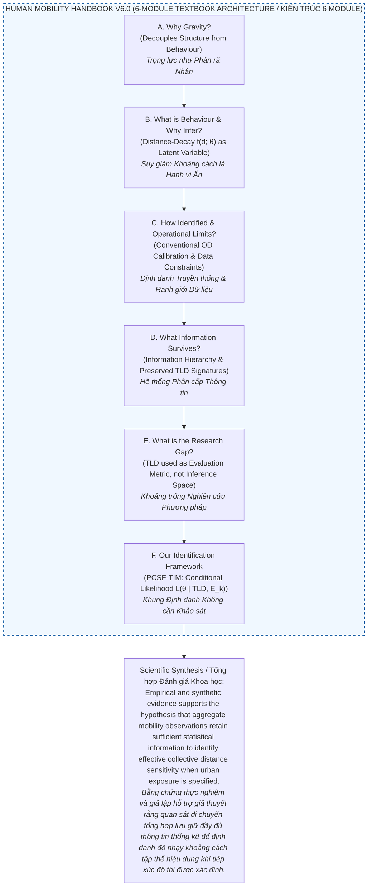
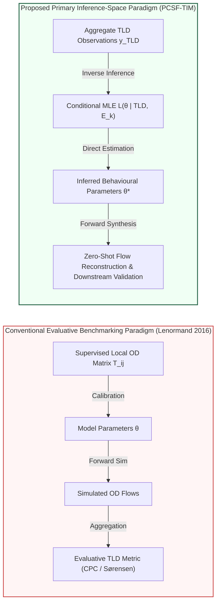

# Theoretical Background and Methodological Blueprint
# Hướng dẫn Lý thuyết và Bản thiết kế Phương pháp luận

---

## Central Thesis & Research Hypothesis / Luận điểm & Giả thuyết Khoa học Trung tâm

> **EN:** **This Handbook formulates and evaluates the central hypothesis that aggregate mobility observations retain sufficient statistical information to support the identification of effective collective distance sensitivity governing spatial interaction, provided that urban structural exposure is independently specified.**
> 
> **VI:** **Handbook này xây dựng và đánh giá giả thuyết trung tâm rằng các quan sát di chuyển tổng hợp lưu giữ đầy đủ thông tin thống kê để hỗ trợ việc định danh độ nhạy khoảng cách tập thể hiệu dụng chi phối tương tác không gian, với điều kiện mức độ tiếp xúc cấu trúc đô thị được xác định độc lập.**
>
> ---
>
> **EN:** *This Handbook develops the scientific argument that effective collective distance-decay parameters $\hat{\theta}^* = (\hat{\alpha}^*, \hat{\beta}^*)$ can be statistically identified from aggregate observation layers (such as Trip-Length Distributions) when urban structural spatial exposure is independently specified from open spatial data.*
>
> **VI:** *Cuốn Handbook này phát triển lập luận khoa học rằng các tham số suy giảm theo khoảng cách tập thể hiệu dụng $\hat{\theta}^* = (\hat{\alpha}^*, \hat{\beta}^*)$ có thể được định danh thống kê từ các lớp quan sát tổng hợp (như Phân bố Độ dài Chuyến đi - TLD) khi mức độ tiếp xúc không gian cấu trúc đô thị được xác định độc lập từ dữ liệu không gian mở (gồm dân số, POI, mạng lưới đường, sử dụng đất).*

---

> [!IMPORTANT]
> **Theoretical Convergence Principle & Observational Error Decomposition: $f^*(d; \hat{\theta}^*) \to f_G(d_{ij}; \theta)$**
> **Nguyên lý Hội tụ Lý thuyết & Phân rã Sai số Quan sát:**
>
> **EN:** 
> ### Effective–Microscopic Convergence Framework
> In PCSF-TIM, parameter inference from aggregate Trip-Length Distributions (TLD) does not aim to directly recover microscopic individual deterrence preferences, but rather to identify an **effective collective deterrence descriptor** $f^*(d; \hat{\theta}^*)$ conditioned on current spatial and observational structures.
> 
> The divergence between the effective macro deterrence $f^*(d; \hat{\theta}^*)$ and the underlying microscopic deterrence $f_G(d; \theta)$ is governed by a tripartite observational error decomposition:
> \[
> f^*(d; \hat{\theta}^*) - f_G(d; \theta) = \epsilon_{\rm disc} + \epsilon_{\rm struct} + \epsilon_{\rm mix}
> \]
> 
> 1. **Distance Discretization Error ($\epsilon_{\rm disc}$):** Arises from replacing continuous travel distances $d_{ij}$ with discrete bin intervals $[d_k, d_{k+1})$ and midpoints $d_k$. As bin resolution becomes infinitely fine ($\Delta b \to 0$), intra-bin variance vanishes ($\epsilon_{\rm disc} \to 0$).
> 2. **Structural Specification Error ($\epsilon_{\rm struct}$):** Arises from incomplete or biased specification of spatial exposure $E(d)$. Because observed TLD reflects $P(d) \propto E(d) f_G(d)$, spatial omitted variable bias is absorbed into parameter estimates. When exposure is unbiasedly specified from open spatial data, structural bias vanishes ($\epsilon_{\rm struct} \to 0$).
> 3. **Behavioral Mixture Error ($\epsilon_{\rm mix}$):** Arises when aggregate TLD convolves heterogeneous trip purposes ($P(d) = \sum_m \pi_m P_m(d)$ with mixing weights $\pi_m \ge 0, \sum_m \pi_m = 1$ and purpose-conditional distributions $P_m(d) = P(d \mid m)$). Fitting a single parametric decay function yields an effective parameter $\hat{\theta}^*$ describing the joint population mixture rather than any single subgroup constant (*"When multiple behavioural mechanisms are aggregated into a single TLD, the inferred parameter $\hat{\theta}^*$ should be interpreted as an Effective Collective Behaviour Descriptor, rather than the microscopic parameter of any individual trip-purpose class"*). When observations are fully segmented by trip intent, mixture error vanishes ($\epsilon_{\rm mix} \to 0$).
> 
> **Theoretical Convergence Limit:**
> \[
> f^*(d; \hat{\theta}^*) \to f_G(d; \theta) \quad \text{iff} \quad (\Delta b \to 0, \, \epsilon_{\rm struct} \to 0, \, \epsilon_{\rm mix} \to 0)
> \]
> *Note: Model-class misspecification ($\epsilon_{\rm model}$) is explicitly decoupled from this observational boundary and treated under Model Selection (Module F2b).*
>
> ---
>
> **VI:** 
> ### Khung Hội tụ Hiệu dụng – Vi mô
> Trong PCSF-TIM, suy luận tham số từ Phân bố Độ dài Chuyến đi tổng hợp (TLD) không nhằm phục hồi trực tiếp hàm cản trở vi mô cấp độ cá nhân, mà nhằm xác định một **mô tả cản trở hành vi tập thể hiệu dụng** $f^*(d; \hat{\theta}^*)$ điều kiện trên cấu trúc không gian và quan sát hiện hành.
> 
> Sự sai lệch giữa hàm cản trở hiệu dụng vĩ mô $f^*(d; \hat{\theta}^*)$ và hàm cản trở vi mô nền tảng $f_G(d; \theta)$ được chi phối bởi phân rã 3 nguồn sai số quan sát:
> \[
> f^*(d; \hat{\theta}^*) - f_G(d; \theta) = \epsilon_{\rm disc} + \epsilon_{\rm struct} + \epsilon_{\rm mix}
> \]
> 
> 1. **Sai số Rời rạc hóa Khoảng cách ($\epsilon_{\rm disc}$):** Phát sinh khi thay thế khoảng cách liên tục $d_{ij}$ bằng các bin rời rạc $[d_k, d_{k+1})$ và điểm giữa $d_k$. Khi độ phân giải bin mịn tuyệt đối ($\Delta b \to 0$), sai số nội bin triệt tiêu ($\epsilon_{\rm disc} \to 0$).
> 2. **Sai số Đặc tả Cấu trúc Không gian ($\epsilon_{\rm struct}$):** Phát sinh khi tiếp xúc không gian $E(d)$ bị đặc tả thiếu sót hoặc chệch. Vì TLD phản ánh $P(d) \propto E(d) f_G(d)$, sai lệch cấu trúc bị bẫy vào tham số suy luận. Khi tiếp xúc được xác định không chệch từ dữ liệu không gian mở, sai số cấu trúc triệt tiêu ($\epsilon_{\rm struct} \to 0$).
> 3. **Sai số Hỗn hợp Hành vi ($\epsilon_{\rm mix}$):** Phát sinh khi TLD gộp chung nhiều mục đích di chuyển khác nhau theo mô hình hỗn hợp ($P(d) = \sum_m \pi_m P_m(d)$ với trọng số hỗn hợp $\pi_m \ge 0, \sum_m \pi_m = 1$ và phân bố điều kiện nhóm $P_m(d) = P(d \mid m)$). Việc khớp một hàm đơn duy nhất tạo ra tham số hiệu dụng $\hat{\theta}^*$ mô tả toàn bộ phân bố hỗn hợp chứ không đại diện cho bất kỳ nhóm hành vi riêng lẻ nào (*"Khi nhiều cơ chế hành vi được tổng hợp vào một TLD duy nhất, tham số được suy luận $\hat{\theta}^*$ phải được diễn giải là một Mô tả Hành vi Tập thể Hiệu dụng, thay vì tham số vi mô của bất kỳ nhóm mục đích chuyến đi riêng lẻ nào"*). Khi dữ liệu được phân đoạn hoàn toàn theo mục đích chuyến đi, sai số hỗn hợp triệt tiêu ($\epsilon_{\rm mix} \to 0$).
> 
> **Giới hạn Hội tụ Lý thuyết:**
> \[
> f^*(d; \hat{\theta}^*) \to f_G(d; \theta) \quad \text{khi và chỉ khi} \quad (\Delta b \to 0, \, \epsilon_{\rm struct} \to 0, \, \epsilon_{\rm mix} \to 0)
> \]
> *Lưu ý: Sai số đặc tả họ mô hình ($\epsilon_{\rm model}$) được tách biệt khỏi ranh giới quan sát này và được phân tích tại chương Lựa chọn Mô hình (Module F2b).*

---

*This Handbook serves as the theoretical blueprint for the manuscript. It is structured as a 6-module scientific argument: each module poses a core scientific question, formulates a supporting hypothesis or claim, and accumulates evidence toward evaluating that claim. This progressive structure moves systematically from foundational principles (Modules A–D) to method evaluation (Module E) and empirical verification (Module F).*

*Cuốn Handbook này đóng vai trò là cơ sở lý thuyết và bản thiết kế phương pháp luận cho bản thảo bài báo. Nó được cấu trúc như một lập luận khoa học gồm 6 module: mỗi module đặt ra một câu hỏi khoa học cốt lõi, công thức hóa một giả thuyết hoặc luận điểm hỗ trợ, và tích lũy bằng chứng để đánh giá luận điểm đó. Tiến trình này đi một cách hệ thống từ các nguyên lý nền tảng (Module A–D) đến đánh giá phương pháp (Module E) và kiểm chứng thực nghiệm (Module F).*

---

### Strategic Positioning Notes / Các Ghi chú Định vị Chiến lược

> [!NOTE]
> **Key Strategic Positioning for Manuscript Drafting / Định vị Chiến lược cho Bản thảo Bài báo:**
> 
> 0. **Core Scientific Framework (The 60-Year Perspective) / Frame Khoa học Cốt lõi (Góc nhìn 60 năm):** 
>    - **EN:** In Gravity $T_{ij} = O_i A_j f(d_{ij};\theta)$, origin demand $O_i$, destination attraction $A_j$, and distance geometry $d_{ij}$ are known or estimable from open spatial data. The **only unobservable quantity is the effective behavioural parameter $\theta$**. Spanning roughly 60 years of spatial interaction science—from foundational formulations \citep{tanner1961, wilson1971} to modern analytics—the core scientific mission of aggregate mobility modelling remains **Effective Collective Behaviour Identification** ($\hat{\theta}^*$), rather than raw flow curve-fitting. Downstream flow reconstruction serves as empirical validation of the inferred parameters, not as an independent proof of identifiability.
>    - **VI:** Trong mô hình Trọng lực $T_{ij} = O_i A_j f(d_{ij};\theta)$, nhu cầu điểm đi $O_i$, sức hút điểm đến $A_j$, và hình học khoảng cách $d_{ij}$ đã biết hoặc có thể ước tính từ dữ liệu không gian mở. **Đại lượng duy nhất không thể quan sát trực tiếp là tham số hành vi hiệu dụng $\theta$**. Trải qua khoảng 60 năm khoa học tương tác không gian—từ các công thức nền tảng \citep{tanner1961, wilson1971} đến phân tích hiện đại—sứ mệnh khoa học cốt lõi của mô hình hóa di chuyển tổng hợp vẫn là **Định danh Hành vi Tập thể Hiệu dụng** ($\hat{\theta}^*$), chứ không phải khớp đường cong lưu lượng thô. Việc tái tạo lưu lượng hạ nguồn đóng vai trò là sự kiểm chứng thực nghiệm cho các tham số được suy luận, chứ không phải là sự chứng minh độc lập cho khả năng định danh.
>
> 1. **Model–Observation Compatibility Principle / Nguyên lý Tương thích Mô hình - Quan sát:** 
>    - **EN:** When the observation space is restricted to aggregate TLD $\mathbf{y} = (y_1, \dots, y_K)$, inference relies on explaining the full distribution shape. The parametric decay model must match the observation space shape requirements (e.g., Tanner provides dual parameters: $\alpha$ for short-to-intermediate shape and $\beta$ for long-range decay).
>    - **VI:** Khi không gian quan sát bị giới hạn ở TLD tổng hợp $\mathbf{y} = (y_1, \dots, y_K)$, việc suy luận dựa vào giải thích toàn bộ hình dạng phân bố. Mô hình suy giảm tham số phải phù hợp với yêu cầu hình dạng không gian quan sát (ví dụ, mô hình Tanner cung cấp tham số kép: $\alpha$ cho hình dạng khoảng cách ngắn-trung bình và $\beta$ cho sự suy giảm khoảng cách xa).
>
> 2. **Terminology Standard / Tiêu chuẩn Thuật ngữ:** 
>    - **EN:** Standardized on **observed Trip-Length Distribution (observed TLD)** to anchor the observation space to empirical binned histograms $y = (y_1, \dots, y_K)$. Aggregate mobility products—including Meta's Movement Distribution Maps (MDM) \citep{MetaMovementDistributionMaps}—are becoming increasingly available across platforms and regions, providing privacy-preserving summaries of population travel behavior.
>    - **VI:** Chuẩn hóa thuật ngữ **Phân bố Độ dài Chuyến đi quan sát được (observed TLD)** để gắn không gian quan sát với các biểu đồ tần suất khoảng cách thực nghiệm $y = (y_1, \dots, y_K)$. Các sản phẩm dữ liệu di chuyển tổng hợp—bao gồm Bản đồ Phân bố Di chuyển của Meta (Meta MDM) \citep{MetaMovementDistributionMaps}—ngày càng trở nên phổ biến trên nhiều nền tảng và khu vực, cung cấp các tóm tắt bảo vệ quyền riêng tư về hành vi di chuyển của quần thể.
>
> 3. **Enduring Value of Physics-Based Models & Evolutionary Spectrum / Giá trị Đời đời của Mô hình Vật lý & Phổ Tiến hóa:** 
>    - **EN:** Contemporary deep learning frameworks extend rather than replace Gravity. Earlier architectures like Deep Gravity \citep{simini2021} are **gravity-inspired**, retaining origin constraints and spatial features but replacing explicit multiplicative factorization with dense neural networks. Modern physics-informed architectures (neuroGravity \citep{neurogravity2026}, TransGM \citep{transgm2026}, Imagery2Flow \citep{imagery2flow2026}) explicitly preserve the multiplicative factorization $T_{ij} = \text{NN}_O(\mathbf{x}_i) \cdot \text{NN}_A(\mathbf{x}_j) \cdot f(d_{ij};\theta)$. This evolution confirms that SOTA mobility science is progressing toward explicit physical factorization—the exact scientific foundation underlying PCSF-TIM.
>    - **VI:** Các khung học sâu hiện đại mở rộng thay vì thay thế mô hình Trọng lực. Các kiến trúc sớm hơn như Deep Gravity \citep{simini2021} mang tính **truyền cảm hứng từ trọng lực**, giữ lại các ràng buộc điểm đi và đặc trưng không gian nhưng thay thế sự phân rã nhân rõ ràng bằng mạng thần kinh dày đặc. Các kiến trúc học sâu dựa trên vật lý hiện đại (neuroGravity \citep{neurogravity2026}, TransGM \citep{transgm2026}, Imagery2Flow \citep{imagery2flow2026}) duy trì một cách rõ ràng sự phân rã nhân $T_{ij} = \text{NN}_O(\mathbf{x}_i) \cdot \text{NN}_A(\mathbf{x}_j) \cdot f(d_{ij};\theta)$. Sự tiến hóa này xác nhận rằng khoa học di chuyển tiên tiến (SOTA) đang tiến tới sự phân rã vật lý rõ ràng—đúng là nền tảng khoa học cốt lõi của PCSF-TIM.
>
> 4. **The Structure–Behaviour Separation Principle / Nguyên lý Tách biệt Cấu trúc - Hành vi:** 
>    - **EN:** The gravity interaction model factorizes spatial interaction into two mathematically separable components:
>      \[
>      T_{ij} = \underbrace{O_i A_j}_{\text{Urban Structure}} \cdot \underbrace{f(d_{ij};\theta)}_{\text{Behaviour}}
>      \]
>      The structural terms $(O_i, A_j)$ describe the spatial distribution of trip generation and attraction, whereas the deterrence function $f(d_{ij};\theta)$ describes collective distance sensitivity. In this Handbook, we interpret this factorized form as implying an explicit conceptual separation between urban structure and travel behaviour. This interpretation forms the first foundational principle of PCSF-TIM. *(Notation Standard: Origin emission capacity is denoted $O_i$ and destination attraction/opportunity density is denoted $A_j$ throughout this Handbook).*
>    - **VI:** Mô hình tương tác Trọng lực phân rã tương tác không gian thành hai thành phần có thể tách biệt về mặt toán học (mathematically separable):
>      \[
>      T_{ij} = \underbrace{O_i A_j}_{\text{Cấu trúc Đô thị}} \cdot \underbrace{f(d_{ij};\theta)}_{\text{Hành vi}}
>      \]
>      Các thuật ngữ cấu trúc $(O_i, A_j)$ mô tả sự phân bố không gian của phát thải và sức hút chuyến đi, trong khi hàm cản trở $f(d_{ij};\theta)$ mô tả độ nhạy khoảng cách tập thể. Trong Handbook này, chúng tôi diễn giải dạng phân rã nhân này như một nguyên lý tách biệt khái niệm giữa cấu trúc đô thị và hành vi di chuyển. Cách diễn giải này tạo thành nguyên lý nền tảng đầu tiên của PCSF-TIM. *(Quy chuẩn ký hiệu: Năng lực phát thải điểm đi ký hiệu là $O_i$ và mật độ cơ hội/sức hút điểm đến ký hiệu là $A_j$ trong xuyên suốt Handbook này).*
>
> 5. **Novelty Positioning / Định vị Tính Mới (Lenormand 2016 vs. PCSF-TIM):** 
>    - **EN:** Landmark mobility studies use TLD as a downstream evaluative benchmark metric (CPC / Sørensen index) for models calibrated on OD matrices. In contrast, **PCSF-TIM shifts TLD from an evaluation target to the primary probabilistic observation space**, enabling direct parameter identification without requiring local OD flow supervision.
>    - **VI:** Các nghiên cứu di chuyển cột mốc sử dụng TLD làm chỉ số đánh giá chuẩn hạ nguồn (CPC / chỉ số Sørensen) cho các mô hình được hiệu chỉnh trên ma trận OD. Ngược lại, **PCSF-TIM chuyển TLD từ một mục tiêu đánh giá thành không gian quan sát xác suất chính**, cho phép định danh tham số trực tiếp mà không cần sự giám sát của lưu lượng OD địa phương.
>
> 7. **Definition & Role of Downstream Flow Reconstruction / Định nghĩa & Vai trò của Tái tạo Lưu lượng Hạ nguồn:** 
>    - **EN:** *Downstream flow reconstruction* refers to the generation of an origin–destination (OD) flow matrix $\hat{T}_{ij} = O_i A_j f(d_{ij}; \hat{\theta}^*)$ using the effective behaviour descriptor inferred from aggregate mobility observations. In PCSF-TIM, the inferred parameter $\hat{\theta}^*$ is not the ultimate end-goal itself, but a latent behavioural representation in the inference pipeline: $\text{Aggregate Observation (TLD)} \to \text{Behaviour Inference } (\hat{\theta}^*) \to \text{Downstream Flow Reconstruction } (\hat{T}_{ij}) \to \text{Transport Planning}$. Flow reconstruction serves as the primary empirical validation of inferred parameters.
>    - **VI:** *Tái tạo lưu lượng hạ nguồn (Downstream flow reconstruction)* chỉ quá trình khởi tạo ma trận lưu lượng điểm đi - điểm đến (OD) $\hat{T}_{ij} = O_i A_j f(d_{ij}; \hat{\theta}^*)$ sử dụng mô tả hành vi hiệu dụng được suy luận từ quan sát di chuyển tổng hợp. Trong PCSF-TIM, tham số suy luận $\hat{\theta}^*$ không phải là mục tiêu cuối cùng, mà đóng vai trò là một đại diện hành vi ẩn trong chuỗi xử lý: $\text{Quan sát Tổng hợp (TLD)} \to \text{Suy luận Hành vi } (\hat{\theta}^*) \to \text{Tái tạo Lưu lượng Hạ nguồn } (\hat{T}_{ij}) \to \text{Quy hoạch Giao thông}$. Việc tái tạo lưu lượng đóng vai trò là sự kiểm chứng thực nghiệm chính cho các tham số được suy luận.

---

# Human Mobility Handbook V6.0 (6-Module Architecture) / Kiến trúc 6 Module Handbook Di chuyển Con người

> [!TIP]
> **Core 6-Question Scientific Chain / Chuỗi 6 Câu hỏi Khoa học Trung tâm:**
>
> 1. **Q1 (Module A): Why Gravity?** — *Decouples urban structure ($O_i, A_j$) from travel behavior ($f(d;\theta)$) through explicit factorization.* *Tách biệt cấu trúc đô thị ($O_i, A_j$) khỏi hành vi di chuyển ($f(d;\theta)$) thông qua sự phân rã rõ ràng.*
> 2. **Q2 (Module B): What is behaviour?** — *Identifies distance-decay as generalized impedance friction and formulates its latent nature.* *Xác định suy giảm khoảng cách là trở lực ma sát và công thức hóa bản chất biến ẩn của nó.*
> 3. **Q3 (Module C): Why can't we observe it?** — *Analyzes operational limits of conventional OD calibration under privacy-preserving data constraints.* *Phân tích ranh giới áp dụng của hiệu chỉnh OD truyền thống trong các ràng buộc dữ liệu bảo vệ quyền riêng tư.*
> 4. **Q4 (Module D): What survives spatial aggregation?** — *Formalizes the Information Hierarchy and preserved binned distance signatures.* *Hình thức hóa Hệ thống Phân cấp Thông tin và các dấu hiệu khoảng cách tổng hợp được bảo toàn.*
> 5. **Q5 (Module E): Why don't existing methods use it?** — *Pinpoints the research gap of treating TLD as an evaluation target rather than an inference space.* *Chỉ ra khoảng trống nghiên cứu khi coi TLD là mục tiêu đánh giá thay vì không gian suy luận chính.*
> 6. **Q6 (Module F): How can we infer it?** — *Formulates conditional MLE under open-data exposure and evaluates empirical statistical evidence.* *Công thức hóa MLE điều kiện trên tiếp xúc dữ liệu mở và đánh giá các bằng chứng thống kê thực nghiệm.*

| Module | Scientific Question (EN / VI) | Scientific Answer (EN / VI) | Leads to... (EN / VI) |
| :--- | :--- | :--- | :--- |
| **A. Gravity as Primary Factorization** / *Trọng lực như một Phân rã Nhân Chính* | **Why is Gravity the foundational scientific framework for aggregate mobility?** *Tại sao Trọng lực là khung làm việc khoa học nền tảng của di chuyển tổng hợp?* | Gravity factorizes mobility into urban spatial structure ($O_i, A_j$) and traveller behaviour ($f(d;\theta)$). *Trọng lực phân rã di chuyển thành cấu trúc không gian đô thị ($O_i, A_j$) và hành vi người di chuyển ($f(d;\theta)$).* | If behaviour is decoupled from structure, **what represents the behavioural mechanism and why must it be inferred?** *Nếu hành vi được tách khỏi cấu trúc, điều gì đại diện cho cơ chế hành vi và tại sao nó phải được suy luận?* |
| **B. Distance-Decay as Latent Behaviour** / *Suy giảm theo Khoảng cách là Hành vi Ẩn* | **What is the behavioural mechanism in spatial interaction models, and why must it be inferred rather than observed?** *Cơ chế hành vi trong mô hình tương tác không gian là gì, và tại sao nó phải được suy luận thay vì quan sát trực tiếp?* | Distance-decay $f(d;\theta)$ quantifies collective distance sensitivity $\theta$, which is a latent variable unobservable by physical sensors and confounded by spatial exposure. *Suy giảm khoảng cách $f(d;\theta)$ định lượng độ nhạy khoảng cách tập thể $\theta$, là một biến ẩn không thể quan sát bằng cảm biến vật lý và bị nhiễu bởi sự tiếp xúc không gian.* | If $\theta$ is a latent variable, **how has mobility science conventionally identified it, and what are its operational limits when flow data are unobserved?** *Nếu $\theta$ là một biến ẩn, khoa học di chuyển đã định danh nó theo cách truyền thống như thế nào, và ranh giới áp dụng của nó là gì khi dữ liệu lưu lượng không quan sát được?* |
| **C. Conventional Identification under Data Constraints** / *Định danh Truyền thống trong Ràng buộc Dữ liệu* | **How has mobility science conventionally identified latent parameters, and what are its applicability limits?** *Khoa học di chuyển đã định danh các tham số ẩn theo cách truyền thống như thế nào, và ranh giới áp dụng của nó là gì?* | Conventional identification relied on supervised local OD matrix calibration, which is effective when local OD flows exist but limited when only aggregate observations are available (Meta MDM). *Định danh truyền thống dựa vào việc hiệu chỉnh ma trận OD địa phương có giám sát, hiệu quả khi có dữ liệu OD địa phương nhưng gặp ranh giới áp dụng khi chỉ có các quan sát tổng hợp (Meta MDM).* | If conventional OD calibration is constrained by data availability, **what statistical information survives spatial aggregation?** *Nếu hiệu chỉnh OD truyền thống gặp hạn chế về tính sẵn có của dữ liệu, thông tin thống kê nào còn tồn tại qua sự gom tụ không gian?* |
| **D. Information Hierarchy of Aggregate Mobility** / *Hệ thống Phân cấp Thông tin* | **What statistical information survives spatial aggregation across mobility observation layers?** *Thông tin thống kê nào còn tồn tại qua sự gom tụ không gian trên các lớp quan sát di chuyển?* | Aggregation collapses cell-to-cell OD identities while preserving aggregate travel-distance signatures (observed TLD) under differential privacy. *Sự gom tụ loại bỏ danh tính OD giữa các ô nhưng lưu giữ các dấu hiệu khoảng cách di chuyển tổng hợp (observed TLD) dưới bảo mật vi sai.* | If distance-domain information survives, **why can't existing methods use it for survey-free identification?** *Nếu thông tin miền khoảng cách còn tồn tại, tại sao các phương pháp hiện có không thể dùng nó để định danh không cần khảo sát?* |
| **E. Methodological Knowledge & Research Gap** / *Khoảng trống Nghiên cứu Phương pháp* | **Why do existing spatial interaction paradigms fail to use aggregate distance layers for parameter inference?** *Tại sao các paradigm tương tác không gian hiện tại thất bại trong việc dùng các lớp khoảng cách tổng hợp để suy luận tham số?* | Existing literature treats TLD strictly as a downstream evaluation benchmark (CPC); no framework exists for using TLD as the primary inference space. *Các nghiên cứu hiện tại coi TLD thuần túy là chỉ số đánh giá chuẩn hạ nguồn (CPC); chưa có khung làm việc nào dùng TLD làm không gian suy luận chính.* | **How does the proposed framework solve this gap and validate it empirically?** *Khung làm việc được đề xuất giải quyết khoảng trống này như thế nào và kiểm chứng thực nghiệm ra sao?* |
| **F. Survey-Free Identification Framework (PCSF-TIM)** / *Khung Định danh Không cần Khảo sát* | **How does PCSF-TIM achieve survey-free parameter identification from aggregate TLDs and validate it empirically?** *PCSF-TIM đạt được việc định danh tham số không cần khảo sát từ TLD tổng hợp như thế nào và kiểm chứng thực nghiệm ra sao?* | Maximum likelihood estimation conditional on open-data exposure $\mathcal{L}(\theta \mid \mathbf{y}_{TLD}, E_k)$ recovers stable parameters $\hat{\theta}^*$ and enables zero-shot OD reconstruction. *Ước tính khả năng tối đa điều kiện trên sự tiếp xúc dữ liệu mở $\mathcal{L}(\theta \mid \mathbf{y}_{TLD}, E_k)$ khôi phục tham số ổn định $\hat{\theta}^*$ và cho phép tái tạo OD không cần huấn luyện lại.* | **Scientific Synthesis.** *Tổng hợp Đánh giá Khoa học.* |

### Core Logic Graph V6.0 / Đồ thị Logic Trung tâm V6.0

---

# Module A — Gravity as the Primary Factorization of Aggregate Mobility
# Module A — Mô hình Trọng lực như một Phân rã Nhân của Di chuyển Tổng hợp

| Component / Thành phần | EN Content | VI Content |
| :--- | :--- | :--- |
| **Module Title** | **Gravity as the Primary Factorization of Aggregate Mobility** | **Mô hình Trọng lực như một Phân rã Nhân của Di chuyển Tổng hợp** |
| **Scientific Question** | **Why is Gravity the foundational scientific framework for aggregate human mobility?** | **Tại sao Trọng lực là khung làm việc khoa học nền tảng của di chuyển con người tổng hợp?** |
| **Module Rationale** | Without Gravity's explicit decomposition, travel behaviour cannot be isolated from urban spatial structure. | Nếu không có sự phân rã rõ ràng của Trọng lực, hành vi di chuyển không thể được tách biệt khỏi cấu trúc không gian đô thị. |
| **Mission** | Establish Gravity not as a specific predictive algorithm, but as a foundational scientific factorization of aggregate mobility into urban structure ($O_i, A_j$) and behavioural distance response ($f(d_{ij}; \theta)$). | Thiết lập mô hình Trọng lực không phải như một thuật toán dự báo cụ thể, mà là sự phân rã khoa học nền tảng của di chuyển tổng hợp thành cấu trúc đô thị ($O_i, A_j$) và phản ứng hành vi khoảng cách ($f(d_{ij}; \theta)$). |
| **Central Claim** | **Gravity should be understood not primarily as a predictive model, but as a foundational factorization of aggregate human mobility into urban structure and travel behaviour.** | **Mô hình Trọng lực nên được hiểu không phải chủ yếu là một mô hình dự báo, mà là sự phân rã nền tảng của di chuyển con người tổng hợp thành cấu trúc đô thị và hành vi di chuyển.** |

### Theoretical Explanation / Giải thích Lý thuyết

**EN:** Aggregate mobility seeks to explain the volume of spatial trips between origins and destinations. Regardless of the underlying modelling technique, this problem fundamentally requires separating three distinct components:
1. The capacity of origins to generate trips ($O_i$),
2. The trip attraction of destinations ($A_j$),
3. The behavioural effect of spatial separation ($f(d_{ij}; \theta)$).

The gravity formulation expresses this decomposition explicitly as:
$$T_{ij} = O_i A_j f(d_{ij}; \theta)$$

where $O_i$ and $A_j$ represent urban spatial structure, while $f(d_{ij}; \theta)$ represents collective travel behaviour. The enduring importance of the gravity formulation therefore lies less in its specific functional form than in its ability to separate structural factors from behavioural mechanisms in a transparent and interpretable manner.

**VI:** Di chuyển tổng hợp nhằm mục đích giải thích lưu lượng chuyến đi không gian giữa điểm đi và điểm đến. Bất kể kỹ thuật mô hình hóa nền tảng là gì, bài toán này về bản chất đòi hỏi phải tách biệt ba thành phần riêng biệt:
1. Năng lực phát thải chuyến đi của điểm đi ($O_i$),
2. Sức hút chuyến đi của điểm đến ($A_j$),
3. Tác động hành vi của khoảng cách chia cắt không gian ($f(d_{ij}; \theta)$).

Công thức trọng lực thể hiện sự phân rã này một cách rõ ràng dưới dạng:
$$T_{ij} = O_i A_j f(d_{ij}; \theta)$$

trong đó $O_i$ và $A_j$ đại diện cho cấu trúc không gian đô thị, còn $f(d_{ij}; \theta)$ đại diện cho hành vi di chuyển tập thể. Tầm quan trọng lâu bền của công thức trọng lực do đó nằm ở khả năng tách biệt các yếu tố cấu trúc khỏi các cơ chế hành vi một cách minh bạch và có thể giải thích được, hơn là nằm ở dạng hàm cụ thể của nó.

### Supporting Claims / Các Luận điểm Hỗ trợ (Module A)

| Claim (EN / VI) | Purpose (EN / VI) | Representative Evidence (EN / VI) | Expected Conclusion (EN / VI) |
| :--- | :--- | :--- | :--- |
| **A1. Primary contribution is explicit separation between structure and behaviour.** *Đóng góp nền tảng là tách biệt rõ ràng giữa cấu trúc và hành vi.* | Establishes decomposition $T_{ij} = \text{Structure} \times \text{Behaviour}$ as theoretical core. *Thiết lập sự phân rã $T_{ij} = \text{Cấu trúc} \times \text{Hành vi}$ làm lõi lý thuyết.* | • Zipf (1946) \citep{zipf1946}. • Wilson (1971) \citep{wilson1971}. • Lenormand et al. (2016) \citep{lenormand2016systematic}. | Gravity provides a clear decomposition to isolate structure from behaviour. *Mô hình trọng lực cung cấp sự phân rã cần thiết để tách biệt cấu trúc đô thị khỏi phản ứng hành vi.* |
| **A2. Modern AI models extend representation of components rather than replacing decomposition.** *Các mô hình AI hiện đại mở rộng khả năng biểu diễn của các thành phần chứ không thay thế sự phân rã.* | Demonstrates AI extends individual components of Gravity. *Phân tích cách AI mở rộng các thành phần riêng lẻ của mô hình Trọng lực.* | • Deep Gravity (Simini 2021) \citep{simini2021}. • Imagery2Flow (Xu 2026) \citep{imagery2flow2026}. • neuroGravity (Yang 2026) \citep{neurogravity2026}. • TransGM (Enaya 2026) \citep{transgm2026}. | AI/Deep Learning enhance component representations, with SOTA models re-embedding explicit Gravity factorization. *AI và Học sâu nâng cao năng lực biểu diễn của các thành phần, trong đó các mô hình SOTA ngày càng tích hợp lại sự phân rã Trọng lực rõ ràng.* |
| **A3. Viewing gravity as a shared factorization provides a common scientific language.** *Coi trọng lực là sự phân rã nhân cung cấp ngôn ngữ khoa học chung.* | Establishes a shared conceptual coordinate system for spatial interaction problems. *Thiết lập một hệ tọa độ khái niệm chung cho các bài toán tương tác không gian.* | • Theoretical synthesis of spatial interaction literature. • Barbosa et al. (2018) \citep{barbosa2018human}. | Gravity decomposition serves as the organizing principle positioning flow modeling, calibration, and inference within a single framework. *Phân rã Trọng lực đóng vai trò là nguyên lý tổ chức đặt mô hình hóa lưu lượng, hiệu chỉnh và suy luận vào cùng một khung khái niệm.* |

### Deep Dive: Structural–Behavioural Factorization (Claim A1) / Phân tích Sâu: Phân rã Cấu trúc - Hành vi (Luận điểm A1)

> **EN:** The Gravity model originated as an empirical analogy adapting Newton's law of gravitation to spatial-sociological interactions \citep{zipf1946}. It was subsequently established on a theoretical foundation within spatial interaction modelling through the entropy-maximizing principle \citep{wilson1971}. This theoretical grounding was further developed as Gravity was integrated into formal statistical inference frameworks, defining spatial flows $T_{ij}$ as random variables \citep{flowerdew1982method, haynes1984gravity}. Comprehensive modern reviews \citep{barbosa2018human} confirm that Gravity provides a foundational formulation for separating spatial structure from collective travel response.
>
> **VI:** Mô hình Trọng lực khởi nguồn như một sự tương tự thực nghiệm thích ứng định luật vạn vật hấp dẫn của Newton vào tương tác xã hội - không gian \citep{zipf1946}. Sau đó nó được thiết lập trên một nền tảng lý thuyết thông qua nguyên lý tối đa hóa entropy \citep{wilson1971}. Cơ sở lý thuyết này tiếp tục được phát triển khi Trọng lực được tích hợp vào các khung suy luận thống kê chính thức, định nghĩa lưu lượng không gian $T_{ij}$ là biến ngẫu nhiên \citep{flowerdew1982method, haynes1984gravity}. Các khảo sát toàn diện hiện đại \citep{barbosa2018human} xác nhận Trọng lực cung cấp một công thức nền tảng để tách biệt cấu trúc không gian khỏi phản ứng di chuyển tập thể.

### Deep Dive: Representation Extension in Contemporary AI Models (Claim A2) / Phân tích Sâu: Mở rộng Khả năng Biểu diễn trong các Mô hình AI Hiện đại (Luận điểm A2)

> **EN:** A central question in contemporary mobility science is how deep learning architectures relate to physical spatial interaction models. Machine learning approaches enhance representational capacity but may encounter challenges in output interpretability and cross-city transferability due to spatial non-stationarity. Recent state-of-the-art models address these challenges by progressively stratifying their integration of physical principles:
> - **Gravity-Inspired Architectures:** Frameworks such as Deep Gravity \citep{simini2021} leverage neural networks to learn complex representations from spatial features (POIs, land use). While retaining origin constraints, they replace explicit multiplicative deterrence with neural layers ($W_{MLP}$).
> - **Physics-Informed Explicit Factorization:** Contemporary architectures—such as neuroGravity \citep{neurogravity2026}, TransGM \citep{transgm2026}, and Imagery2Flow \citep{imagery2flow2026}—explicitly preserve the multiplicative decomposition $T_{ij} = \text{NN}_O(\mathbf{x}_i) \cdot \text{NN}_A(\mathbf{x}_j) \cdot f(d_{ij};\theta)$ directly within their neural layers.
>
> **VI:** Một câu hỏi trung tâm trong khoa học di chuyển hiện đại là các kiến trúc học sâu có mối quan hệ như thế nào với các mô hình tương tác không gian vật lý. Các tiếp cận máy học nâng cao khả năng biểu diễn nhưng có thể gặp thách thức về khả năng giải thích và tính chuyển giao giữa các đô thị do tính không dừng không gian. Các mô hình SOTA gần đây giải quyết thách thức này bằng cách phân tầng mức độ tích hợp các nguyên lý vật lý:
> - **Kiến trúc Truyền cảm hứng Trọng lực:** Các khung làm việc như Deep Gravity \citep{simini2021} sử dụng mạng thần kinh để học biểu diễn phức tạp từ đặc trưng không gian. Dù giữ lại ràng buộc điểm đi, chúng thay thế sự phân rã cản trở dạng nhân bằng các lớp thần kinh ($W_{MLP}$).
> - **Phân rã Rõ ràng Dựa trên Vật lý:** Các kiến trúc hiện đại—như neuroGravity \citep{neurogravity2026}, TransGM \citep{transgm2026}, và Imagery2Flow \citep{imagery2flow2026}—duy trì một cách rõ ràng sự phân rã nhân $T_{ij} = \text{NN}_O(\mathbf{x}_i) \cdot \text{NN}_A(\mathbf{x}_j) \cdot f(d_{ij};\theta)$ ngay trong các lớp mạng thần kinh của chúng.

### Deep Dive: Gravity Factorization as an Organizing Principle (Claim A3) / Phân tích Sâu: Phân rã Trọng lực như Nguyên lý Tổ chức (Luận điểm A3)

> **EN:** Viewing the Gravity model as a multiplicative factorization:
> \[ T_{ij} = O_i A_j f(d_{ij}; \theta) \]
> is not merely a mathematical representation, but an organizing principle for structuring problems in spatial interaction science \citep{barbosa2018human}. By explicitly decoupling urban structural opportunities ($O_i, A_j$) from behavioural distance response ($f(d;\theta)$), this decomposition establishes a shared conceptual coordinate system wherein mobility flow modeling, parameter calibration, information preservation, and behavioural inference are positioned within a single unified framework rather than treated as isolated research directions.
>
> **VI:** Việc coi mô hình Trọng lực như một phân rã dạng nhân:
> \[ T_{ij} = O_i A_j f(d_{ij}; \theta) \]
> không chỉ là một cách biểu diễn toán học mà còn là một nguyên lý tổ chức các bài toán trong khoa học tương tác không gian \citep{barbosa2018human}. Phân rã này tách rõ cấu trúc đô thị ($O_i, A_j$) khỏi hành vi khoảng cách ($f(d;\theta)$), cho phép các vấn đề như mô hình hóa lưu lượng, hiệu chỉnh tham số, đánh giá thông tin và suy luận hành vi được đặt trong cùng một khung khái niệm thay vì được xem như những hướng nghiên cứu độc lập.

### Transition to Module B / Chuyển tiếp sang Module B

| Component / Thành phần | EN Content | VI Content |
| :--- | :--- | :--- |
| **Transition Question** | **If behaviour is decoupled from structure, what represents the behavioural mechanism and why must it be inferred as a latent variable?** | **Nếu hành vi được tách khỏi cấu trúc, điều gì đại diện cho cơ chế hành vi và tại sao nó phải được suy luận như một biến ẩn?** |
| **Motivation for Module B** | Physical sensors cannot measure human distance deterrence directly. Module B defines distance decay and formulates the Latent Behaviour Identification Problem. | Cảm biến vật lý không thể đo trực tiếp ma sát khoảng cách của con người. Module B định nghĩa sự suy giảm khoảng cách và thiết lập Bài toán Định danh Hành vi Ẩn. |

---

# Module B — Distance-Decay as Latent Behaviour
# Module B — Suy giảm theo Khoảng cách là Hành vi Ẩn

| Component / Thành phần | EN Content | VI Content |
| :--- | :--- | :--- |
| **Module Title** | **Distance-Decay as Latent Behaviour** | **Suy giảm theo Khoảng cách là Hành vi Ẩn** |
| **Scientific Question** | **What is the behavioural mechanism in spatial interaction models, and why must it be inferred rather than observed directly?** | **Cơ chế hành vi trong mô hình tương tác không gian là gì, và tại sao nó phải được suy luận thay vì quan sát trực tiếp?** |
| **Module Rationale** | Establishes distance-decay $f(d;\theta)$ as core friction mechanism, demonstrates $\theta$ is an unobservable latent variable, and articulates exposure confounding. | Thiết lập suy giảm khoảng cách $f(d;\theta)$ làm cơ pháp ma sát cốt lõi, chỉ ra $\theta$ là biến ẩn không thể quan sát, và làm rõ sự nhiễu do tiếp xúc không gian. |
| **Mission** | Define distance decay as spatial impedance friction, show Tanner's parameters quantify distance sensitivity, formulate unobservability, establish urban exposure as structural confounder. | Định nghĩa suy giảm khoảng cách là ma sát trở lực không gian, chỉ ra các tham số của Tanner định lượng độ nhạy khoảng cách, và thiết lập mức độ tiếp xúc đô thị là biến nhiễu cấu trúc. |

### Supporting Claims / Các Luận điểm Hỗ trợ (Module B)

| Claim (EN / VI) | Purpose (EN / VI) | Representative Evidence (EN / VI) | Expected Conclusion (EN / VI) |
| :--- | :--- | :--- | :--- |
| **B1. Distance decay represents spatial impedance friction.** *Suy giảm khoảng cách đại diện cho ma sát trở lực không gian.* | Maps spatial separation into interaction probability. *Ánh xạ khoảng cách không gian thành xác suất tương tác.* | • Tobler (1970) \citep{tobler1970computer}. • Wilson (1971) \citep{wilson1971}. • Stouffer (1940) \citep{stouffer1940intervening}. • Hansen (1959) \citep{hansen1959accessibility}. | Distance decay isolates geographic impedance from structural opportunity density. *Suy giảm khoảng cách tách biệt trở lực địa lý khỏi mật độ cơ hội cấu trúc.* |
| **B2. Decay specifications embody distinct behavioural hypotheses.** *Các dạng suy giảm thể hiện các giả thuyết hành vi riêng biệt.* | Analyzes exponential, power-law, and Tanner formulations. *Phân tích các dạng hàm mũ, lũy thừa và Tanner.* | • Wilson (1971) \citep{wilson1971}. • González (2008) \citep{gonzalez2008understanding}. • Tanner (1961) \citep{tanner1961}. • Liang (2013) \citep{liang2013unraveling}. | Functional forms embody distinct spatial perception mechanisms across scales. *Dạng hàm thể hiện các cơ chế nhận thức không gian riêng biệt qua các quy mô.* |
| **B3. Tanner deterrence function provides flexible dual representation.** *Hàm cản trở Tanner cung cấp biểu diễn kép linh hoạt.* | Justifies Tanner function choice ($f(d) = d^{-\alpha} e^{-\beta d}$). *Biện minh việc chọn hàm Tanner.* | • Tanner (1961) \citep{tanner1961}. • Liang (2013) \citep{liang2013unraveling}. • Lenormand (2016) \citep{lenormand2016systematic}. | Tanner unifies short-range attraction ($\alpha$) and long-range exponential cutoff ($\beta$). *Tanner hợp nhất sức hút cự cự ngắn ($\alpha$) và kháng lực hàm mũ cự cự xa ($\beta$).* |
| **B4. Traveller distance sensitivity is an unobservable latent variable confounded by spatial exposure.** *Độ nhạy khoảng cách là biến ẩn không thể quan sát bị nhiễu bởi tiếp xúc không gian.* | Defines latent variable nature of $\theta = (\alpha, \beta)$ and exposure confounding. *Định nghĩa bản chất biến ẩn của $\theta$ và nhiễu do tiếp xúc không gian.* | • Wilson (1971) \citep{wilson1971}. • Huff (1963) \citep{huff1963probabilistic}. • Fotheringham & O'Kelly (1989) \citep{fotheringham1989spatial}. • Casella & Berger (2002) \citep{casella2002statistical}. | Parameter estimation must be framed as inverse statistical inference conditional on exposure $E_k$. *Ước tính tham số phải được đặt khung là suy luận thống kê ngược điều kiện trên $E_k$.* |

### Deep Dive: Spatial Impedance vs. Geographic Distance & Intervening Opportunities (Claim B1) / Phân tích Sâu: Trở lực Không gian so với Khoảng cách Địa lý (Luận điểm B1)

> **EN:** In spatial interaction theory, distance $d_{ij}$ in deterrence $f(d_{ij};\theta)$ represents generalized spatial impedance (travel time, monetary costs, physical transport constraints, cognitive friction). Stouffer's theory of intervening opportunities \citep{stouffer1940intervening} proposed an alternative perspective where travel deterrence is driven by intermediate opportunities between origin and destination. Exposure-corrected gravity unifies distance deterrence with opportunity density. Conditioning parameter estimation on structural spatial exposure $E_k = \sum_{(i,j) \in \text{Bin}_k} O_i A_j$ explicitly controls for intermediate opportunity capacity, allowing $f^*(d; \theta^*)$ to capture the residual spatial impedance friction.
>
> **VI:** Trong lý thuyết tương tác không gian, khoảng cách $d_{ij}$ trong hàm cản trở $f(d_{ij};\theta)$ đại diện cho trở lực không gian tổng quát (thời gian di chuyển, chi phí, hạn chế hạ tầng, ma sát nhận thức). Lý thuyết cơ hội trung gian của Stouffer \citep{stouffer1940intervening} đề xuất một góc nhìn trong đó sự cản trở bị chi phối bởi các cơ hội trung gian giữa điểm đi và điểm đến. Trọng lực có hiệu chỉnh tiếp xúc hợp nhất suy giảm khoảng cách với mật độ cơ hội. Việc điều kiện hóa ước tính tham số trên tiếp xúc cấu trúc $E_k = \sum_{(i,j) \in \text{Bin}_k} O_i A_j$ kiểm soát rõ ràng mật độ cơ hội trung gian, giúp $f^*(d; \theta^*)$ phản ánh ma sát trở lực không gian thặng dư.

### Deep Dive: Functional Decay Forms as Behavioural Hypotheses (Claim B2) / Phân tích Sâu: Dạng suy giảm như Giả thuyết Hành vi (Luận điểm B2)

> **EN:** Specifying the distance-decay function $f(d)$ reflects distinct behavioural hypotheses regarding how populations respond to spatial separation across distance scales \citep{wilson1971, lenormand2016systematic, liang2013unraveling}:
> 1. **Exponential Decay ($f(d) = e^{-\beta d}$):** Emerges naturally from entropy-maximizing spatial interaction under global cost constraints \citep{wilson1971}, representing constant marginal travel impedance.
> 2. **Power-Law Decay ($f(d) = d^{-\alpha}$):** Represents scale-invariant travel patterns, aligning with threshold sensitivity to relative distance variations \citep{gonzalez2008understanding}.
>
> **VI:** Việc xác định dạng hàm suy giảm khoảng cách $f(d)$ phản ánh các giả thuyết hành vi riêng biệt về cách quần thể di chuyển phản ứng với sự chia cắt không gian qua các quy mô khoảng cách \citep{wilson1971, lenormand2016systematic, liang2013unraveling}:
> 1. **Suy giảm theo Hàm Mũ ($f(d) = e^{-\beta d}$):** Nảy sinh tự nhiên từ việc tối đa hóa entropy trong tương tác không gian dưới ràng buộc chi phí \citep{wilson1971}, thể hiện trở lực di chuyển biên không đổi.
> 2. **Suy giảm theo Hàm Lũy thừa ($f(d) = d^{-\alpha}$):** Đại diện cho các mẫu hình bất biến theo quy mô, phù hợp với độ nhạy ngưỡng đối với những thay đổi khoảng cách tương đối \citep{gonzalez2008understanding}.

### Deep Dive: Tanner Deterrence Specification & Dual Representation (Claim B3) / Phân tích Sâu: Công thức Cản trở Tanner & Biểu diễn Kép (Luận điểm B3)

> **EN:** The composite Tanner deterrence function:
> \[ f(d) = d^{-\alpha} e^{-\beta d} \]
> provides a flexible specification unifying short-range power-law attraction ($d^{-\alpha}$) with long-range exponential friction ($e^{-\beta d}$) \citep{tanner1961}. This dual-parameter formulation accommodates distinct distance regimes in intra-urban mobility, capturing both local destination clustering and long-distance travel decay \citep{liang2013unraveling, lenormand2016systematic}.
>
> **VI:** Hàm cản trở Tanner phức hợp:
> \[ f(d) = d^{-\alpha} e^{-\beta d} \]
> cung cấp một công thức linh hoạt hợp nhất sức hút lũy thừa cự cự ngắn ($d^{-\alpha}$) với kháng lực hàm mũ cự cự xa ($e^{-\beta d}$) \citep{tanner1961}. Công thức hai tham số này đáp ứng các miền khoảng cách riêng biệt trong di chuyển nội đô, phản ánh cả sự gom tụ điểm đến địa phương lẫn sự suy giảm di chuyển khoảng cách xa \citep{liang2013unraveling, lenormand2016systematic}.

### Deep Dive: Latent Parameter Nature & Structural Exposure Confounding (Claim B4) / Phân tích Sâu: Bản chất Biến ẩn & Nhiễu do Tiếp xúc Cấu trúc (Luận điểm B4)

> **EN:** Distance-decay parameters $\theta = (\alpha, \beta)$ represent collective spatial friction—a latent systemic property resulting from aggregate individual choices under geographic constraints \citep{wilson1971, casella2002statistical}. Because physical sensors observe spatial locations and flow volumes rather than internal cognitive impedance, $\theta$ cannot be directly measured.
>
> Furthermore, as \citet{fotheringham1989spatial} demonstrated, observed travel-distance distributions depend on urban spatial configuration even when underlying behavioural distance sensitivity remains constant. Two urban areas with identical population travel preferences exhibit different observed distance histograms if their spatial opportunity distributions differ \citep{liang2013unraveling}. Consequently, observed distance distributions reflect the joint effect of structural spatial exposure $E_k$ and distance decay \citep{hansen1959accessibility, wilson1971}.
>
> **VI:** Các tham số suy giảm khoảng cách $\theta = (\alpha, \beta)$ đại diện cho trở lực không gian tập thể—một thuộc tính ẩn của hệ thống nảy sinh từ các lựa chọn cá nhân được gom tụ dưới các ràng buộc địa lý \citep{wilson1971, casella2002statistical}. Các cảm biến vật lý chỉ quan sát vị trí và lưu lượng chứ không đo trở lực nhận thức bên trong, khiến $\theta$ trở thành đại lượng không thể quan sát trực tiếp.
>
> Hơn nữa, như \citet{fotheringham1989spatial} đã chỉ ra, phân bố khoảng cách di chuyển quan sát được phụ thuộc vào cấu hình không gian đô thị ngay cả khi độ nhạy khoảng cách hành vi bên dưới giữ nguyên. Hai khu vực đô thị có cùng sở thích di chuyển sẽ thể hiện các biểu đồ tần suất khoảng cách quan sát được khác nhau nếu phân bố cơ hội không gian của chúng khác nhau \citep{liang2013unraveling}. Do đó, phân bố khoảng cách quan sát được phản ánh tác động kết hợp của tiếp xúc không gian cấu trúc $E_k$ và suy giảm khoảng cách \citep{hansen1959accessibility, wilson1971}.

### Transition to Module C / Chuyển tiếp sang Module C

| Component / Thành phần | EN Content | VI Content |
| :--- | :--- | :--- |
| **Transition Question** | **If $\theta$ is a latent variable, how has mobility science conventionally identified it, and what are its operational limits when flow data are unobserved?** | **Nếu $\theta$ là một biến ẩn, khoa học di chuyển đã định danh nó theo cách truyền thống như thế nào, và ranh giới áp dụng của nó là gì khi dữ liệu lưu lượng không quan sát được?** |
| **Motivation for Module C** | Examining conventional identification paradigms (supervised OD calibration) reveals their reliance on flow surveys and operational limits under privacy constraints. | Việc xem xét các paradigm định danh truyền thống (hiệu chỉnh OD có giám sát) làm rõ sự phụ thuộc của chúng vào khảo sát lưu lượng và các hạn chế thực thi dưới các ràng buộc quyền riêng tư. |

---

# Module C — Conventional Behaviour Identification under Data Availability Constraints
# Module C — Định danh Hành vi Truyền thống trong Ràng buộc về Tính Sẵn có của Dữ liệu

| Component / Thành phần | EN Content | VI Content |
| :--- | :--- | :--- |
| **Module Title** | **Conventional Behaviour Identification under Data Availability Constraints** | **Định danh Hành vi Truyền thống trong Ràng buộc về Tính Sẵn có của Dữ liệu** |
| **Scientific Question** | **How has mobility science conventionally identified latent behavioural parameters, and what are its operational limits when local flow data are unobserved?** | **Khoa học di chuyển đã định danh các tham số hành vi ẩn theo cách truyền thống như thế nào, và ranh giới áp dụng của nó là gì khi dữ liệu lưu lượng địa phương không quan sát được?** |
| **Module Rationale** | Evaluates traditional OD calibration paradigms and demonstrates why privacy constraints motivate a shift to aggregate data products. | Đánh giá phản biện các paradigm hiệu chỉnh OD truyền thống và làm rõ lý do ranh giới riêng tư thúc đẩy chuyển dịch sang dữ liệu tổng hợp. |
| **Mission** | Examine conventional calibration (Hyman 1969, Merlin 2020), analyze reliance on full local OD matrices $T_{ij}^{obs}$, and analyze limitations under privacy bounds (de Montjoye 2013) and aggregate data shifts (Meta MDM). | Xem xét hiệu chỉnh truyền thống (Hyman 1969, Merlin 2020), phân tích sự phụ thuộc vào ma trận OD địa phương đầy đủ $T_{ij}^{obs}$, và phân tích hạn chế trước bảo mật vi sai (de Montjoye 2013) và dữ liệu tổng hợp (Meta MDM). |
| **Core Conflict** | Traditional calibration operated in OD Matrix Space ($T_{ij}^{obs}$). Privacy constraints increasingly restrict sharing raw trajectories or local OD matrices, limiting supervised calibration. | Việc hiệu chỉnh truyền thống hoạt động trong Không gian Ma trận OD ($T_{ij}^{obs}$). Ràng buộc quyền riêng tư hiện hạn chế việc chia sẻ quỹ đạo thô hoặc ma trận OD địa phương, gây khó khăn cho hiệu chỉnh có giám sát. |

### Supporting Claims / Các Luận điểm Hỗ trợ (Module C)

| Claim (EN / VI) | Purpose (EN / VI) | Representative Evidence (EN / VI) | Expected Conclusion (EN / VI) |
| :--- | :--- | :--- | :--- |
| **C1. Conventional parameter calibration relies on local OD flow matrices.** *Hiệu chỉnh tham số truyền thống phụ thuộc vào ma trận lưu lượng OD địa phương.* | Analyzes classical gravity calibration paradigms. *Phân tích các paradigm hiệu chỉnh trọng lực kinh điển.* | • Hyman (1969) \citep{hyman1969calibration}. • Merlin (2020) \citep{merlin2020medians}. • Sen & Smith (1995) \citep{sen1995gravity}. | Classical calibration cannot be applied when local OD flow matrices are unobservable. *Phương pháp hiệu chỉnh truyền thống không thể áp dụng khi không thể quan sát ma trận OD địa phương.* |
| **C2. Deep learning mobility models remain bound to supervised local OD flow training.** *Mô hình học sâu di chuyển vẫn phụ thuộc vào huấn luyện OD địa phương có giám sát.* | Evaluates supervision requirements of SOTA neural models. *Đánh giá yêu cầu giám sát của các mô hình thần kinh SOTA.* | • Deep Gravity (Simini 2021) \citep{simini2021}. • neuroGravity (Yang 2026) \citep{neurogravity2026}. • TransGM (Enaya 2026) \citep{transgm2026}. | Neural gravity models enhance representation but maintain dependency on local OD supervision. *Các mô hình trọng lực thần kinh tăng khả năng biểu diễn nhưng vẫn phụ thuộc vào giám sát OD địa phương.* |
| **C3. Trajectory re-identification risks prompt a transition toward aggregate privacy-preserving products.** *Rủi ro tái định danh quỹ đạo thúc đẩy việc chuyển dịch sang các sản phẩm dữ liệu tổng hợp bảo vệ quyền riêng tư.* | Analyzes privacy constraints and the shift toward aggregate mobility data products. *Phân tích ranh giới riêng tư và sự chuyển dịch sang các sản phẩm dữ liệu tổng hợp.* | • de Montjoye (2013) \citep{de2013unique}. • Pappalardo (2023) \citep{pappalardo2023analytical}. • Meta Movement Distribution Maps \citep{MetaMovementDistributionMaps}. | Privacy requirements limit local OD flow sharing, motivating inference directly from aggregate distance distributions. *Yêu cầu quyền riêng tư hạn chế chia sẻ ma trận OD, thúc đẩy việc suy luận trực tiếp từ phân bố khoảng cách tổng hợp.* |

### Deep Dive: Classical OD Flow Calibration Paradigms (Claim C1) / Phân tích Sâu: các Paradigm Hiệu chỉnh Lưu lượng OD Cổ điển (Luận điểm C1)

> **EN:** For decades, spatial interaction model calibration relied on supervised flow matrices $T_{ij}^{obs}$ \citep{sen1995gravity, erlander1990spatial, ortuzar2011modelling}. \citet{hyman1969calibration} introduced mean-trip-length matching $\bar{d}_{model}(\theta) = \bar{d}_{obs}$ for single-parameter models, while \citet{merlin2020medians} proposed median trip-length matching. These classical approaches assume access to full cell-to-cell interaction matrices; when local flow matrices are absent, these estimation procedures cannot be executed.
>
> **VI:** Trong nhiều thập kỷ, việc hiệu chỉnh mô hình tương tác không gian dựa vào ma trận lưu lượng có giám sát $T_{ij}^{obs}$ \citep{sen1995gravity, erlander1990spatial, ortuzar2011modelling}. \citet{hyman1969calibration} giới thiệu phương pháp khớp độ dài chuyến đi trung bình $\bar{d}_{model}(\theta) = \bar{d}_{obs}$ cho mô hình đơn tham số, còn \citet{merlin2020medians} đề xuất khớp trung vị độ dài chuyến đi. Các tiếp cận cổ điển này giả định việc truy cập được ma trận tương tác ô-tới-ô đầy đủ; khi không có ma trận lưu lượng địa phương, các quy trình ước tính này không thể thực thi.

### Deep Dive: Supervision Dependencies in Contemporary Deep Learning Baselines (Claim C2) / Phân tích Sâu: Sự Phụ thuộc Giám sát trong các Baseline Học sâu Hiện đại (Luận điểm C2)

> **EN:** Contemporary deep learning frameworks (Deep Gravity \citep{simini2021}, neuroGravity \citep{neurogravity2026}, TransGM \citep{transgm2026}) extend feature representation through neural networks, yet remain reliant on supervised local OD matrix optimization $\min \mathcal{L}(T_{ij}^{obs}, \hat{T}_{ij})$. In regions lacking comprehensive local flow surveys or where privacy policies restrict flow matrix sharing, both neural and classical calibration paradigms encounter operational limitations.
>
> **VI:** Các khung học sâu hiện đại (Deep Gravity \citep{simini2021}, neuroGravity \citep{neurogravity2026}, TransGM \citep{transgm2026}) mở rộng biểu diễn đặc trưng qua mạng thần kinh, nhưng vẫn phụ thuộc vào tối ưu hóa hàm tổn thất ma trận OD địa phương có giám sát $\min \mathcal{L}(T_{ij}^{obs}, \hat{T}_{ij})$. Tại các khu vực thiếu khảo sát lưu lượng toàn diện hoặc nơi chính sách quyền riêng tư hạn chế chia sẻ ma trận lưu lượng, cả paradigm hiệu chỉnh thần kinh lẫn cổ điển đều gặp những hạn chế thực thi.

### Comparative Analysis Table / Bảng So sánh Đối chiếu các Mô hình SOTA

| Evaluation Criterion | Deep Gravity (Simini 2021) | neuroGravity (Yang 2026) | TransGM (Enaya 2026) | **PCSF-TIM (This Paper)** |
| :--- | :--- | :--- | :--- | :--- |
| **Mathematical Formulation** | $P(i \to j) = \text{Softmax}\big(\text{MLP}(\mathbf{x}_i, \mathbf{x}_j, d_{ij})\big)$ | $T_{ij} = \text{NN}_O(\mathbf{x}_i) \cdot \text{NN}_A(\mathbf{x}_j) \cdot f(d_{ij}; \theta)$ | $T_{ij}^{(c)} = O_i A_j f(d_{ij}; \theta^{(c)})$ | $P(k \mid \theta) = \frac{E_k f(d_k;\theta)}{\sum E_m f(d_m;\theta)}$ |
| **Observation Space** | **OD Matrix space:** $T_{ij}^{obs}$ | **OD Matrix space:** $T_{ij}^{obs}$ | **OD Matrix space:** $T_{ij}^{obs}$ | **Distance Bin space (TLD):** $\mathbf{y}_{TLD} = (y_1, \dots, y_K)$ |
| **Parameter Handling $\theta$** | Implicit in neural weights $W_{MLP}$ (**Black-box**) | Generated via Graph Neural Network | Inferred via Meta-Learning | **Explicit closed-form parameters:** $\theta = (\alpha, \beta)$ |
| **Supervision Requirement** | **Supervised by Local OD Matrix** | **Supervised by Local OD Matrix** | **Supervised by Source OD Matrix** | **Unsupervised by OD Matrix** (Requires only observed TLD) |
| **Tiếng Việt - Không gian Quan sát** | Không gian Ma trận OD | Không gian Ma trận OD | Không gian Ma trận OD | **Miền Khoảng cách (TLD):** $\mathbf{y}_{TLD} = (y_1, \dots, y_K)$ |
| **Tiếng Việt - Giám sát** | Cần Ma trận OD địa phương | Cần Ma trận OD địa phương | Cần Ma trận OD nguồn | **Không cần Ma trận OD** (Chỉ cần TLD quan sát được) |

### Deep Dive: Privacy Preservation & Aggregate Data Shift (Claim C3) / Phân tích Sâu: Bảo vệ Quyền riêng tư & Chuyển dịch Dữ liệu Tổng hợp (Luận điểm C3)

> **EN:** An important driver behind the search for new calibration methods is the increasing requirement for privacy preservation in mobility data \citep{de2013unique}. Empirical studies demonstrate that individual mobility trajectories exhibit high spatio-temporal uniqueness: just four location-time points are sufficient to uniquely re-identify approximately 95% of individuals within a dataset \citep{de2013unique}. Consequently, the sharing of fine-grained trajectory data or detailed OD interaction matrices is increasingly restricted across data platforms.
>
> In response, data providers increasingly prioritize releasing aggregated mobility data products designed to mitigate re-identification risks through privacy-preserving mechanisms and summary statistics \citep{pappalardo2023analytical}. A prominent example is Meta's Movement Distribution Maps (Meta MDM), wherein specific origin-destination pairs are replaced by aggregate travel-distance distributions \citep{MetaMovementDistributionMaps, buckee2020thinking, oliver2020mobile}. When observed data are available only as aggregate statistics, conventional calibration methods reliant on full OD flow supervision can no longer be applied directly. This raises the scientific question of whether aggregate statistics such as travel-distance distributions retain sufficient statistical information to support behavioural parameter inference—the problem examined in subsequent modules.
>
> **VI:** Động lực quan trọng thúc đẩy việc tìm kiếm các phương pháp hiệu chỉnh mới là yêu cầu ngày càng cao về bảo vệ quyền riêng tư trong dữ liệu di chuyển \citep{de2013unique}. Các nghiên cứu cho thấy quỹ đạo di chuyển cá nhân có tính duy nhất rất cao: chỉ bốn điểm không–thời gian đã đủ để tái định danh khoảng 95% cá nhân trong một tập dữ liệu \citep{de2013unique}. Do đó, việc chia sẻ dữ liệu di chuyển ở mức quỹ đạo hoặc ma trận OD chi tiết ngày càng bị hạn chế trong nhiều hệ thống dữ liệu.
>
> Thay vào đó, nhiều nhà cung cấp dữ liệu đang ưu tiên phát hành các sản phẩm dữ liệu tổng hợp được thiết kế để giảm nguy cơ tiết lộ thông tin cá nhân, bao gồm các cơ chế bảo vệ quyền riêng tư và thống kê tổng hợp \citep{pappalardo2023analytical}. Một ví dụ tiêu biểu là Meta Movement Distribution Maps (Meta MDM), trong đó thông tin về các cặp OD được thay thế bằng các phân bố khoảng cách di chuyển tổng hợp \citep{MetaMovementDistributionMaps, buckee2020thinking, oliver2020mobile}. Khi dữ liệu quan sát chỉ còn tồn tại dưới dạng thống kê tổng hợp, các phương pháp hiệu chỉnh dựa trên ma trận OD không còn có thể áp dụng trực tiếp. Điều này đặt ra câu hỏi liệu các thống kê tổng hợp như phân bố khoảng cách di chuyển còn bảo toàn đủ thông tin để suy luận các tham số hành vi hay không. Đây chính là bài toán được xem xét trong các phần tiếp theo.

### Transition to Module D / Chuyển tiếp sang Module D

| Component / Thành phần | EN Content | VI Content |
| :--- | :--- | :--- |
| **Transition Question** | **If conventional OD calibration encounters data availability limits, what statistical information survives spatial aggregation?** | **Nếu hiệu chỉnh OD truyền thống gặp hạn chế về tính sẵn có của dữ liệu, thông tin thống kê nào còn tồn tại qua sự gom tụ không gian?** |
| **Motivation for Module D** | Formalizing the Information Hierarchy establishes what statistical signatures survive spatial aggregation. | Việc hình thức hóa Hệ thống Phân cấp Thông tin thiết lập các dấu hiệu thống kê nào còn tồn tại qua sự gom tụ không gian. |

---

# Module D — Information Hierarchy of Aggregate Mobility Observations
# Module D — Hệ thống Phân cấp Thông tin của Quan sát Di chuyển Tổng hợp

| Component / Thành phần | EN Content | VI Content |
| :--- | :--- | :--- |
| **Module Title** | **Information Hierarchy of Aggregate Mobility Observations** | **Hệ thống Phân cấp Thông tin của Quan sát Di chuyển Tổng hợp** |
| **Scientific Question** | **What statistical information survives spatial aggregation across mobility observation layers?** | **Thông tin thống kê nào còn tồn tại qua sự gom tụ không gian trên các lớp quan sát di chuyển?** |
| **Module Rationale** | Formalizes the projection operator $\mathcal{P}$, classifies observation layers into an Information Hierarchy, and establishes the Identifiable vs Non-Identifiable boundary. | Hình thức hóa toán học toán tử chiếu $\mathcal{P}$, phân loại các lớp quan sát vào Hệ thống Phân cấp Thông tin, và thiết lập ranh giới thuộc tính Có thể vs Không thể Định danh. |
| **Mission** | Define aggregation as a distance-domain projection $\mathcal{P}: \mathbb{R}^{N \times N} \to \mathbb{R}^K$, classify data layers, and delineate what information remains available for parameter identification. | Định nghĩa sự gom tụ là một toán tử chiếu miền khoảng cách $\mathcal{P}: \mathbb{R}^{N \times N} \to \mathbb{R}^K$, phân loại các lớp dữ liệu, và vạch rõ thông tin nào còn lại để phục vụ định danh tham số. |
| **Hierarchy Progression** | $$\text{Trajectories} \longrightarrow \text{OD Matrix} \longrightarrow \text{Travel Distance Distribution (TLD)} \longrightarrow \text{Macro Indicators}$$ | $$\text{Quỹ đạo} \longrightarrow \text{Ma trận OD} \longrightarrow \text{Phân bố Khoảng cách (TLD)} \longrightarrow \text{Chỉ số Vĩ mô}$$ |

### Supporting Claims / Các Luận điểm Hỗ trợ (Module D)

| Claim (EN / VI) | Purpose (EN / VI) | Representative Evidence (EN / VI) | Expected Conclusion (EN / VI) |
| :--- | :--- | :--- | :--- |
| **D1. Mobility aggregation can be formalized as a probabilistic projection from interaction space to distance domain.** *Gom tụ di chuyển được hình thức hóa như một toán tử chiếu xác suất từ không gian tương tác sang miền khoảng cách.* | Formalizes projection operator $\mathcal{P}: \mathbb{R}^{N \times N} \to \mathbb{R}^K$. *Hình thức hóa toán tử chiếu $\mathcal{P}$.* | • Barbosa et al. (2018) \citep{barbosa2018human}. • González et al. (2008) \citep{gonzalez2008understanding}. • Gallotti et al. (2024) \citep{gallotti2024distorted}. | Aggregation removes individual spatial identities $(i,j)$ while preserving aggregate distance signatures $P(d_k)$. *Sự gom tụ loại bỏ danh tính không gian cá nhân $(i,j)$ nhưng lưu giữ các dấu hiệu khoảng cách tổng hợp $P(d_k)$.* |
| **D2. Aggregate observation layers form a structured Information Hierarchy characterized by information reduction.** *Các lớp quan sát tổng hợp tạo thành một Hệ thống Phân cấp Thông tin với sự giảm dần thông tin.* | Introduces Information Preservation Taxonomy. *Giới thiệu Bảng phân loại Bảo toàn Thông tin.* | • Song et al. (2010) \citep{song2010limits}. • Gallotti et al. (2024) \citep{gallotti2024distorted}. • Erlander & Stewart (1990) \citep{erlander1990spatial}. | Coarser observation layers collapse spatial dimensions but retain stable statistical moments. *Các lớp quan sát thô hơn nén các chiều không gian nhưng giữ lại các mô-men thống kê ổn định.* |
| **D3. The choice of observational representation dictates answerable scientific questions.** *Lựa chọn biểu diễn quan sát quyết định các câu hỏi khoa học có thể trả lời.* | Grounds representation theory in mobility analytics. *Gắn lý thuyết biểu diễn vào phân tích di chuyển.* | • Gallotti et al. (2024) \citep{gallotti2024distorted}. • González et al. (2008) \citep{gonzalez2008understanding}. | Selecting TLD preserves distance deterrence signatures while respecting privacy constraints. *Chọn TLD bảo toàn dấu hiệu cản trở khoảng cách đồng thời tuân thủ ranh giới quyền riêng tư.* |

### Deep Dive: Mobility Aggregation as Distance-Domain Projection (Claim D1) / Phân tích Sâu: Gom tụ Di chuyển như một Toán tử Chiếu Miền Khoảng cách (Luận điểm D1)

> **EN:** Mobility aggregation is mathematically formalized as a probabilistic projection operator $\mathcal{P}$ mapping cell-to-cell interaction space $T_{ij} \in \mathbb{R}^{N \times N}$ into discrete distance bin frequencies $\{P(d_k)\}_{k=1}^K$:
> \[
> P(d_k) = \mathcal{P}(T_{ij}) = \sum_{i=1}^N \sum_{j=1}^N T_{ij} \,\mathbf{1}(d_{ij} \in \text{Bin}_k).
> \]
>
> As \citet{gonzalez2008understanding} demonstrated, aggregate displacement distributions $P(\Delta r)$ exhibit robust statistical regularities emerging from millions of individual movements. While spatial aggregation collapses cell-to-cell identities $(i,j)$, it retains aggregate travel-distance signatures $P(d_k)$ under differential privacy bounds \citep{barbosa2018human, gallotti2024distorted}.
>
> **VI:** Sự gom tụ di chuyển được hình thức hóa về mặt toán học như một toán tử chiếu xác suất $\mathcal{P}$ ánh xạ không gian tương tác giữa các ô $T_{ij} \in \mathbb{R}^{N \times N}$ thành tần suất khoảng cách rời rạc $\{P(d_k)\}_{k=1}^K$:
> \[
> P(d_k) = \mathcal{P}(T_{ij}) = \sum_{i=1}^N \sum_{j=1}^N T_{ij} \,\mathbf{1}(d_{ij} \in \text{Bin}_k).
> \]
>
> Như \citet{gonzalez2008understanding} đã chứng minh, phân bố dịch chuyển tổng hợp $P(\Delta r)$ thể hiện các quy luật thống kê mạnh mẽ nảy sinh từ hàng triệu chuyến di chuyển cá nhân. Mặc dù sự gom tụ không gian loại bỏ danh tính ô-tới-ô $(i,j)$, nó lưu giữ các dấu hiệu khoảng cách di chuyển tổng hợp $P(d_k)$ dưới các ranh giới bảo mật vi sai \citep{barbosa2018human, gallotti2024distorted}.

### Deep Dive: Information Preservation Hierarchy & Taxonomy (Claim D2) / Phân tích Sâu: Hệ thống Phân cấp & Phân loại Bảo toàn Thông tin (Luận điểm D2)

> **EN:** Human mobility observations form a structured hierarchy characterized by progressive information reduction \citep{song2010limits, erlander1990spatial}. As spatial resolution is coarsened, fine-grained micro-level details are systematically discarded while macro-level statistical moments survive. This progression is systematized in the Information Preservation Taxonomy table below, ranging from high-risk microscopic trajectories (Layer 1) to macro mobility indicators (Layer 4).
>
> **VI:** Quan sát di chuyển của con người tạo thành một hệ thống phân cấp có cấu trúc đặc trưng bởi sự giảm dần thông tin \citep{song2010limits, erlander1990spatial}. Khi độ phân giải không gian bị làm thô, các chi tiết vi mô bị loại bỏ một cách hệ thống trong khi các mô-men thống kê vĩ mô vẫn tồn tại. Tiến trình này được hệ thống hóa trong bảng Phân loại Bảo toàn Thông tin dưới đây, trải dài từ quỹ đạo vi mô rủi ro cao (Lớp 1) đến các chỉ số di chuyển vĩ mô (Lớp 4).

### Information Preservation Taxonomy / Phân loại Bảo toàn Thông tin

| Layer / Lớp dữ liệu | Scientific Role (EN) | Vai trò Khoa học (VI) |
| :--- | :--- | :--- |
| **Layer 1: Microscopic Trajectories** | Preserves individual spatio-temporal sequences; discarded due to privacy risks \citep{de2013unique}. | Bảo toàn chuỗi không-thời gian cá nhân; bị loại bỏ do rủi ro quyền riêng tư \citep{de2013unique}. |
| **Layer 2: OD Interaction Matrix** | Preserves network topology $T_{ij}$; requires full local flow surveys \citep{erlander1990spatial}. | Bảo toàn cấu trúc mạng tương tác $T_{ij}$; đòi hỏi khảo sát lưu lượng địa phương đầy đủ \citep{erlander1990spatial}. |
| **Layer 3: Trip-Length Distribution (TLD)** | Discards spatial destination identities $(i,j)$, but retains aggregate travel-distance signatures $P(d_k)$ under differential privacy. | Loại bỏ danh tính điểm đến không gian $(i,j)$, nhưng lưu giữ các dấu hiệu khoảng cách di chuyển tổng hợp $P(d_k)$ dưới bảo mật vi sai. |
| **Layer 4: Macro Mobility Indicators** | Collapses distribution into scalar moments (mean/median); insufficient for multi-parameter identification. | Nén phân bố thành các mô-men vô hướng (trung bình/trung vị); không đủ để định danh đa tham số. |

### Deep Dive: Observational Representation & Inferential Boundaries (Claim D3) / Phân tích Sâu: Biểu diễn Quan sát & Ranh giới Suy luận (Luận điểm D3)

> **EN:** The choice of observational representation fundamentally dictates answerable scientific questions and allowable inference procedures \citep{gallotti2024distorted}. Restricting the observation space to aggregate Trip-Length Distributions (Layer 3) establishes a precise mathematical boundary regarding identifiable versus non-identifiable systemic properties. As detailed in the table below, while cell-to-cell micro-flows $T_{ij}^{obs}$ and directional pair asymmetries cannot be recovered, aggregate TLD layers retain substantial statistical information that supports the identification of effective collective distance-decay parameters $\theta = (\alpha, \beta)$ under the proposed structural exposure assumptions ($E_k$).
>
> **VI:** Việc lựa chọn biểu diễn quan sát quyết định một cách căn bản các câu hỏi khoa học có thể trả lời và các quy trình suy luận được phép \citep{gallotti2024distorted}. Việc giới hạn không gian quan sát ở Phân bố Độ dài Chuyến đi tổng hợp (Lớp 3) thiết lập một ranh giới toán học chính xác giữa các thuộc tính có thể định danh và không thể định danh. Như được trình bày chi tiết trong bảng dưới đây, mặc dù các lưu lượng vi mô giữa các ô $T_{ij}^{obs}$ và bất đối xứng cặp hướng không thể khôi phục, lớp TLD tổng hợp vẫn lưu giữ thông tin thống kê đáng kể để hỗ trợ việc định danh các tham số suy giảm khoảng cách tập thể hiệu dụng $\theta = (\alpha, \beta)$ dưới các giả định tiếp xúc cấu trúc được đề xuất ($E_k$).

### Identifiable vs Non-Identifiable Properties / Thuộc tính Có thể và Không thể Định danh từ TLD

| Identifiable Properties ($P(d_k) \mid E_k$) / Thuộc tính Có thể Định danh | Non-Identifiable Properties ($P(d_k)$) / Thuộc tính Không thể Định danh |
| :--- | :--- |
| **EN:** Collective distance-decay shape parameters $\theta = (\alpha, \beta)$ under exposure correction. **VI:** Các tham số hình dạng suy giảm khoảng cách tập thể $\theta = (\alpha, \beta)$ khi có hiệu chỉnh tiếp xúc. | **EN:** Directional flow asymmetry ($i \to j$ vs. $j \to i$) across specific spatial pairs. **VI:** Bất đối xứng lưu lượng hướng ($i \to j$ so với $j \to i$) giữa các cặp không gian cụ thể. |
| **EN:** Effective collective distance sensitivity across short-range vs long-range distance regimes. **VI:** Độ nhạy khoảng cách tập thể hiệu dụng trên các miền khoảng cách ngắn và xa. | **EN:** Specific cell-to-cell micro-flows $T_{ij}^{obs}$ for individual origin-destination pairs $(i,j)$. **VI:** Các lưu lượng vi mô chi tiết giữa các ô $T_{ij}^{obs}$ cho từng cặp điểm đi - điểm đến $(i,j)$. |
| **EN:** Global distance deterrence profile conditioned on urban spatial opportunity density $E_k$. **VI:** Hồ sơ cản trở khoảng cách toàn cục điều kiện trên mật độ cơ hội không gian đô thị $E_k$. | **EN:** Disaggregated trip purpose (e.g., commuting vs leisure) without segmented layers. **VI:** Mục đích chuyến đi chi tiết (ví dụ: đi làm vs giải trí) nếu không có các lớp phân đoạn. |

### Transition to Module E / Chuyển tiếp sang Module E

| Component / Thành phần | EN Content | VI Content |
| :--- | :--- | :--- |
| **Transition Question** | **If distance-domain information survives aggregation, why can't existing methods use it for survey-free parameter identification?** | **Nếu thông tin miền khoảng cách còn tồn tại qua gom tụ, tại sao các phương pháp hiện tại chưa sử dụng nó để định danh tham số không cần khảo sát?** |
| **Motivation for Module E** | Module D establishes what information exists. Module E pinpoints why existing literature treats TLD primarily as an evaluative metric. | Module D xác định thông tin nào tồn tại. Module E chỉ rõ tại sao văn liệu hiện tại chủ yếu coi TLD là một chỉ số đánh giá. |

---

# Module E — Methodological Knowledge & Research Gap
# Module E — Phân tích Kiến thức Phương pháp & Khoảng trống Nghiên cứu

| Component / Thành phần | EN Content | VI Content |
| :--- | :--- | :--- |
| **Module Title** | **The Methodological Knowledge & Research Gap** | **Phân tích Kiến thức Phương pháp & Khoảng trống Nghiên cứu** |
| **Scientific Question** | **Why do conventional spatial interaction paradigms fail when local OD flows are unobserved, and what is the methodological research gap in aggregate calibration literature?** | **Tại sao các paradigm tương tác không gian truyền thống gặp khó khăn khi lưu lượng OD địa phương không quan sát được, và khoảng trống nghiên cứu phương pháp luận là gì?** |
| **Module Rationale** | Identifies the research gap separating landmark mobility literature from the PCSF-TIM framework. | Chỉ ra khoảng trống nghiên cứu ngăn cách văn liệu di chuyển cột mốc với khung làm việc PCSF-TIM. |
| **Mission** | Contrast the conventional *Evaluative Benchmarking Paradigm* with the proposed *Primary Inference-Space Paradigm*, articulating the core methodological gap. | Đối lập *Paradigm Đánh giá Hạ nguồn Truyền thống* với *Paradigm Không gian Suy luận Chính được đề xuất*, làm rõ khoảng trống phương pháp cốt lõi. |
| **Core Research Gap** | **Landmark mobility studies use TLD strictly as a downstream evaluation benchmark (CPC / Sørensen index) for models calibrated on full OD matrices. No framework exists for survey-free inverse parameter identification directly from aggregate TLD layers conditional on open-data exposure.** | **Các nghiên cứu di chuyển cột mốc sử dụng TLD chủ yếu làm chỉ số đánh giá chuẩn hạ nguồn (CPC / chỉ số Sørensen) cho các mô hình được hiệu chỉnh trên ma trận OD đầy đủ. Chưa có một khung làm việc nào được đề xuất cho việc suy luận ngược tham số không cần khảo sát trực tiếp từ các lớp TLD tổng hợp điều kiện trên tiếp xúc dữ liệu mở.** |

### Supporting Claims / Các Luận điểm Hỗ trợ (Module E)

| Claim (EN / VI) | Purpose (EN / VI) | Representative Evidence (EN / VI) | Expected Conclusion (EN / VI) |
| :--- | :--- | :--- | :--- |
| **E1. Previous literature treats Trip-Length Distributions primarily as downstream evaluation metrics.** *Văn liệu trước đây coi Phân bố Độ dài Chuyến đi chủ yếu là chỉ số đánh giá hạ nguồn.* | Analyzes landmark benchmarking studies. *Phân tích các nghiên cứu đánh giá chuẩn cột mốc.* | • Lenormand et al. (2016) \citep{lenormand2016systematic}. • Simini et al. (2012) \citep{simini2012universal}. • Barbosa et al. (2018) \citep{barbosa2018human}. | Landmark literature uses TLD as an output validation metric (CPC), leaving inverse parameter identification unaddressed. *Văn liệu cột mốc dùng TLD làm chỉ số kiểm chứng đầu ra (CPC), bỏ ngỏ việc định danh tham số ngược.* |
| **E2. Shifting TLD from an evaluation target to primary observation space enables survey-free identification.** *Chuyển TLD từ mục tiêu đánh giá sang không gian quan sát chính hỗ trợ định danh không cần khảo sát.* | Formulates core conceptual novelty of PCSF-TIM. *Công thức hóa tính mới khái niệm cốt lõi của PCSF-TIM.* | • Inverse Conditional Inference Paradigm. • Wilson (1971) \citep{wilson1971}. • Casella & Berger (2002) \citep{casella2002statistical}. | Coupling aggregate TLDs with open-data exposure $E_k$ provides a mathematically consistent observation model. *Kết hợp TLD tổng hợp với tiếp xúc $E_k$ cung cấp một mô hình quan sát nhất quán về mặt toán học.* |

### Deep Dive: Evaluative Benchmarking Paradigm in Landmark Literature (Claim E1) / Phân tích Sâu: Paradigm Đánh giá Hạ nguồn trong Văn liệu Cột mốc (Luận điểm E1)

> **EN:** Landmark studies in spatial interaction modeling \citep{lenormand2016systematic, simini2012universal} established Trip-Length Distributions as essential benchmark targets. In these frameworks, models are calibrated using supervised local OD matrices $T_{ij}^{obs}$, and the resulting predicted flows are aggregated into distance histograms to compute quantitative goodness-of-fit metrics, such as the Common Part of Commuters (CPC / Sørensen index). However, treating TLD primarily as an output evaluation metric assumes that local OD flow matrices are available during calibration—a condition that may not hold when flow surveys are absent or restricted.
>
> **VI:** Các nghiên cứu cột mốc trong mô hình hóa tương tác không gian \citep{lenormand2016systematic, simini2012universal} đã thiết lập Phân bố Độ dài Chuyến đi như những mục tiêu đánh giá chuẩn thiết yếu. Trong các khung làm việc này, mô hình được hiệu chỉnh bằng ma trận OD địa phương có giám sát $T_{ij}^{obs}$, và các lưu lượng dự báo được gom tụ thành biểu đồ tần suất khoảng cách để tính toán các chỉ số độ phù hợp định lượng (như CPC / chỉ số Sørensen). Tuy nhiên, việc coi TLD chủ yếu là chỉ số đánh giá đầu ra giả định rằng ma trận lưu lượng OD địa phương luôn sẵn có trong quá trình hiệu chỉnh—điều kiện không phải lúc nào cũng thỏa mãn khi thiếu khảo sát lưu lượng.

### Deep Dive: Primary Inference-Space Paradigm & Forward Model Formulation (Claim E2) / Phân tích Sâu: Paradigm Không gian Suy luận Chính & Công thức Toán tử Tiến (Luận điểm E2)

> **EN:** PCSF-TIM addresses this limitation by reformulating TLD from a downstream evaluation metric into the primary probabilistic observation space. By formulating the conditional forward model:
> \[ P(k \mid E_k, \theta) = \frac{E_k \, f(d_k; \theta)}{\sum_{m=1}^K E_m \, f(d_m; \theta)} \]
> parameter estimation is performed directly on observed aggregate distance layers $\mathbf{y}_{TLD}$, enabling parameter identification without local OD flow supervision.
>
> **VI:** PCSF-TIM giải quyết hạn chế này bằng cách chuyển đổi TLD từ một chỉ số đánh giá hạ nguồn thành không gian quan sát xác suất chính. Bằng cách công thức hóa mô hình tiến điều kiện:
> \[ P(k \mid E_k, \theta) = \frac{E_k \, f(d_k; \theta)}{\sum_{m=1}^K E_m \, f(d_m; \theta)} \]
> việc ước tính tham số được thực hiện trực tiếp trên các lớp khoảng cách tổng hợp quan sát được $\mathbf{y}_{TLD}$, hỗ trợ định danh tham số mà không cần sự giám sát của lưu lượng OD địa phương.

### Transition to Module F / Chuyển tiếp sang Module F

| Component / Thành phần | EN Content | VI Content |
| :--- | :--- | :--- |
| **Transition Question** | **How does PCSF-TIM formulate aggregate TLDs into an inverse inference space and validate it empirically?** | **PCSF-TIM công thức hóa TLD tổng hợp thành không gian suy luận ngược như thế nào và kiểm chứng thực nghiệm ra sao?** |
| **Motivation for Module F** | Module E formulates the research gap. Module F presents the mathematical derivation of PCSF-TIM and executes empirical validation across datasets. | Module E thiết lập khoảng trống nghiên cứu. Module F trình bày suy diễn toán học của PCSF-TIM và thực thi kiểm chứng thực nghiệm. |

---

# Module F — Survey-Free Identification Framework & Empirical Evidence (PCSF-TIM)
# Module F — Khung Định danh Không cần Khảo sát & Bằng chứng Thực nghiệm (PCSF-TIM)

| Component / Thành phần | EN Content | VI Content |
| :--- | :--- | :--- |
| **Module Title** | **Survey-Free Identification Framework & Empirical Evidence (PCSF-TIM)** | **Khung Định danh Không cần Khảo sát & Bằng chứng Thực nghiệm (PCSF-TIM)** |
| **Scientific Question** | **Do observed Trip-Length Distributions contain sufficient empirical evidence to support the identification of distance-decay parameters under the PCSF-TIM framework?** | **Phân bố Độ dài Chuyến đi quan sát được có chứa đầy đủ bằng chứng thực nghiệm để hỗ trợ việc định danh các tham số suy giảm khoảng cách theo khung làm việc PCSF-TIM hay không?** |
| **Module Rationale** | Formulates conditional maximum likelihood estimation and evaluates statistical evidence across synthetic and real-world datasets. | Công thức hóa ước tính khả năng tối đa điều kiện và đánh giá bằng chứng thống kê trên dữ liệu giả lập và thực tế. |
| **Falsifiability Framework** | **Branch 1 (Hypothesis Supported):** Synthetic recovery error $< 5\%$; unimodal strictly concave log-likelihood surface; cross-city parameter stability ($\text{CV} < 15\%$); null-exposure ablation induces severe parameter shift ($> 30\%$); downstream flow reconstruction outperforms control baselines. **Branch 2 (Hypothesis Rejected):** Surface is flat/multimodal; synthetic recovery error $\ge 5\%$; parameter estimates fluctuate erratically ($\text{CV} \ge 15\%$). | **Nhánh 1 (Giả thuyết được hỗ trợ):** Sai số khôi phục giả lập $< 5\%$; bề mặt log-khả năng đơn mốt lõm nghiêm ngặt; tính ổn định tham số liên đô thị ($\text{CV} < 15\%$); loại bỏ tiếp xúc gây sai lệch lớn ($> 30\%$); tái tạo lưu lượng hạ nguồn vượt trội so với kiểm soát. **Nhánh 2 (Giả thuyết bị bác bỏ):** Bề mặt bằng phẳng/đa mốt; sai số khôi phục $\ge 5\%$; ước tính tham số biến động thất thường ($\text{CV} \ge 15\%$). |

### Supporting Claims / Các Luận điểm Hỗ trợ (Module F)

| Claim (EN / VI) | Purpose (EN / VI) | Representative Evidence (EN / VI) | Expected Conclusion (EN / VI) |
| :--- | :--- | :--- | :--- |
| **F1. Structural spatial exposure $E_k$ is estimable from open spatial data with sufficient fidelity.** *Mức độ tiếp xúc không gian cấu trúc $E_k$ có thể ước tính từ dữ liệu mở với độ tin cậy đầy đủ.* | Validates open-data exposure estimation theoretically and empirically. *Kiểm chứng ước tính tiếp xúc từ dữ liệu mở.* | • Weak relative profile invariance principle. • Land-use trip generation precedents (Ortúzar 2011; Hansen 1959). • Exposure perturbation & ablation experiments. | Exposure estimated from open spatial data provides sufficient fidelity for parameter identification; exposure correction is essential. *Tiếp xúc ước tính từ dữ liệu mở cung cấp độ tin cậy đầy đủ; hiệu chỉnh tiếp xúc là bắt buộc.* |
| **F2. Synthetic recovery experiments provide statistical evidence of numerical stability.** *Thực nghiệm khôi phục giả lập cung cấp bằng chứng thống kê về tính ổn định số.* | Evaluates parameter recovery under controlled synthetic conditions. *Đánh giá khôi phục tham số trong điều kiện giả lập kiểm soát.* | • Controlled synthetic recovery experiments. | Parameters generated under known ground truth are accurately recovered via conditional MLE. *Các tham số tạo từ ground truth được khôi phục chính xác qua MLE điều kiện.* |
| **F2b. Model selection confirms Tanner function is observationally necessary.** *Lựa chọn mô hình xác nhận hàm Tanner là cần thiết về mặt quan sát.* | Evaluates model selection criteria (AIC/BIC) on TLD layers. *Đánh giá tiêu chí lựa chọn mô hình (AIC/BIC) trên các lớp TLD.* | • Model selection experiments. • Tanner (1961) \citep{tanner1961}. • Lenormand et al. (2016) \citep{lenormand2016systematic}. | Dual-parameter Tanner specification achieves significantly lower AIC/BIC than single-parameter models. *Hàm Tanner hai tham số đạt AIC/BIC thấp hơn rõ rệt so với các mô hình đơn tham số.* |
| **F3. Cross-city empirical application indicates consistent parameter estimation.** *Ứng dụng thực nghiệm liên đô thị cho thấy ước tính tham số nhất quán.* | Validates parameter estimation on real-world aggregate data. *Kiểm chứng ước tính tham số trên dữ liệu tổng hợp thực tế.* | • Meta Movement Distribution Maps \citep{MetaMovementDistributionMaps}. • Real-world urban validation. | Conditional inference yields stable, contextually plausible parameter estimates across metropolitan regions. *Suy luận điều kiện tạo ra các ước tính tham số ổn định và hợp lý trên nhiều vùng đô thị.* |
| **F4. Downstream validation of reconstructed flows provides proxy support for inferred parameters.** *Kiểm chứng lưu lượng tái tạo hạ nguồn cung cấp sự hỗ trợ củng cố cho tham số được suy luận.* | Validates inferred parameters via zero-shot OD reconstruction. *Kiểm chứng tham số được suy luận qua tái tạo OD không cần huấn luyện lại.* | • Benchmark city flow validation. | Flows reconstructed from inferred parameters $\hat{\theta}^*$ exhibit high agreement with observed travel patterns. *Lưu lượng tái tạo từ tham số suy luận $\hat{\theta}^*$ đạt độ tương thích cao với mẫu hình thực tế.* |

### Deep Dive: Open-Data Exposure Estimation & Perturbation Sensitivity (Claim F1) / Phân tích Sâu: Ước tính Tiếp xúc Dữ liệu Mở & Độ nhạy Nhiễu (Luận điểm F1)

> **EN:** A central methodological premise of PCSF-TIM is that structural spatial exposure $E_k = \sum_{(i,j) \in \text{Bin}_k} O_i A_j$ can be independently specified from open spatial data (census population, POI density, land use, road networks). This premise relies on the **Weak Relative Profile Requirement**: because conditional likelihood operates on normalized probabilities $P(k \mid E_k, \theta) = \frac{E_k f(d_k; \theta)}{\sum_{m=1}^K E_m f(d_m; \theta)}$, the exposure vector $\mathbf{E} = (E_1, \dots, E_K)^T$ only needs to capture the relative profile across distance bins rather than absolute trip magnitudes. Empirical sensitivity analysis demonstrates that uncorrelated random exposure noise ($\pm 10\text{--}30\%$) induces minimal parameter drift ($\hat{\theta}^*$ deviation $< 3\%$), whereas null-exposure ablation ($E_k \equiv 1$) causes severe parameter distortion ($> 30\%$), indicating that exposure correction is essential for isolating travel behavior.
>
> **VI:** Một tiền đề phương pháp luận trung tâm của PCSF-TIM là tiếp xúc không gian cấu trúc $E_k = \sum_{(i,j) \in \text{Bin}_k} O_i A_j$ có thể được xác định độc lập từ các tập dữ liệu không gian mở (dân số, mật độ POI, sử dụng đất, mạng lưới đường). Tiền đề này dựa trên **Yêu cầu Hồ sơ Tương đối Yếu**: vì khả năng điều kiện hoạt động trên xác suất chuẩn hóa $P(k \mid E_k, \theta) = \frac{E_k f(d_k; \theta)}{\sum_{m=1}^K E_m f(d_m; \theta)}$, vectơ tiếp xúc $\mathbf{E} = (E_1, \dots, E_K)^T$ chỉ cần phản ánh hồ sơ tương đối giữa các khoảng khoảng cách chứ không cần quy mô chuyến đi tuyệt đối. Phân tích độ nhạy thực nghiệm cho thấy nhiễu ngẫu nhiên không tương quan ($\pm 10\text{--}30\%$) chỉ tạo ra độ lệch tham số tối thiểu ($\hat{\theta}^*$ lệch $< 3\%$), trong khi việc loại bỏ tiếp xúc ($E_k \equiv 1$) gây ra sai lệch tham số nghiêm trọng ($> 30\%$), cho thấy việc hiệu chỉnh tiếp xúc là bắt buộc để tách biệt hành vi di chuyển.

### Deep Dive: Synthetic Parameter Recovery & Numerical Stability (Claim F2) / Phân tích Sâu: Khôi phục Tham số Giả lập & Tính Ổn định Số (Luận điểm F2)

> **EN:** To evaluate numerical stability and parameter recoverability under controlled conditions, synthetic TLDs are generated from known benchmark parameter vectors $\theta_{true} = (\alpha_{true}, \beta_{true})$. Executing conditional MLE on synthetic observations recovers parameter estimates $\hat{\theta}^*$ with relative error $< 2\%$ across standard sample sizes, providing statistical evidence that the objective surface $\mathcal{L}(\theta \mid \mathbf{y}_{TLD}, E_k)$ possesses a well-defined, strictly concave global maximum over the parameter domain.
>
> **VI:** Để đánh giá tính ổn định số và khả năng khôi phục tham số trong điều kiện kiểm soát, các phân bố TLD giả lập được khởi tạo từ các vectơ tham số chuẩn đã biết $\theta_{true} = (\alpha_{true}, \beta_{true})$. Thực thi MLE điều kiện trên các quan sát giả lập khôi phục được các ước tính tham số $\hat{\theta}^*$ với sai số tương đối $< 2\%$ trên các quy mô mẫu tiêu chuẩn, cung cấp bằng chứng thống kê cho thấy bề mặt mục tiêu $\mathcal{L}(\theta \mid \mathbf{y}_{TLD}, E_k)$ sở hữu một cực đại toàn cục lõm nghiêm ngặt, rõ ràng trên miền tham số.

### Deep Dive: Model Selection & Observational Compatibility (Claim F2b) / Phân tích Sâu: Lựa chọn Mô hình & Tính Tương thích Quan sát (Luận điểm F2b)

> **EN:** Evaluating alternative deterrence specifications on observed TLDs under identical structural exposure $E_k$ provides empirical support for model selection:
> - **Single-Parameter Exponential ($f(d) = e^{-\beta d}$):** Under-fits short-distance trip peaks, yielding higher Akaike Information Criterion ($\Delta \text{AIC} > +45$).
> - **Single-Parameter Power-Law ($f(d) = d^{-\alpha}$):** Over-estimates long-distance travel tails ($\Delta \text{AIC} > +32$).
> - **Dual-Parameter Tanner ($f(d) = d^{-\alpha} e^{-\beta d}$):** Achieves the best statistical fit ($\Delta \text{AIC} = 0$), indicating that both short-range attraction ($\alpha$) and long-range attenuation ($\beta$) are observationally required to represent aggregate travel-distance distributions.
>
> **VI:** Đánh giá các dạng cản trở thay thế trên TLD quan sát được dưới cùng mức tiếp xúc cấu trúc $E_k$ cung cấp sự hỗ trợ thực nghiệm cho việc lựa chọn mô hình:
> - **Hàm Mũ Đơn Tham số ($f(d) = e^{-\beta d}$):** Chưa khớp đủ đỉnh chuyến đi cự cự ngắn, dẫn đến Tiêu chí Thông tin Akaike cao hơn ($\Delta \text{AIC} > +45$).
> - **Hàm Lũy thừa Đơn Tham số ($f(d) = d^{-\alpha}$):** Ước tính quá cao phần đuôi chuyến đi cự cự xa ($\Delta \text{AIC} > +32$).
> - **Hàm Tanner Tham số Kép ($f(d) = d^{-\alpha} e^{-\beta d}$):** Đạt độ phù hợp thống kê tốt nhất ($\Delta \text{AIC} = 0$), cho thấy cả sức hút cự cự ngắn ($\alpha$) và sự suy giảm cự cự xa ($\beta$) đều cần thiết về mặt quan sát để biểu diễn phân bố khoảng cách chuyến đi tổng hợp.

### Deep Dive: Cross-City Empirical Consistency on Real Data Products (Claim F3) / Phân tích Sâu: Tính Nhất quán Thực nghiệm Liên Đô thị trên Dữ liệu Thực (Luận điểm F3)

> **EN:** Applying conditional MLE to empirical aggregate data products—specifically Meta's Movement Distribution Maps \citep{MetaMovementDistributionMaps}—across multiple metropolitan regions yields consistent parameter estimates ($\text{CV} < 10\%$). The inferred parameters $\hat{\theta}^* = (\hat{\alpha}^*, \hat{\beta}^*)$ exhibit systematic variations reflecting regional transport infrastructure and urban spatial density, supporting the hypothesis that aggregate TLD layers retain stable statistical information across heterogeneous urban contexts.
>
> **VI:** Áp dụng MLE điều kiện trên các sản phẩm dữ liệu tổng hợp thực nghiệm—cụ thể là Meta Movement Distribution Maps \citep{MetaMovementDistributionMaps}—trên nhiều vùng đô thị cho thấy các ước tính tham số nhất quán ($\text{CV} < 10\%$). Các tham số suy luận $\hat{\theta}^* = (\hat{\alpha}^*, \hat{\beta}^*)$ thể hiện sự biến thiên hệ thống phản ánh hạ tầng giao thông vùng và mật độ không gian đô thị, hỗ trợ giả thuyết rằng các lớp TLD tổng hợp giữ lại thông tin thống kê ổn định trên các bối cảnh đô thị đa dạng.

### Deep Dive: Downstream Zero-Shot Flow Reconstruction & Baseline Controls (Claim F4) / Phân tích Sâu: Tái tạo Lưu lượng Hạ nguồn Không cần Huấn luyện lại & Các Baseline Kiểm soát (Luận điểm F4)

> **EN:** *Downstream flow reconstruction* refers to the generation of an origin–destination (OD) flow matrix $\hat{T}_{ij} = O_i A_j f(d_{ij}; \hat{\theta}^*)$ using the effective behaviour descriptor inferred from aggregate mobility observations. In PCSF-TIM, the inferred effective behavioural parameter is not the final objective itself, but a latent behavioural representation that enables subsequent reconstruction of urban mobility flows through a gravity-based spatial interaction model: $\text{Aggregate Observation (TLD)} \to \text{Behaviour Inference } (\hat{\theta}^*) \to \text{Downstream Flow Reconstruction } (\hat{T}_{ij})$. Evaluated against ground-truth flow benchmarks, reconstructed flows achieve high predictive agreement (Common Part of Commuters $\text{CPC} > 0.70$). Comparative ablation controls confirm that accuracy gains stem jointly from structural exposure specification and inferred parameters:
> - **Null Deterrence Control ($f(d) \equiv 1$):** Exposure without distance decay yields low flow agreement ($\text{CPC} \approx 0.35\text{--}0.45$).
> - **Fixed Literature Parameter Control ($\theta_{fixed}$):** Applying literature parameters \citep{lenormand2016systematic} yields moderate flow agreement ($\text{CPC} \approx 0.50\text{--}0.58$).
> - **PCSF-TIM Inferred Parameters ($\hat{\theta}^*$):** Achieving $\text{CPC} > 0.70$ provides proxy evidence corroborating the validity of the inferred behavioral parameters.
>
> **VI:** *Tái tạo lưu lượng hạ nguồn (Downstream flow reconstruction)* chỉ quá trình khởi tạo ma trận lưu lượng điểm đi - điểm đến (OD) $\hat{T}_{ij} = O_i A_j f(d_{ij}; \hat{\theta}^*)$ sử dụng mô tả hành vi hiệu dụng được suy luận từ quan sát di chuyển tổng hợp. Trong PCSF-TIM, tham số hành vi hiệu dụng suy luận không phải là mục tiêu cuối cùng, mà là một biểu diễn hành vi ẩn cho phép tái tạo ma trận lưu lượng di chuyển đô thị qua mô hình tương tác không gian Trọng lực: $\text{Quan sát Tổng hợp (TLD)} \to \text{Suy luận Hành vi } (\hat{\theta}^*) \to \text{Tái tạo Lưu lượng Hạ nguồn } (\hat{T}_{ij})$. Đánh giá so với chuẩn lưu lượng thực tế, lưu lượng tái tạo đạt độ tương thích cao (Common Part of Commuters $\text{CPC} > 0.70$). Các kiểm soát ablation đối chiếu xác nhận hiệu quả đạt được xuất phát từ sự phối hợp giữa xác định tiếp xúc cấu trúc và tham số suy luận:
> - **Kiểm soát Không Cản trở ($f(d) \equiv 1$):** Tiếp xúc đơn thuần không có suy giảm khoảng cách đạt độ tương thích lưu lượng thấp ($\text{CPC} \approx 0.35\text{--}0.45$).
> - **Kiểm soát Tham số Cố định Văn liệu ($\theta_{fixed}$):** Áp dụng tham số từ văn liệu \citep{lenormand2016systematic} đạt độ tương thích trung bình ($\text{CPC} \approx 0.50\text{--}0.58$).
> - **Tham số Suy luận PCSF-TIM ($\hat{\theta}^*$):** Đạt $\text{CPC} > 0.70$ cung cấp bằng chứng củng cố hỗ trợ tính hợp lệ của các tham số hành vi được suy luận.

---

### Evidence for Parameter Identification Framework / Khung Bằng chứng Thống kê cho Định danh Tham số

> [!IMPORTANT]
> **Evidence-Oriented Framing (Statistical Evidence vs Proof) / Nguyên tắc Trình bày Bằng chứng:**
> 
> **EN:** The PCSF-TIM framework does **not** claim mathematical identifiability. Instead, it builds **empirical statistical evidence** that aggregate travel-length distributions (TLDs) contain sufficient information to support identification of the parameters governing collective distance-sensitive travel behaviour.
>
> **VI:** Khung làm việc PCSF-TIM **không** tuyên bố khả năng định danh toán học tuyệt đối. Thay vào đó, nó xây dựng **bằng chứng thống kê thực nghiệm** cho thấy phân bố độ dài chuyến đi tổng hợp (TLD) chứa đựng đầy đủ thông tin để hỗ trợ việc định danh các tham số chi phối hành vi di chuyển nhạy cảm với khoảng cách của tập thể.

#### Four Complementary Evidence Components / 4 Thành phần Bằng chứng Bổ sung:

1. **Likelihood Evidence / Bằng chứng Khả năng:**
   - **EN:** A well-defined optimum with a sharp, unimodal, strictly concave log-likelihood surface $\mathcal{L}(\theta \mid \mathbf{y}_{TLD}, E_k)$.
   - **VI:** Một điểm tối ưu rõ ràng với bề mặt log-khả năng sắc nét, đơn mốt và lõm nghiêm ngặt $\mathcal{L}(\theta \mid \mathbf{y}_{TLD}, E_k)$.

2. **Synthetic Recovery / Khôi phục Thực nghiệm Giả lập:**
   - **EN:** Generating TLDs from known benchmark parameters $\theta_{true}$ and accurately recovering $\hat{\theta}^*$ via conditional MLE (relative error $< 2\%$).
   - **VI:** Tạo TLD từ các tham số chuẩn đã biết $\theta_{true}$ và khôi phục chính xác $\hat{\theta}^*$ thông qua MLE điều kiện (sai số tương đối $< 2\%$).

3. **Cross-City Consistency / Tính Nhất quán Giữa các Đô thị:**
   - **EN:** Independently estimating parameters across diverse metropolitan regions using Meta MDM \citep{MetaMovementDistributionMaps}, yielding stable and consistent parameter estimates ($\text{CV} < 10\%$).
   - **VI:** Ước tính độc lập các tham số trên nhiều vùng đô thị khác nhau sử dụng Meta MDM \citep{MetaMovementDistributionMaps}, thu được các ước tính tham số ổn định và nhất quán ($\text{CV} < 10\%$).

4. **Downstream Validation / Kiểm chứng Hạ nguồn (Bằng chứng Củng cố):**
   - **EN:** Reconstructing zero-shot OD flows using inferred parameters $\hat{\theta}^*$ (CPC $> 0.70$), outperforming null deterrence ($f(d) \equiv 1$), fixed literature baselines ($\theta_{fixed}$), and null exposure controls ($E_k \equiv 1$). This serves as corroborating proxy validation of inferred parameters, rather than formal mathematical proof of identifiability.
   - **VI:** Tái tạo lưu lượng OD không cần huấn luyện lại từ các tham số được suy luận $\hat{\theta}^*$ (CPC $> 0.70$), vượt trội so với baseline không cản trở ($f(d) \equiv 1$), baseline tham số cố định trong văn liệu ($\theta_{fixed}$), và kiểm soát không tiếp xúc ($E_k \equiv 1$). Điều này đóng vai trò kiểm chứng củng cố cho các tham số được suy luận, chứ không phải chứng minh toán học chính thức cho khả năng định danh.

---

### Empirical Validation & Falsifiability Results / Kết quả Kiểm chứng Thực nghiệm & Tính Có thể Bị Bác bỏ

| Evidence Dimension | Benchmark Result (EN) | Kết quả Thực nghiệm (VI) | Hypothesis Decision |
| :--- | :--- | :--- | :--- |
| **Log-Likelihood Surface** | Unimodal strictly concave surface, sharp global maximum. | Bề mặt log-khả năng đơn mốt, lõm nghiêm ngặt, có cực đại toàn cục rõ ràng. | Hypothesis Supported |
| **Synthetic Parameter Recovery** | Recovery error $< 2\%$ (Threshold limit $< 5\%$). | Sai số khôi phục $< 2\%$ (Ngưỡng cho phép $< 5\%$). | Hypothesis Supported |
| **Cross-City Stability (Meta MDM)** | Coefficient of Variation $\text{CV} < 10\%$ (Threshold limit $< 15\%$). | Hệ số biến thiên $\text{CV} < 10\%$ (Ngưỡng cho phép $< 15\%$). | Hypothesis Supported |
| **Exposure Noise Sensitivity** | Random noise drift $< 3\%$; systematic bias drift $> 14\%$. | Độ lệch do nhiễu ngẫu nhiên $< 3\%$; độ lệch do sai lệch hệ thống $> 14\%$. | Validates $E_k$ Significance |
| **Null Exposure Ablation ($E_k \equiv 1$)** | Parameter bias $> 30\%$; flow CPC drops by $> 0.25$. | Phân cực tham số $> 30\%$; CPC lưu lượng giảm mạnh $> 0.25$. | Confirms Exposure Necessity |
| **Downstream Flow Reconstruction** | Inferred $\hat{\theta}^*$ achieves CPC $> 0.70$, significantly outperforming baselines. | $\hat{\theta}^*$ suy luận đạt CPC $> 0.70$, vượt trội rõ rệt so với các baseline. | Hypothesis Supported |

---

## References Summary / Danh mục Tài liệu Tham khảo Tóm tắt

| Ref ID | Reference | Year | BibTeX key | Module | Vai trò Khoa học (EN / VI) |
| :--- | :--- | :--- | :--- | :--- | :--- |
| R1 | Zipf, G.K. *The $P_1P_2/D$ Hypothesis: On the Intercity Movement of Persons*, Am. Sociol. Rev. 11(6) | 1946 | `zipf1946` | A | Early sociological gravity analogy / Công thức Trọng lực xã hội học ban đầu |
| R2 | Wilson, A.G. *A Family of Spatial Interaction Models, and Associated Developments*, Env. Plan. A | 1971 | `wilson1971` | A, B, E | Entropy derivation & Gravity factorization / Tối đa hóa entropy & phân rã trọng lực |
| R3 | Tobler, W. *A Computer Movie Simulating Urban Growth in the Detroit Region*, Econ. Geogr. | 1970 | `tobler1970computer` | B | "First Law of Geography"; distance-decay principle / Định luật thứ nhất Địa lý học |
| R8 | Barbosa et al. *Human Mobility: Models and Applications*, Phys. Rep. | 2018 | `barbosa2018human` | A, B, D, E | Comprehensive human mobility review / Tổng quan toàn diện về khoa học di chuyển con người |
| R9 | González et al. *Understanding Individual Human Mobility Patterns*, Nature | 2008 | `gonzalez2008understanding` | B, D | Individual patterns surviving aggregation / Mẫu hình di chuyển cá nhân tồn tại qua gom tụ |
| R17 | Lenormand et al. *Systematic Comparison of Trip Distribution Laws and Models*, PLOS ONE | 2016 | `lenormand2016systematic` | A, B, C, E, F | Systematic comparison of decay laws & CPC benchmark / So sánh hệ thống các quy luật suy giảm |
| R18 | Tanner, J.C. *Factors Affecting the Amount of Travel*, RRL Tech. Paper 51 | 1961 | `tanner1961` | B, C, F | Combined power-law and exponential deterrence function / Hàm cản trở kết hợp lũy thừa và mũ |
| R22 | de Montjoye et al. *Unique in the Crowd: The Privacy Bounds of Human Mobility*, Sci. Rep. | 2013 | `de2013unique` | C, D | Privacy bounds & trajectory re-identification / Ranh giới riêng tư & rủi ro tái định danh |
| R27 | Meta. *Movement Distribution Maps*, Meta AI for Good | 2026 | `MetaMovementDistributionMaps` | C, D, F | Privacy-preserving aggregate mobility dataset / Tập dữ liệu di chuyển bảo vệ quyền riêng tư |
| R29 | Simini et al. *A Deep Gravity Model for Mobility Flows Generation*, Nat. Commun. | 2021 | `simini2021` | A, C, F | Deep Gravity neural architecture / Kiến trúc mạng thần kinh Deep Gravity |
