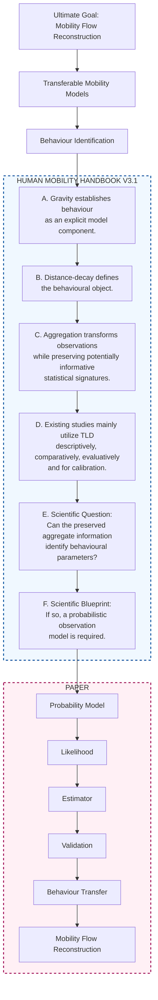
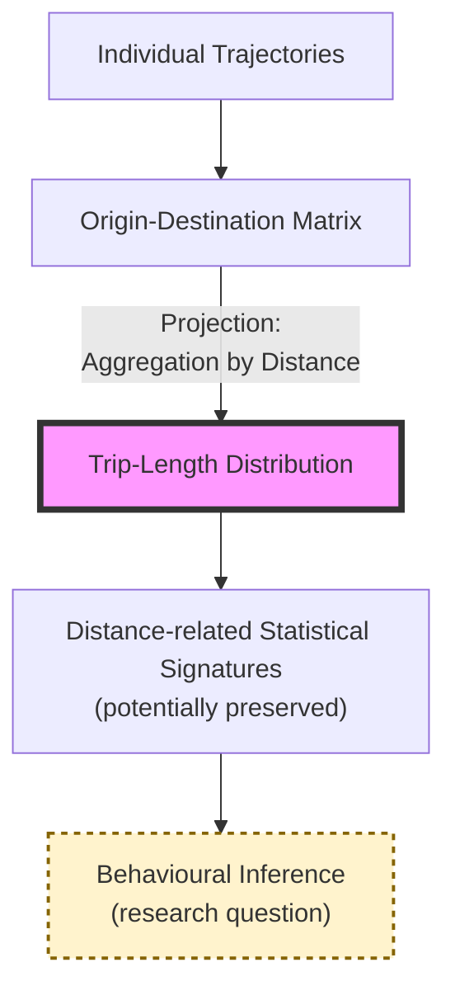
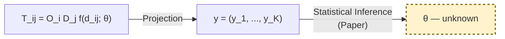

# Theoretical Background and Methodological Blueprint

*This Handbook serves as the theoretical justification for the manuscript. It is structured as a scientific proof: each module poses a core scientific question, answers it with a central claim, and supports that claim through a series of evidence-backed arguments. This rigorous progression establishes the necessity and validity of inferring distance-decay parameters from aggregate mobility observations.*

---

# Human Mobility Handbook V3.1 (Frozen Architecture)

| Module | Scientific Question | Why this module exists? | Mission | Central Claim | Key Scientific Transition |
| :--- | :--- | :--- | :--- | :--- | :--- |
| **A. Gravity as the Scientific Foundation** | **Why should human mobility be studied within the Gravity framework?** | Establish the scientific language for modelling spatial interactions and justify why Gravity remains the canonical framework despite modern learning-based models. | Demonstrate that Gravity provides a principled decomposition of mobility into urban structure and behavioural response. | **Gravity remains the canonical scientific framework for aggregate spatial interaction because it explicitly separates urban structure from behavioural distance sensitivity. Behaviour can only become transferable after it is explicitly identified.** | If behaviour is an explicit model component, it becomes a legitimate scientific object for identification. |
| **B. The Scientific Meaning of the Distance-decay Function** | **What does the distance-decay function represent?** | Define the scientific object studied in this research. | Explain why distance-decay is not merely a mathematical function but a representation of collective behavioural response to travel distance. | **The distance-decay function is the behavioural component of Gravity models, encoding collective distance sensitivity under a given urban environment.** | Once behaviour is defined, the next question is whether observations preserve information about it. |
| **C. Information Transformation through Mobility Aggregation** | **What information is lost, preserved, or transformed when mobility data are aggregated?** | Justify why aggregate observations deserve scientific attention. | Develop the principle of information transformation and distinguish information loss from information preservation. | **Aggregation transforms rather than simply destroys mobility information, preserving statistical signatures that may remain informative about the underlying behavioural process.** | The scientific issue is no longer whether information survives aggregation, but whether the preserved information remains informative for behavioural identification. |
| **D. Scientific Utilization of Trip-Length Distributions** | **How have Trip-Length Distributions been utilized in human mobility research?** | Objectively synthesize how the community has used TLD without prematurely claiming a research gap. | Review the scientific roles of TLD in descriptive analysis, model evaluation, comparison and calibration. Systematically assess whether direct behavioural inference has already been explored. | **Trip-Length Distributions have primarily been utilized as descriptive, evaluative and calibration-oriented representations of aggregate mobility. Whether they have been systematically used for behavioural parameter identification must be established through a comprehensive literature review.** | Existing utilization naturally raises the question of whether TLD may support a broader scientific role. |
| **E. Research Opportunity: Behavioural Parameter Identification from Aggregate Observations** | **Can the statistical information preserved in Trip-Length Distributions support the identification of distance-decay parameters?** | Transform accumulated evidence into a precise research question. | Formulate the research opportunity and position the paper within the broader roadmap toward transferable mobility modelling. | **Behavioural parameter identification is a necessary step toward transferable mobility modelling and ultimately toward mobility flow reconstruction. The statistical information preserved in Trip-Length Distributions suggests that aggregate observations may provide a viable observation space for identifying distance-decay parameters.** | If aggregate observations may support identification, an appropriate probabilistic framework is required. |
| **F. Towards a Probabilistic Framework for Behavioural Parameter Identification** | **What scientific principles are required to formulate statistical inference from aggregate observations?** | Establish the conceptual bridge between the handbook and the methodology. | Present the scientific hypothesis, conceptual observation model, and methodological principles without introducing likelihood functions or optimisation algorithms. | **Statistical inference becomes conceptually feasible when aggregate distance observations are interpreted as probabilistic observations generated by an underlying behavioural process.** | The paper begins by constructing the probabilistic observation model, likelihood formulation, estimator and empirical validation. |

### Frozen Logic Graph (V3.1)

---

# Module A — Gravity as the Scientific Foundation

| **Component**              | **Content** |
| -------------------------- | --- |
| **Module Title**           | **Gravity as the Scientific Foundation of Human Mobility Modelling** |
| **Scientific Question**    | **Why should human mobility be studied within the Gravity framework?** |
| **Why this module exists** | Bài báo nghiên cứu việc nhận diện **distance-decay function**. Distance-decay chỉ có ý nghĩa khi được đặt trong một mô hình mô tả tương tác không gian. Vì vậy, trước hết cần chứng minh rằng **Gravity vẫn là nền tảng khoa học thống nhất của spatial interaction modelling**, từ đó việc nghiên cứu distance-decay trở thành một bài toán có cơ sở lý thuyết vững chắc. |
| **Mission**                | Thiết lập Gravity là ngôn ngữ khoa học chuẩn để mô tả dòng di chuyển tổng hợp, đồng thời chứng minh rằng decomposition của Gravity thành urban structure và behavioural response là nền tảng cho việc nhận diện và chuyển giao hành vi. |
| **Central Claim**          | **Gravity remains the canonical scientific framework for aggregate spatial interaction because it explicitly separates urban structure from behavioural distance sensitivity. Behaviour can only become transferable after it is explicitly identified.** |

### Supporting Claims

| **Supporting Claim** | **Purpose** | **Representative Evidence (SOTA)** | **Expected Conclusion** |
| --- | --- | --- | --- |
| **Claim A1. Gravity has evolved from an empirical analogy into the canonical mathematical representation of spatial interaction.** | Chứng minh Gravity không chỉ là mô hình lịch sử mà đã trở thành nền tảng lý thuyết của spatial interaction. | • Zipf (1946): Gravity analogy. • Wilson (1971): Entropy-maximizing derivation. • Flowerdew & Aitkin (1982): Statistical estimation (Poisson framework). • Haynes & Fotheringham (1984): Classical spatial interaction modelling. • Barbosa et al. (2018): Physics Reports review. | Gravity là ngôn ngữ khoa học chuẩn để mô tả aggregate spatial interactions. |
| **Claim A2. Modern mobility models extend rather than replace the Gravity paradigm.** | Trả lời phản biện rằng Deep Learning đã thay thế Gravity. | • Deep Gravity (Simini et al., 2021). • neuroGravity (Yang et al., 2026). • TransGM (Enaya et al., 2026). • Universal Geography Neural Network (Guo et al., 2025). • Imagery2Flow (Xu et al., 2025). | AI và Deep Learning chủ yếu tăng cường khả năng biểu diễn hoặc học các thành phần của Gravity chứ không thay thế cấu trúc khoa học của nó. |
| **Claim A3. Gravity explicitly separates urban structure from spatial interaction behaviour.** | Thiết lập decomposition sẽ được dùng xuyên suốt Handbook và bài báo. | • Wilson (1971). • Lenormand et al. (2016). • Comparative studies of gravity models. | Gravity phân tách rõ **Urban Structure** ($O_i$, $D_j$) khỏi **Behaviour** ($f(d_{ij};\theta)$). |
| **Claim A4. The distance-decay function is the unique component that explicitly represents spatial impedance.** | Cô lập đúng đối tượng nghiên cứu của bài báo. | • Tanner (1961). • Liang et al. (2013). • Lenormand et al. (2016). | Trong toàn bộ mô hình Gravity, chỉ **distance-decay function** trực tiếp mô tả ảnh hưởng của khoảng cách lên xác suất tương tác. |
| **Claim A5. Behaviour can only become transferable after it has first been explicitly identified.** | Bổ sung cầu nối logic từ Module A sang Module E — giải quyết câu hỏi tại sao identification là prerequisite. | • Theoretical reasoning grounded in A3 & A4. • Yang et al. (2026). • Enaya et al. (2026). | Nếu distance-decay ($\theta$) không được nhận diện một cách tường minh, không thể chuyển giao hành vi từ ngữ cảnh này sang ngữ cảnh khác mà không cần OD matrix. |

### Core Mathematical Representation

| **Purpose** | **Content** |
| --- | --- |
| **Scientific Formulation**    | $T_{ij}=O_iD_jf(d_{ij};\theta)$ |
| **Urban Structure**           | $O_i$: Origin emission (trip production). $D_j$: Destination attraction (trip attraction). |
| **Behavioural Component**     | $f(d_{ij};\theta)$: Distance-decay function describing collective distance sensitivity. |
| **Scientific Interpretation** | Aggregate mobility can be viewed as the interaction between urban opportunities ($O_i,D_j$) and behavioural responses to travel distance ($f(d_{ij};\theta)$). Behaviour is only transferable once $\theta$ has been independently identified. |

### Take-home Message

| **Component** | **Content** |
| --- | --- |
| **Scientific Conclusion** | Gravity remains the dominant scientific framework for modelling aggregate spatial interactions. It naturally decomposes mobility into **urban structure** and **distance-dependent behavioural response**, identifying the distance-decay function as the primary object of analysis. Crucially, behavioural transferability requires explicit identification of $\theta$ — making this identification a scientific prerequisite, not merely a technical task. |

### Transition to Module B

| **Component** | **Content** |
| --- | --- |
| **Transition Question**     | If behaviour is an explicit model component that must be identified, **what exactly does the distance-decay function represent?** |
| **Motivation for Module B** | Understanding the scientific meaning of the distance-decay function is essential before asking whether its parameters can be identified from aggregate observations such as Trip-Length Distributions. |

---

# Module B — The Scientific Meaning of the Distance-Decay Function

| **Component**              | **Content** |
| -------------------------- | --- |
| **Module Title**           | **The Scientific Meaning of the Distance-Decay Function** |
| **Scientific Question**    | **What does the distance-decay function represent, and why is it the central object of behavioural analysis in Gravity models?** |
| **Why this module exists** | Module A đã chứng minh Gravity là nền tảng khoa học của spatial interaction và rằng behaviour phải được identified tường minh. Bước tiếp theo là xác định chính xác distance-decay function đại diện cho điều gì, tại sao nó mang ý nghĩa khoa học độc lập, và tại sao các tham số của nó là đối tượng cần được nhận diện. |
| **Mission**                | Thiết lập ý nghĩa khoa học của distance-decay function, làm rõ vai trò của các tham số trong việc mô tả collective distance sensitivity và chuẩn bị nền tảng để nghiên cứu khả năng suy luận các tham số này từ Trip-Length Distributions. |
| **Central Claim**          | **The distance-decay function is the behavioural component of Gravity models, encoding collective distance sensitivity under a given urban environment.** |

### Supporting Claims

| **Supporting Claim** | **Purpose** | **Representative Evidence (SOTA)** | **Expected Conclusion** |
| --- | --- | --- | --- |
| **Claim B1. Distance-decay represents spatial impedance rather than merely geographic distance.** | Làm rõ khoảng cách trong Gravity không chỉ là độ dài hình học mà là chi phí, thời gian và trở ngại đối với tương tác. | • Tanner (1961). • Wilson (1971). • Tobler (1970). • Hansen (1959). • Lenormand et al. (2016). | Distance-decay mô tả tác động tổng hợp của spatial impedance lên xác suất tương tác. |
| **Claim B2. Different functional forms represent different hypotheses about collective distance sensitivity.** | Giải thích vì sao tồn tại nhiều hàm deterrence khác nhau thay vì chỉ một công thức. | • Exponential model. • Power-law model. • Tanner function. • Comparative studies (Lenormand et al., Liang et al.). | Mỗi hàm distance-decay tương ứng với một giả thuyết hành vi khác nhau về cách khoảng cách ảnh hưởng đến di chuyển. |
| **Claim B3. Tanner provides a more flexible behavioural representation than classical exponential decay.** | Giải thích lý do lựa chọn Tanner trong nghiên cứu. | • Tanner (1961). • Liang et al. (2013). • Lenormand et al. (2016). | Tanner có khả năng mô tả đồng thời **near-distance preference** và **long-distance deterrence**, vượt ra ngoài giả định suy giảm đơn điệu đơn giản của exponential decay. |
| **Claim B4. The parameters of the distance-decay function quantify collective distance sensitivity rather than immutable human behaviour.** | Tránh diễn giải quá mức rằng tham số phản ánh "bản chất con người". | • Wilson (1971). • Lenormand et al. (2016). • Barbosa et al. (2018). • Hansen (1959). • Huff (1963). | Các tham số distance-decay phản ánh hành vi di chuyển tập thể dưới những điều kiện hạ tầng, khả năng tiếp cận và cấu trúc đô thị hiện tại, chứ không phải đặc tính cố hữu của con người. |

### Conceptual Representation

| **Purpose** | **Content** |
| --- | --- |
| **Gravity formulation**        | $T_{ij}=O_iD_jf(d_{ij};\theta)$ |
| **Focus of this module**       | Giữ nguyên $O_i$ và $D_j$, tập trung vào $f(d_{ij};\theta)$. |
| **Behavioural interpretation** | $\theta$ điều khiển mức độ nhạy cảm của tương tác đối với khoảng cách, trong bối cảnh cấu trúc đô thị đã cho. |
| **Scientific interpretation**  | Distance-decay không trực tiếp mô tả từng cá nhân mà mô tả phản ứng thống kê của toàn bộ hệ thống đối với khoảng cách. |

### Take-home Message

| **Component** | **Content** |
| --- | --- |
| **Scientific Conclusion** | Distance-decay function là thành phần duy nhất trong mô hình Gravity trực tiếp mô tả cách khoảng cách điều chỉnh tương tác tập thể. Việc hiểu và nhận diện các tham số của nó là chìa khóa để phân tích collective distance sensitivity dưới các điều kiện đô thị cụ thể. |

### Transition to Module C

| **Component** | **Content** |
| --- | --- |
| **Transition Question**     | If the distance-decay function encodes meaningful behavioural information, **does this information survive when detailed OD interactions are aggregated into Trip-Length Distributions?** |
| **Motivation for Module C** | Bài báo không quan sát trực tiếp từng cặp OD mà chỉ quan sát dữ liệu tổng hợp. Vì vậy cần trả lời liệu quá trình tổng hợp có còn bảo tồn thông tin cần thiết để nhận diện distance-decay hay không. |

---

# Module C — Information Transformation through Aggregation

| **Component**              | **Content** |
| -------------------------- | --- |
| **Module Title**           | **Information Transformation through Mobility Aggregation** |
| **Scientific Question**    | **What information is lost, preserved, or transformed when Origin–Destination interactions are aggregated into Trip-Length Distributions?** |
| **Why this module exists** | Paper không quan sát đầy đủ OD matrix mà chỉ sử dụng Trip-Length Distribution (TLD). Vì vậy cần chứng minh rằng phép tổng hợp không chỉ làm mất thông tin mà còn bảo tồn những statistical signatures có thể hỗ trợ suy luận thống kê. Nếu không có module này thì toàn bộ research question sẽ thiếu nền tảng khoa học. |
| **Mission**                | Xây dựng lý thuyết về **Information Transformation**, giải thích aggregation như một phép biến đổi thông tin thay vì chỉ là quá trình giảm kích thước dữ liệu. Phân biệt information loss và information preservation mà không overclaim về khả năng inference. |
| **Central Claim**          | **Aggregation transforms rather than simply destroys mobility information, preserving statistical signatures that may remain informative about the underlying behavioural process.** |

### Supporting Claims

| **Supporting Claim** | **Purpose** | **Representative Evidence (SOTA)** | **Expected Conclusion** |
| --- | --- | --- | --- |
| **Claim C1. Aggregation inevitably removes individual and relational information.** | Thừa nhận giới hạn của dữ liệu tổng hợp. | • Privacy-preserving aggregate datasets (e.g., Meta's Movement Distribution Maps (MDM) \citep{MetaMovementDistributionMaps}). • Barbosa et al. (2018). | Sau aggregation không còn nhận diện cá nhân, quỹ đạo hay từng cặp OD. |
| **Claim C2. Aggregation preserves global statistical regularities of collective mobility.** | Chứng minh aggregation vẫn giữ lại cấu trúc thống kê ở cấp độ vĩ mô. | • Song et al. (2010). • González et al. (2008). | Những quy luật thống kê tổng thể vẫn tồn tại sau aggregation. |
| **Claim C3. Trip-Length Distribution is a statistical projection of the OD matrix rather than an unrelated dataset.** | Thiết lập mối quan hệ toán học giữa OD và TLD. | • Wilson (1971). • Lenormand et al. (2016). • Ortúzar & Willumsen (2011). | TLD là kết quả của phép chiếu từ không gian OD sang không gian khoảng cách, không phải một nguồn dữ liệu độc lập. |
| **Claim C4. Distance-related statistical signatures may survive aggregation because aggregation is performed over spatial interactions, not over travel distance itself.** | Cung cấp lý do có thể kỳ vọng rằng distance signatures được bảo tồn — nhưng không khẳng định điều này đã được chứng minh. | • Gallotti et al. (2024). • González et al. (2008). • Song et al. (2010). • Lenormand et al. (2016). | Có cơ sở lý luận để kỳ vọng rằng phân bố khoảng cách bảo tồn dấu hiệu thống kê của distance-decay, dù điều này chưa được kiểm chứng trong Handbook. |

> [!IMPORTANT]
> **Lưu ý về Claim C4:** Module C không chứng minh rằng TLD đủ thông tin cho inference. Nó chỉ xác lập rằng có cơ sở lý luận để *kỳ vọng* sự bảo tồn đó. Việc kiểm chứng thuộc về Paper.

### Conceptual Representation

| **Purpose** | **Content** |
| --- | --- |
| **Observation Space Transformation** | $\mathbf{T}_{OD} \longrightarrow \mathbf{y}_{TLD}$ |
| **Conceptual Meaning**               | OD Matrix được chiếu (projected) sang Trip-Length Distribution thông qua phép tổng hợp theo khoảng cách. |
| **Information Removed**              | Origin identity, Destination identity, Individual trajectories, Network topology, Pairwise interactions. |
| **Information Preserved**            | Trip-length frequencies, Distance distribution shape, Global mobility regularities, Aggregate statistical signatures. |
| **Scientific Interpretation**        | Aggregation biến đổi không gian quan sát từ **interaction space** sang **distance space**. Liệu thông tin về distance-decay có được bảo tồn đủ cho inference hay không là câu hỏi khoa học, không phải điều Handbook khẳng định. |

### Information Hierarchy

| **Observation Level**        | **Information Content** | **Privacy** | **Potential for Behavioural Inference** |
| --- | --- | --- | --- |
| Individual Trajectories      | Highest   | Lowest   | Highest |
| Origin–Destination Matrix    | Very High | Low      | Very High |
| Trip-Length Distribution     | Intermediate | High  | **Unknown — constitutes the research question** |
| Aggregate Summary Statistics | Lowest    | Highest  | Limited |

### Conceptual Flowchart

### Take-home Message

| **Component** | **Content** |
| --- | --- |
| **Scientific Conclusion** | Aggregation should be understood as an information transformation rather than pure information loss. Although detailed OD interactions disappear, Trip-Length Distributions may retain statistically meaningful distance-related information. Whether this information is sufficient to support behavioural inference is not established here — it is the scientific question that motivates the paper. |

### Transition to Module D

| **Component** | **Content** |
| --- | --- |
| **Transition Question**     | **If Trip-Length Distributions may preserve meaningful statistical information, how has the mobility research community actually utilized them?** |
| **Motivation for Module D** | Sau khi xác lập khả năng thông tin được bảo tồn, bước tiếp theo là tổng hợp khách quan cách cộng đồng khoa học đã khai thác TLD trong thực tế, trước khi rút ra bất kỳ kết luận nào về research opportunity. |

---

# Module D — Scientific Utilization of Trip-Length Distributions

| **Component**              | **Content** |
| -------------------------- | --- |
| **Module Title**           | **Scientific Utilization of Trip-Length Distributions in Human Mobility Research** |
| **Scientific Question**    | **How have Trip-Length Distributions been utilized in human mobility research?** |
| **Why this module exists** | Module C đã thiết lập rằng TLD *có thể* bảo tồn các statistical signatures có ý nghĩa. Tuy nhiên, tiềm năng lý thuyết không đồng nghĩa với việc cộng đồng khoa học đã khai thác chúng cho mục đích inference. Vì vậy cần tổng hợp khách quan cách TLD đã được sử dụng, không phán xét, không khẳng định gap trước khi đọc SOTA. |
| **Mission**                | Tổng hợp có hệ thống vai trò của Trip-Length Distributions trong SOTA, phân loại các mục đích sử dụng và đánh giá khách quan liệu statistical inference đã từng được thực hiện trực tiếp từ TLD hay chưa. |
| **Central Claim**          | **Trip-Length Distributions have primarily been utilized as descriptive, evaluative and calibration-oriented representations of aggregate mobility. Whether they have been systematically used for behavioural parameter identification must be established through a comprehensive literature review.** |

### Supporting Claims

| **Supporting Claim** | **Purpose** | **Representative Evidence (SOTA)** | **Expected Conclusion** |
| --- | --- | --- | --- |
| **Claim D1. Trip-Length Distributions are widely used to characterize aggregate mobility patterns.** | Chứng minh TLD là một đại diện quen thuộc trong mobility research. | • Barbosa et al. (2018). • Pappalardo et al. (2023). • Meta MDM (2026). | TLD là công cụ chuẩn để mô tả hành vi di chuyển tổng thể của một hệ thống đô thị. |
| **Claim D2. Trip-Length Distributions are commonly used for model evaluation and comparison.** | Cho thấy TLD thường được dùng như một tiêu chuẩn đánh giá mô hình. | • Simini et al. (2012, 2021). • Lenormand et al. (2016). | TLD chủ yếu được sử dụng để kiểm tra khả năng tái tạo phân bố khoảng cách của mô hình. |
| **Claim D3. Trip-Length Distributions are sometimes incorporated into calibration, but typically as auxiliary observations rather than primary inference objects.** | Phân biệt calibration với inference. | • Ortúzar & Willumsen (2011). • Flowerdew & Aitkin (1982). • Tanner (1961). • Hyman (1969). • Merlin (2020). | Khi xuất hiện trong calibration, TLD thường đóng vai trò ràng buộc hoặc dữ liệu hỗ trợ, không phải là đối tượng suy luận trung tâm. |
| **Claim D4. The extent to which existing studies have formulated statistical inference directly from Trip-Length Distributions must be systematically assessed.** | Giữ tính trung lập tuyệt đối — không khẳng định gap trước khi review. | To be assessed through systematic literature review. If exceptions exist, they must be documented and their scope evaluated. | Observation sau khi review; không phải giả định trước. |

> [!NOTE]
> **Lưu ý về Claim D4:** Đây là kết luận **phải được rút ra sau khi tổng hợp tài liệu**, không phải giả định ban đầu. Nếu phát hiện các công trình đã thực hiện statistical inference trực tiếp từ TLD, chúng cần được trình bày đầy đủ cùng với phạm vi và giả định của chúng.

### Evidence Synthesis

| **Scientific Role**   | **Typical Objective** | **Representative Studies** | **Level of Adoption** |
| --- | --- | --- | --- |
| Descriptive analysis  | Characterize travel patterns | Household travel surveys, transportation planning | High |
| Comparative analysis  | Compare cities or populations | Urban mobility comparison studies | Moderate |
| Model evaluation      | Assess predictive realism | Gravity, Radiation, Deep Gravity, neuroGravity, TransferGM | High |
| Calibration support   | Auxiliary constraints during model fitting | Selected transportation demand models | Moderate |
| Statistical inference | Recover behavioural parameters directly from TLD | **To be determined by systematic literature review** | **To be determined** |

### Historical Perspective

| **Component** | **Content** |
| --- | --- |
| **Historical Interpretation** | Sự phát triển của mobility modelling gắn liền với việc xem **trajectory** và **OD matrix** là nguồn thông tin đầy đủ nhất cho calibration và inference. Trong bối cảnh đó, Trip-Length Distributions chủ yếu được xem là dữ liệu tổng hợp phục vụ mô tả hoặc đánh giá mô hình. Điều này hình thành một quan niệm phổ biến rằng việc mất cấu trúc OD đồng nghĩa với việc giảm khả năng suy luận thống kê — mặc dù giả định này chưa được kiểm chứng một cách hệ thống đối với các statistical signatures còn được bảo tồn sau aggregation. |

### Take-home Message

| **Component** | **Content** |
| --- | --- |
| **Scientific Conclusion** | Existing research demonstrates that Trip-Length Distributions are scientifically valuable and widely adopted as aggregate mobility representations. Their primary roles have been descriptive, comparative, evaluative and supportive in calibration. The question of whether they may also serve as the primary observation space for behavioural parameter identification remains to be answered by a systematic literature review — and if unanswered there, by this paper. |

### Transition to Module E

| **Component** | **Content** |
| --- | --- |
| **Transition Question**     | **Can the statistical information preserved in Trip-Length Distributions support identification of distance-decay parameters?** |
| **Motivation for Module E** | Modules A–D đã thiết lập rằng (i) distance-decay là đối tượng khoa học trung tâm của Gravity và identification của nó là prerequisite cho transferability, (ii) aggregation có thể bảo tồn các statistical signatures liên quan đến khoảng cách, và (iii) TLD đã được sử dụng rộng rãi nhưng chủ yếu cho các mục đích mô tả và đánh giá. Điều này tự nhiên dẫn đến một research opportunity. |

---

# Module E — Research Opportunity: Behavioural Parameter Identification from Aggregate Observations

| **Component**              | **Content** |
| -------------------------- | --- |
| **Module Title**           | **Research Opportunity: Behavioural Parameter Identification from Aggregate Observations** |
| **Scientific Question**    | **Can the statistical information preserved in Trip-Length Distributions support the identification of distance-decay parameters?** |
| **Why this module exists** | Modules A–D đã thiết lập bốn tiền đề: (i) Gravity separates urban structure from behaviour, (ii) behaviour phải được identified để trở nên transferable, (iii) aggregation có thể bảo tồn statistical signatures liên quan đến khoảng cách, và (iv) TLD chủ yếu đã được dùng cho descriptive/evaluative purposes. Module này tổng hợp các tiền đề đó thành một research opportunity — không phải một research gap. |
| **Mission**                | Chuyển từ **evidence synthesis** sang **research synthesis**: xác định cơ hội nghiên cứu được suy ra từ logic tích lũy và đặt bài báo vào đúng vị trí trong roadmap dài hạn hướng tới transferable mobility modelling và mobility flow reconstruction. |
| **Central Claim**          | **Behavioural parameter identification is a necessary step toward transferable mobility modelling and ultimately toward mobility flow reconstruction. The statistical information preserved in Trip-Length Distributions suggests that aggregate observations may provide a viable observation space for identifying distance-decay parameters.** |

### Supporting Claims

| **Supporting Claim** | **Purpose** | **Logical Foundation** | **Expected Conclusion** |
| --- | --- | --- | --- |
| **Claim E1. The scientific object of interest is the distance-decay parameter vector, not the complete OD matrix.** | Thu hẹp đúng đối tượng nghiên cứu, tách biệt khỏi OD reconstruction. | Module A + Module B | Nếu mục tiêu là nhận diện $\theta$ thì không nhất thiết phải khôi phục toàn bộ OD matrix. |
| **Claim E2. Aggregation preserves statistical signatures that may carry information about the distance-decay parameters.** | Kết nối với Module C, dùng đúng ngôn ngữ không overclaim. | Module C | Những statistical signatures này *có thể* vẫn mang thông tin về $\theta$. |
| **Claim E3. Existing utilization of TLD has not closed the possibility of treating aggregate observations as an inference space for behavioural parameters.** | Kết nối với Module D một cách trung lập. | Module D | Literature hiện tại chưa hệ thống hoá câu hỏi này, do đó câu hỏi vẫn còn mở. |
| **Claim E4. Behavioural parameter identification is a prerequisite for transferable mobility modelling.** | Justify tại sao identification là necessary — giải quyết nhận xét phản biện về Module A. | Claim A5 | Nếu $\theta$ không được identified tường minh từ aggregate data, mô hình chỉ có thể được transfer nếu OD matrix tại địa điểm đích đã có sẵn — điều này phủ nhận mục tiêu scalability. |

### Logical Synthesis

| **Established Premise** | **Source Module** |
| --- | --- |
| Gravity provides the canonical framework for aggregate spatial interaction. | Module A |
| Gravity separates urban structure from behavioural response. | Module A |
| Behaviour must be explicitly identified to become transferable. | Module A (Claim A5) |
| Distance-decay is the behavioural object of interest. | Module B |
| Aggregation preserves potentially informative statistical signatures. | Module C |
| TLD utilization has been primarily descriptive and evaluative. | Module D |

↓

#### Scientific Synthesis

Nếu:
- distance-decay ($\theta$) là đối tượng cần identify để hướng tới transferable mobility modelling,

và:
- aggregate TLD có thể bảo tồn statistical signatures của $\theta$,

thì một research opportunity tự nhiên xuất hiện:

> **Can aggregate distance observations provide a viable observation space for identifying the parameters governing the distance-decay function?**

Đây chính là research question của bài báo.

### Research Hypothesis (Conceptual)

> **Aggregate Trip-Length Distributions preserve sufficient statistical information to identify the parameters governing the underlying distance-decay function.**

> [!WARNING]
> **Lưu ý:** Module E **chỉ phát biểu research opportunity và hypothesis**. Handbook không chứng minh giả thuyết này. Việc kiểm chứng thuộc về phần Methods, Experiments và Results của Paper.

### Scientific Contribution

| **Conventional Perspective** | **Perspective Proposed in this Handbook** |
| --- | --- |
| Trip-Length Distribution is primarily an aggregate descriptive statistic. | Trip-Length Distribution may constitute a statistically informative observation space for behavioural inference. |
| Statistical inference requires OD matrices or individual trajectories. | Statistical inference of behavioural parameters may be feasible directly from aggregate distance observations, if sufficient statistical signatures are preserved. |
| Transferable mobility modelling requires access to local OD data. | If $\theta$ can be identified from aggregate TLD, behaviour transfer becomes data-efficient and scalable. |

### Take-home Message

| **Component** | **Content** |
| --- | --- |
| **Scientific Conclusion** | The accumulated evidence establishes a scientifically motivated research opportunity: if aggregate distance observations preserve sufficient information about the governing distance-decay parameters, then identification of $\theta$ from TLD alone becomes feasible — and this would constitute a meaningful step toward scalable, transferable mobility modelling. |

### Transition to Module F

| **Component** | **Content** |
| --- | --- |
| **Transition Question**     | **What scientific principles would be required to formulate statistical inference of distance-decay parameters from aggregate observations?** |
| **Motivation for Module F** | Sau khi xác định được research opportunity, bước tiếp theo không còn là đặt câu hỏi liệu vấn đề này có xứng đáng nghiên cứu hay không, mà là xác định những **nguyên lý khoa học nào** là cần thiết để xây dựng một framework suy luận thống kê từ Trip-Length Distributions. |

---

# Module F — Towards a Probabilistic Framework for Behavioural Parameter Identification

| **Component**              | **Content** |
| -------------------------- | --- |
| **Module Title**           | **Towards a Probabilistic Framework for Behavioural Parameter Identification** |
| **Scientific Question**    | **What scientific principles are required to formulate statistical inference from aggregate observations?** |
| **Why this module exists** | Module E đã xác định rằng Trip-Length Distributions có thể là observation space tiềm năng cho inference về distance-decay parameters. Tuy nhiên, một research opportunity chỉ có giá trị khi tồn tại một nền tảng phương pháp luận hợp lý để hiện thực hóa nó. Module này thiết lập các nguyên lý khoa học tối thiểu cần có, phát biểu rõ scientific hypothesis và tạo cầu nối sang phần Methods của bài báo. |
| **Mission**                | Xây dựng **Methodological Blueprint** của bài báo: phát biểu scientific hypothesis, trình bày fundamental assumptions, và mô tả conceptual inference pipeline — nhưng không trình bày likelihood, estimator hay thuật toán tối ưu. |
| **Central Claim**          | **Statistical inference becomes conceptually feasible when aggregate distance observations are interpreted as probabilistic observations generated by an underlying behavioural process.** |

### Supporting Claims

| **Supporting Claim** | **Purpose** | **Logical Foundation** | **Expected Conclusion** |
| --- | --- | --- | --- |
| **Claim F1. Aggregate distance observations can be interpreted as observations generated by an underlying Gravity process.** | Thiết lập mối liên hệ giữa TLD và Gravity — nền tảng cho probabilistic observation model. | Module A–C | TLD không phải dữ liệu độc lập mà là kết quả của quá trình sinh dữ liệu từ mô hình Gravity. |
| **Claim F2. Distance-decay parameters govern the probability distribution of observed trip lengths.** | Thiết lập mối liên hệ giữa $\theta$ và dữ liệu quan sát — nền tảng cho inference. | Module B + C | Thay đổi $\theta$ dẫn đến thay đổi trong phân bố khoảng cách quan sát. |
| **Claim F3. Statistical inference requires an explicit probabilistic observation model linking parameters to aggregate observations.** | Chuẩn bị cho phần Methods mà chưa đi vào likelihood. | Casella & Berger (2002) | Muốn suy luận $\theta$, cần một mô hình xác suất mô tả cách TLD được sinh ra từ $\theta$ thông qua quá trình Gravity. |
| **Claim F4. The methodological challenge is how to formulate an appropriate probabilistic inference framework, not whether inference is in principle possible.** | Chuyển câu hỏi từ "Why?" sang "How?" — khép lại Handbook, mở ra Paper. | Module E | Bài báo sẽ tập trung vào việc xây dựng và kiểm chứng inference framework, không tranh luận thêm về motivation. |

### Fundamental Assumptions

#### Assumption A — Gravity generates aggregate mobility
$$T_{ij}=O_iD_jf(d_{ij};\theta)$$
*Ý nghĩa:* Aggregate mobility được sinh bởi một quá trình Gravity với các thành phần urban structure ($O_i, D_j$) và distance-decay ($f(d_{ij};\theta)$).

#### Assumption B — Distance-decay governs collective distance sensitivity
$$f(d_{ij};\theta)$$
*Ý nghĩa:* Thành phần này quyết định sự thay đổi xác suất tương tác theo khoảng cách và là đối tượng cần được identified.

#### Assumption C — Trip-Length Distributions are projections of the underlying Gravity process
$$\mathbf{T}_{OD} \rightarrow \mathbf{y}_{TLD}$$
*Ý nghĩa:* TLD là projection của OD matrix lên không gian khoảng cách. Không phải nguồn dữ liệu độc lập.

### Scientific Hypothesis

> **Aggregate distance observations preserve sufficient statistical information to identify the parameters $\theta$ governing the underlying distance-decay function.**

> [!IMPORTANT]
> **Ranh giới Handbook–Paper:** This hypothesis is **not established within the Handbook**. It constitutes the core empirical proposition to be examined in the Paper through probabilistic modelling, likelihood formulation, parameter estimation, and experimental validation across multiple urban systems.

### Conceptual Inference Pipeline

| **Stage** | **Scientific Interpretation** |
| --- | --- |
| **Underlying process** | Aggregate interactions are generated by a Gravity model governed by $O_i$, $D_j$, and $f(d_{ij};\theta)$. |
| **Observation transformation** | The OD matrix is projected into a Trip-Length Distribution through aggregation over travel distance. |
| **Observation space** | Statistical inference is formulated directly in the TLD observation space rather than the OD space. |
| **Inference objective** | Identify the distance-decay parameters $\theta$ that best explain the observed aggregate distance distribution. |

> [!NOTE]
> *The likelihood formulation, choice of estimator, and optimisation algorithm are strictly deferred to the Methodology section of the Paper.*

### Scientific Implications

| **Conventional Paradigm** | **Proposed Paradigm** |
| --- | --- |
| Observation space = OD Matrix | Observation space = Trip-Length Distribution |
| Behaviour identified from detailed pairwise interactions | Behaviour inferred from aggregate statistical signatures in the distance space |
| Aggregation = information loss | Aggregation = information transformation; behavioural signatures may be preserved |
| Transferable mobility requires local OD data | Transferable mobility may require only aggregate TLD and open urban structure data |

### Take-home Message

| **Component** | **Content** |
| --- | --- |
| **Scientific Conclusion** | The preceding modules establish the scientific motivation for studying statistical inference from Trip-Length Distributions. This module argues that such inference is conceptually feasible, provided that a probabilistic observation model can explicitly connect $\theta$ with aggregate distance observations — and provided that sufficient statistical information is preserved. Whether this condition holds is the empirical question the Paper is designed to answer. |

### Transition to the Paper

> The Handbook has established **why** the proposed research question is scientifically meaningful: distance-decay identification is prerequisite to transferable mobility modelling, aggregate observations may preserve relevant statistical signatures, and existing utilization of TLD has not exhausted this possibility. The remainder of the Paper addresses the question of **how**: constructing the probabilistic observation model, deriving the likelihood, specifying the estimator, and validating the approach across diverse urban systems.

---

# References

> [!IMPORTANT]
> **Module mapping V3.1:** Cột "Hỗ trợ Module" dưới đây sử dụng ký hiệu Module **A–F** theo kiến trúc Handbook V3.1. Các reference chỉ phục vụ phần **Paper** (Methodology, Estimation, Experiments, Future Work) được đánh dấu `Paper` thay vì ký hiệu module cũ (G–J).

## I. Spatial Interaction Foundations

| Ref ID | Reference | Year | BibTeX key | Hỗ trợ Module (V3.1) | Vai trò |
| ------ | --------- | ---- | ---------- | -------------------- | ------- |
| R1 | Zipf, G.K. *The $P_1P_2/D$ Hypothesis: On the Intercity Movement of Persons*, Am. Sociol. Rev. 11(6) | 1946 | `zipf1946` | A | Early sociological formalization of the gravity analogy (Claim A1) |
| R2 | Wilson, A.G. *A Family of Spatial Interaction Models, and Associated Developments*, Env. Plan. A | 1971 | `wilson1971` | A, B, C, F | Entropy derivation, Gravity foundation (A1, A3, B1, B4, C3, F1) |
| R3 | Tobler, W. *A Computer Movie Simulating Urban Growth in the Detroit Region*, Econ. Geogr. | 1970 | `tobler1970computer` | B | Source of the "First Law of Geography"; distance-decay principle (B1) |
| R4 | Haynes & Fotheringham. *Gravity and Spatial Interaction Models*, Sage | 1984 | `haynes1984gravity` | A, B | Textbook kinh điển (A1, B1) |
| R5 | Fotheringham & O'Kelly. *Spatial Interaction Models: Formulations and Applications*, Kluwer | 1989 | `fotheringham1989spatial` | A | Spatial interaction theory (A1) |
| R6 | Hansen, W. *How Accessibility Shapes Land Use*, JAIP 25(2) | 1959 | `hansen1959accessibility` | B | Accessibility & distance decay (B1, B2) |
| R8 | Sen & Smith. *Gravity Models of Spatial Interaction Behavior*, Springer | 1995 | `sen1995gravity` | B | Statistical theory of gravity model estimation (B2) |

---

## II. Human Mobility Foundations

| Ref ID | Reference | Year | BibTeX key | Hỗ trợ Module (V3.1) | Vai trò |
| ------ | --------- | ---- | ---------- | -------------------- | ------- |
| R7 | Barbosa et al. *Human Mobility: Models and Applications* | 2018 | `barbosa2018human` | A, B, C, D | Review lớn nhất về Human Mobility (A1, B4, C1, D — general survey) |
| R9 | González et al. *Understanding Individual Human Mobility Patterns* | 2008 | `gonzalez2008understanding` | C | Individual mobility regularities surviving aggregation (C2) |
| R10 | Song et al. *Limits of Predictability in Human Mobility* | 2010 | `song2010limits` | C | Human mobility predictability; statistical regularities (C2) |
| R32 | Pappalardo et al. *Future Directions in Human Mobility Science* | 2023 | `pappalardo2023analytical` | D | Agenda review; framing of mobility data and TLD utilization (D1) |
| R33 | Gallotti et al. *Distorted Insights from Human Mobility Data* | 2024 | `gallotti2024distorted` | C, D | Representation choice changes inference; aggregation effects (C4, D — evidence that observation representation matters) |
| R34 | Blondel et al. *A Survey of Results on Mobile Phone Datasets Analysis* | 2015 | `blondel2015survey` | Paper | Survey of CDR-based mobility observation (Paper: future work context) |

---

## III. Distance-decay & Alternative Models

| Ref ID | Reference | Year | BibTeX key | Hỗ trợ Module (V3.1) | Vai trò |
| ------ | --------- | ---- | ---------- | -------------------- | ------- |
| R11 | Simini et al. *A Universal Model for Mobility and Migration Patterns* | 2012 | `Simini2012universal` | B, D | Radiation Model — alternative without explicit distance-decay (B2); used for TLD evaluation (D2) |
| R12 | Stouffer. *Intervening Opportunities: A Theory Relating Mobility and Distance* | 1940 | `stouffer1940intervening` | B | Alternative behavioural mechanism without explicit distance-decay (B2) |
| R13 | Huff. *A Probabilistic Analysis of Shopping Center Trade Areas*, Land Econ. 39(1) | 1963 | `huff1963probabilistic` | B | Huff Model; distance-decay in retail trade areas (B1, B2) |
| R14 | Ortúzar & Willumsen. *Modelling Transport*, 4th ed. | 2011 | `ortuzar2011modelling` | D | Transportation demand modelling; calibration practice (D3) |
| R28 | Balcan et al. *Multiscale Mobility Networks and Infectious Diseases* | 2009 | `balcan2009multiscale` | B | Epidemic spatial model with a fitted gravity law (B2) |
| R29 | Lenormand et al. *Systematic Comparison of Trip Distribution Laws and Models* | 2016 | `lenormand2016systematic` | A, B, C, D | Systematic comparison of models (A3, B2, B4, C3, D2, D3) |
| R35 | Martínez & Viegas. *A New Approach to Modelling Distance-Decay Functions* | 2013 | `martinez2013distance` | B | Distance-decay functional forms for accessibility (B2) |
| R48 | Liang et al. *Unraveling the Origin of Exponential Law in Intra-Urban Human Mobility* | 2013 | `liang2013unraveling` | A, B | Intra-urban exponential decay mechanics (A4, B3) |

---

## III-b. Aggregate / Moment-Based Calibration

⚠️ Đây là nhóm reference **bắt buộc phải trích** để tránh over-claim ở Module D.

| Ref ID | Reference | Year | BibTeX key | Hỗ trợ Module (V3.1) | Vai trò |
| ------ | --------- | ---- | ---------- | -------------------- | ------- |
| R36 | Tanner, J.C. *Factors Affecting the Amount of Travel*, RRL Tech. Paper 51 | 1961 | `tanner1961` | A, B, D | Tanner function; deterrence calibrated against trip-length information (A4, B1, B3, D3) |
| R37 | Hyman, G.M. *The Calibration of Trip Distribution Models*, Env. Plan. A | 1969 | `hyman1969calibration` | D | Classical mean-trip-length calibration (D3) |
| R38 | Merlin, L.A. *A New Method Using Medians to Calibrate Single-Parameter Spatial Interaction Models* | 2020 | `merlin2020medians` | D | Calibration from a single summary statistic (D3) |
| R39 | Yang et al. *Limits of Predictability in Commuting Flows in the Absence of Data for Calibration* | 2014 | `yang2014limits` | D | Closest prior work on estimation without local calibration data (D4) |

---

## IV. Statistical Inference

| Ref ID | Reference | Year | BibTeX key | Hỗ trợ Module (V3.1) | Vai trò |
| ------ | --------- | ---- | ---------- | -------------------- | ------- |
| R15 | Ben-Akiva & Lerman. *Discrete Choice Analysis* | 1985 | `benakiva1985discrete` | Paper | MLE (disaggregate choice; cited as statistical precedent only) |
| R16 | Bishop. *Pattern Recognition and Machine Learning* | 2006 | `bishop2006pattern` | Paper | Statistical inference (Paper: methodology) |
| R17 | Murphy. *Machine Learning: A Probabilistic Perspective* | 2012 | `murphy2012machine` | Paper | Bayesian & likelihood (Paper: methodology) |
| R18 | Casella & Berger. *Statistical Inference*, 2nd ed. | 2002 | `casella2002statistical` | F, Paper | Classical inference; many-to-one maps; sufficiency (F3; Paper: methodology, validation, future work) |
| R19 | Cover & Thomas. *Elements of Information Theory* | 1991 | `cover1991elements` | Paper | Future Information Theory (Paper: future work) |
| R30 | Flowerdew & Aitkin. *A Method of Fitting the Gravity Model Based on the Poisson Distribution* | 1982 | `flowerdew1982method` | A, D, Paper | Poisson MLE gravity calibration (A1, D3; Paper: methodology) |

---

## V. Aggregate Mobility Data

| Ref ID | Reference | Year | BibTeX key | Hỗ trợ Module (V3.1) | Vai trò |
| ------ | --------- | ---- | ---------- | -------------------- | ------- |
| R20 | Meta. *Movement Distribution Maps* (AI for Good) | 2026 | `MetaMovementDistributionMaps` | C, D | Aggregate travel-distance product (C1 — privacy-preserving aggregation example; D1 — TLD data source used in paper) |
| R23 | Tatem. *WorldPop, Open Data for Spatial Demography* | 2017 | `worldpop2018` | Paper | Open spatial-demography data products (Paper: data description; cite only when population data is introduced) |
| R40 | Buckee et al. *Aggregated Mobility Data Could Help Fight COVID-19* | 2020 | `buckee2020aggregated` | C | Rationale for aggregate mobility release; privacy-driven aggregation (C1) |
| R41 | Oliver et al. *Mobile Phone Data for Informing Public Health Actions* | 2020 | `oliver2020mobile` | C | Aggregate mobility products in practice (C1) |
| R42 | de Montjoye et al. *Unique in the Crowd: The Privacy Bounds of Human Mobility* | 2013 | `de2013unique` | C | Re-identifiability motivating aggregation (C1) |
| R43 | Houssiau et al. *On the Difficulty of Achieving Differential Privacy in Practice* | 2022 | `houssiau2022dpaggregate` | C | Privacy guarantees for aggregate location data (C1) |
| R51 | Wang et al. *Urban Human Mobility: Data-Driven Modeling and Prediction* | 2019 | `wang2019urban` | — | Survey taxonomy classifying collective vs individual mobility (available; not currently cited in V3.1 claims) |

> **Đã loại bỏ:** Google Community Mobility Reports và Apple Mobility Trends (cả hai chỉ công bố % thay đổi số lượt ghé thăm / yêu cầu chỉ đường, không phải OD hay phân bố quãng đường, và đã ngừng phát hành từ 2022); "GDPR" (văn bản luật, không phải reference khoa học — thay bằng R42/R43); "Nature Open Mobility Dataset paper 2024" (không xác định được tác giả/venue).

---

## VI. Deep Learning Mobility

| Ref ID | Reference | Year | BibTeX key | Hỗ trợ Module (V3.1) | Vai trò |
| ------ | --------- | ---- | ---------- | -------------------- | ------- |
| R25 | Simini et al. *A Deep Gravity Model for Mobility Flows Generation* | 2021 | `simini2021` | A, D | Deep Gravity — extends Gravity paradigm (A2); used for TLD model evaluation (D2) |
| R26 | Atwal et al. *Commuting Flow Prediction Using OpenStreetMap Data* | 2025 | `atwal2025commuting` | Paper | Open-data flow prediction; still OD-supervised (Paper: related work) |
| R27 | Yang et al. *Transferable Human Mobility Network Reconstruction with neuroGravity* | 2026 | `neurogravity2026` | A | Physics-informed DL; preserves gravity decomposition (A2) |
| R31 | Enaya et al. *TransGM: Transferable Gravity Models for Cross-City Policy Transfer* | 2026 | `transgm2026` | A | Transferable gravity model (A2) |
| R44 | Zhu & Ma. *Gravity-Informed Deep Flow Inference* | 2026 | `zhu2026gravitypanel` | A | Gravity-informed neural inference (A2) |
| R45 | Xu et al. *Predicting Human Mobility Flows in Cities Using Deep Learning on Satellite Imagery* | 2025 | `xu2025imagery2flow` | A | OD prediction from satellite imagery; extends Gravity paradigm (A2) — doi:10.1038/s41467-025-65373-z |
| R46 | Guo et al. *Universal Geography Neural Network* | 2025 | `guo2025universal` | A | Universal geography model extending Gravity (A2) |
| R47 | Shi et al. *Predicting Origin-Destination Flow via Multi-Perspective Graph Convolutional Network* | 2020 | `shi2020mpgcn` | Paper | Dynamic GNN OD prediction requiring time-series OD supervision (Paper: related work) |
| R49 | Wang et al. *Similarity Based City Data Transfer Framework in Urban Digitization* | 2025 | `wang2025similarity` | Paper | Similarity-based cross-city transfer framework (Paper: future work) |
| R50 | Vu et al. *Enhanced Urban Functional Land Use Map with Free and Open-Source Data*, Int. J. Digit. Earth 14(11):1744-1757 | 2021 | `vu2021landuse` | Paper | Deriving urban spatial structures from open data (Paper: data description) |

---

## VII. Paper-Specific References (Methodology, Experiments, Validation)

> Các reference dưới đây **không thuộc Handbook V3.1** (Modules A–F) mà phục vụ trực tiếp cho phần **Methodology**, **Experiments**, **Validation** và **Future Work** của bài báo.

| Ref ID | Reference | BibTeX key | Paper Section | Vai trò |
| ------ | --------- | ---------- | ------------- | ------- |
| P1 | This Paper | — | Methodology | Behaviour Identification Framework |
| P2 | This Paper | — | Methodology | Statistical Behaviour Identification |
| P3 | This Paper | — | Experiments | Empirical Validation |

---

## VIII. Future Research Directions

Các reference này **chưa dùng nhiều trong Handbook**, nhưng sẽ rất quan trọng cho các bài báo tiếp theo. ID dùng tiền tố `FW` để tránh trùng với claim ID F1–F4 của Module F.

| Ref ID | Chủ đề | Vai trò |
| ------ | ------ | ------- |
| FW1 | Fisher Information | Formal information-theoretic analysis |
| FW2 | Sufficient Statistics | Whether TLD is a sufficient statistic for θ |
| FW3 | Information Bottleneck | Aggregation as information bottleneck |
| FW4 | Identifiability Theory | Formal parameter identifiability |
| FW5 | Information Geometry | Geometric structure of the parameter space |
| FW6 | Knowledge Transfer for OD Reconstruction in Data-Scarce Cities | Cross-city transfer using inferred θ |

---

# Mapping References sang Handbook V3.1

> [!NOTE]
> Bảng này chỉ bao gồm references **trực tiếp hỗ trợ Modules A–F** của Handbook V3.1. Các reference chỉ phục vụ Paper (Methodology, Experiments, Future Work) được liệt kê ở Section VII–VIII.

| Module (V3.1) | Vai trò trong Handbook | Main References |
| --- | --- | --- |
| **A** | Gravity as Scientific Foundation | R1, R2, R4, R5, R7, R25, R27, R29, R30, R31, R36, R44, R45, R46, R48 |
| **B** | Distance-decay Function | R2, R3, R4, R6, R7, R8, R11, R12, R13, R28, R29, R35, R36, R48 |
| **C** | Information Transformation | R2, R7, R9, R10, R20, R29, R33, R40, R41, R42, R43 |
| **D** | Scientific Utilization of TLD | R7, R11, R14, R20, R25, R29, R30, R32, R33, R36, R37, R38, R39 |
| **E** | Research Opportunity | Logical synthesis from Modules A–D (no unique new references) |
| **F** | Probabilistic Blueprint | R2, R18 |

---

# Kiểm tra tính nhất quán V3.1 (checklist trước khi viết bài)

- [x] Mọi reference trong bảng claim đều có bibkey.
- [ ] Xác nhận bibkey `guo2025universal` (R46) tồn tại trong `paper/references.bib` hoặc bổ sung nếu thiếu.
- [ ] Claim D4 chưa chốt — phụ thuộc vào systematic literature review.
- [x] Module C dùng ngôn ngữ "may remain informative" — không overclaim.
- [x] Module E phát biểu "research opportunity" — không phải "research gap".
- [x] Module F phát biểu "scientific hypothesis" — không phải "assumption".
- [x] ID claim và ID reference không trùng namespace (Module F dùng F1–F4 cho claims; future work dùng FW1–FW6).
- [x] Đã cụ thể hóa tất cả placeholder evidence bằng các trích dẫn khoa học chính xác.
