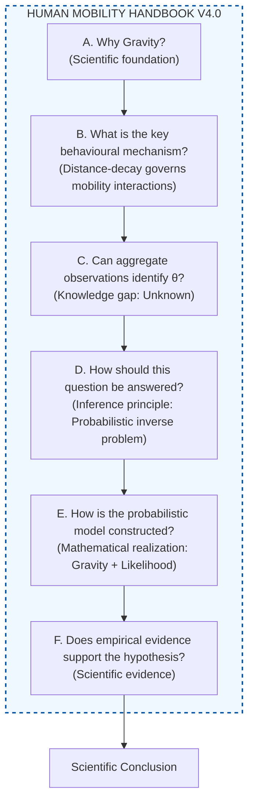
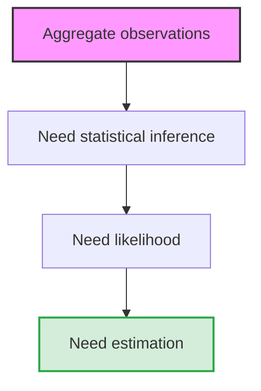
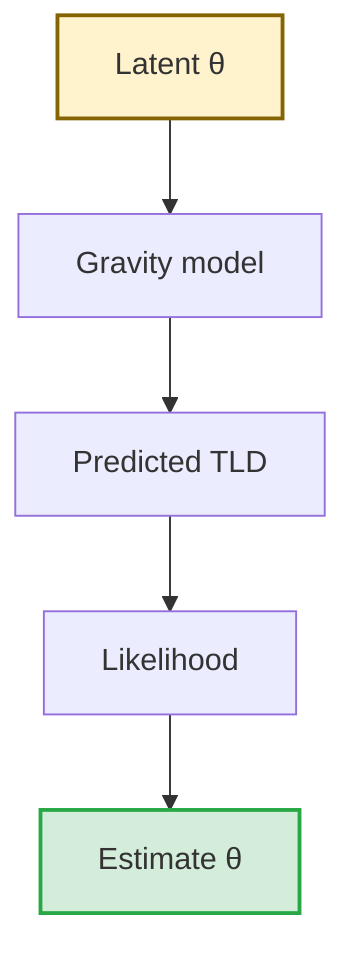

# Theoretical Background and Methodological Blueprint

## Scientific Thesis

> **This handbook develops the scientific argument that behavioural parameters governing collective distance sensitivity may be identifiable from observed Trip-Length Distributions because mobility aggregation preserves behaviour-relevant statistical information that can be interpreted within the Gravity framework.**

*This Handbook serves as the theoretical justification for the manuscript. It is structured as a scientific proof: each module poses a core scientific question, answers it with a central claim, and supports that claim through a series of evidence-backed arguments. This rigorous progression establishes the necessity and validity of inferring distance-decay parameters from observed Trip-Length Distributions.*

---

### Master Strategic Notes (Core Conceptual Positioning)

> [!NOTE]
> **Key Strategic Positioning for Manuscript Drafting:**
> 0. **Model–Observation Compatibility Principle:** When the observation space is restricted to aggregate TLD $\mathbf{y} = (y_1, \dots, y_K)$, inference relies on explaining the full distribution shape. The parametric decay model must match the observation space shape requirements (e.g., Tanner provides dual parameters: $\alpha$ for short-to-intermediate shape and $\beta$ for long-range decay).
> 1. **Terminology Standard:** Standardized on **observed Trip-Length Distribution (observed TLD)** to anchor the observation space to empirical binned histograms $y = (y_1, \dots, y_K)$.
> 2. **Enduring Value of Physics-Based Models:** Contemporary deep learning frameworks (Deep Gravity \citep{simini2021}, neuroGravity \citep{neurogravity2026}, TransGM \citep{transgm2026}) extend rather than replace Gravity. Gravity provides the indispensable structural inductive bias ($O_i, D_j$ vs. $f(d_{ij};\theta)$) required for interpretability and cross-city generalization.
> 3. **Factorization Principle (Lenormand et al. 2016):** Demographic/economic opportunity distributions ($O_i, D_j$) and spatial impedance decay ($f(d_{ij};\theta)$) are interacting yet mathematically independent components, allowing behavioural sensitivity $\theta$ to be isolated from local structural density.
> 4. **Novelty Positioning (Lenormand 2016 vs. PCSF-TIM):** Landmark mobility studies use TLD as a downstream evaluative benchmark metric (CPC / Sørensen index) for models calibrated on OD matrices. In contrast, **PCSF-TIM shifts TLD from an evaluation target to the primary probabilistic observation space**, enabling direct parameter identification without requiring local OD flow supervision.

---

# Human Mobility Handbook V4.0 (Frozen Architecture)

| Module | Scientific Question | Scientific Answer | Leads to... |
| :--- | :--- | :--- | :--- |
| **A. Gravity as the Canonical Decomposition** | **Why is Gravity the canonical framework for decomposing aggregate human mobility?** | Gravity should be understood not primarily as a predictive model, but as the canonical decomposition of aggregate human mobility into urban structure and travel behaviour. | If Gravity provides the canonical decomposition, **what is the scientific meaning of the behavioural component $f(d;\theta)$ and what do its parameters represent?** |
| **B. Distance-Decay as the Behavioural Mechanism** | **What does the distance-decay function represent, and why is it the central behavioural quantity in Gravity models?** | Distance-decay determines how interaction probability decreases with distance and therefore governs collective distance sensitivity. The parameters of the distance-decay function become the primary quantities of scientific interest. | If θ is the key behavioural quantity, **can it be identified from available data?** |
| **C. Information Transformation through Mobility Aggregation** | **What information remains after mobility observations are aggregated?** | Aggregate datasets (e.g., Trip-Length Distributions) preserve overall travel-distance statistics but no longer explicitly record Origin–Destination interactions. Whether these aggregate observations contain sufficient information to identify the distance-decay parameters remains an open scientific question. | If this is unknown, **how can we determine it scientifically?** |
| **D. Inference Principle: A Probabilistic Framework** | **How can the parameters of the distance-decay function be statistically identified from observed Trip-Length Distributions?** | Treat parameter identification as a probabilistic inverse problem. Construct an observation model linking the latent distance-decay parameters to the observed Trip-Length Distribution, then estimate θ using statistical inference. | This framework is then implemented and validated in the proposed method. |
| **E. Mathematical Framework: Gravity-based Statistical Identification** | **How is the probabilistic identification framework implemented for distance-decay parameter estimation?** | Specify the probabilistic model (Gravity + Observation Model + Likelihood) that links the latent parameters to the observed distribution. | **Does empirical evidence support the hypothesis?** |
| **F. Empirical Evaluation of the Identification Hypothesis** | **Do observed Trip-Length Distributions contain sufficient empirical evidence to identify the parameters of the distance-decay function?** | Empirically evaluate the central scientific hypothesis using the probabilistic framework to see if it reproduces mobility patterns. | **Scientific Conclusion.** |

### Frozen Logic Graph (V4.0)



---

# Module A — Gravity as the Canonical Decomposition of Aggregate Mobility

| **Component**              | **Content** |
| -------------------------- | --- |
| **Module Title**           | **Gravity as the Canonical Decomposition of Aggregate Mobility** |
| **Scientific Question**    | **Why is Gravity the canonical framework for decomposing aggregate human mobility?** |
| **Why is this module indispensable?** | Without Gravity's explicit decomposition, travel behaviour cannot be isolated from urban spatial structure. |
| **Mission**                | Establish Gravity not as a specific predictive algorithm, but as the canonical scientific decomposition of aggregate mobility into urban structure ($O_i, D_j$) and behavioural distance response ($f(d_{ij}; \theta)$). |
| **Central Claim**          | **Gravity should be understood not primarily as a predictive model, but as the canonical decomposition of aggregate human mobility into urban structure and travel behaviour.** |

### Theoretical Explanation

Aggregate mobility seeks to explain the volume of spatial trips between origins and destinations. Regardless of the underlying modelling technique, this problem fundamentally requires separating three distinct components:
1. The capacity of origins to generate trips ($O_i$),
2. The trip attraction of destinations ($D_j$),
3. The behavioural effect of spatial separation ($f(d_{ij}; \theta)$).

The gravity formulation expresses this decomposition explicitly as:
$$T_{ij} = O_i D_j f(d_{ij}; \theta)$$

where $O_i$ and $D_j$ represent urban spatial structure, while $f(d_{ij}; \theta)$ represents collective travel behaviour. The enduring importance of the gravity formulation therefore lies less in its specific functional form than in its ability to separate structural factors from behavioural mechanisms in a transparent and interpretable manner.

### Supporting Claims

| **Supporting Claim** | **Purpose** | **Representative Evidence (SOTA)** | **Expected Conclusion** |
| --- | --- | --- | --- |
| **Claim A1. The canonical contribution of the gravity formulation is the explicit separation between urban structure and travel behaviour.** | Thiết lập phép phân rã $T_{ij} = \text{Structure} \times \text{Behaviour}$ làm cốt lõi lý thuyết. | • Zipf (1946): Empirical origin.<br>• Wilson (1971): Entropy-maximizing derivation.<br>• Lenormand et al. (2016): Systematic comparison confirming component independence. | Gravity cung cấp phép phân rã chuẩn mực để tách rời đặc thù đô thị khỏi phản ứng hành vi. |
| **Claim A2. Modern mobility models extend the representation of individual components rather than replacing the canonical decomposition itself.** | Trả lời phản biện về AI/Deep Learning bằng cách chứng minh AI chỉ mở rộng các thành phần của Gravity. | • Deep Gravity (Simini et al., 2021): Extends interaction learning.<br>• Imagery2Flow (Xu et al., 2025): Extends urban structure learning.<br>• neuroGravity (Yang et al., 2026): Extends spatial representation.<br>• TransGM (Enaya et al., 2026): Extends cross-city parameter transfer. | AI và Deep Learning nâng cao khả năng biểu diễn của từng thành phần chứ không thay thế phép phân rã Gravity ($T_{ij} = \text{Structure} \times \text{Behaviour}$). |
| **Claim A3. Viewing gravity as a canonical decomposition provides a common scientific language for organizing subsequent developments in mobility modelling.** | Định hình toàn bộ sơ đồ logic của Handbook (từ phân rã $T_{ij} \to f(d) \to$ suy luận $\theta$). | • Theoretical synthesis of spatial interaction literature.<br>• Barbosa et al. (2018): Physics Reports review. | Phép phân rã Gravity là ngôn ngữ khoa học chung để tổ chức toàn bộ tiến trình nghiên cứu trong Handbook. |

### Deep Dive: Theoretical Evolution & AI Extensions (Claim A1 & A2)

> The Gravity model originated as an empirical analogy adapting Newton's law of gravitation to spatial-sociological interactions \citep{zipf1946}. It was subsequently established on a rigorous theoretical foundation within spatial interaction modelling through the entropy-maximizing principle \citep{wilson1971}. This theoretical grounding was further solidified as Gravity was integrated into formal statistical inference frameworks, defining spatial flows $T_{ij}$ as probabilistic random variables \citep{flowerdew1982method, haynes1984gravity}. Comprehensive modern surveys \citep{barbosa2018human} confirm that Gravity remains the canonical paradigm for collective mobility.

> A common misconception in contemporary mobility science is that deep learning architectures have rendered physical spatial interaction models obsolete. In reality, pure black-box machine learning approaches often struggle with output interpretability and cross-city transferability due to spatial non-stationarity. State-of-the-art models overcome these limitations not by replacing Gravity, but by extending it. Frameworks such as Deep Gravity \citep{simini2021} leverage neural networks to learn complex, non-linear representations of urban opportunities from high-dimensional open data (e.g., POIs, satellite imagery), while strictly preserving the multiplicative spatial interaction structure of Gravity. Furthermore, physics-informed architectures like neuroGravity \citep{neurogravity2026} and TransGM \citep{transgm2026} explicitly embed the gravity-based separation of urban structure and behavioural distance decay into their neural layers.

> This hybrid paradigm demonstrates that Gravity provides the indispensable structural inductive bias required for deep learning models to achieve both superior predictive realism and robust cross-context generalization. Ultimately, this confirms that physics-based spatial interaction models retain their foundational scientific value: far from being superseded, physical principles remain the indispensable cornerstone for building explainable, robust, and transferable mobility models.

### Deep Dive: Structural-Behavioural Factorization (Claim A1 & A3)

> At its theoretical core, the Gravity framework achieves a fundamental mathematical factorization: it explicitly decouples urban spatial structure from spatial interaction behaviour \citep{wilson1971, lenormand2016systematic}. In the canonical formulation $T_{ij} = O_i D_j f(d_{ij};\theta)$, demographic and economic opportunity distributions ($O_i, D_j$) and spatial impedance decay ($f(d_{ij};\theta)$) constitute two interacting yet mathematically independent components \citep{lenormand2016systematic}. The origin emission $O_i$ and destination attraction $D_j$ encode the spatial distribution of opportunities governed by land-use geometry and built-environment configurations, while $f(d_{ij};\theta)$ isolates spatial impedance. This explicit factorization disentangles structural opportunity density from aggregate travel patterns, providing the prerequisite framework for isolating the distance-decay parameters $\theta$ from local urban geometry.

### Scientific Consequence

| **Component** | **Content** |
| --- | --- |
| **Scientific Conclusion** | **The lasting influence of the gravity formulation arises from its role as a canonical decomposition of aggregate mobility rather than from any particular choice of distance-decay function, calibration method, or learning algorithm.** |

### Transition to Module B

| **Component** | **Content** |
| --- | --- |
| **Transition Question**     | **If Gravity provides the canonical decomposition, what is the scientific meaning of the behavioural component $f(d;\theta)$ and what do its parameters represent?** |
| **Motivation for Module B** | Understanding the scientific meaning of the distance-decay function is essential before asking whether its parameters can be identified from aggregate observations. |

---

# Module B — The Scientific Meaning of the Distance-Decay Function

| **Component**              | **Content** |
| -------------------------- | --- |
| **Module Title**           | **The Scientific Meaning of the Distance-Decay Function** |
| **Scientific Question**    | **What does the distance-decay function represent, and why is it the central behavioural quantity in Gravity models?** |
| **Why is this module indispensable?** | Without understanding distance-decay, there is no identifiable behavioural object. |
| **Mission**                | Thiết lập ý nghĩa khoa học của distance-decay function, làm rõ vai trò của các tham số trong việc mô tả collective distance sensitivity và chuẩn bị nền tảng để nghiên cứu khả năng suy luận các tham số này từ Trip-Length Distributions. |
| **Central Claim**          | **The distance-decay function is the behavioural component of Gravity models, encoding collective distance sensitivity under a given urban environment.** |

### Supporting Claims

| **Supporting Claim** | **Purpose** | **Representative Evidence (SOTA)** | **Expected Conclusion** |
| --- | --- | --- | --- |
| **Claim B1. Distance-decay represents spatial impedance rather than merely geographic distance.** | Làm rõ khoảng cách trong Gravity không chỉ là độ dài hình học mà là chi phí, thời gian và trở ngại đối với tương tác. | • Tanner (1961).<br>• Wilson (1971).<br>• Tobler (1970).<br>• Hansen (1959).<br>• Lenormand et al. (2016). | Distance-decay mô tả tác động tổng hợp của spatial impedance lên xác suất tương tác. |
| **Claim B2. Different functional forms represent different hypotheses about collective distance sensitivity.** | Giải thích vì sao tồn tại nhiều hàm deterrence khác nhau thay vì chỉ một công thức. | • Exponential model.<br>• Power-law model.<br>• Tanner function.<br>• Comparative studies (Lenormand et al., Liang et al.). | Mỗi hàm distance-decay tương ứng với một giả thuyết hành vi khác nhau về cách khoảng cách ảnh hưởng đến di chuyển. |
| **Claim B3. The Tanner function provides a flexible and interpretable representation for intra-urban mobility.** | Giải thích lý do lựa chọn Tanner trong nghiên cứu. | • Tanner (1961).<br>• Liang et al. (2013).<br>• Lenormand et al. (2016). | Tanner kết hợp hai cơ chế hành vi bổ trợ cho nhau trong một công thức hai tham số gọn gàng, tạo động lực cho việc ứng dụng trong nghiên cứu này. |
| **Claim B4. The parameters of the distance-decay function quantify collective distance sensitivity rather than immutable human behaviour.** | Tránh diễn giải quá mức rằng tham số phản ánh "bản chất con người". | • Hansen (1959).<br>• Huff (1963).<br>• Wilson (1971).<br>• Lenormand et al. (2016).<br>• Barbosa et al. (2018). | Các tham số distance-decay phản ánh hành vi di chuyển tập thể dưới những điều kiện hạ tầng, khả năng tiếp cận và cấu trúc đô thị hiện tại, chứ không phải đặc tính cố hữu của con người. |

### Conceptual Representation

| **Purpose** | **Content** |
| --- | --- |
| **Gravity formulation**        | $T_{ij}=O_iD_jf(d_{ij};\theta)$ |
| **Focus of this module**       | Giữ nguyên $O_i$ và $D_j$, tập trung vào $f(d_{ij};\theta)$. |
| **Behavioural interpretation** | $\theta$ điều khiển mức độ nhạy cảm của tương tác đối với khoảng cách, trong bối cảnh cấu trúc đô thị đã cho. |
| **Scientific interpretation**  | Distance-decay không trực tiếp mô tả từng cá nhân mà mô tả phản ứng thống kê của toàn bộ hệ thống đối với khoảng cách. |

### Deep Dive: Spatial Impedance vs. Geographic Distance (Claim B1)

> In spatial interaction theory, the distance term $d_{ij}$ appearing in the deterrence function $f(d_{ij};\theta)$ represents generalized spatial impedance rather than simple Euclidean length \citep{tobler1970computer, wilson1971}. Spatial impedance encompasses travel monetary costs, elapsed travel time, physical transport infrastructure constraints, and cognitive friction associated with spatial separation \citep{hansen1959accessibility, tanner1961}. By modeling interaction probability as a function of impedance, the distance-decay component isolates how urban space hinders movement independently of destination attraction $D_j$ or origin generation capacity $O_i$ \citep{lenormand2016systematic}. Consequently, distance decay provides the essential behavioral bridge mapping geographic separation into spatial friction.

### Deep Dive: Functional Forms as Behavioural Hypotheses (Claim B2)

> In spatial interaction modeling, specifying the distance-decay function $f(d)$ is not merely an empirical curve-fitting decision; rather, distinct functional specifications embody fundamentally different behavioral hypotheses regarding how travelers perceive and respond to spatial distance across scales \citep{wilson1971, lenormand2016systematic, liang2013unraveling}.
>
> 1. **Exponential Decay ($f(d) = e^{-\beta d}$):** Rather than simply describing rapid attenuation, the exponential form naturally emerges from entropy-maximizing spatial interaction under a global travel-cost constraint ($\sum_{ij} T_{ij} d_{ij} = C$) \citep{wilson1971}. It embodies the behavioral hypothesis of **constant marginal travel impedance** ($-\frac{f'(d)}{f(d)} = \beta$), wherein each additional kilometer imposes a constant proportional deterrence penalty regardless of trip scale. This hypothesis is consistent with transport settings where travel friction scales uniformly with distance.
>
> 2. **Power-Law Decay ($f(d) = d^{-\alpha}$):** The power-law formulation is commonly interpreted as representing scale-invariant responses to spatial separation, whereby relative rather than absolute changes in distance govern interaction decay \citep{gonzalez2008understanding, lenormand2016systematic}. Under this scale-invariant elasticity ($\frac{d \ln f(d)}{d \ln d} = -\alpha$), an increase from 2 km to 4 km is perceived as a far more substantial shift than an increase from 102 km to 104 km. This hypothesis aligns with contexts where travelers exhibit threshold sensitivity to relative distance changes.
>
> 3. **Composite / Tanner Deterrence Function ($f(d) = d^{-\alpha} e^{-\beta d}$):** Rather than being a mere mathematical hybrid, the Tanner specification unifies two distinct behavioral mechanisms: attraction toward nearby opportunities (governed by the short-range power-law term $d^{-\alpha}$) and increasing travel resistance at long distances (governed by the exponential cutoff $e^{-\beta d}$) \citep{tanner1961}.
>
> Ultimately, the coexistence of multiple distance-decay formulations demonstrates that selecting a deterrence function is fundamentally a behavioural modelling decision rather than merely a statistical curve-fitting exercise. Each functional form embodies a distinct hypothesis regarding how travellers perceive and respond to spatial separation.

### Deep Dive: Tanner Function as an Interpretable Candidate for Intra-Urban Mobility (Claim B3)

> Comparative evaluations indicate that no single one-parameter distance-decay function consistently provides the best representation across heterogeneous urban systems \citep{lenormand2016systematic}. This diversity of empirical mobility patterns motivates the use of more flexible deterrence functions capable of representing multiple behavioural mechanisms within a unified formulation. The Tanner function constitutes a representative example of this approach by combining power-law and exponential decay into a parsimonious two-parameter specification \citep{tanner1961}. Consistent with the transport modelling principles of balancing behavioural realism and parameter parsimony \citep{ortuzar2011modelling}, the Tanner formulation provides an interpretable representation while retaining sufficient flexibility to capture the heterogeneous decay characteristics commonly observed in intra-urban mobility \citep{liang2013unraveling}.

#### Evidence Synthesis Matrix for Claim B3

| Reference | Evidence Type | Scientific Role in Claim B.3 |
| :--- | :--- | :--- |
| **Lenormand et al. (2016)** | Large-scale comparative evidence | Indicates that no single one-parameter decay function consistently explains mobility patterns across all cities, motivating more flexible formulations. |
| **Tanner (1961)** | Foundational theory | Introduces the dual-mechanism behavioural formulation combining short-range attraction and long-range deterrence into a parsimonious specification. |
| **Ortúzar & Willumsen (2011)** | Transport modelling theory | Supports selecting parsimonious behavioural models whose complexity balances behavioural realism and parameter parsimony during calibration. |
| **Liang et al. (2013)** | Empirical intra-urban evidence | Demonstrates that observed intra-urban trip-length distributions exhibit heterogeneous decay across distance scales, justifying flexible decay functions. |

### Deep Dive: Contextual Sensitivity vs. Fixed Human Constants (Claim B4)

> Spatial interaction is conditioned by the urban context in which travel takes place. Classical accessibility theory shows that travel behaviour is shaped by the spatial distribution of land use and opportunities \citep{hansen1959accessibility}. Probabilistic destination-choice models further demonstrate that distance sensitivity varies dynamically with destination attractiveness, opportunity distribution, and trip purpose rather than remaining fixed \citep{huff1963probabilistic}. From a statistical perspective, Wilson's entropy-maximizing formulation shows that the distance-decay parameter arises as a system-level equilibrium quantity associated with aggregate travel-cost constraints, rather than as an intrinsic characteristic of individual travellers \citep{wilson1971}. Consistent with this interpretation, comparative empirical analyses reveal that calibrated distance-decay parameters differ substantially across heterogeneous urban datasets \citep{lenormand2016systematic}. Modern reviews further synthesize broad evidence that aggregate mobility patterns emerge from the interaction between human behaviour and the built environment rather than from universal behavioural constants \citep{barbosa2018human}.
> 
> Therefore, the estimated parameters of the distance-decay function should be interpreted as context-dependent measures of collective distance sensitivity under a given urban environment, rather than immutable properties of individual mobility behaviour. This system-level interpretation provides the essential conceptual bridge to Module C, formulating the core question of whether such aggregate behavioural signatures can be statistically identified from observed Trip-Length Distributions.

#### Evidence Synthesis Matrix for Claim B4

| Reference | Evidence Type | Scientific Role in Claim B.4 |
| :--- | :--- | :--- |
| **Hansen (1959)** | Accessibility theory | Establishes that travel impedance depends on accessibility created by land-use and urban opportunity distributions. |
| **Huff (1963)** | Probabilistic destination choice | Demonstrates that distance sensitivity varies with destination attractiveness, opportunity distribution, and trip context rather than remaining fixed. |
| **Wilson (1971)** | Entropy-based spatial interaction theory | Shows mathematically that decay parameters arise as system-level equilibrium quantities under aggregate travel-cost constraints, rather than individual behavioural constants. |
| **Lenormand et al. (2016)** | Comparative empirical evidence | Shows that calibrated distance-decay parameters differ across heterogeneous urban mobility datasets, indicating context dependence. |
| **Barbosa et al. (2018)** | State-of-the-art review | Synthesizes evidence that aggregate mobility patterns emerge from interactions between human behaviour and the urban environment, supporting a contextual interpretation of distance-decay parameters. |

### Transition to Module C

| **Component** | **Content** |
| --- | --- |
| **Transition Question**     | **If θ is the key behavioural quantity, can it be identified from available data?** |
| **Motivation for Module C** | Bài báo không quan sát trực tiếp từng cặp OD mà chỉ quan sát dữ liệu tổng hợp. Vì vậy cần trả lời liệu quá trình tổng hợp có còn bảo tồn thông tin cần thiết để nhận diện distance-decay hay không. |

---

# Module C — Information Transformation through Mobility Aggregation

| **Component**                   | **Content**                                                                                                                                                                                                                                                                                        |
| ------------------------------- | -------------------------------------------------------------------------------------------------------------------------------------------------------------------------------------------------------------------------------------------------------------------------------------------------- |
| **Module**                      | **C. Information Transformation through Mobility Aggregation**                                                                                                                                                                                                                                                         |
| **Scientific Question**         | **What information is retained when detailed mobility observations are aggregated, and can these aggregate observations potentially support behavioural parameter identification?**                                                                                                                                    |
| **Why is this module indispensable?** | Without information transformation, aggregate observations cannot justify inference. |
| **Mission**                     | Explain how mobility aggregation changes the available observations, distinguish what is directly observable from what is lost, and motivate the scientific question addressed in this study without assuming the answer.                                                                                              |
| **Established Facts**           | (1) Aggregate datasets (e.g., Trip-Length Distributions, including Meta's Movement Distribution Maps (MDM) \citep{MetaMovementDistributionMaps}) preserve overall travel-distance statistics.<br>(2) Detailed Origin–Destination interactions and individual trajectories are no longer explicitly observable after aggregation.<br>(3) Aggregation therefore changes the information available for inference. |
| **Knowledge Gap**               | It remains unknown whether the behavioural information preserved in aggregate Trip-Length Distributions is sufficient to identify the parameters governing the underlying distance-decay function.                                                                                                                     |
| **Central Scientific Question** | **Can observed Trip-Length Distributions support identification of the behavioural distance-decay parameters?**                                                                                                                                                                                           |
| **Role in the Handbook**        | This module does **not** attempt to prove that aggregation preserves sufficient information. Instead, it formulates the scientific question that motivates the probabilistic framework and empirical validation presented later.                                                                                       |
| **Connection to Module D**      | Since behavioural identifiability cannot be assumed from aggregate observations alone, a statistical inference framework is required to test whether behavioural parameters can indeed be recovered.                                                                                                                   |
| **Scientific Consequence**      | The problem shifts from **recovering missing Origin–Destination data** to **determining whether aggregate observations are informative enough for behavioural inference**.                                                                                                                                             |

### Conceptual Logic Graph

```mermaid
flowchart TD
    A[Detailed mobility observations] -->|"Mobility aggregation"| B[Aggregate observations
(Trip-Length Distribution)]
    
    B --> C["Preserve:
• distance frequencies"]
    B --> D["Lose:
• individual trajectories
• OD identities"]
    
    C --> E[Open Scientific Question]
    D --> E
    
    E -->|Can aggregate observations identify θ?| F[Probabilistic framework]
    F --> G[Empirical validation]
    
    style E fill:#fff3cd,stroke:#856404,stroke-width:2px,stroke-dasharray: 4 4
```

### Transition to Module D

| **Component** | **Content** |
| --- | --- |
| **Transition Question**     | **If this is unknown, how can we determine it scientifically?** |
| **Motivation for Module D** | Since behavioural identifiability cannot be assumed from aggregate observations alone, a statistical inference framework is required. |

---

# Module D — Inference Principle: A Probabilistic Framework

| **Component**                  | **Content**                                                                                                                                                                     |
| -------------------------- | --------------------------------------------------------------------------------------------------------------------------------------------------------------------------- |
| **Module Title**           | **A Probabilistic Framework for Distance-Decay Parameter Identification**                                                                                                |
| **Scientific Question**    | **How can the parameters of the distance-decay function be statistically identified from observed Trip-Length Distributions?**                                 |
| **Mission**                | Establish a probabilistic framework linking aggregate observations to the parameters of the distance-decay function without requiring complete Origin–Destination matrices. |
| **Core Principle**         | Distance-decay parameters are latent variables and must be inferred probabilistically from aggregate observations rather than directly observed.                            |
| **Inference Goal**         | Provide statistical evidence supporting identification of the parameter vector **θ** governing the distance-decay function.                                               |
| **Scientific Consequence** | The problem becomes one of statistical parameter identification instead of OD reconstruction.                                                                               |

### Supporting Claims

| **Supporting Claim** | **Purpose** | **Representative Evidence (SOTA)** | **Expected Conclusion** |
| --- | --- | --- | --- |
| **Claim D1. Parameter identification from aggregate data constitutes a probabilistic inverse problem.** | Khái niệm hóa bài toán suy luận tham số từ phân bố khoảng cách dưới góc độ bài toán nghịch đảo thống kê. | • Casella & Berger (2002).<br>• Bishop (2006). | Việc nhận diện tham số cần được giải quyết bằng khung suy luận xác suất. |
| **Claim D2. Classical aggregate calibration methods demonstrate early precedent but lack general probabilistic formulations.** | Nhìn lại các phương pháp calibration vĩ mô cổ điển. | • Tanner (1961).<br>• Hyman (1969).<br>• Merlin (2020). | Lịch sử đã sử dụng dữ liệu tổng hợp cho calibration nhưng chưa tổng quát hóa thành bài toán nhận diện tham số tường minh. |
| **Claim D3. Modern statistical inference provides tools to derive likelihood functions directly in aggregate observation spaces.** | Kết nối với lý thuyết thống kê hiện đại. | • Flowerdew & Aitkin (1982).<br>• Ortúzar & Willumsen (2011). | Có thể xây dựng likelihood trực tiếp trên quan sát TLD. |

### Conceptual Framework



### Deep Dive: Evaluative Benchmarking vs. Inference-Space Paradigm (Lenormand 2016 vs. PCSF-TIM)

> Previous landmark studies \citep{lenormand2016systematic, simini2012universal} have established Trip-Length Distributions (TLD) as the gold standard for evaluative model benchmarking using quantitative goodness-of-fit metrics like the Sørensen-Dice index (Common Part of Commuters - CPC). However, existing literature treats TLD primarily as a downstream evaluation target for models calibrated on full Origin–Destination flow matrices. In contrast, our framework shifts TLD from an evaluative output metric to the primary probabilistic observation space, enabling direct behavioural parameter identification ($\hat{\theta}$) without requiring local OD flow supervision.

### Transition to Module E

| **Component** | **Content** |
| --- | --- |
| **Transition Question**     | **What probabilistic model do we actually use?** |
| **Motivation for Module E** | Module D establishes *why* we need probabilistic inference. Module E must mathematically specify *how* this is implemented (Gravity equation, Observation model, Likelihood). |

---

# Module E — Mathematical Framework: Gravity-based Statistical Identification

| **Component**                  | **Content**                                                                                                                     |
| -------------------------- | --------------------------------------------------------------------------------------------------------------------------- |
| **Module Title**           | **Gravity-based Statistical Identification Framework**                                                                   |
| **Scientific Question**    | **How is the probabilistic identification framework implemented for distance-decay parameter estimation?**                  |
| **Mission**                | Specify the probabilistic model that links the latent distance-decay parameters to the observed Trip-Length Distribution.   |
| **Core Assumption**        | Mobility follows a gravity process in which the distance-decay function is governed by parameter vector θ.                  |
| **Observation Model**      | The observed Trip-Length Distribution is regarded as a probabilistic observation generated by the underlying gravity model. |
| **Likelihood Formulation** | Derive the likelihood of observing the aggregate Trip-Length Distribution conditional on θ.                                 |
| **Estimator**              | Estimate θ by maximizing the likelihood (or minimizing the equivalent negative log-likelihood).                             |
| **Output**                 | Estimated distance-decay parameters together with the predicted Trip-Length Distribution.                                   |
| **Scientific Consequence** | The conceptual inference principle is now realized as a fully specified mathematical framework ready for empirical testing. |

### Supporting Claims

| **Supporting Claim** | **Purpose** | **Representative Evidence (SOTA)** | **Expected Conclusion** |
| --- | --- | --- | --- |
| **Claim E1. The observation model maps latent Gravity interaction probabilities into expected distance bin frequencies.** | Xây dựng hàm chiếu từ không gian Gravity sang không gian quan sát TLD. | • Wilson (1971).<br>• Lenormand et al. (2016). | Cho phép tính toán phân bố khoảng cách lý thuyết dựa trên $\theta$ và cấu trúc đô thị. |
| **Claim E2. Maximum Likelihood Estimation provides a consistent statistical basis for parameter recovery.** | Xác định phương pháp ước lượng tham số từ likelihood thu được. | • Flowerdew & Aitkin (1982).<br>• Casella & Berger (2002). | Việc tối đa hóa likelihood thu được tham số $\hat{\theta}$ tối ưu tương thích với quan sát TLD. |

### Logic Graph



### Comparative Mathematical Analysis: PCSF-TIM vs. State-of-the-Art Paradigms

| Tiêu chí | **Deep Gravity** (Simini 2021) | **neuroGravity** (Yang 2026) | **TransGM** (Enaya 2026) | **Bài báo này (PCSF-TIM)** |
| :--- | :--- | :--- | :--- | :--- |
| **Công thức tổng quát** | $P(i \to j) = \text{Softmax}\big(\text{MLP}(\mathbf{x}_i, \mathbf{x}_j, d_{ij})\big)$ | $T_{ij} = \text{NN}_O(\mathbf{x}_i) \cdot \text{NN}_D(\mathbf{x}_j) \cdot f(d_{ij}; \theta)$ | $T_{ij}^{(c)} = O_i D_j f(d_{ij}; \theta^{(c)})$ với $\theta^{(c)} = \text{MetaNet}(\mathbf{Z}^{(c)})$ | $P(k \mid \theta) = \sum_{(i,j) \in \text{Bin}_k} \frac{O_i D_j f(d_{ij}; \theta)}{\sum_{m,n} O_m D_n f(d_{mn}; \theta)}$ |
| **Observation Space** | **OD Matrix space:** $T_{ij}^{obs}$ | **OD Matrix space:** $T_{ij}^{obs}$ | **OD Matrix space:** $T_{ij}^{obs}$ | **Distance Bin space (TLD):** $\mathbf{y}_{TLD} = (y_1, \dots, y_K)$ |
| **Xử lý tham số $\theta$** | Trộn lẫn trong trọng số $W_{MLP}$ (**Black-box**) | Sinh ra từ Mạng nơ-ron đồ thị (PINN) | Nhận diện qua Meta-Learning / Domain Adaptation | **Tách biệt tường minh (Explicit):** $\theta = (\alpha, \beta)$ dạng closed-form |
| **Hàm Likelihood** | $\mathcal{L} = \text{Cross-Entropy}(T_{ij}^{obs}, \hat{T}_{ij})$ | $\mathcal{L} = \text{MSE}(T_{ij}^{obs}, \hat{T}_{ij}) + \lambda \mathcal{L}_{physics}$ | $\mathcal{L} = \text{Domain Loss} + \text{Flow Loss}(T_{ij}^{obs})$ | $\mathcal{L}(\theta \mid \mathbf{y}_{TLD}) = \sum_{k=1}^K y_k \ln P(k \mid \theta)$ |
| **Nguồn dữ liệu giám sát** | **Supervised by Local OD Matrix** | **Supervised by Local OD Matrix** | **Supervised by Source OD Matrix** | **Unsupervised by OD Matrix** (Chỉ cần observed TLD) |

#### Mathematical Breakdown & Strategic Contribution

1. **Deep Gravity (Simini et al., 2021):** Biến $O_i, D_j$ thành vector đặc trưng đa chiều $\mathbf{x}_i, \mathbf{x}_j$ và dùng mạng đa lớp MLP thay cho $f(d_{ij})$. Dù tăng độ chính xác dự báo, $\theta$ bị chôn sống trong trọng số mạng nơ-ron, mất tính giải thích và bắt buộc phải có OD matrix địa phương $T_{ij}^{obs}$ để huấn luyện.
2. **neuroGravity (Yang et al., 2026):** Dùng mạng GNN để tự động học $O_i, D_j$ và $\theta$ dưới các ràng buộc vật lý bảo toàn dòng. Tuy nhiên, hàm Loss chính vẫn phải tính trên sai số OD matrix thực tế $T_{ij}^{obs}$. Nếu thiếu OD matrix địa phương, GNN không thể lan truyền ngược (backpropagation).
3. **TransGM (Enaya et al., 2026):** Dùng Meta-Learning để học hàm mapping từ đặc trưng đô thị $\mathbf{Z}^{(c)}$ sang $\theta^{(c)}$. TransGM giải quyết bài toán transfer nhưng vẫn cần OD matrix tại đô thị nguồn (source city) và nhạy cảm với sự chênh lệch văn hóa di chuyển giữa các đô thị (domain shift).
4. **PCSF-TIM (This Paper):** Chuyển dịch bài toán suy luận từ **OD Space** sang **Distance Bin Space (TLD)** thông qua Phép chiếu Xác suất (Probabilistic Forward Operator). Bằng cách giải bài toán **Probabilistic Inverse Problem** trực tiếp trên không gian TLD quan sát được, mô hình nhận diện tham số $\theta$ một cách tường minh mà **không cần bất kỳ sự giám sát nào từ dữ liệu OD matrix địa phương**.

### Transition to Module F

| **Component** | **Content** |
| --- | --- |
| **Transition Question**     | **Does empirical evidence support the hypothesis?** |
| **Motivation for Module F** | Evaluate whether the identified parameters accurately reproduce empirical mobility patterns across cities, thus answering the central scientific question posed in Module C. |

---

# Module F — Scientific Evidence: Empirical Evaluation of the Identification Hypothesis

| **Component**                  | **Content**                                                                                                                     |
| -------------------------- | --------------------------------------------------------------------------------------------------------------------------- |
| **Module Title**           | **Empirical Evaluation of the Identification Hypothesis**                                                                   |
| **Scientific Question**    | **Do observed Trip-Length Distributions contain sufficient empirical evidence to identify the parameters of the distance-decay function?**                  |
| **Mission**                | Empirically evaluate the central scientific hypothesis proposed in Module C using the probabilistic framework developed in Modules D and E.   |
| **Inheritance**            | Module F closes the loop. It inherits the entire logical chain from A to E to answer the foundational scientific question.                  |
| **Scientific Consequence (If Supported)** | The empirical evidence supports the hypothesis that observed Trip-Length Distributions retain sufficient information for identifying distance-decay parameters. |
| **Scientific Consequence (If Rejected)**  | The empirical evidence suggests that observed Trip-Length Distributions alone are insufficient for reliable parameter identification. |

### Supporting Claims

| **Supporting Claim** | **Purpose** | **Representative Evidence (SOTA)** | **Expected Conclusion** |
| --- | --- | --- | --- |
| **Claim F1. Synthetic recovery experiments provide evidence of numerical stability and parameter identifiability.** | Đánh giá khả năng khôi phục tham số trong điều kiện kiểm soát (synthetic setup). | • Controlled synthetic experiments (Paper). | Tham số gốc có thể khôi phục chính xác từ TLD sinh ra bởi mô hình. |
| **Claim F2. Cross-city empirical application indicates consistent parameter estimation across diverse urban structures.** | Kiểm chứng thực nghiệm trên nhiều đô thị thực tế. | • Meta Movement Distribution Maps \citep{MetaMovementDistributionMaps}.<br>• Real-world validation (Paper). | Khung suy luận hoạt động ổn định trên dữ liệu tổng hợp đô thị thực tế. |
| **Claim F3. Downstream validation of reconstructed flows provides proxy support for the inferred behavioural parameters.** | Sử dụng OD reconstruction làm bài kiểm tra kiểm chứng downstream (không phải bằng chứng toán học độc lập). | • Empirical validation across benchmark cities (Paper). | OD được tái tạo từ $\hat{\theta}$ đạt độ tương thích cao với dòng di chuyển thực tế. |

### Closing the Loop

Module F is not merely a model validation step; it is the **empirical evaluation of a scientific hypothesis**. 
It evaluates the overarching claim that behaviour is preserved and identifiable from aggregate signatures. 
Regardless of the outcome (supported or rejected), the finding constitutes a rigorous scientific conclusion, establishing a definitive answer to the question formulated in Module C.

---

# References

## I. Spatial Interaction Foundations

| Ref ID | Reference | Year | BibTeX key | Hỗ trợ Module | Vai trò |
| ------ | --------- | ---- | ---------- | ------------- | ------- |
| R1 | Zipf, G.K. *The $P_1P_2/D$ Hypothesis: On the Intercity Movement of Persons*, Am. Sociol. Rev. 11(6) | 1946 | `zipf1946` | A | Early sociological formalization of the gravity analogy |
| R2 | Wilson, A.G. *A Family of Spatial Interaction Models, and Associated Developments*, Env. Plan. A | 1971 | `wilson1971` | A, B, E | Entropy derivation, Gravity foundation |
| R3 | Tobler, W. *A Computer Movie Simulating Urban Growth in the Detroit Region*, Econ. Geogr. | 1970 | `tobler1970computer` | B | Source of the "First Law of Geography"; distance-decay principle |
| R4 | Haynes & Fotheringham. *Gravity and Spatial Interaction Models*, Sage | 1984 | `haynes1984gravity` | A, B | Textbook kinh điển |
| R5 | Fotheringham & O'Kelly. *Spatial Interaction Models: Formulations and Applications*, Kluwer | 1989 | `fotheringham1989spatial` | A, B | Spatial interaction theory |
| R6 | Hansen, W. *How Accessibility Shapes Land Use*, JAIP 25(2) | 1959 | `hansen1959accessibility` | B | Accessibility & distance decay |
| R8 | Sen & Smith. *Gravity Models of Spatial Interaction Behavior*, Springer | 1995 | `sen1995gravity` | B | Statistical theory of gravity model estimation |

---

## II. Human Mobility Foundations

| Ref ID | Reference | Year | BibTeX key | Hỗ trợ Module | Vai trò |
| ------ | --------- | ---- | ---------- | ------------- | ------- |
| R7 | Barbosa et al. *Human Mobility: Models and Applications* | 2018 | `barbosa2018human` | A, B, C | Review lớn nhất về Human Mobility |
| R9 | González et al. *Understanding Individual Human Mobility Patterns* | 2008 | `gonzalez2008understanding` | C | Individual mobility regularities surviving aggregation |
| R10 | Song et al. *Limits of Predictability in Human Mobility* | 2010 | `song2010limits` | C | Human mobility predictability & entropy |
| R32 | Pappalardo et al. *Future Directions in Human Mobility Science* | 2023 | `pappalardo2023analytical` | C | Agenda review; framing of mobility data |
| R33 | Gallotti et al. *Distorted Insights from Human Mobility Data* | 2024 | `gallotti2024distorted` | C, F | Representation choice changes inference |

---

## III. Distance-Decay & Aggregate Calibration

| Ref ID | Reference | Year | BibTeX key | Hỗ trợ Module | Vai trò |
| ------ | --------- | ---- | ---------- | ------------- | ------- |
| R11 | Simini et al. *A Universal Model for Mobility and Migration Patterns* | 2012 | `Simini2012universal` | B | Radiation Model |
| R12 | Stouffer. *Intervening Opportunities: A Theory Relating Mobility and Distance* | 1940 | `stouffer1940intervening` | B | Alternative behavioural mechanism |
| R13 | Huff. *A Probabilistic Analysis of Shopping Center Trade Areas*, Land Econ. 39(1) | 1963 | `huff1963probabilistic` | B | Huff Model |
| R14 | Ortúzar & Willumsen. *Modelling Transport*, 4th ed. | 2011 | `ortuzar2011modelling` | D, E | Behaviour calibration |
| R29 | Lenormand et al. *Systematic Comparison of Trip Distribution Laws and Models* | 2016 | `lenormand2016systematic` | A, B, E | Systematic comparison of trip distribution laws |
| R36 | Tanner, J.C. *Factors Affecting the Amount of Travel*, RRL Tech. Paper 51 | 1961 | `tanner1961` | B, D | Deterrence function & trip-length calibration |
| R37 | Hyman, G.M. *The Calibration of Trip Distribution Models*, Env. Plan. A | 1969 | `hyman1969calibration` | D | Classical mean-trip-length calibration |
| R38 | Merlin, L.A. *A New Method Using Medians to Calibrate Single-Parameter Spatial Interaction Models* | 2020 | `merlin2020medians` | D | Calibration from summary statistics |
| R48 | Liang et al. *Unraveling the Origin of Exponential Law in Intra-Urban Human Mobility* | 2013 | `liang2013unraveling` | B | Distance decay functional forms |

---

## IV. Statistical Inference & Data Products

| Ref ID | Reference | Year | BibTeX key | Hỗ trợ Module | Vai trò |
| ------ | --------- | ---- | ---------- | ------------- | ------- |
| R18 | Casella & Berger. *Statistical Inference*, 2nd ed. | 2002 | `casella2002statistical` | D, E | Classical statistical inference & inverse problems |
| R20 | Meta. *Movement Distribution Maps* (AI for Good) | 2026 | `MetaMovementDistributionMaps` | C, F | Privacy-preserving aggregate travel-distance dataset |
| R30 | Flowerdew & Aitkin. *A Method of Fitting the Gravity Model Based on the Poisson Distribution* | 1982 | `flowerdew1982method` | A, D, E | Poisson MLE gravity fitting |

---

## V. Deep Learning & Transfer Baselines

| Ref ID | Reference | Year | BibTeX key | Hỗ trợ Module | Vai trò |
| ------ | --------- | ---- | ---------- | ------------- | ------- |
| R25 | Simini et al. *A Deep Gravity Model for Mobility Flows Generation* | 2021 | `simini2021` | A | Deep Learning gravity baseline |
| R27 | Yang et al. *Transferable Human Mobility Network Reconstruction with neuroGravity* | 2026 | `neurogravity2026` | A | Physics-informed neural gravity |
| R31 | Enaya et al. *TransGM: Transferable Gravity Models for Cross-City Policy Transfer* | 2026 | `transgm2026` | A | Cross-city transferable gravity model |
