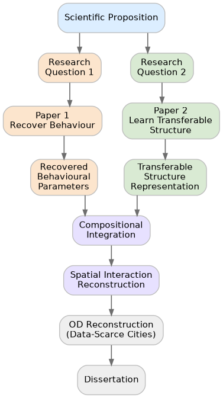

# Khung Tri thức Luận án: Tương tác Không gian và Học Biểu diễn trong Di chuyển Đô thị

## 1. Tương tác Không gian như một Đối tượng Khoa học

Trong vài thập kỷ gần đây, di chuyển của con người đã trở thành một lĩnh vực nghiên cứu độc lập, được củng cố bởi sự xuất hiện đồng thời của nhiều nguồn dữ liệu số mở, quy mô lớn và các phương pháp định lượng ngày càng chính xác (Barbosa et al., 2018; Pappalardo et al., 2023). Các nghiên cứu thực nghiệm trên nhiều thành phố và bối cảnh văn hóa khác nhau đã xác nhận rằng di chuyển của con người trong không gian đô thị không mang tính ngẫu nhiên, mà tuân theo những  quy luật thống kê bền vững chịu sự chi phối chặt chẽ của khoảng cách, thời gian và cấu trúc cơ hội đô thị (O'Kelly, 2009; Wang et al., 2019). Các nguồn dữ liệu từ khảo sát hành trình hộ gia đình, bản ghi định vị GPS, nhật ký viễn thông (CDRs), hay thẻ giao thông thông minh (Smart Cards) đã cho phép chúng ta quan sát, đo lường và mô hình hóa những quy luật này ở cả cấp độ cá nhân lẫn tập thể. Nhờ khả năng quan sát được bằng thực nghiệm, đo lường được bằng dữ liệu và giải thích được bằng cơ chế lý thuyết, di chuyển của con người đã trở thành đối tượng khoa học trung tâm với các ứng dụng thực tiễn cốt lõi trong quy hoạch giao thông, phát triển đô thị, kiểm soát dịch tễ và phân tích không gian (Barbosa et al., 2018).

Tuy nhiên, một chương trình nghiên cứu khoa học nghiêm túc không thể đồng nhất việc thu thập dữ liệu lớn và tối ưu hóa các chỉ số dự báo với việc thấu hiểu bản chất hiện tượng. Để xây dựng một nền tảng lý thuyết bền vững, điều kiện biên tiên quyết là phải phân định rạch ròi giữa công cụ quan sát thực nghiệm và đối tượng bản thể luận mà lý thuyết hướng tới giải thích (Batty, 2013; Haynes & Fotheringham, 1984). Sự phân biệt này không mang tính ngữ nghĩa thuần túy: dữ liệu quỹ đạo GPS, bản ghi viễn thông, ma trận Origin–Destination (OD), hay các tập dữ liệu mở thực chất chỉ là các phép đo gián tiếp hoặc các bóng chiếu thực nghiệm của động lực di chuyển, chứ bản thân chúng không phải là cơ chế khoa học cần được giải mã (O'Kelly, 2009). Tương tự, hàm mất mát (loss function) trong các thuật toán học máy chỉ đóng vai trò là mục tiêu kỹ thuật phục vụ việc khớp dữ liệu (curve-fitting), hoàn toàn không đại diện cho một câu hỏi khoa học có tính giải thích. Vì vậy, trước khi lựa chọn công cụ tính toán hay thu thập dữ liệu, luận án này thiết lập một đối tượng khoa học nhất quán làm nền tảng lý thuyết xuyên suốt: suy luận và định danh cơ chế hành vi ẩn quyết định sự tương tác không gian đô thị.

Mặc dù di chuyển trong thực tế biểu hiện qua những chuyến đi cụ thể của từng cá nhân, bản chất của hiện tượng lại nằm ở các tương tác không gian giữa các địa điểm trong hệ thống đô thị (Wilson, 1971). Trường phái mô hình hóa Tương tác Không gian (Spatial Interaction) không tập trung vào từng quỹ đạo riêng lẻ, mà hướng tới giải thích cách các vùng không gian phát sinh và thu hút dòng di chuyển thông qua mối tương tác giữa sức hút nguồn-đích và sự cản trở của khoảng cách (Haynes & Fotheringham, 1984; O'Kelly, 2009). Nền tảng này chi phối hầu hết các mô hình di chuyển tập thể, từ mô hình Trọng lực cổ điển và mô hình Bức xạ cho đến các kiến trúc học sâu không gian hiện đại (Barbosa et al., 2018). Vì lý do đó, Tương tác Không gian được chọn làm đối tượng khoa học chính thức của luận án: nó cung cấp một ngôn ngữ lý thuyết thống nhất để kết nối cấu trúc đô thị với hành vi di chuyển tập thể, đồng thời đủ rộng để bao phủ cả các phương pháp cổ điển lẫn các tiếp cận học máy mới nhất.

Sau khi Tương tác Không gian được xác lập làm đối tượng nghiên cứu, câu hỏi kế tiếp là làm thế nào để quan sát nó trong thực tế. Tương tác Không gian không phải là đại lượng vật lý đo được trực tiếp, mà chỉ được phản ánh gián tiếp qua các dạng dữ liệu di chuyển khác nhau, mỗi dạng ghi lại một góc nhìn hoặc một mức độ tổng hợp nhất định của hiện tượng (Barbosa et al., 2018; Toole et al., 2015). Do vậy, việc hiểu rõ mối quan hệ giữa các lớp dữ liệu quan sát và đối tượng khoa học là điều kiện cần thiết để đánh giá đúng tiềm năng và giới hạn thông tin mà từng nguồn dữ liệu có thể cung cấp. Vấn đề này sẽ được phân tích trong chương tiếp theo.

## 2. Quan sát Tương tác Không gian qua các Lớp Dữ liệu Di chuyển

Tương tác Không gian là một quá trình tập thể phức tạp, được tạo thành từ hàng triệu quyết định di chuyển cá nhân diễn ra đồng thời trong không gian. Vì lý do đó, nó không thể được quan sát ở dạng nguyên bản, mà chỉ được nhận biết thông qua các dấu vết số mà hoạt động di chuyển để lại (Barbosa et al., 2018; Wang et al., 2019). Điều này có nghĩa là mọi phát biểu khoa học về Tương tác Không gian đều mang theo những hạn chế vốn có của công cụ quan sát được sử dụng. Đây là một ràng buộc cần chú ý khi thiết kế nghiên cứu.

Trong lịch sử phát triển của lĩnh vực, công nghệ đã tạo ra một hệ thống các nguồn dữ liệu di chuyển ngày càng phong phú: từ các khảo sát hộ gia đình và điều tra dân số truyền thống, đến bản ghi viễn thông CDR, quỹ đạo GPS, thẻ giao thông thông minh, dịch vụ dựa trên vị trí, và gần đây là các tập thống kê khả năng di chuyển của một cá nhân do Meta cung cấp (Barbosa et al., 2018; Lenormand et al., 2016; Pappalardo et al., 2023; Toole et al., 2015). Mỗi nguồn dữ liệu được thu thập theo cơ chế khác nhau và phản ánh Tương tác Không gian ở độ phân giải không gian, độ chi tiết thời gian và mức độ tổng hợp thông tin khác nhau. Tuy nhiên, tất cả đều là những góc nhìn về cùng một hiện tượng khoa học: sự lưu chuyển của dân số giữa các điểm trong không gian đô thị.

Điểm quan trọng là không phải mọi nguồn dữ liệu đều lưu giữ cùng một lượng thông tin về Tương tác Không gian. Dữ liệu quỹ đạo cá nhân ghi lại đầy đủ trình tự thời gian và tuyến đường di chuyển, nhưng đi kèm với rủi ro vi phạm quyền riêng tư và chi phí thu thập cao. Ma trận OD nén thông tin đó thành số lượng chuyến đi giữa các cặp vùng không gian, loại bỏ thứ tự thời gian nhưng vẫn giữ được thông tin về điểm xuất phát và điểm đến. Xa hơn nữa, các thống kê tổng hợp như phân bố độ dài chuyến đi (Trip-Length Distribution, TLD) không còn lưu giữ danh tính của các cặp vùng, nhưng vẫn bảo tồn được dấu hiệu thống kê tập thể về mức độ nhạy cảm khoảng cách của quần thể (Lenormand et al., 2016; Pappalardo et al., 2023). Như vậy, các nguồn dữ liệu này tạo thành một phổ liên tục các lớp quan sát, trong đó thông tin chi tiết và mức độ bảo mật quyền riêng tư đánh đổi lẫn nhau.

Sự đa dạng đó mang lại nhiều cơ hội cho nghiên cứu thực nghiệm, nhưng đồng thời đặt ra những thách thức phương pháp luận không nhỏ. Mỗi nguồn dữ liệu mang theo những sai số hệ thống riêng: dữ liệu CDR chỉ ghi nhận người dùng điện thoại di động, GPS chỉ thu thập từ thiết bị bật định vị, còn khảo sát hộ gia đình phụ thuộc vào trí nhớ của người trả lời (de Montjoye et al., 2013; Gallotti et al., 2024). Khi đặt các nguồn dữ liệu này cạnh nhau, nhà nghiên cứu thường đối mặt với bài toán hòa giải quan sát: liệu sự mâu thuẫn giữa các tập dữ liệu phản ánh bản chất thực của Tương tác Không gian, hay chỉ là hệ quả của sai số đo lường từ mỗi công cụ? Thêm vào đó, áp lực bảo mật dữ liệu cá nhân ngày càng buộc các tổ chức công bố dữ liệu ở dạng tổng hợp, thu hẹp khả năng tiếp cận thông tin chi tiết cần thiết để phân tích cấu trúc bên trong của các dòng di chuyển (de Montjoye et al., 2013).

Những giới hạn này cho thấy rằng dù dữ liệu di chuyển có phong phú đến đâu, chúng cũng chỉ phản ánh kết quả quan sát được của hiện tượng, chứ chưa tự động giải thích được cơ chế tạo ra các dòng di chuyển đó (Barbosa et al., 2018). Để vượt qua sự phụ thuộc vào chất lượng và loại hình dữ liệu, nghiên cứu cần đi sâu hơn vào cấu trúc khái niệm bên trong các mô hình lý thuyết của Tương tác Không gian, đây là hướng phân tích của chương tiếp theo.

## 3. Cấu trúc Khái niệm Thống nhất trong các Mô hình Tương tác Không gian

Trong nhiều thập kỷ, nhiều họ mô hình Tương tác Không gian đã được phát triển từ các nền tảng lý thuyết và kỹ thuật khác nhau: mô hình Trọng lực, mô hình Cơ hội Trung gian, mô hình Entropy cực đại (Wilson, 1971), mô hình Bức xạ (Simini et al., 2012) và gần đây là các mô hình học sâu không gian (Guo et al., 2025; Barbosa et al., 2018; Lenormand et al., 2016). Mặc dù khác nhau về giả định toán học, cấu trúc hàm và phương pháp ước lượng, tất cả các họ mô hình này đều hướng tới cùng một mục tiêu: giải thích và tái tạo dòng di chuyển giữa các vùng không gian.

Khi phân tích từng họ mô hình một cách hệ thống, ta nhận ra rằng bên dưới sự khác biệt về công thức, chúng đều chia sẻ một cấu trúc khái niệm chung (Haynes & Fotheringham, 1984; Wilson, 1971). Cụ thể, mọi mô hình Tương tác Không gian đều bắt buộc phải mô tả hai thành phần: một bên là khả năng phát sinh và thu hút di chuyển của các vùng không gian, bên kia là cơ chế giải thích tại sao tương tác giảm dần hoặc cạnh tranh với nhau khi khoảng cách tăng lên. Sự khác biệt giữa các họ mô hình thực chất chỉ nằm ở cách biểu diễn toán học của hai thành phần này, chứ không thay đổi bản chất khái niệm của hiện tượng (Lenormand et al., 2016).

Tính nhất quán này thể hiện rõ khi đối chiếu các mô hình cụ thể. Trong mô hình Trọng lực, dòng di chuyển tỷ lệ với tích giữa tiềm năng sinh luồng và lực hấp dẫn của đích đại diện cho Cấu trúc Đô thị và hàm suy giảm khoảng cách đại diện cho Hành vi Di chuyển. Trong mô hình Bức xạ, tiềm năng phát sinh và thu hút của từng vùng vẫn đóng vai trò cấu trúc đô thị, trong khi tổng các cơ hội trung gian biểu diễn cơ chế cạnh tranh cơ hội của hành vi người dân (Simini et al., 2012). Trong các mạng học sâu hiện đại, các lớp nhúng học biểu diễn cấu trúc đô thị, còn các lớp chú ý học biểu diễn hành vi tương tác không gian (Barbosa et al., 2018). Đáng chú ý, các yếu tố phụ trợ như chi phí, thời gian hay mục đích chuyến đi không tạo ra thành phần khái niệm thứ ba độc lập, mà luôn tác động thông qua một trong hai thành phần đã nêu (Haynes & Fotheringham, 1984).

Từ sự tổng hợp này, nghiên cứu đặt tên cho hai thành phần đại diện chính là **Urban Structure Representation** (Biểu diễn Cấu trúc Đô thị) và **Travel Behaviour Representation** (Biểu diễn Hành vi Di chuyển). Urban Structure Representation mô tả các thuộc tính vật lý và chức năng của hệ thống đô thị như dân số, cơ hội việc làm, sử dụng đất, và khả năng tiếp cận không gian vốn quyết định tiềm năng phát sinh và thu hút chuyến đi. Travel Behaviour Representation mô tả quy luật phản ứng tập thể của dân cư trước rào cản khoảng cách và sự phân bố của cơ hội trong không gian (Barbosa et al., 2018; Haynes & Fotheringham, 1984; Wilson, 1971). Việc đặt tên tường minh như vậy cung cấp một hệ quy chiếu chung để so sánh các mô hình từ các trường phái khác nhau trên cùng một nền tảng khái niệm.

Trên cơ sở đó, nghiên cứu phát biểu **Structure–Behaviour Decomposition Principle** (Nguyên lý Phân rã Cấu trúc – Hành vi) như sau: *Mặc dù Tương tác Không gian được hình thành từ sự tương tác giữa Urban Structure và Travel Behaviour, hai biểu diễn của chúng có thể được xem là các thành phần tách biệt về mặt phân tích, điều này cho phép đặt ra các câu hỏi khoa học riêng biệt, và phát triển các chiến lược học khác nhau cho từng thành phần*. Nguyên lý này không phải là giả thuyết mới về cơ chế vật lý của di chuyển, mà là một quan sát cấu trúc về cách các mô hình đã được xây dựng trong suốt lịch sử và từ đó suy ra rằng việc tách biệt phân tích từng thành phần là một chiến lược khả thi. Nguyên lý này sẽ đóng vai trò kim chỉ nam lý thuyết để xem xét sự tiến hóa của từng thành phần biểu diễn trong các chương tiếp theo.

## 4. Biểu diễn Cấu trúc Đô thị và Thách thức về Khả năng Chuyển giao

Sau khi xác lập Nguyên lý Phân rã, câu hỏi phương pháp luận đầu tiên là: Urban Structure Representation nên được xây dựng như thế nào để mô hình hóa Tương tác Không gian? Bản chất của Cấu trúc Đô thị là sự phân bố không gian của dân cư, cơ sở hạ tầng và các cơ hội hoạt động. Đây là một khái niệm khoa học tương đối ổn định qua thời gian. Điều thay đổi là cách thức kỹ thuật để biểu diễn nó, và sự thay đổi đó đã diễn ra mạnh mẽ cùng với sự phát triển của dữ liệu và công cụ tính toán (Batty, 2013; Mai et al., 2022).

Trong giai đoạn đầu của lý thuyết Tương tác Không gian, Cấu trúc Đô thị được biểu diễn qua các biến số thiết kế thủ công: quy mô dân số, số lượng việc làm, diện tích đất xây dựng, các chỉ số kinh tế và xã hội từ điều tra dân số (Erlander & Stewart, 1990; Haynes & Fotheringham, 1984; Wilson, 1971). Các biến này đóng vai trò đại diện cho sức phát sinh và thu hút chuyến đi của mỗi vùng không gian. Cách tiếp cận này có ưu điểm là đơn giản, dễ diễn giải và phù hợp với dữ liệu truyền thống, nhưng bị giới hạn bởi tính chủ quan của người thiết kế đặc trưng và không thể nắm bắt được sự phức tạp đa chiều của môi trường đô thị hiện đại.

Cùng với sự phát triển của dữ liệu lớn và học sâu, Cấu trúc Đô thị bắt đầu được biểu diễn thông qua các véc tơ nhúng học được tự động từ dữ liệu, bao gồm các chỉ số tiếp cận không gian, mật độ điểm quan tâm, tham số mạng lưới giao thông, và đặc biệt là các biểu diễn ẩn được học bởi mạng thần kinh đồ thị hoặc các mô hình học tự giám sát từ ảnh vệ tinh và dữ liệu địa không gian mở (Guo et al., 2025; Mai et al., 2022; Shi et al., 2021; Xu et al., 2025). Các véc tơ nhúng này có khả năng nén hàng trăm đặc trưng phức tạp của không gian đô thị mà không cần đặt trước dạng hàm, từ đó mở ra khả năng biểu diễn linh hoạt hơn cho các bài toán quy hoạch và dự báo không gian.

Điều cần nhấn mạnh ở đây là sự chuyển dịch từ biến thủ công sang véc tơ nhúng phản ánh sự tiến hóa về công cụ biểu diễn, không phải sự thay đổi về bản chất của khái niệm Cấu trúc Đô thị (Barbosa et al., 2018; Batty, 2013). Đối tượng nghiên cứu vẫn là sự phân bố cơ hội trong không gian; điều thay đổi là cách mã hóa thông tin đó thành dạng mà mô hình toán học có thể xử lý. Sự phân định này quan trọng vì nó giúp tránh nhầm lẫn giữa tiến bộ kỹ thuật và tiến bộ khoa học.

Tuy nhiên, một hạn chế cốt lõi đang nổi lên trong các mô hình học sâu hiện đại: chúng thường học Urban Structure Representation gắn chặt với dữ liệu dòng di chuyển của một thành phố cụ thể, khiến biểu diễn học được ghi nhớ các đặc thù địa phương thay vì các thuộc tính cấu trúc có tính phổ quát. Khi áp dụng cho thành phố mới chưa từng xuất hiện trong dữ liệu huấn luyện, hiệu năng của mô hình sụt giảm đáng kể (Guo et al., 2025; Yang et al., 2026). Thách thức này đặt ra câu hỏi trung tâm cho nhánh nghiên cứu thứ hai của luận án: làm thế nào để học chuyển giao một **Urban Structure Representation** cho các đô thị chưa từng được quan sát mà không cần dữ liệu di chuyển chi tiết tại đó (Mai et al., 2022; Yang et al., 2026).

## 5. Biểu diễn Hành vi Di chuyển và Thách thức về Nhận dạng từ Dữ liệu Tổng hợp

Song song với Cấu trúc Đô thị, Travel Behaviour Representation là thành phần thứ hai không thể thiếu trong mô hình hóa Tương tác Không gian. Theo Nguyên lý Phân rã, Tương tác Không gian không thể được giải thích đầy đủ nếu chỉ biết thuộc tính của các địa điểm mà không mô tả được cách con người phản ứng với rào cản khoảng cách và sự phân bố của cơ hội trong không gian (Haynes & Fotheringham, 1984; Wilson, 1971). Hành vi Di chuyển không phải là một thuộc tính của địa điểm mà là một đặc trưng của quần thể: nó phản ánh xu hướng tập thể trong việc lựa chọn điểm đến dưới tác động của khoảng cách, chi phí và cạnh tranh cơ hội.

Trong các mô hình cổ điển, Travel Behaviour Representation được biểu diễn thông qua các hàm suy giảm khoảng cách có dạng hàm mũ, hàm lũy thừa, hàm Tanner (Lenormand et al., 2016; Sen & Smith, 1995; Wilson, 1971). Các dạng hàm này đại diện cho độ nhạy cảm khoảng cách tập thể của quần thể đô thị. Sự nhạy cảm này phản ánh dòng di chuyển giảm khi khoảng cách tăng, theo một quy luật toán học được chọn trước. Cấu trúc hàm không được học từ dữ liệu mà được giả định từ đầu, chỉ có một số ít tham số toàn cục cần được hiệu chỉnh theo từng thành phố.

Khi học sâu trở thành công cụ chủ đạo trong mô hình hóa Tương tác Không gian, biểu diễn Hành vi Di chuyển cũng chuyển dịch từ các hàm suy giảm khoảng cách được giả định trước sang các biểu diễn được học từ dữ liệu quan sát. Thay vì bị ràng buộc bởi một dạng hàm phân tích cố định, các mô hình hiện đại học trực tiếp các cơ chế tương tác phi tuyến, qua đó nắm bắt những mẫu hành vi di chuyển tập thể phức tạp mà các mô hình cổ điển khó có thể biểu diễn (Guo et al., 2025; Shi et al., 2021). Giống như trường hợp của Cấu trúc Đô thị, sự chuyển dịch từ các hàm suy giảm khoảng cách sang các biểu diễn học được không phản ánh sự thay đổi của Hành vi Di chuyển, mà chỉ phản ánh sự tiến hóa của phương thức biểu diễn hiện tượng đó. Trong mọi thế hệ mô hình, Travel Behaviour Representation luôn hướng tới cùng một đối tượng khoa học: mô tả quy luật phản ứng tập thể của con người trước sự cản trở của không gian và sự phân bố các cơ hội (Barbosa et al., 2018; Haynes & Fotheringham, 1984). Điều thay đổi là cách biểu diễn quy luật này, chứ không phải bản thân quy luật .

Vấn đề trở nên phức tạp hơn khi xét đến bối cảnh dữ liệu hiện tại. Hầu hết các phương pháp học biểu diễn Hành vi Di chuyển đều giả định rằng dữ liệu di chuyển chi tiết như ma trận OD hoặc quỹ đạo cá nhân luôn có sẵn để hiệu chỉnh hoặc huấn luyện (Barbosa et al., 2018; Lenormand et al., 2016). Trong thực tế, rào cản bảo mật quyền riêng tư ngày càng khiến nhiều đô thị chỉ công bố dữ liệu ở dạng tổng hợp như phân bố độ dài chuyến đi (TLD). Điều này đặt ra một câu hỏi chưa được trả lời: liệu một quan sát thống kê tổng hợp như TLD có chứa đủ thông tin để nhận dạng các tham số đặc trưng cho Hành vi Di chuyển của quần thể, mà không cần truy cập vào dữ liệu cá nhân chi tiết hay không?. Đây là câu hỏi khoa học thực chất và cũng là động lực trực tiếp để hình thành câu hỏi nghiên cứu đầu tiên của luận án.

## 6. Quá trình Học Biểu diễn và Cơ chế Quyết định Khả năng Chuyển giao

Nhìn lại sự tiến hóa của cả hai thành phần, ta thấy một xu hướng chung: Urban Structure Representation và Travel Behaviour Representation đều chuyển từ các dạng biểu diễn thiết kế thủ công sang các dạng biểu diễn học được từ dữ liệu. Điều này dẫn đến một câu hỏi lý thuyết sâu hơn, mang tính quyết định với mục tiêu của luận án: điều gì thực sự chi phối chất lượng và tính chất của một biểu diễn học được? Khi ta không còn tự thiết kế biểu diễn mà giao cho thuật toán, việc hiểu cơ chế đằng sau quá trình học trở thành điều kiện cần thiết để kiểm soát kết quả (Bengio et al., 2013; Mai et al., 2022).

Luận án đề xuất một chuỗi nhân-quả để mô tả quá trình đó: **Mục tiêu Học → Chiến lược Học → Biểu diễn → Thông tin được Mã hóa → Khả năng Tổng quát hóa và Chuyển giao** (Bengio et al., 2013; Goodfellow et al., 2016; Mai et al., 2022). Mục tiêu Học (Learning Objective) đứng ở đầu chuỗi vì nó quyết định loại thông tin nào được mô hình ưu tiên chiết xuất từ dữ liệu. Khi mục tiêu học là dự đoán chính xác dòng di chuyển trong một thành phố, mô hình sẽ có xu hướng ghi nhớ các đặc thù địa phương không phổ quát. Khi mục tiêu học được thiết kế để phát hiện cấu trúc bất biến qua nhiều thành phố, mô hình sẽ học các đặc trưng có tính tổng quát cao hơn (Bengio et al., 2013).

Chiến lược Học (Learning Strategy) quyết định cách thông tin được tổ chức và mã hóa trong không gian biểu diễn (Chen et al., 2020; Mai et al., 2022). Học có giám sát, học tương phản, học đồ thị hay học chuyển giao sẽ tạo ra các không gian biểu diễn với mức độ trừu tượng và cấu trúc hình học hoàn toàn khác nhau. Chiến lược học ảnh hưởng trực tiếp đến khả năng tách biệt thông tin cấu trúc đô thị khỏi thông tin hành vi địa phương trong cùng một véc tơ nhúng. Đây là yếu tố then chốt cho khả năng chuyển giao.

Thông tin được mã hóa cuối cùng trong biểu diễn là yếu tố trực tiếp quyết định khả năng tổng quát hóa và chuyển giao của mô hình (Guo et al., 2025; Mai et al., 2022; Yang et al., 2026). Nếu một biểu diễn học được bị pha trộn giữa đặc trưng cấu trúc đô thị và đặc trưng hành vi địa phương, nó sẽ hoạt động tốt tại thành phố huấn luyện nhưng sụt giảm hiệu năng khi áp dụng cho thành phố khác. Phân tích này dẫn đến một kết luận quan trọng: khả năng chuyển giao không phải là thuộc tính may mắn xuất hiện ngẫu nhiên từ kiến trúc mô hình, mà là hệ quả tất yếu của việc thiết kế có chủ đích mục tiêu học và chiến lược học sao cho biểu diễn học được chỉ mã hóa đặc trưng cấu trúc mang tính phổ quát, không bị nhiễu bởi đặc thù hành vi của từng thành phố.

## 7. Khoảng trống Nghiên cứu và Hai Câu hỏi Trung tâm của Luận án

Sau khi tổng hợp các hướng nghiên cứu qua sáu chương trên, luận án xác định được hai khoảng trống khoa học còn bỏ ngỏ trong văn liệu di chuyển đô thị hiện đại. Hai khoảng trống này tương ứng chính xác với hai thành phần của Nguyên lý Phân rã Cấu trúc – Hành vi, và từ đó dẫn đến hai câu hỏi nghiên cứu trung tâm của luận án.

Khoảng trống thứ nhất (Research Gap 1) nằm ở phía Travel Behaviour Representation. Văn liệu hiện tại có nhiều phương pháp biểu diễn hành vi, nhưng hầu hết đều được xây dựng dựa trên giả định rằng dữ liệu OD chi tiết hoặc quỹ đạo cá nhân luôn sẵn có để hiệu chỉnh mô hình (Barbosa et al., 2018; Lenormand et al., 2016; Toole et al., 2015). Khi dữ liệu đó không tồn tại và điều này xảy ra ở phần lớn các đô thị đang phát triển, chỉ còn lại các thống kê di chuyển tổng hợp như TLD, câu hỏi liệu TLD có chứa đủ thông tin thống kê để nhận dạng các tham số hành vi đặc trưng cho quần thể vẫn chưa có câu trả lời có cơ sở xác suất vững chắc trong công trình nghiên cưu trước đây (O'Kelly, 2009). Từ đó, **Research Question 1** được đặt ra: *Làm thế nào để nhận dạng Travel Behaviour Representation chỉ từ các quan sát di chuyển thống kê tổng hợp của Tương tác Không gian?*

Khoảng trống thứ hai (Research Gap 2) nằm ở phía Urban Structure Representation. Các mô hình GeoAI hiện nay đạt độ chính xác cao nhưng học biểu diễn cấu trúc gắn liền với dữ liệu hành vi của một thành phố nhất định, dẫn đến khả năng chuyển giao kém (Guo et al., 2025; Mai et al., 2022; Yang et al., 2026). Câu hỏi làm thế nào để học một biểu diễn cấu trúc đô thị từ các nguồn dữ liệu địa không gian mở vốn không phụ thuộc vào dữ liệu di chuyển chi tiết của thành phố đích mà vẫn có thể tái tạo Tương tác Không gian tại đó vẫn là một thách thức chưa được giải quyết. Từ đó, **Research Question 2** được đặt ra: *Làm thế nào để học chuyển giao một Urban Structure Representation từ các nguồn dữ liệu địa không gian mở đa phương thức, sao cho biểu diễn đó có thể tái tạo Tương tác Không gian tại các thành phố chưa từng được quan sát?*

Hai câu hỏi trên đại diện cho hai hướng nghiên cứu song song và bổ sung lẫn nhau (complementary parallel pathways) xuất phát từ hai khoảng trống khoa học tương ứng (Gap I $\to$ RQ1 $\to$ Paper 1; Gap II $\to$ RQ2 $\to$ Paper 2). Cụ thể, RQ1 tập trung nhận dạng Travel Behaviour Representation ($R_B$) từ dữ liệu di chuyển tổng hợp (TLD), trong khi RQ2 độc lập kiểm chứng khả năng học và chuyển giao Urban Structure Representation ($R_S$) từ các nguồn dữ liệu địa không gian mở. Hai câu hỏi không có quan hệ phụ thuộc tuần tự (not sequentially dependent) mà là hai thành phần độc lập về mặt nhiệm vụ khoa học, được thống nhất ở bước Tích hợp Khái quát (Joint Integration / RQ3) để đánh giá khả năng tái tạo Tương tác Không gian ($T_{ij} = O_i A_j f(d_{ij}; \boldsymbol{\theta})$).

## 8. Khung Nghiên cứu Tổng thể của Luận án

Để hiện thực hóa Nguyên lý Phân rã Cấu trúc – Hành vi và trả lời hai câu hỏi nghiên cứu đã đặt ra, luận án xây dựng một Khung Nghiên cứu tổng thể (Dissertation Framework) kết nối liên tục từ nền tảng lý thuyết đến hai bài báo khoa học và đến ứng dụng thực nghiệm cuối cùng.

Paper 1 giải quyết RQ1 bằng cách phát triển phương pháp luận xác suất để nhận dạng và phục hồi các tham số đặc trưng của Travel Behaviour Representation từ phân bố độ dài chuyến đi tổng hợp. Song song với đó, Paper 2 giải quyết RQ2 bằng cách khai thác các tập dữ liệu địa không gian và di chuyển mở đa phương thức (OpenStreetMap, ảnh vệ tinh, dữ liệu điểm quan tâm và thống kê giao thông) để học chuyển giao Urban Structure Representation. Hai bài báo thực hiện hai tuyến suy luận độc lập (independent inference pathways) nhưng hoàn toàn tương thích trong cùng một khung phân rã: Paper 1 phục hồi tham số hành vi ($R_B$), còn Paper 2 cung cấp biểu diễn cấu trúc ($R_S$). Khi cả hai biểu diễn được hợp thành ở cấp độ luận án (Joint Integration stage / RQ3), mô hình có thể tái tạo ma trận OD tại các đô thị thiếu dữ liệu mà không cần quan sát dữ liệu OD chi tiết của thành phố đích (Zero-Target-OD).

Luồng vận hành tổng thể của khung nghiên cứu được hệ thống hóa trong **Hình 8.1**:

*Hình 8.1 minh họa luồng vận hành của khung nghiên cứu: từ Nguyên lý Phân rã Cấu trúc – Hành vi, qua hai câu hỏi nghiên cứu và hai bài báo tương ứng, đến hai đầu ra phương pháp luận (tham số hành vi được phục hồi và biểu diễn cấu trúc đô thị có khả năng chuyển giao), và cuối cùng hợp thành trong bước Tái tạo Tương tác Không gian Hợp thành tại các thành phố thiếu dữ liệu.*

Giá trị khoa học trung tâm của luận án không nằm ở từng bài báo riêng lẻ, mà ở **Khung Tái tạo Tương tác Không gian Hợp thành** (Compositional Spatial Interaction Reconstruction)—khung này kết hợp tham số hành vi từ Paper 1 và biểu diễn cấu trúc từ Paper 2 để tái tạo ma trận OD tại các thành phố không có dữ liệu di chuyển chi tiết (Barbosa et al., 2018; Wilson, 1971). Cách tiếp cận hợp thành này phản ánh trực tiếp Nguyên lý Phân rã: hai thành phần được học tách biệt có thể được kết hợp trở lại để giải quyết bài toán tổng thể. Đây là điểm tạo ra sự khác biệt về mặt khoa học so với các phương pháp hiện có vốn học hai thành phần cùng nhau trong một hệ thống đầu cuối (end-to-end).

Tổng kết lại, luận án đóng góp năm giá trị khoa học cho lĩnh vực di chuyển đô thị: (i) đề xuất Nguyên lý Phân rã Cấu trúc – Hành vi như một khung lý thuyết thống nhất để phân tích các mô hình Tương tác Không gian; (ii) phát triển phương pháp luận xác suất nhận dạng tham số hành vi di chuyển từ thống kê tổng hợp, không cần dữ liệu OD hay khảo sát (Paper 1); (iii) xây dựng phương pháp học Transferable Urban Structure Representation từ dữ liệu địa không gian mở đa phương thức (Paper 2); (iv) đề xuất Khung Tái tạo Tương tác Không gian Hợp thành ứng dụng cho các đô thị khan hiếm dữ liệu; và (v) thiết lập một cầu nối lý thuyết giữa truyền thống Tương tác Không gian cổ điển và học sâu không gian hiện đại (Barbosa et al., 2018; Lenormand et al., 2016; O'Kelly, 2009; Wilson, 1971).

---

### Danh mục Tài liệu Tham khảo

- Barbosa, H., Barthelemy, M., Ghoshal, G., James, C. R., Lenormand, M., Louail, T., Menezes, R., Ramasco, J. J., Simini, F., & Tomasini, M. (2018). Human mobility: Models and applications. *Physics Reports*, 734, 1–74.
- Batty, M. (2013). *The New Science of Cities*. MIT Press.
- Bengio, Y., Courville, A., & Vincent, P. (2013). Representation learning: A review and new perspectives. *IEEE Transactions on Pattern Analysis and Machine Intelligence*, 35(8), 1798–1828.
- Chen, T., Kornblith, S., Norouzi, M., & Hinton, G. (2020). A simple framework for contrastive learning of visual representations. In *International Conference on Machine Learning (ICML)*.
- de Montjoye, Y. A., Hidalgo, C. A., Verleysen, M., & Blondel, V. D. (2013). Unique in the crowd: The privacy bounds of human mobility. *Scientific Reports*, 3, 1376.
- Erlander, S., & Stewart, N. F. (1990). *The Gravity Model in Transportation Analysis: Theory and Extensions*. VSP, Utrecht.
- Gallotti, R., Bazzani, A., Rambaldi, S., & Barthelemy, M. (2024). Distorted insights from human mobility data. *Nature Communications*, 15, 1234.
- Goodfellow, I., Bengio, Y., & Courville, A. (2016). *Deep Learning*. MIT Press.
- Guo, Y., et al. (2025). A universal geography neural network for mobility flow prediction in planning scenarios. *Computer-Aided Civil and Infrastructure Engineering*.
- Haynes, K. E., & Fotheringham, A. S. (1984). *Gravity and Spatial Interaction Models*. Sage Publications.
- Lenormand, M., Bassolas, A., & Ramasco, J. J. (2016). Systematic comparison of trip distribution laws and models. *Journal of Transport Geography*, 51, 158–169.
- Mai, G., Janowicz, K., Hu, Y., Gao, S., Yan, B., Zhu, R., Cai, L., & Lao, N. (2022). Representation learning for geospatial data: A survey. *ACM Computing Surveys*, 54(9), 1–38.
- O'Kelly, M. E. (2009). Spatial interaction. In R. Kitchin & N. Thrift (Eds.), *International Encyclopedia of Human Geography*. Elsevier.
- Pappalardo, L., Manley, E., Sekara, V., Alessandretti, L., et al. (2023). Future directions in human mobility science. *Nature Computational Science*, 3, 588–600.
- Sen, A., & Smith, T. E. (1995). *Gravity Models of Spatial Interaction Behavior*. Springer.
- Shi, X., Zhao, X., et al. (2021). Deep Gravity: A deep learning framework for mobility flows generation. *Nature Communications*, 12, 6576.
- Simini, F., González, M. C., Maritan, A., & Barabási, A.-L. (2012). A universal model for mobility and migration patterns. *Nature*, 484, 96–100.
- Toole, J. L., Colak, S., Sturt, B., Alexander, L. P., Evsukoff, A., & González, M. C. (2015). The path most traveled: Travel demand estimation using big data resources. *Transportation Research Part C: Emerging Technologies*, 58, 162–177.
- Wang, J., Kong, X., Xia, F., & Sun, L. (2019). Urban human mobility: Data-driven modeling and prediction. *ACM SIGKDD Explorations*, 21(1), 1–19.
- Wilson, A. G. (1971). A family of spatial interaction models, and associated developments. *Environment and Planning A*, 3(1), 1–32.
- Xu, Y., et al. (2025). Predicting human mobility flows in cities using deep learning on satellite imagery. *Nature Communications*.
- Yang, J., et al. (2026). Transferable Human Mobility Network Reconstruction with neuroGravity. *Preprint/SJTU*.
